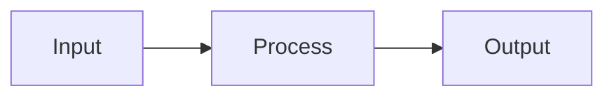

# Creating a Kodo Forge Course

This workflow explains how to author a new learning course for the Kodo Forge TUI platform. Follow these steps to create a professional, didactically sound course that the Kodo Forge engine can render.

## Prerequisites

- A running Kodo Forge installation (either from source via `npm start` or a standalone `.exe`)
- A text editor for writing Markdown files

## Step 1: Plan Your Curriculum

Before writing content, plan your course structure:

1. **Define 3-5 learning phases**, each containing 8-10 lessons
2. **Each phase should have a clear learning goal** (e.g., "Phase 1: Foundations", "Phase 2: Core Concepts")
3. **End each phase with a Review Challenge lesson** that tests all concepts from that phase
4. **Define prerequisites** — does the learner need another course first?

Example structure for a "Python Basics" course:
```
Phase 1: Foundations (Lessons 01-10)
Phase 2: Data Structures (Lessons 11-20)
Phase 3: OOP & Patterns (Lessons 21-30)
Phase 4: Real-World Python (Lessons 31-40)
```

## Step 2: Create the Directory Structure

Create a directory for your course (e.g., `python/`) at the same level as the `platform/` folder.

```
my-project/
├── platform/          # The Kodo Forge engine
├── platform.json      # Course registry
└── python/            # Your new course
    ├── 01-getting-started/
    │   ├── README.md
    │   └── sections/
    │       ├── 01-installation.md
    │       ├── 02-first-program.md
    │       └── 03-repl-workflow.md
    ├── 02-variables-and-types/
    │   ├── README.md
    │   └── sections/
    │       ├── 01-variables.md
    │       ├── 02-numbers.md
    │       ├── 03-strings.md
    │       └── 04-booleans.md
    └── ...
```

**Naming conventions:**
- Lesson folders: `XX-kebab-case-name/` (zero-padded number + descriptive name)
- Section files: `XX-kebab-case-name.md` inside a `sections/` subdirectory
- Each lesson MUST have a `README.md` in its root (this is the lesson overview)

## Step 3: Write the README.md for Each Lesson

The `README.md` serves as the lesson overview page. It should contain:

```markdown
# Lesson Title

> **Lernziel:** After this lesson, you will be able to [specific outcome].

## Overview

Brief introduction to what this lesson covers and why it matters.

## Sections

1. [Section Name](sections/01-section-name.md) — Brief description
2. [Section Name](sections/02-section-name.md) — Brief description

## Key Concepts

- Concept 1
- Concept 2

## Prerequisites

- What the learner should know before starting
```

## Step 4: Write Section Content

Each section is a Markdown file. The Kodo Forge engine supports these Markdown features:

### Basic Markdown
- `#`, `##`, `###` headings
- `**bold**`, `*italic*`, `` `inline code` ``
- Bullet lists and numbered lists
- Links `[text](url)`

### Code Blocks
````markdown
```typescript
const greeting: string = "Hello, World!";
console.log(greeting);
```
````

### Annotated Code Blocks (Special Feature!)
Use the custom annotation syntax for side-by-side code + explanation:

````markdown
```typescript [annotated]
const x: number = 42;          // Declare a typed variable
const arr: number[] = [1,2,3]; // Array with type annotation
type Point = { x: number };    // Custom type alias
```
````

Each line ending with `// comment` will be displayed as an annotation next to the code.

### Callout Boxes
```markdown
> **💡 TIPP:** This is a tip callout box.

> **⚠️ WARNUNG:** This is a warning.

> **📌 WICHTIG:** This is important.

> **🧠 DENKFRAGE:** This prompts the learner to think.
```

### Tables
```markdown
| Feature | TypeScript | JavaScript |
|---------|-----------|------------|
| Types   | ✓         | ✗          |
| Enums   | ✓         | ✗          |
```

### Mermaid Diagrams
````markdown

````

### Depth Markers (Adaptive Reading)
```markdown
<!-- section:summary -->
This content shows in "Kurz" (summary) mode.

<!-- depth:standard -->
This shows in standard mode (default).

<!-- depth:vollständig -->
This shows only in deep-dive mode.
```

## Step 5: Register the Course in platform.json

Edit `platform.json` to register your new course:

```json
{
  "courses": [
    {
      "id": "python",
      "name": "Python Basics",
      "description": "Learn Python from scratch",
      "directory": "python",
      "color": "yellow",
      "icon": "PY",
      "totalLessons": 40,
      "totalSections": 200,
      "estimatedHours": 60,
      "exerciseTypes": 8,
      "topics": ["Variables", "Functions", "OOP", "Libraries"],
      "prerequisite": null,
      "prerequisiteDescription": "None",
      "prerequisiteMinPhase": null,
      "status": "active",
      "recommendNext": null
    }
  ],
  "activeCourse": "python"
}
```

**Field reference:**
- `id`: Unique identifier (must match directory name)
- `name`: Display name shown in the TUI
- `directory`: Folder name containing the course
- `color`: TUI color theme (`blue`, `red`, `cyan`, `magenta`, `yellow`, `green`)
- `icon`: 2-character abbreviation shown in the TUI
- `totalLessons`: Number of lesson folders
- `prerequisite`: ID of required course (or `null`)
- `status`: `"active"` or `"planned"`
- `recommendNext`: ID of the next course in the learning path (or `null`)

## Step 6: Test Your Course

// turbo
```bash
cd platform
npm start
```

The engine will detect your new course and display it on the platform screen. Navigate through your lessons to verify:
- All sections render correctly
- Code blocks have proper syntax highlighting
- Tables and diagrams display properly
- Callout boxes appear with correct styling

## Step 7: Didactic Best Practices

Follow these principles for high-quality courses:

1. **LEARN Cycle**: Structure each lesson as Read → Explore → Apply → Reflect → Reference
2. **Progressive Complexity**: Start simple, increase difficulty gradually within each phase
3. **Concrete Examples**: Always show real, runnable code — not abstract pseudocode
4. **Active Recall**: End sections with "Denkfragen" (thinking questions) to prompt reflection
5. **Spaced Repetition**: The engine handles this automatically based on completed sections
6. **Chunk Size**: Keep sections to 3-7 minutes of reading time (roughly 300-700 words)
7. **Review Challenges**: Every 10 lessons, add a review that combines all previous concepts
8. **Annotated Code**: Use annotated code blocks for complex examples — the side annotations are invaluable
