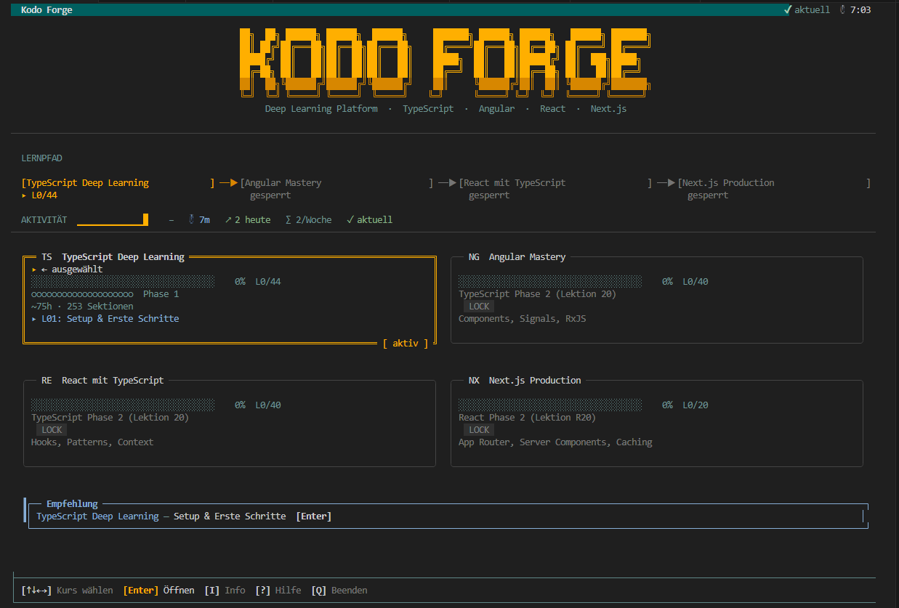

<h1 align="center">
  <br>
  
  <br>
  Kodo Forge
  <br>
</h1>

<h4 align="center">A terminal-native learning platform for developers who hate browser distractions.</h4>

<p align="center">
  <a href="https://github.com/lia-xim/Kodo-Forge-TUI-for-learning-Coding/blob/main/LICENSE">
    
  </a>
  <a href="https://github.com/lia-xim/Kodo-Forge-TUI-for-learning-Coding/releases">
    
  </a>
  <a href="https://github.com/lia-xim/Kodo-Forge-TUI-for-learning-Coding/stargazers">
    
  </a>
</p>

<br>

<p align="center">
  
</p>

## ✨ What is Kodo Forge?

Browsers are noisy. Between social media, notifications, and 50 open tabs, it's hard to focus on **deep technical learning**. 

**Kodo Forge** is an open-source, terminal-based **interactive learning engine**. It brings the "learn by doing" philosophy directly into your terminal (PowerShell, Bash, Zsh), allowing you to master complex technologies like **TypeScript**, **Angular**, and **React** without ever leaving your development environment.

### Why Kodo Forge?
- **Zero Distractions:** No browser tabs, no ads, just you and the code.
- **TUI (Terminal User Interface):** Beautifully rendered interactive lessons and quizzes.
- **Adaptive Depth:** Content adjusts based on your performance—faster for experts, deeper for beginners.
- **Offline First:** Local-first engine that works wherever your terminal goes.

## 🚀 Getting Started (No Installation Needed)

Check out our [Releases](https://github.com/lia-xim/Kodo-Forge-TUI-for-learning-Coding/releases) for the standalone executable.

- **Windows:** Download `kodo-forge.exe` and execute it.
- **macOS (Apple Silicon):** `kodo-forge-macos-arm64`
- **macOS (Intel):** `kodo-forge-macos-x64`
- **Linux:** Binaries available for x64 and ARM64.

*Courses are bundled inside the binary — they automatically extract to your OS data directory on first launch.*

## 🛠️ Features

- **Spaced Repetition:** Smart scheduling based on learning science (Roediger 2011).
- **Side-by-Side Annotations:** Special tags split the view, placing comments directly next to code.
- **47-Metric Scoring:** Advanced evaluation for complex quiz types.
- **Customizable:** Build your own courses using simple **Markdown**.

## 🏗️ Building from Source

If you want to contribute to the Node.js/TypeScript engine:

```bash
# Clone the repository
git clone https://github.com/lia-xim/Kodo-Forge-TUI-for-learning-Coding.git

# Navigate to the platform
cd Kodo-Forge-TUI-for-learning-Coding/platform

# Install dependencies and start
npm install
npm run start
```

## 🤝 Community & Contributing

Kodo Forge is a **community-driven project**. We believe the best way to learn code is to build it together.

- **Add a Course:** You only need Markdown knowledge. See [CONTRIBUTING.md](CONTRIBUTING.md) for details.
- **Report Bugs:** Open an issue if something isn't working right.
- **AI-Powered Authoring:** Use [`.agent/workflows/create-kodo-course.md`](.agent/workflows/create-kodo-course.md) to generate perfectly formatted lessons with LLMs.

## 🎓 Official Courses

- **TypeScript Deep Learning:** 44 comprehensive sections from basics to Compiler API.
- **Angular Mastery** *(In Development)*
- **React with TypeScript** *(In Development)*

## 📄 License

This project is licensed under the **MIT License** - see the [LICENSE](LICENSE) file for details.
