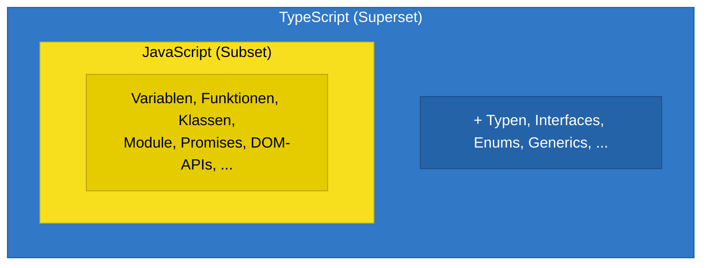
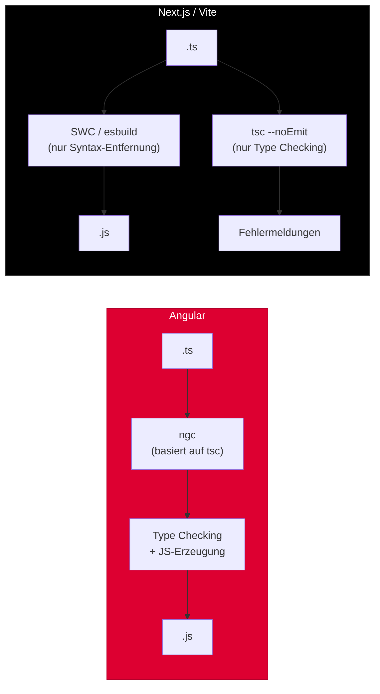

# Section 1: What is TypeScript?

> Estimated reading time: ~10 minutes

## What you'll learn here

- Why TypeScript was invented and what real problem it solves
- How TypeScript and JavaScript relate to each other (superset relationship)
- Why Angular, React, and Next.js use TypeScript differently

---

## The Origin Story

In 2010, Microsoft had a problem. Large internal projects -- including Bing Maps and Office Web Apps -- were written in JavaScript and growing rapidly. Hundreds of developers were working on the same codebase. And it was getting out of hand.

The problem wasn't JavaScript itself. JavaScript is a brilliant language for small scripts and dynamic web pages. But with codebases of hundreds of thousands of lines, a fundamental promise breaks down: **nobody knows where the data flows anymore.**

> **Background:** Anders Hejlsberg -- the man behind Turbo Pascal, Delphi, and C# -- was tasked with finding a solution. His central insight was: you can't replace JavaScript, you have to *extend* it. Any other approach would fail because the entire web ecosystem is built on JavaScript. So he designed a language that *compiles* to JavaScript and adds type information purely as a developer aid -- without changing runtime behavior.

The team worked quietly on the project for two years. In October 2012, Microsoft presented TypeScript 0.8 to the public.

> **Fun Fact:** TypeScript was developed internally at Microsoft for two full years before it was released in 2012. Anders Hejlsberg said in an interview: *"We could have designed a completely new language, but the key insight was that we needed to meet JavaScript developers where they are."*

### The Google Moment

In 2014, something unexpected happened: Google was working on its own project called **AtScript** -- an extension of JavaScript that would also add types and annotations. AtScript was intended as the foundation for Angular 2.

Instead of creating two competing systems, Google decided to collaborate with Microsoft. The features of AtScript (in particular Decorators and Metadata Annotations) were incorporated into TypeScript. Angular 2 was written entirely in TypeScript.

> **Background:** This decision was historically significant. Two of the world's largest tech companies agreed on a shared type system for JavaScript. This gave TypeScript a legitimacy that no internal Microsoft project could have achieved on its own.

Today, TypeScript is used by Microsoft, Google, the entire Angular community, the React ecosystem, Deno, and countless open-source projects.

> **Think about it:** Google had planned its own language -- AtScript -- for Angular 2. In your opinion, what would have happened if Google had chosen AtScript instead of TypeScript? Would the web ecosystem have two competing type systems today?

---

## The Real Problem: Why Do We Need Types?

Imagine you're building a skyscraper. JavaScript gives you the tools -- hammer, saw, concrete. But no blueprints, no structural inspection, no safety certification. You can build whatever you want. And it only collapses once someone moves in.

TypeScript is the structural engineer who checks *before construction* whether the structure will hold.

### The Four Real Reasons for TypeScript

**1. Large codebases collapse without types.**

At Microsoft, hundreds of developers worked on the same JavaScript code. Without types, nobody knew what data a function expected or returned. Errors were only found by customers.

**2. Refactoring becomes a guessing game.**

When you rename a function or change its parameters, JavaScript can't tell you which 47 other places are now broken. TypeScript can.

**3. Documentation goes stale, types don't.**

Comments lie. Types don't. A type annotation is *living documentation* that the compiler enforces.

**4. IDE support needs type information.**

Autocomplete, "Go to Definition", rename-refactoring -- all of this only works well when the IDE knows which types are involved. The TypeScript Language Server (tsserver) is why VS Code has such great JavaScript/TypeScript support -- even for plain JavaScript, VS Code uses TypeScript inference behind the scenes.

> **Practical Tip:** Even if you never write a single line of TypeScript, you benefit from TypeScript. The IntelliSense in VS Code for JavaScript projects is powered by the TypeScript Language Server, which evaluates `.d.ts` files and JSDoc comments.

> **Experiment:** Open VS Code and create a file `test.js` (not `.ts`!). Write `const arr = [1, 2, 3];` and then `arr.` -- VS Code will still show you the array methods with types. Why? Because the TypeScript Language Server is running in the background, even for JavaScript files.

---

## TypeScript and JavaScript: The Relationship

A point many people misunderstand:

```
TypeScript ist ein SUPERSET von JavaScript.
Jeder gueltige JavaScript-Code ist auch gueltiger TypeScript-Code.
```

This means: TypeScript does not *replace* JavaScript. It *extends* it.



> Everything within the yellow area (JavaScript) is simultaneously valid TypeScript. TypeScript only adds the blue area.

TypeScript **exclusively** *adds* things. It removes nothing from JavaScript. And -- here's the key -- everything TypeScript adds exists **only at compile time**. At runtime, everything is pure JavaScript again. This principle is called **Type Erasure** and it's so important that we dedicate a full section to it in Section 2.

```typescript annotated
// --- JavaScript (valid in BOTH languages) ---
const greet = (name) => {    // plain JS function -- valid TypeScript too
  return "Hallo " + name;    // no types needed, JS logic stays unchanged
};

// --- TypeScript extensions (compile time only) ---
interface Person {           // ← exists ONLY at compile time, removed in JS output
  name: string;              // ← type annotation -- erased before runtime
  age: number;               // ← erased before runtime
}

const greetTyped = (person: Person): string => {  // ← ": Person" and ": string" are erased
  return "Hallo " + person.name;                  // ← this line survives into JS unchanged
};
// After compilation: const greetTyped = (person) => { return "Hallo " + person.name; };
```

> **Explain to yourself:** What exactly is the difference between what TypeScript knows at compile time and what remains at runtime?
> - Type annotations (`: string`, `: Person`) only exist in the `.ts` source code and are completely removed
> - Interfaces disappear completely from the JavaScript output -- not a single byte remains
> - The actual logic code (variables, functions, return values) remains unchanged

> **Think about it:** If TypeScript is a superset of JavaScript, does that mean every `.js` file is also a valid `.ts` file? And if so -- why is there any distinction between the file extensions at all?

The answer: Yes, every `.js` file is syntactically valid TypeScript. But the compiler treats `.ts` files more strictly -- for example, no implicit `any` is allowed in a `.ts` file (when `noImplicitAny` is active). The file extension signals to the compiler which rules to apply.

---

## TypeScript in Practice: Angular, React, Next.js

If you work with Angular or React/Next.js, you're already using TypeScript -- but in fundamentally different ways:

### Angular: TypeScript-first

Angular is TypeScript-first. The project was written in TypeScript from the beginning, and the Angular compiler (`ngc`) builds directly on top of `tsc`. Decorators like `@Component` and `@Injectable` are TypeScript features that Angular relies on heavily. Without TypeScript, there is no Angular.

> **Background:** The decision to write Angular 2 in TypeScript was a direct result of the Google-Microsoft collaboration over AtScript. Google wanted Decorators and Metadata Annotations -- and instead of building their own system, they contributed these features to TypeScript. Today, Decorators are an official TC39 proposal and part of the JavaScript standard.

### React/Next.js: JavaScript-first with TypeScript as the de-facto standard

React and Next.js are JavaScript-first, but TypeScript has established itself as the de-facto standard. Here's an important distinction: Next.js does NOT use `tsc` for compilation. Instead, Next.js and Vite use faster tools like **SWC** or **esbuild**, which strip the TypeScript syntax but perform NO type checking. `tsc` runs separately as a type checker (with `--noEmit`).



This explains why `npm run build` in Next.js has two steps: first `tsc --noEmit` (type checking), then the actual build with SWC. In Angular, both are a single step.

> **Practical Tip:** In your Angular project, `ng serve` automatically handles type checking and compilation. In Next.js, you need to ensure yourself that `tsc --noEmit` runs -- either as a separate script or through the IDE. Otherwise, type errors can sneak in that only surface during `next build`.

---

## What You've Learned

- **TypeScript was born** because large JavaScript codebases are unmaintainable without types
- **Anders Hejlsberg** designed TypeScript with the insight that JavaScript must be extended, not replaced
- **TypeScript is a superset** of JavaScript -- it adds types but removes nothing
- **Angular** is TypeScript-first, **React/Next.js** use TypeScript as a standard but with separate type checking
- **Google and Microsoft** worked together, making TypeScript the de-facto standard

> **Think about it:** You've learned that TypeScript is a superset of JavaScript. Imagine you open an existing JavaScript project with 500 `.js` files. What would be the simplest first step to introduce TypeScript WITHOUT rewriting a single file? (Hint: The answer lies in the tsconfig.json -- you'll learn about it in Section 3.)

---

**Next Section:** [The Compiler -- How TypeScript Becomes JavaScript](02-der-compiler.md)

> Good time for a break. When you come back, start with Section 2: The Compiler.