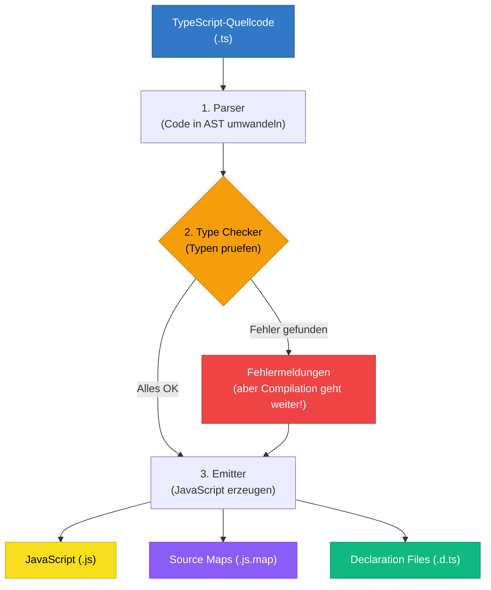
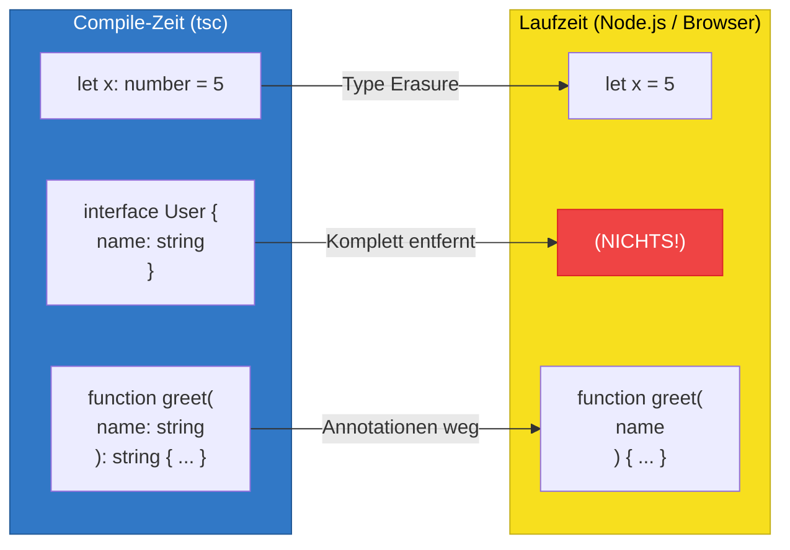

# Section 2: The Compiler — How TypeScript Becomes JavaScript

> Estimated reading time: ~10 minutes

## What you'll learn here

- What the TypeScript compiler does in its three phases (Parsing, Type Checking, Emit)
- Why type checking and code generation are *independent* of each other
- What Type Erasure means and what consequences it has

---

## Compilation vs. Transpilation

Strictly speaking, the TypeScript compiler is a **transpiler**: it translates from one high-level language (TypeScript) into another high-level language (JavaScript), not into machine code. With a true compiler (like the C compiler `gcc`), machine code is produced that the processor can execute directly.

But the TypeScript compiler does more than just translate. It also checks your types. These two tasks are *independent* of each other — a design decision with far-reaching consequences.

> **Background:** Anders Hejlsberg made a deliberate design decision: the compiler should *always* produce JavaScript, even when there are type errors. In languages like Java or C#, a compilation error means no executable code is produced. TypeScript is different: it reports the errors but still produces output. Why? Because TypeScript must not block existing JavaScript code. You should be able to add types incrementally without your project becoming unbuildable in the process.

---

## The Three Phases in Detail



> **Important:** Note the arrow from "Fehler gefunden" to the Emitter — TypeScript generates JavaScript **even with errors**! This is a deliberate design decision.

### Phase 1: Parsing — Code Is Transformed into a Tree

The parser reads your source code character by character and builds an **Abstract Syntax Tree (AST)** from it — a tree structure that represents the logical structure of your code.

Think of the AST as a family tree of your code:

```
  Code: let alter: number = 30;

  AST:
  VariableDeclaration
  +-- name: "alter"
  +-- type: NumberKeyword
  +-- initializer: NumericLiteral (30)
```

Why does this matter? Because both the type checker and the emitter don't read the raw text — they read the AST. This is also why your IDE can show you syntax errors immediately — the parser fails before type checking even begins.

> **Deeper Knowledge:** You can inspect the AST of your own code: [astexplorer.net](https://astexplorer.net) shows you the resulting tree for any code snippet. This isn't just academically interesting — if you ever write an ESLint rule or a codemod, you'll be working directly with the AST.

> **Experiment:** Open [astexplorer.net](https://astexplorer.net), select "TypeScript" as the language, and enter this code: `let alter: number = 30;`. Find the `NumberKeyword` node in the AST tree. Then change the code to `let alter = 30;` (without the type annotation). What changes in the AST? The `NumberKeyword` node disappears — that's exactly what the emitter removes during compilation.

### Phase 2: Type Checking — The Intelligence of TypeScript

The type checker traverses the AST and checks every node:

- Do the types match in assignments? (`let x: string = 42` — error!)
- Do the properties exist? (`user.nmae` — typo!)
- Do the function arguments match? (`add(1, "2")` — wrong types!)
- Are all code paths covered? (missing `return` — error!)

This is the most computationally intensive step. In large projects, type checking can take several seconds.

> **Background:** TypeScript's type-checking system is Turing-complete. This means, theoretically, there are programs for which the type checker never terminates. In practice, TypeScript has built-in recursion limits (e.g., a maximum of 50 levels for conditional types). Nevertheless, it's possible to write extremely complex type constructs that keep the compiler busy for seconds. One reason why tools like `esbuild` and SWC are so fast: **they skip this step entirely.**

### Phase 3: Emit — Generating JavaScript Code

The emitter traverses the AST again and generates JavaScript code:

- All type annotations are removed
- Interfaces and type aliases disappear entirely
- When needed, modern code is rewritten in older syntax (downleveling)
- Optionally, source maps and declaration files are generated

> 🧠 **Explain to yourself:** The compiler has three phases (Parsing, Type Checking, Emit). Why are type checking and emit independent of each other? What would be the downside if type errors blocked JavaScript generation?
> **Key points:** Incremental migration possible | Existing JS code is not blocked | noEmitOnError for strict builds

---

## Type Checking and Emit Are Separate!

TypeScript can generate JavaScript code **even when there are type errors**. The compiler reports the errors but still produces output.

If you don't want this behavior, there's the option **`noEmitOnError: true`**. With this, `tsc` only generates JavaScript when there are NO type errors. This is recommended for CI/CD pipelines and production builds.

```json
{
  "compilerOptions": {
    "noEmitOnError": true
  }
}
```

> **Think about it:** If TypeScript generates JavaScript even with errors — why should you pay attention to those errors at all? Couldn't you just ignore all errors and run the code anyway?

The answer: You *could* ignore the errors. The code would run. But the errors tell you that your code probably isn't doing what you think. It's like a smoke detector: you can take out the battery and go back to sleep, but the fire is still there.

---

## Type Erasure: Types Disappear Without a Trace

This is one of the most important concepts in TypeScript:

**At runtime, TypeScript types do not exist.**



Everything that is TypeScript-specific (`: number`, `interface`, generics, etc.) is **completely removed**. Not a single byte of it remains in the JavaScript output.

```typescript annotated
interface User {
// ^ Exists ONLY at compile time — completely removed
  name: string;
// ^ Type annotation ": string" disappears in the JS output
  age: number;
}

const greet = (user: User): string => {
// ^ ": User" and ": string" are removed (Type Erasure)
  return `Hallo ${user.name}, du bist ${user.age}`;
};
// ^ In JS, this remains: const greet = (user) => { return `Hallo...` }
```

> **Fun Fact:** Node.js 23.6+ has experimental support for "Type Stripping" — meaning Node.js can execute `.ts` files directly by stripping the types itself, without needing the full compiler. This shows: Type Erasure is so fundamental that even the runtime now supports it natively.

### Consequences of Type Erasure

**1. You cannot check TypeScript types at runtime.**

`if (typeof x === "string")` works — that's JavaScript.
`if (x instanceof MyInterface)` does NOT work — interfaces don't exist at runtime.

**2. Types have no performance impact.**

Since they are completely removed, they make the generated JavaScript code neither slower nor larger.

**3. You don't need a TypeScript runtime.**

The generated JavaScript code runs everywhere JavaScript runs, without any dependency on TypeScript.

> 🧠 **Explain to yourself:** What does Type Erasure mean in practice? If you write `interface User { name: string }` and compile it — what remains of it in the JavaScript output? Why is that?
> **Key points:** Interface disappears entirely | Compile-time construct only | Not a single byte in the JS output | Runtime checking requires typeof/instanceof

### The Big Exception: What Does NOT Disappear

Not everything in TypeScript is pure compile-time magic. These constructs generate real JavaScript code:

| Construct | What it becomes |
|-----------|----------------|
| `enum Direction { Up, Down }` | A JavaScript object with reverse mapping |
| `class User { ... }` | A JavaScript class (that's a JS feature!) |
| Decorators `@Component()` | Function calls (relevant for Angular!) |
| `import` / `export` | Remain as module syntax |

> **Practical Tip:** Many developers prefer `as const` objects over enums — they produce plain JavaScript and behave more predictably. In Angular projects, you'll still encounter enums frequently because they were the standard in older Angular versions.

### The Analogy: Blueprint and Building

Think of Type Erasure like this: TypeScript types are like the blueprint for a house. The blueprint is crucial during the construction phase (compile time) — it ensures everything fits together. But once the house is finished (runtime), nobody carries the blueprint around with them. The house works without it. And when you look at the house, you can't see which architect drew the plans.

> **Think about it:** If interfaces don't exist at runtime, how do you check at runtime whether an object has a certain structure? For example: an API response arrives and you want to verify it actually has the expected properties. What JavaScript tools could you use for this?

> **Experiment:** Create a file `test-erasure.ts` with the following content:
> ```typescript
> interface Tier { name: string; }
> enum Farbe { Rot, Gruen, Blau }
> const hund: Tier = { name: "Bello" };
> console.log(hund);
> console.log(Farbe.Rot);
> ```
> Compile it with `tsc test-erasure.ts` and open the generated `test-erasure.js`. Which lines have disappeared? Which ones remain? Compare the two files line by line.

---

## What you've learned

- The compiler has **three phases**: Parsing (generating the AST), Type Checking (finding errors), Emit (generating JavaScript)
- **Type Checking and Emit are independent** — type errors don't prevent JavaScript generation (except with `noEmitOnError`)
- **Type Erasure** means: at runtime, no TypeScript types exist — everything is completely removed
- **Exceptions** like `enum`, `class`, and decorators generate real JavaScript code
- The compiler is deliberately designed this way to enable **incremental migration**

---

**Next Section:** [Understanding tsconfig — The Heart of Every TS Project](03-tsconfig-verstehen.md)

> A good moment for a break. When you come back, start with Section 3: Understanding tsconfig.