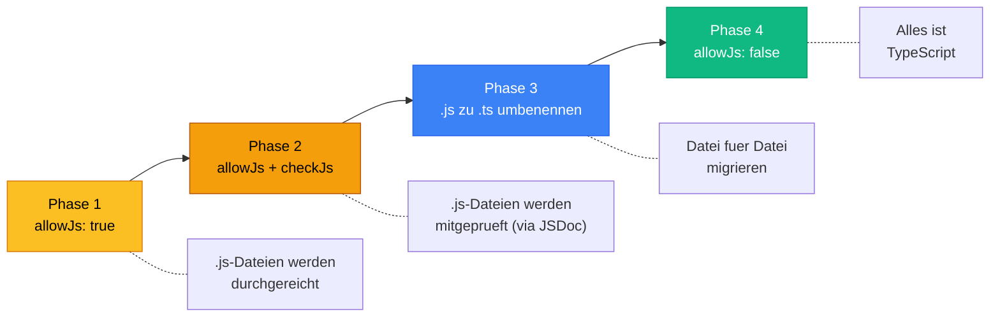

# Section 3: Understanding tsconfig -- The Heart of Every TS Project

> Estimated reading time: ~12 minutes

## What you'll learn here

- What the most important options in a `tsconfig.json` do and WHY they exist
- Why `strict: true` is non-negotiable
- What Source Maps and Declaration Files are and when you need them

---

## The tsconfig.json: Configuring Your Project

Now that you know WHAT the compiler does (parsing, type checking, emit), let's look at HOW you configure it. The `tsconfig.json` is the control center.

### A typical tsconfig.json

```json
{
  "compilerOptions": {
    "target": "ES2022",
    "module": "NodeNext",
    "moduleResolution": "NodeNext",
    "strict": true,
    "esModuleInterop": true,
    "outDir": "./dist",
    "rootDir": "./src",
    "declaration": true,
    "sourceMap": true,
    "skipLibCheck": true,
    "forceConsistentCasingInFileNames": true,
    "noEmitOnError": true
  },
  "include": ["src/**/*"],
  "exclude": ["node_modules", "dist"]
}
```

At first glance, this looks like a lot of switches. But each one has a concrete reason.

> **Background:** The `tsconfig.json` was introduced with TypeScript 1.5 (2015). Before that, you had to pass all compiler options as command-line flags. Imagine typing `tsc --target ES5 --module commonjs --strict --outDir dist --rootDir src ...` every time -- that was the reality. The `tsconfig.json` was a game changer because it made configuration versionable and shareable.

> **Experiment:** Open the `tsconfig.json` in your project and hover over any option in VS Code. VS Code shows you a description directly from the TypeScript documentation. Try it with `strict`, `target` and `module` -- the descriptions are surprisingly helpful.

> **Think about it:** Why is the tsconfig.json implemented as a JSON file and not as a JavaScript file (like `webpack.config.js` or `eslint.config.js`)? What would be the advantage of a JS configuration? What would be the disadvantage?

### The most important options explained

| Option | What it does | Recommendation |
|--------|-------------|------------|
| `target` | Determines which JS version to compile to (ES5, ES2015, ES2022, ...) | `ES2022` for modern Node.js projects |
| `module` | The module system of the output (CommonJS, ESNext, NodeNext) | `NodeNext` for Node.js |
| `strict` | Enables ALL strict checks at once | **Always `true`** |
| `outDir` | Where the compiled JS files are written | `./dist` |
| `rootDir` | Where the source code is located | `./src` |
| `declaration` | Generates `.d.ts` files (type declarations) | `true` for libraries |
| `sourceMap` | Generates `.map` files for debugging | `true` during development |
| `esModuleInterop` | Better compatibility with CommonJS modules | `true` |
| `skipLibCheck` | Skips type-checking of `.d.ts` files | `true` (speeds up compilation) |
| `noEmitOnError` | No JavaScript output on type errors | `true` for production builds |

> **Deep dive:** `target` affects not only the syntax (e.g., whether `async/await` gets compiled down to Promises) but also which **built-in types** are available. With `target: "ES5"`, TypeScript doesn't know `Promise`, `Map`, `Set` or `Symbol`. If you want to use these, you either need to raise the target or extend the `lib` option: `"lib": ["ES5", "ES2015.Promise"]`. In practice: just use `ES2022` -- all modern runtimes (Node 18+, current browsers) support it.

---

## What `strict: true` Enables in Detail

`strict` is an umbrella flag. It activates these individual options:

- **`strictNullChecks`** -- `null` and `undefined` are their own types
- **`strictFunctionTypes`** -- Stricter checking of function parameters (contravariance!)
- **`strictBindCallApply`** -- Correctly checks `bind`, `call`, `apply`
- **`strictPropertyInitialization`** -- Class properties must be initialized
- **`noImplicitAny`** -- Variables without type annotations don't automatically get `any`
- **`noImplicitThis`** -- `this` must have a clear type
- **`alwaysStrict`** -- Emits `"use strict"` in every file
- **`useUnknownInCatchVariables`** -- `catch(e)` has type `unknown` instead of `any`

> **Background:** The `strict` flag was introduced with TypeScript 2.3 (2017), and the team regularly adds further sub-options with new TypeScript versions. This means: if you set `strict: true` and update TypeScript, your code might suddenly have new errors because stricter checks were added. This is *intentional* -- each new strict check has found real bugs in real code.

### Why strict MUST always be on: a concrete example

Without `strictNullChecks`, the following happens:

```typescript
// OHNE strictNullChecks -- GEFAEHRLICH!
function getUser(id: number): User {
  return database.find(u => u.id === id);  // Koennte undefined sein!
}

const user = getUser(999);
console.log(user.name);  // KEIN Compiler-Fehler!
                          // Aber zur Laufzeit: "Cannot read property 'name' of undefined"
```

With `strictNullChecks`, TypeScript reports:

```typescript annotated
// MIT strictNullChecks -- SICHER!
function getUser(id: number): User | undefined {
// ^ return type "User | undefined" -- compiler forces callers to handle both cases
  return database.find(u => u.id === id);  // Array.find returns T | undefined
}

const user = getUser(999);     // type of "user" is now "User | undefined"
console.log(user.name);        // ERROR: Object is possibly 'undefined'
                               // ← compiler refuses to let you ignore the undefined case

// You MUST narrow the type before accessing properties:
if (user) {                    // ← type guard: inside this block, "user" is "User"
  console.log(user.name);     // safe -- TypeScript knows user is defined here
}
```

> **Background:** Tony Hoare, who invented the concept of the null reference in 1965, later called it his **"billion-dollar mistake"**: *"I call it my billion-dollar mistake. It was the invention of the null reference."* `strictNullChecks` is the direct antidote. It forces you to explicitly handle every place where `null` or `undefined` can occur. No more "Cannot read property of undefined" errors in production.

> **Think about it:** `useUnknownInCatchVariables` (since TS 4.4) changes the type of `catch(e)` from `any` to `unknown`. Why is that safer? What do you need to do differently in the catch block now?

> 🧠 **Explain to yourself:** Why does TypeScript NOT report an error on `user.name` WITHOUT `strictNullChecks`, even when `user` might be `undefined`? What changes WITH this option?
> **Key points:** Without strictNullChecks: null/undefined are implicitly part of every type | With it: null/undefined are their own types | Forces explicit checking | Prevents "Cannot read property of undefined"

**Rule: Always start with `strict: true`.** It's much harder to introduce Strict Mode retroactively than to work with it from the start. If you're migrating an existing project, you can set `strict: true` and temporarily disable individual sub-options:

```json
{
  "compilerOptions": {
    "strict": true,
    "strictPropertyInitialization": false  // Spaeter aktivieren
  }
}
```

---

## allowJs and checkJs: The Bridge Between JS and TS

What if you have an existing JavaScript project and want to migrate it to TypeScript incrementally? There are two important compiler options for that:

- **`allowJs: true`** -- Allows `.js` files in the TypeScript project. You can mix `.ts` and `.js` files. This is the first step of a migration.

- **`checkJs: true`** -- Goes a step further: TypeScript also checks `.js` files for type errors! It uses JSDoc comments and type inference to do this.

```javascript
// In einer .js-Datei (mit checkJs: true):

/** @param {string} name */
/** @param {number} alter */
function begruessung(name, alter) {
  return `${name} ist ${alter} Jahre alt.`;
}

begruessung("Anna", "zwanzig");  // TypeScript meldet: Fehler!
                                  // Auch ohne .ts-Datei!
```

**Migration strategy in four phases:**



> **Practical tip:** When migrating an existing React project, start with the "leaf components" -- the smallest, most independent components at the bottom of the tree. Then work your way up. With Angular projects, this strategy is rarely needed, since Angular uses TypeScript from the start.

---

## Source Maps: The Debugging Tool

When you set `"sourceMap": true`, the compiler generates a `.js.map` file alongside every `.js` file. But what's inside it?

**The problem:** You write TypeScript, but the browser/Node.js executes JavaScript. When an error occurs, the stack trace points to line 47 in `user.js` -- but you never wrote `user.js`. You want to see line 23 in `user.ts`.

**The solution:** Source Maps are a translation table that maps every line in the generated JavaScript to the corresponding line in the original TypeScript.

```
user.ts (was du schreibst)      user.js (was ausgefuehrt wird)
----------------------------    ----------------------------
Zeile 23: const x: number = 5  Zeile 47: const x = 5
                       \                    /
                        \                  /
                    user.js.map
                    (Zuordnungstabelle)
```

The analogy: Source Maps are like the index of a translated book. If someone finds a passage on page 47 of the English translation, they can use the mapping to look up that it corresponds to page 23 in the German original.

**How to use Source Maps:**

- **In the browser:** DevTools automatically recognize Source Maps. You see your `.ts` files in the Sources tab and can set breakpoints directly in them.
- **In Node.js:** Start with `node --enable-source-maps dist/main.js`. Stack traces will then point to the `.ts` files.
- **In VS Code:** Configure `launch.json` with `"sourceMap": true` -- then you can debug directly in TypeScript.

**When to enable Source Maps?**

| Environment | Recommendation | Why |
|----------|-----------|-------|
| Development | Always `true` | Debugging without Source Maps is flying blind |
| Production (Backend) | `true` | Helps with debugging in production |
| Production (Frontend) | Optional / `"hidden"` | Published Source Maps expose your source code; `"hidden"` is for error tracking only (Sentry, etc.) |

---

## Declaration Files (.d.ts): Type Definitions for the World

When you set `"declaration": true`, `tsc` generates a `.d.ts` file alongside every `.js` file. This contains ONLY the type information -- no code.

```typescript
// user.ts (dein Code)
export function createUser(name: string, age: number): User {
  return { id: Math.random(), name, age, createdAt: new Date() };
}

// user.d.ts (automatisch erzeugt)
export declare function createUser(name: string, age: number): User;
```

**Why does this exist?**

When you write a library and publish it as an npm package, you ship the compiled JavaScript. But the users of your library still want type information. The `.d.ts` files deliver exactly that.

> **Background:** This is also why packages like `@types/react` or `@types/node` exist. React and Node.js are written in JavaScript, but the community has contributed the type information on [DefinitelyTyped](https://github.com/DefinitelyTyped/DefinitelyTyped). DefinitelyTyped is one of the largest open-source repositories in the world -- with over 8,000 type definitions for JavaScript libraries. When you run `npm install @types/lodash`, you're installing the `.d.ts` files from this repository.

---

## What you've learned

- The **tsconfig.json** is the central configuration -- it controls *how* the compiler works
- **`strict: true`** is mandatory -- without Strict Mode, you're giving up TypeScript's greatest advantage
- **`strictNullChecks`** is the single most important sub-option -- it prevents null reference errors
- **Source Maps** connect generated JavaScript code to your TypeScript for debugging
- **Declaration Files** (`.d.ts`) provide type information for libraries
- **Migrating** from JS to TS works incrementally via `allowJs` and `checkJs`

> **Experiment:** Create a minimal `tsconfig.json` with just `{ "compilerOptions": { "strict": true } }` and compile a file where a variable has no type: `function add(a, b) { return a + b; }`. Read the error message. Then set `strict: false` and compile again. What difference did you notice? Set `strict` back to `true` afterwards!

---

**Next section:** [Tools & Execution -- tsc, tsx, ts-node compared](04-tools-und-ausfuehrung.md)

> Good time for a break. When you come back, start with Section 4: Tools & Execution.