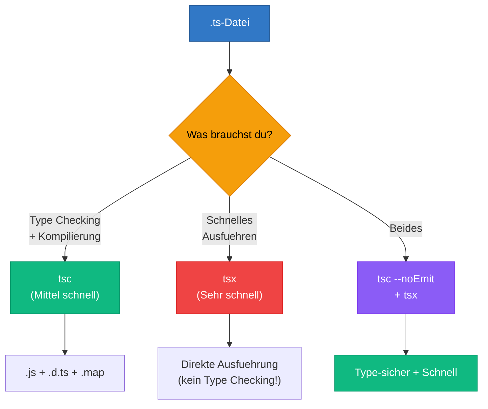

# Section 4: Tools & Execution -- tsc, tsx, ts-node Compared

> Estimated reading time: ~10 minutes

## What you'll learn here

- Which tools exist for running TypeScript, and what each one does
- Why `tsx` is fast but doesn't do type checking
- The ideal development workflow: combining type checking + fast execution

---

## The Tool Ecosystem

TypeScript has no built-in runtime. You can't simply "run" `.ts` files like a Python script. Instead, you either have to compile first and then execute, or use a tool that does both in a single step.

> **Background:** This is a deliberate design decision. TypeScript didn't want to build its own ecosystem — it wanted to integrate into the existing JavaScript ecosystem. That's why `tsc` produces JavaScript that can be run by any existing JavaScript runtime (Node.js, Deno, browsers, Bun). Other languages like Dart or CoffeeScript created their own runtimes — and lost relevance as a result. TypeScript avoided that mistake.

---

## 1. `tsc` -- The Official Compiler

```bash
# Installation
npm install -g typescript

# Einzelne Datei kompilieren
tsc hello.ts        # erzeugt hello.js

# Projekt kompilieren (nutzt tsconfig.json)
tsc                 # kompiliert alles laut Konfiguration

# Watch-Modus: Kompiliert bei jeder Aenderung neu
tsc --watch

# Nur Type Checking, kein Output
tsc --noEmit
```

`tsc` only compiles — it doesn't execute the code. You have to run the generated JavaScript with `node` afterwards:

```bash
tsc hello.ts && node hello.js
```

> **Deeper knowledge:** `tsc --noEmit` is one of the most important commands in modern TypeScript projects. It checks all types but produces no output. That's exactly what Next.js and Vite do: they use `tsc` only for checking, not for compiling. Faster tools handle the actual compilation. You'll find this command in almost every `package.json`: `"typecheck": "tsc --noEmit"`.

---

## 2. `tsx` -- Running TypeScript Directly

```bash
# Installation
npm install -g tsx

# Direkt ausfuehren (kompiliert im Speicher, keine .js-Datei)
tsx hello.ts

# Watch-Modus
tsx watch hello.ts
```

`tsx` is the fastest way to run TypeScript. It uses `esbuild` under the hood and is extremely fast.

**But:** it does NO type checking. It simply strips the types and executes the JavaScript.

> **Background:** `esbuild` was written by Evan Wallace (one of Figma's co-founders) in Go. It's 10–100× faster than `tsc` because it does two things `tsc` doesn't: (1) it uses all CPU cores in parallel, and (2) it skips type checking entirely. For `esbuild`, type annotations are just syntax to be removed — it doesn't understand their meaning.

**When is this a problem?**

If your code has a type error, `tsx` will NOT report it. The code just runs — and may only crash at runtime. That's why you always need `tsc --noEmit` alongside it.

Think of it this way: `tsx` is like a fast courier who delivers your package immediately without checking the contents. `tsc` is quality control that ensures the right product is in the package. You need both.

```typescript annotated
// This file contains a deliberate type error:
const greeting: number = "hello";   // ← ERROR: Type 'string' not assignable to type 'number'
console.log(greeting);              // tsx runs this anyway -- output: "hello"

// tsx behaviour:   strips ": number", executes as JS, prints "hello" -- no complaint
// tsc behaviour:   reports "Type 'string' is not assignable to type 'number'" and stops
// tsc --noEmit:    same type error, but produces no .js file -- used purely for checking

// The key insight: tsx treats annotations as comments to remove,
//                  tsc treats them as contracts to enforce.
```

> 🧠 **Explain to yourself:** Why does `tsx` do NO type checking? What's the advantage — and what risk does that create? How do `tsx` and `tsc --noEmit` complement each other in the workflow?
> **Key Points:** tsx uses esbuild (syntax removal only) | No type checking = faster | Risk: runtime errors despite type errors | Both together: speed + safety

> **Experiment:** Create a file `test-tsx.ts` with a deliberate type error:
> ```typescript
> const name: number = "hello";
> console.log(name);
> ```
> Run it with `tsx test-tsx.ts`. What happens? The code runs without errors! Then run `tsc --noEmit test-tsx.ts`. Now you'll see the error. That's the difference.

> **Think about it:** If `tsx` doesn't report type errors — why use it at all? Why not always use `tsc`? (Hint: think about speed on large projects and the feedback loop during development.)

---

## 3. `ts-node` -- The Classic

```bash
# Installation
npm install -g ts-node

# Ausfuehren
ts-node hello.ts

# Mit SWC (schneller)
ts-node --swc hello.ts
```

`ts-node` is older and slower than `tsx`, but more widely used. It can optionally perform type checking as well.

> **Background:** `ts-node` was the first popular tool for running TypeScript directly and appeared in 2015. It uses the real TypeScript compiler under the hood, which makes it slower but more complete. With the `--swc` flag, it can use SWC instead of `tsc` for transpilation — which makes it significantly faster, but then without type checking (just like `tsx`). For new projects, `tsx` is the better choice, but you'll still encounter `ts-node` in many older projects and tutorials.

---

## 4. `tsc --watch` vs. `tsx watch` -- What's the Difference?

| | `tsc --watch` | `tsx watch` |
|---|---|---|
| **What it does** | Recompiles on every change | Re-executes on every change |
| **Type Checking** | Yes, on every change | No |
| **Output** | `.js` files on disk | Direct execution in memory |
| **Speed** | Slower (full type checking) | Very fast (syntax removal only) |
| **Best use** | In the background for type feedback | For rapid development |

### The Ideal Workflow

Run both simultaneously:

```bash
# Terminal 1: Type Checking im Hintergrund
tsc --watch --noEmit

# Terminal 2: Schnelles Ausfuehren
tsx watch src/main.ts
```

Terminal 1 tells you whether your code is correct. Terminal 2 shows you what your code does. Together they give you fast feedback AND type safety.

> **Practical tip:** In VS Code, you can configure both tasks in `tasks.json` and have them start automatically when you open the project. Or just use VS Code's built-in TypeScript errors — they come directly from the TypeScript Language Server and are always up to date, without needing to manually start `tsc --watch`.

---

## Comparing All Tools



**Complete Comparison:**

| Tool | Type Checking | Speed | Output |
|----------|:---:|:---:|---|
| tsc | Yes | Medium | .js + .d.ts + .map |
| tsx | No | Very fast | Direct execution |
| ts-node | Optional | Slow | Direct execution |
| esbuild | No | Extremely fast | .js (bundled) |
| SWC | No | Extremely fast | .js |

### Recommendation by Context

| Context | Recommendation |
|---------|-----------|
| Running quickly | `tsx` |
| CI/Build | `tsc` for type checking + compilation |
| Combined | `tsc --noEmit` (check) + `tsx` (execute) |
| Angular project | `ng serve` (uses `tsc` internally) |
| Next.js project | `next dev` (uses SWC internally, `tsc` only for type checking) |
| This learning project | `tsx` for examples and exercises |

> **Think about it:** Why isn't there a tool that can do both — fast AND with type checking? Couldn't someone just write a fast type checker?

This has actually been attempted. Projects like **stc** (a TypeScript type checker in Rust, now discontinued) and **ezno** show that the community is actively working on it. The core problem: the TypeScript type checker is extremely complex — it has to handle thousands of edge cases and interactions between features. Re-implementing a fully compatible type checker is an enormous undertaking. Until that's achieved, the combination of `tsc --noEmit` + a fast transpiler remains the pragmatic solution.

---

## What You've Learned

- **`tsc`** is the official compiler — compiles and checks types
- **`tsx`** runs TypeScript at lightning speed, but without type checking
- **`ts-node`** is the classic option, slower than `tsx`, but more widely used
- **`tsc --watch` + `tsx watch`** together are the ideal workflow
- **No tool offers both** -- fast execution AND type checking -- due to the complexity of the type checker
- In **Angular** and **Next.js**, the tooling is abstracted away, but the same principles apply under the hood

> **Experiment:** Run these commands one after the other and mentally measure the time:
> ```bash
> time tsc --noEmit          # Type Checking des ganzen Projekts
> time tsx examples/01-hello-typescript.ts   # Direkte Ausfuehrung
> ```
> Notice the speed difference? For small projects it's minimal, but with 1000+ files `tsc` will take several seconds while `tsx` starts almost instantly.

---

**Next section:** [Practice & Limits -- Type Checking vs. Runtime Behavior](05-praxis-und-grenzen.md)

> Good time for a break. When you come back, start with Section 5: Practice & Limits.