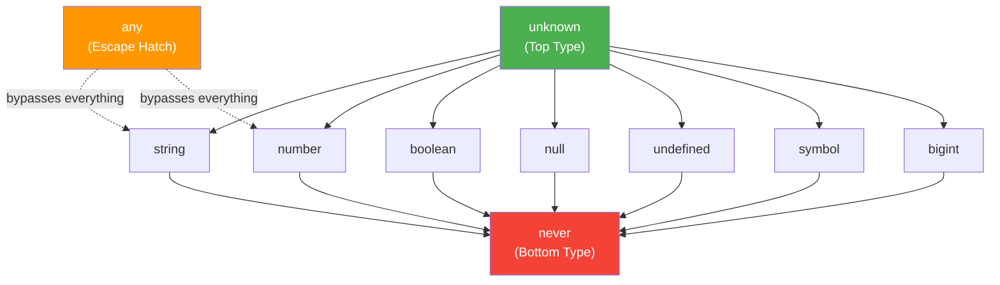

# Section 1: The Type System at a Glance

> Estimated reading time: **10 minutes**
>
> Previous section: — (Start)
> Next section: [02 - string, number, boolean](./02-string-number-boolean.md)

---

## What you'll learn here

- Why TypeScript types **completely disappear** at runtime (Type Erasure)
- How the **type hierarchy** is structured and why that matters
- The difference between **compile time** and **runtime** as a fundamental mental model

---

## The mental model: Compile time vs. runtime

Before we look at a single type, we need to understand the **most important
concept** in TypeScript. It is so fundamental that everything
else builds on it:

> **TypeScript types ONLY exist at compile time. At runtime,
> they are completely gone.**

This is called **Type Erasure**. When the TypeScript compiler
converts your code to JavaScript, **all type annotations are removed**.
What remains is plain JavaScript.

```typescript
// THIS is what you write (TypeScript):
function addiere(a: number, b: number): number {
  return a + b;
}

// THIS is what gets executed (JavaScript after compilation):
function addiere(a, b) {
  return a + b;
}
// The types ": number" have DISAPPEARED.
```

### Why does this matter?

Because it means TypeScript is a **pure compile-time check**.
It's like a very thorough editor who reviews your book for errors
before printing — but the editor is no longer there when the book is
sitting on the shelf.

> **Practical consequence:**
> Data from outside (APIs, `localStorage`, `JSON.parse`) has
> NO TypeScript types. You must validate it YOURSELF.

```typescript
// TypeScript CANNOT check this at runtime:
function istString(wert: unknown): boolean {
  // return typeof wert === "string";   <-- JavaScript check (works)
  // return wert instanceof string;     <-- WRONG! "string" is not a class
}

// Data from outside (APIs, localStorage, JSON.parse) has
// NO TypeScript types. You must validate them YOURSELF.
const apiDaten = JSON.parse('{"name": "Max"}');
// apiDaten is "any" — TypeScript cannot know what the API returns.
```

That's why `unknown` is so important (more on that in Section 4):
It forces you to write runtime checks for data whose type
TypeScript cannot guarantee.

> 🧠 **Explain to yourself:** Why can't TypeScript guarantee what type `JSON.parse()` returns? What would need to happen for TypeScript to be able to do that?
> **Key points:** JSON comes from outside (API, file) | Content is only known at runtime | TypeScript only works at compile time | Solution: Runtime validation with zod or similar

> 📖 **Background: Why did TypeScript choose this design?**
>
> Anders Hejlsberg (creator of TypeScript, but also of C# and Turbo Pascal)
> made a deliberate design decision in 2012: TypeScript should be a **superset
> of JavaScript**, not a completely new type system with runtime overhead.
> The reason? Adoption. If TypeScript had introduced its own runtime constructs
> (such as `enum` classes or runtime type checks), it would have become its own
> language standard — not simply "JavaScript with types."
>
> The result: TypeScript compiles to **clean, readable JavaScript**
> without a runtime library. Your `tsc` output looks like handwritten JS.
> This decision is the main reason TypeScript has achieved such massive
> adoption — unlike alternatives like Flow or ReasonML,
> which had similar goals but found less uptake.

**Keep this picture in mind:**

```
  +-----------------------------------------------------------+
  |              COMPILE TIME (tsc checks)                     |
  |                                                           |
  |  TypeScript types exist here:                             |
  |  string, number, boolean, interfaces, type aliases...     |
  |                                                           |
  |  The compiler REMOVES all types during compilation.       |
  +-----------------------------------------------------------+
  |              RUNTIME (Node.js / Browser executes)          |
  |                                                           |
  |  Only JavaScript values exist here:                       |
  |  typeof === "string", "number", "boolean", "object"...    |
  |                                                           |
  |  NO TypeScript type remains!                              |
  +-----------------------------------------------------------+
```

> 💭 **Think about it:** If TypeScript types don't exist at runtime,
> why are they still so valuable?
>
> **Answer:** Because most errors occur during development,
> not in production. TypeScript catches these errors
> BEFORE the code even runs. It's like a
> spell checker — it prevents mistakes without being visible in the printed
> text. Studies from Google and Microsoft show that
> static type systems prevent **around 15% of all bugs** — that sounds
> small, but it's enormous in projects with millions of lines of code.

> 🔍 **Deeper knowledge: The exception to Type Erasure**
>
> There is **one** place where TypeScript does generate runtime code:
> `enum`. A TypeScript `enum` is compiled to a JavaScript object.
> This is one of the reasons why some teams avoid `enum` and
> instead use Union Types with `as const` — because Union Types
> undergo Type Erasure and generate no runtime code.
>
> ```typescript
> // enum generates runtime code:
> enum Direction { Up, Down }
> // becomes: var Direction; (function(Direction) { ... })(Direction || ...)
>
> // Union + as const generates NO runtime code:
> const Direction = { Up: 0, Down: 1 } as const;
> type Direction = typeof Direction[keyof typeof Direction]; // 0 | 1
> ```

---

## The TypeScript Type Hierarchy

Now that we know types are a compile-time concept,
let's look at how they relate to each other.
TypeScript has a clear hierarchy:

```
                        unknown
              (Top Type — everything is assignable to unknown)
           /     /    |    \     \       \
      string  number  boolean  symbol  bigint  null  undefined  ...
           \     \    |    /     /       /
                        never
              (Bottom Type — nothing is assignable to never)
```

The following diagram shows the hierarchy as a directed graph — the
arrows show the direction of **assignability** (from top to bottom):



**Reading direction:** An arrow from A to B means "A is a supertype of B"
(B can be assigned to A). So any `string` can be assigned to `unknown`
(upward), and `never` can be assigned to any type
(because `never` is a subtype of everything).
The dashed lines from `any` show that `any` breaks the rules.

### What does this mean?

- **`unknown`** is the **Top Type**: Every value in TypeScript is assignable
  to `unknown`. It is the most general type — like a box that
  anything can be put into.
- **`never`** is the **Bottom Type**: `never` is assignable to every type, but
  nothing can be assigned to `never`. It represents the "impossible."
- The **primitive types** (`string`, `number`, `boolean`, `symbol`, `bigint`)
  sit in between.

> 📖 **Background: Top and Bottom Types in type theory**
>
> The terms "Top Type" and "Bottom Type" come from mathematical
> type theory. In set theory, `unknown` would be the **set of all values**
> (every value belongs to it) and `never` would be the **empty set** (no value
> belongs to it, but the empty set is a subset of every other set —
> which is why `never` is assignable to every type).
>
> Other languages have similar concepts:
> - Java: `Object` (Top), no explicit Bottom Type
> - Scala: `Any` (Top), `Nothing` (Bottom)
> - Kotlin: `Any` (Top), `Nothing` (Bottom)
> - Rust: `!` (Bottom, "never type")

And then there is **`any`** — the type that breaks the rules:

```
  any <--> EVERYTHING    (any can become anything and anything can become any)
                          This is an escape hatch, not a solution!
```

`any` is neither Top nor Bottom — it is a type that **completely
disables** the type system. Think of `any` as a "fire alarm pull":
It exists for emergencies, but if you use it every day, you have
a serious problem.

### The hierarchy in practice

This hierarchy is not just theory. It determines **what you can assign
where**:

```typescript annotated
let x: unknown = "hallo";
// ^ unknown is the Top Type: anything can be assigned to it
let y: unknown = 42;
// ^ Upward assignment (concrete -> general) always works

// let a: string = x;
// ^ ERROR! Downward (general -> concrete) does NOT work without a check

if (typeof x === "string") {
// ^ Type Narrowing: TypeScript narrows the type through the check
  let a: string = x;
// ^ Now OK! After the typeof check, TS knows: x is a string
}

function gibNever(): never { throw new Error("!"); }
// ^ never is the Bottom Type: the function NEVER returns
let s: string = gibNever();
// ^ OK -- but never executed (code after throw is unreachable)
```

> ⚡ **Practical tip:** In Angular and React you encounter the hierarchy
> constantly. For example with HTTP responses:
>
> ```typescript
> // Angular HttpClient returns Observable<unknown> when no type is specified:
> this.http.get('/api/users')  // Observable<Object> — should really be cast
>
> // Better: specify a type
> this.http.get<User[]>('/api/users')  // Observable<User[]>
> // But CAUTION: This is a "trust me, compiler" — TypeScript does NOT
> // check whether the API actually returns User[]!
> ```

### Summary so far

| Concept | Meaning | Memory aid |
|---|---|---|
| **Type Erasure** | Types disappear at runtime | "Types are ink that disappears after printing" |
| **unknown** (Top) | Every value fits inside | "The biggest box" |
| **never** (Bottom) | No value fits inside | "The empty set" |
| **any** | Disables the type system | "The fire alarm pull" |
| **Compile time** | Where TypeScript works | "The editor before printing" |
| **Runtime** | Where JavaScript runs | "The book on the shelf" |

---

## What you've learned

- TypeScript types **only exist at compile time** and are removed during compilation (Type Erasure)
- The type hierarchy has `unknown` as the Top Type and `never` as the Bottom Type
- `any` sits outside the hierarchy and disables the type system
- External data (APIs, JSON.parse) has no TypeScript types — you must validate it yourself

> 🧠 **Explain to yourself:** What is the difference between `unknown` (Top Type) and `any`? Both accept any value — but what happens when you try to access properties on them afterwards?
> **Key points:** unknown forces a check before access | any disables the type system completely | any is contagious | unknown is safe

**Core Concept to remember:** Type Erasure is the most fundamental concept in TypeScript. Whenever you're confused, ask yourself: "Does this exist at runtime?" — and the answer clarifies almost everything.

> **Experiment:** Try the following in the TypeScript Playground:
> ```typescript
> // Safe approach: unknown forces checks
> function verarbeite(wert: unknown): string {
>   if (typeof wert === "string") {
>     return wert.toUpperCase(); // OK — TypeScript knows: wert is a string
>   }
>   return "kein String";
> }
>
> // Unsafe approach: any disables the type system
> function verarbeiteUnsicher(wert: any): string {
>   return wert.toUpperCase(); // No error — but runtime crash for numbers!
> }
> ```
> Change the type of `wert` in `verarbeite` from `unknown` to `any`.
> Which error messages disappear? Then try calling `wert.nichtExistent()` —
> with `any` no compiler error, with `unknown` immediately red. What does this tell you about
> the safety guarantees of the type system?

---

> **Pause point** -- Good moment for a break. You've understood the fundamental
> mental model that everything else builds on.
>
> Continue with: [Section 02: string, number, boolean](./02-string-number-boolean.md)