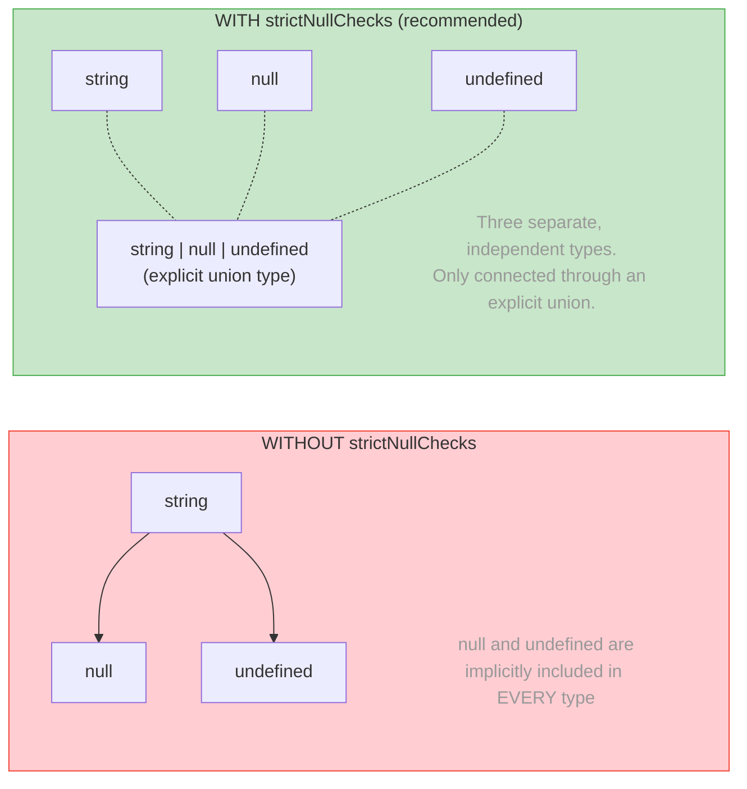

# Section 3: null and undefined — The Billion-Dollar Story

> Estimated reading time: **10 minutes**
>
> Previous section: [02 - string, number, boolean](./02-string-number-boolean.md)
> Next section: [04 - any vs unknown](./04-any-vs-unknown.md)

---

## What you'll learn here

- The historical reasons why JavaScript has **two** types for "no value"
- Why `strictNullChecks` is the **most important compiler option**
- The difference between `x?: string`, `x: string | undefined`, and `x: string | null`

---

## Why does JavaScript have two "nothing" values?

JavaScript (and therefore TypeScript) has **two** types for "no value":

| | `undefined` | `null` |
|---|---|---|
| **Meaning** | "Was never set" | "Was deliberately cleared" |
| **Default** | Uninitialized variables | Must be explicitly set |
| **typeof** | `"undefined"` | `"object"` (historical bug!) |
| **JSON** | Gets **removed** | Stays as `null` |

> 📖 **Background: The "Billion Dollar Mistake"**
>
> Tony Hoare, a British computer scientist, invented the **null pointer** in 1965
> for the language ALGOL W. In 2009, he gave a famous talk
> in which he called this his **"Billion Dollar Mistake"**:
>
> *"I call it my billion-dollar mistake. It was the invention of the null
> reference in 1965. [...] I couldn't resist the temptation to put in a
> null reference, simply because it was so easy to implement."*
>
> His argument: null reference errors (NullPointerException in Java,
> "Cannot read property of null" in JavaScript) have since caused
> **billions in damage** — in the form of bugs, crashes, and
> security vulnerabilities.
>
> JavaScript **doubled** the problem by having both `null`
> and `undefined`. TypeScript's `strictNullChecks` is the
> attempt to retroactively correct Hoare's mistake.

> 📖 **Background: Why is typeof null === "object"?**
>
> This bug stems from the **very first JavaScript implementation**
> from 1995. In the original implementation (written by Brendan Eich in
> 10 days), values were stored as tag + data.
> Objects had the tag `0`, and `null` was represented as a **null pointer**
> (0x00). Since the tag bits were also `0`, `null` was
> incorrectly recognized as an object.
>
> This bug was **never fixed**, because too much existing code
> relies on `typeof null === "object"`. An attempt to fix the bug
> in ES2015 was rejected — it would have broken too many websites.
>
> **The practical consequence:**
> ```typescript
> // WRONG: typeof checks for objects also catch null:
> function process(value: unknown) {
>   if (typeof value === "object") {
>     value.toString(); // Error! value could be null!
>   }
>   // CORRECT:
>   if (typeof value === "object" && value !== null) {
>     value.toString(); // OK
>   }
> }
> ```

---

## strictNullChecks — Your Safety Net

In `tsconfig.json` there is the option `strictNullChecks` (it's part
of `strict: true`, which you should use):

```typescript
// WITH strictNullChecks (recommended, our standard):
let name: string = "Max";
name = null;       // Error! null is not assignable to string
name = undefined;  // Error! undefined is not assignable to string

// You must explicitly allow it:
let name2: string | null = "Max";
name2 = null;       // OK

let age: number | undefined = 25;
age = undefined;   // OK
```

**Without** `strictNullChecks`, `null` and `undefined` would be assignable to **every type** — a recipe for runtime errors.

> 🧠 **Explain to yourself:** What is the difference between `x?: string`, `x: string | undefined`, and `x: string | null`? In which situations would you use which variant?
> **Key points:** x?: optional, property may be missing | x: string|undefined: must be present, value can be undefined | x: string|null: deliberately "no value" | JSON: null stays, undefined gets removed

> 🔍 **Deeper knowledge: What does strictNullChecks change in the type hierarchy?**
>
> Without `strictNullChecks`, `null` and `undefined` are **subtypes** of
> all other types. This means: `string` implicitly includes `null`
> and `undefined`. This matches the behavior of Java, C# (before
> nullable reference types), and Python.
>
> With `strictNullChecks`, `null` and `undefined` become **independent,
> separate types** in the hierarchy. That is the fundamental
> difference:
>
> ```
> WITHOUT strictNullChecks:     WITH strictNullChecks:
>
>     string                        string    null    undefined
>     /    \                         |         |         |
>   null  undefined                (three separate, independent types)
> ```
>
> TypeScript 2.0 (September 2016) introduced `strictNullChecks`. It was
> one of the biggest breaking changes in the history of the language —
> and one of the most valuable.

The following diagram shows the effect of `strictNullChecks` on the
type hierarchy as a before/after comparison:



**Key point:** Without `strictNullChecks`, ANY variable can be `null` —
you only find out at runtime. With the option, TypeScript enforces that
you **explicitly** declare and **explicitly** check for `null` and `undefined`.

---

## Optional Parameters vs null vs undefined

Here lies one of the most subtle distinctions in TypeScript:

```typescript
// 1. Optional: parameter CAN BE MISSING (will then be undefined)
function greet(name?: string) {
  console.log(name);  // string | undefined
}
greet();           // OK, name is undefined
greet("Max");      // OK
greet(undefined);  // OK

// 2. Explicit undefined: parameter MUST be passed, can be undefined
function greet2(name: string | undefined) {
  console.log(name);  // string | undefined
}
// greet2();       // Error! Argument missing
greet2(undefined); // OK — but you must say it explicitly
greet2("Max");     // OK

// 3. Explicitly nullable: parameter MUST be passed, can be null
function greet3(name: string | null) {
  console.log(name);  // string | null
}
// greet3();       // Error! Argument missing
greet3(null);      // OK
greet3("Max");     // OK
```

> 💭 **Think about it:** When do you use which variant?
>
> **Answer:**
> - `name?: string` — when the parameter is **completely optional**
>   (the caller doesn't even need to think about it)
> - `name: string | undefined` — when the caller must **consciously decide**
>   whether to provide a value (e.g. "I don't have a value, but
>   I know that")
> - `name: string | null` — when `null` has a **semantic meaning**
>   (e.g. "The value existed once, but has now been cleared")

### A Practical Example: Forms in Angular/React

```typescript
// Angular Reactive Form: a field can be initialized or empty
interface FormState {
  vorname: string;                 // Required field, always filled
  nachname: string;                // Required field, always filled
  spitzname?: string;              // Optional field, doesn't need to exist
  geloeschteEmail: string | null;  // Had a value once, deliberately cleared
}

// React: Props with optional values
interface ButtonProps {
  label: string;                   // Required
  icon?: string;                   // Optional — no icon needed
  tooltip: string | null;          // Explicit: "has no tooltip"
}
```

---

## Nullish Coalescing (??) and Optional Chaining (?.)

Two operators that fundamentally simplify working with `null`/`undefined`.
Both were introduced in ES2020.

### Nullish Coalescing (??)

```typescript
// ?? returns the right-hand value when the left is null or undefined
const port = config.port ?? 3000;
```

> **The trap: ?? vs ||**
>
> ```typescript
> // || returns the right-hand value for ALL falsy values:
> const port1 = config.port || 3000;
> // If config.port === 0 → port1 is 3000!   (0 is falsy)
> // If config.port === "" → port1 is 3000!   ("" is falsy)
>
> // ?? returns the right-hand value ONLY for null/undefined:
> const port2 = config.port ?? 3000;
> // If config.port === 0 → port2 is 0!       (0 is not nullish)
> // If config.port === "" → port2 is ""!      ("" is not nullish)
> ```
>
> **Rule of thumb:** Always use `??` instead of `||` for default values,
> unless you deliberately want to catch all falsy values.

### Optional Chaining (?.)

```typescript
// ?. breaks the chain if a value is null/undefined
const street = user?.address?.street;  // string | undefined

// Also works for method calls:
const length = array?.length;
const result = callback?.();

// And for index access:
const first = array?.[0];
```

### Nullish Assignment (??=)

```typescript
// Set only if null/undefined:
let name: string | null = null;
name ??= "Default";  // name is now "Default"

let port: number | undefined = 0;
port ??= 3000;       // port stays 0! (0 is not nullish)
```

> ⚡ **Practical tip:** In Angular services and React hooks you'll see
> these operators everywhere:
>
> ```typescript
> // Angular: Service with optional configuration
> @Injectable()
> export class ApiService {
>   private baseUrl: string;
>
>   constructor(@Optional() config?: ApiConfig) {
>     this.baseUrl = config?.baseUrl ?? '/api';
>   }
> }
>
> // React: Hook with optional initial value
> function useUser(id?: string) {
>   const user = useQuery(['user', id], () => fetchUser(id!), {
>     enabled: id != null,  // == null checks for null AND undefined
>   });
>   return user?.data ?? null;
> }
> ```

---

## == null vs === null — A Special Case

```typescript
let x: string | null | undefined = getValue();

// == null checks for null AND undefined (sometimes intentional):
if (x == null) { /* x is null or undefined */ }

// === null checks ONLY for null:
if (x === null) { /* x is only null, not undefined */ }

// === undefined checks ONLY for undefined:
if (x === undefined) { /* x is only undefined, not null */ }
```

> 🔍 **Deeper knowledge: Why == null is an exception**
>
> Normally, you should always use `===` instead of `==` in JavaScript.
> But `x == null` is the **one accepted exception** — because it
> catches both `null` and `undefined`, which is almost always
> the desired behavior.
>
> Many style guides (including TypeScript's own) explicitly allow
> `== null`, even when they otherwise forbid `==`. The ESLint rule
> `eqeqeq` has the option `"allow-null"` for this purpose.

---

## What you've learned

- JavaScript has **two** values for "nothing": `undefined` (never set) and `null` (deliberately cleared)
- Tony Hoare called null his **"Billion Dollar Mistake"** — TypeScript's `strictNullChecks` corrects this
- `typeof null === "object"` is a **bug from 1995** that will never be fixed
- `??` vs `||`: Always use `??` for default values (ignores only null/undefined, not 0/"")
- Three variants: `x?: T` (optional), `x: T | undefined` (explicit), `x: T | null` (semantic)

**Core Concept to remember:** `strictNullChecks` makes `null` and `undefined` into independent types. Without this option, TypeScript's type system is only half as valuable.

> **Experiment:** Try the following in the TypeScript Playground:
> ```typescript
> // strictNullChecks is active by default (with "strict": true)
> function gibLaenge(text: string): number {
>   return text.length;
> }
> // gibLaenge(null);  // Error with strictNullChecks — remove // and see!
>
> // ?? vs || with falsy values
> const port1 = 0 || 3000;   // What is the result? 3000 — 0 is "falsy"!
> const port2 = 0 ?? 3000;   // What is the result? 0 — ?? only checks null/undefined
>
> const text1 = "" || "default";  // "default"
> const text2 = "" ?? "default";  // ""
> ```
> In the Playground, turn off the `strictNullChecks` option under "TS Config".
> Which error messages disappear when you call `gibLaenge(null)`?
> Then replace `??` with `||` for `port2` in the second half —
> why is that dangerous for a port default?

---

> **Pause point** -- You now understand why JavaScript has two "nothing" values
> and how TypeScript protects you from the errors that arise from them.
>
> Continue with: [Section 04: any vs unknown](./04-any-vs-unknown.md)