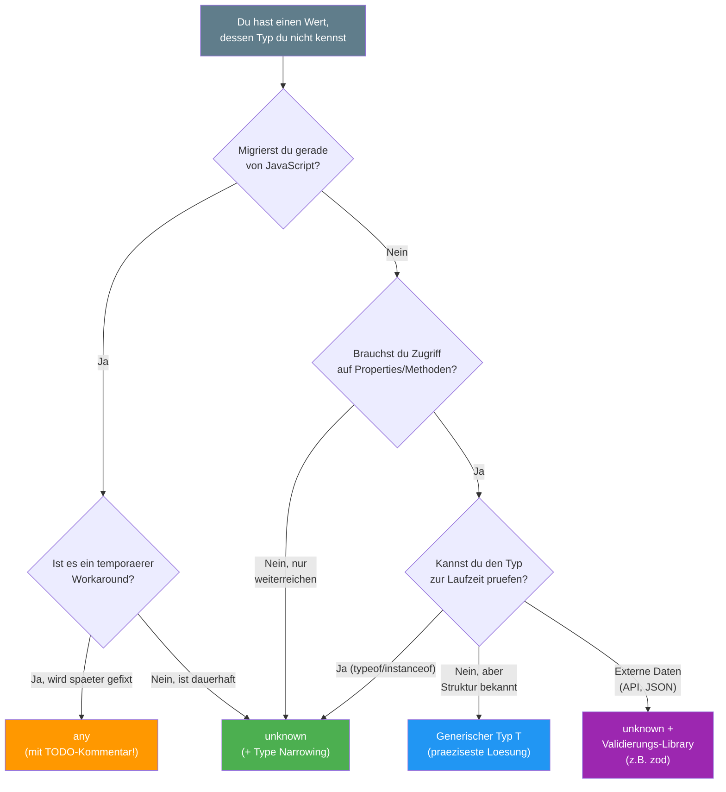

# Section 4: any vs unknown — The Most Important Decision

> Estimated reading time: **10 minutes**
>
> Previous section: [03 - null and undefined](./03-null-und-undefined.md)
> Next section: [05 - never, void, symbol, bigint](./05-never-void-symbol-bigint.md)

---

## What you'll learn here

- Why `any` **completely disables** the type system and how it spreads
- Why `unknown` wasn't introduced until **TypeScript 3.0** — and what came before
- When `any` is still acceptable (the exceptions)

---

## any — The Emergency Exit

```typescript
let dangerous: any = "hallo";
dangerous.foo.bar.baz();   // Kein Error! TypeScript schaut nicht hin
dangerous = 42;
dangerous = true;
dangerous();               // Kein Error! Obwohl es ein boolean ist
```

`any` **disables the entire type system** for this value. TypeScript
gives up and says: "Do whatever you want."

### Why is any dangerous?

**Reason 1: Errors move from compile time to runtime**

The whole point of TypeScript is to catch errors BEFORE execution.
With `any`, you lose this advantage entirely:

```typescript
const user: any = { name: "Max", age: 25 };
console.log(user.adress.street);  // Kein Compile-Error!
// Aber zur Laufzeit: "Cannot read property 'street' of undefined"
// Bemerkst du den Tippfehler? "adress" statt "address"
```

**Reason 2: any is contagious**

This is the truly dangerous part. `any` spreads like a virus:

```typescript
let x: any = "hallo";
let y = x.foo;      // y ist auch any!
let z = y + 1;      // z ist auch any!
let w = z.bar();    // w ist auch any!
// Die gesamte Kette ist jetzt unkontrolliert.
// Ein einziges "any" kann hunderte Variablen infizieren.
```

> 📖 **Background: Why does any exist at all?**
>
> When TypeScript was released in 2012, the primary goal was:
> **migrating existing JavaScript projects**. Microsoft wanted
> teams to be able to gradually convert their JavaScript codebases.
>
> Without `any`, this would have been impossible. Imagine a project with
> 100,000 lines of JavaScript — if every line had to be strictly typed
> immediately, no one would migrate. `any` was the promise:
> "You can start and improve incrementally."
>
> The problem: many teams stayed at the "start" stage. `any` was used
> not as a transitional solution, but as a permanent state.
> TypeScript 3.0 therefore introduced `unknown` as a **safe alternative**
> — and community pressure against `any` has been growing ever since.

### any Visualized

```
  Normales Typsystem:           Mit any:

  string ──x──> number          any ────> alles
  number ──x──> boolean         alles ──> any
  boolean ──x──> string
                                 Keine Pruefungen.
  Jede falsche Zuweisung         Keine Fehlermeldungen.
  wird sofort erkannt.           Keine Sicherheit.
```

---

## unknown — The Safe Way

```typescript
let safe: unknown = "hallo";
safe.foo;              // Error! Erst pruefen!
safe();                // Error! Erst pruefen!
safe + 1;              // Error! Erst pruefen!

// Erst nach einer Pruefung (Type Narrowing) darfst du zugreifen:
if (typeof safe === "string") {
  console.log(safe.toUpperCase());  // OK! TypeScript weiss: es ist string
}

if (typeof safe === "number") {
  console.log(safe.toFixed(2));     // OK! TypeScript weiss: es ist number
}
```

### The Security Analogy

Imagine you receive a package:

- **`any`** = "Don't open the package, just assume it's a cake
  and eat it." — Maybe it's explosives.
- **`unknown`** = "You have a package, but open and inspect it
  first before working with it." — Safe and responsible.

Or put another way:
- **`any`** = "I close my eyes and start running."
- **`unknown`** = "I look before I run."

> 📖 **Background: Why did unknown only arrive in TypeScript 3.0 (July 2018)?**
>
> Before TypeScript 3.0, there was **no safe alternative** to `any`.
> When you had a value whose type you didn't know (e.g.
> `JSON.parse()`, API responses, `catch` blocks), `any` was the
> only option.
>
> The TypeScript team recognized that `any` was being overused
> because there was no alternative — not because developers wanted unsafe code.
> Ryan Cavanaugh (Lead Developer of TypeScript) described
> `unknown` as "the type-safe counterpart of any".
>
> Since TypeScript 3.0, there's no reason to use `any` for "I don't know
> the type." The only remaining reason for `any`
> is "I want TypeScript not to check this code" — and that
> should be extremely rare.
>
> **Fun Fact:** TypeScript 4.4 then introduced `useUnknownInCatchVariables`
> (and it became part of `strict` from 4.4 onward), which changed `catch (error)` from
> `any` to `unknown`. That was the last major step away
> from implicit `any`.

---

## Decision Tree: any or unknown?

When you're unsure which type to use, follow this
decision tree:



**Rule of thumb:** The green path (`unknown`) is right in 90% of cases.
The orange path (`any`) is only acceptable during active migration — and
even then only with a `// TODO:` comment.

---

## Comparison at a Glance

| Property | `any` | `unknown` |
|---|---|---|
| Anything assignable? | Yes | Yes |
| Assignable to other types? | Yes (!) | No (only after checking) |
| Access properties? | Yes (unsafe) | No (check first) |
| Function calls? | Yes (unsafe) | No (check first) |
| Contagious? | **Yes!** | **No** |
| Safe? | **No** | **Yes** |
| Recommended? | **No** | **Yes** |
| Introduced in | TypeScript 1.0 (2014) | TypeScript 3.0 (2018) |

---

## Type Narrowing: Making unknown Useful

`unknown` alone is useless — you can't do anything with it. But
that's the point: it **forces** you to check the type. This is
called **Type Narrowing**:

```typescript annotated
function verarbeite(wert: unknown): string {
// ^ wert is unknown -- we know NOTHING about the type
  if (typeof wert === "string") {
// ^ Type Narrowing: after this check, TS knows that wert is a string
    return wert.toUpperCase();
// ^ Safe! TS has narrowed wert to string
  }
  if (typeof wert === "number") {
    return wert.toFixed(2);
// ^ Safe! TS has narrowed wert to number
  }
  if (wert instanceof Date) {
// ^ instanceof checks the prototype chain (only works with classes)
    return wert.toISOString();
  }
  if (typeof wert === "object" && wert !== null && "name" in wert) {
// ^ Three checks combined: is object, not null, has "name" property
    return String((wert as { name: unknown }).name);
  }
  return "unbekannt";
}
```

> 🔍 **Deeper Knowledge: The Narrowing Techniques**
>
> TypeScript understands several types of checks as narrowing:
>
> | Technique | Syntax | Result |
> |---|---|---|
> | typeof | `typeof x === "string"` | Primitive check |
> | instanceof | `x instanceof Date` | Class check |
> | in | `"name" in x` | Property existence |
> | Equality | `x === null` | Exact value |
> | Truthiness | `if (x)` | Non-falsy |
> | Type Predicate | `function isX(v): v is X` | Custom check |
>
> Type Predicates are covered in depth in Lesson 10 (Type Guards).

---

## When is any Acceptable?

Almost never. But there are genuine exceptions:

### 1. Migrating from JavaScript to TypeScript (temporary!)

```typescript
// Waehrend der Migration: any als Uebergang
// TODO: Typ definieren nach Migration
const legacyConfig: any = require('./old-config');
```

### 2. Deliberate Type Assertion (very rare)

```typescript
// Wenn du TypeScript's Typchecker austricksen musst:
// z.B. bei Test-Mocks oder bewusst ungueltigem Input
const mockService = {
  getUser: () => ({ id: 1, name: "Test" })
} as any as UserService;
```

### 3. Generic Type Constraints (advanced)

```typescript
// Manchmal brauchst du any in generischen Helper-Funktionen:
type AnyFunction = (...args: any[]) => any;
// Das ist akzeptabel, weil es als Constraint dient, nicht als Wert-Typ
```

**Rule of thumb:** Whenever you write `any`, it's a **code smell**.
Always consider first whether `unknown`, a generic type, or a
concrete type would be a better fit.

> ⚡ **Practical Tip: Tracking down any in Angular/React**
>
> ```bash
> # Finde alle "any"-Verwendungen in deinem Projekt:
> grep -rn ": any" src/ --include="*.ts" --include="*.tsx"
>
> # Oder in der tsconfig.json strenger werden:
> {
>   "compilerOptions": {
>     "noImplicitAny": true,          // Fehler wenn Typ als any inferiert wird
>     "useUnknownInCatchVariables": true  // catch-Variable ist unknown statt any
>   }
> }
> ```
>
> The compiler option `noImplicitAny` (part of `strict: true`) does not
> forbid explicit `any`. You can still write `any` explicitly —
> which documents the deliberate decision.

---

## The any Infection Chain in Practice

A realistic example of how `any` makes an entire feature unsafe:

```typescript
// Schritt 1: Eine Funktion gibt any zurueck (z.B. JSON.parse)
const response: any = JSON.parse(apiResponse);

// Schritt 2: Du greifst auf Properties zu — alles ist any
const users = response.data.users;     // any
const firstUser = users[0];            // any
const name = firstUser.name;           // any
const upperName = name.toUpperCase();  // any (!!!)

// Schritt 3: Du uebergibst any an andere Funktionen
function saveUser(user: User): void { /* ... */ }
saveUser(firstUser);  // KEIN ERROR! any passt ueberall rein

// Zur Laufzeit: firstUser koennte null sein,
// koennte ein String sein, koennte ein Array sein.
// TypeScript hat aufgegeben, das zu pruefen.
```

**The safe alternative:**

```typescript
// Mit unknown:
const response: unknown = JSON.parse(apiResponse);

// TypeScript ERZWINGT jetzt Pruefungen:
if (
  typeof response === "object" && response !== null &&
  "data" in response &&
  typeof (response as any).data === "object"  // hier ist as any OK: einmalig, kontrolliert
) {
  // Ab hier hast du einen validierten Zugriffspfad
}

// NOCH BESSER: Eine Validierungs-Library wie zod verwenden:
import { z } from "zod";
const UserSchema = z.object({ name: z.string(), age: z.number() });
const user = UserSchema.parse(JSON.parse(apiResponse));
// user ist jetzt typsicher: { name: string, age: number }
```

---

## What you've learned

- `any` **disables** the type system and is **contagious** — it infects all dependent variables
- `unknown` is the **safe alternative**: equally flexible when assigning, but forces checks
- `unknown` was introduced in TypeScript 3.0 (2018) because `any` was being overused
- Type Narrowing (`typeof`, `instanceof`, `in`) makes `unknown` usable
- `any` is only acceptable in exceptional cases: migration, deliberate assertions, generic constraints

> 🧠 **Explain to yourself:** Why is `any` "contagious"? If you write `let x: any = ...` and then `let y = x.foo` -- what type does `y` have? And what happens with `z = y + 1`?
> **Key points:** any propagates through property accesses | Every dependent variable also becomes any | A single any can infect hundreds of variables | unknown stops the chain

**Core Concept to remember:** `any` is an escape hatch, `unknown` is a solution. When you write `any`, you're documenting: "I'm deliberately opting out of type safety here."

> **Experiment:** Try the following in the TypeScript Playground:
> ```typescript
> // Die Infektionskette mit any
> let quelle: any = { name: "Max", alter: 25 };
> let name = quelle.name;   // Typ: any (nicht string!)
> let laenge = name.length; // Typ: any — kein Fehler, auch wenn name keine Zahl waere
> let ergebnis = laenge + 1; // Typ: any — die Kette geht weiter
>
> // Dieselbe Kette mit unknown — sicher
> let safe: unknown = { name: "Max", alter: 25 };
> // let nameUnsafe = safe.name; // Fehler! Entferne // und schau
> if (typeof safe === "object" && safe !== null && "name" in safe) {
>   const nameTyped = (safe as { name: string }).name; // Jetzt OK
> }
> ```
> Change `safe` from `unknown` to `any`. Which error messages disappear?
> Then write `safe.nichtExistiert.tief.verschachtelt` — with `any` there's no
> compile error, but a runtime crash. Which version would you use in
> a production project for API responses, and why?

---

> **Pause Point** -- You now know the most important decision in
> TypeScript: any vs unknown. From here, the specialized types begin.
>
> Continue with: [Section 05: never, void, symbol, bigint](./05-never-void-symbol-bigint.md)