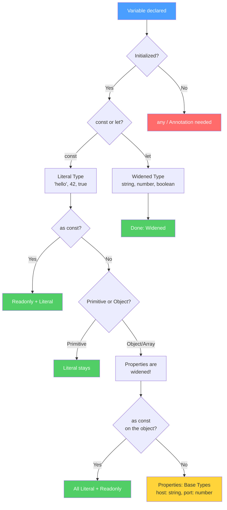

# Section 3: How Inference Works

**Estimated reading time:** ~12 minutes

## What you'll learn here

- The six concrete rules by which TypeScript infers types
- How to **predict** the inferred type before hovering with your mouse
- What "Best Common Type" actually does — and why it doesn't use a class hierarchy
- How Generic Inference works and where its limits lie

---

## Questions to Consider for This Section

1. **Why does Best Common Type form a union instead of searching for the common ancestor in a class hierarchy?**
2. **Why does TypeScript "widen" the type of a generic parameter when it's used in a mutable position?**

---

## The Inference Decision Tree

Before we go through the individual rules, here's the overall picture as a diagram. This flowchart shows you how TypeScript determines the type for **every variable**:



> **Reading note:** Green end nodes = type is fixed. Yellow node = surprise (properties are widened despite `const`). Red node = annotation needed.

Come back to this diagram after the individual rules — it will be much clearer then.

---

## Inference Is Not Guessing — It's an Algorithm

The TypeScript compiler doesn't infer types through magic or heuristics. It's a **deterministic algorithm with clear rules**. Once you know these rules, you can predict the type for every line of code **before** hovering.

Think of the detective from Section 1: he has a fixed set of rules, not just gut instinct. Here are his rules.

---

## Rule 1: Variable Initialization — Type from the Value

The simplest rule: the type of the initial value determines the type of the variable.

```typescript
let x = 3 + 4;        // number + number = number  -->  x: number
let y = "a" + "b";    // string + string = string  -->  y: string
let z = true && false; // boolean && boolean        -->  z: boolean
```

This also applies to more complex expressions:

```typescript
let result = Math.random() > 0.5 ? "yes" : "no";
// Ternary mit zwei Strings  -->  result: string

let parsed = parseInt("42");
// parseInt gibt number zurueck  -->  parsed: number
```

> **Note:** With `const`, this rule is **refined** — there you get Literal Types instead of base types. This is "Widening" and is covered in detail in Section 4.

---

## Rule 2: Best Common Type — Shared Type for Multiple Values

When TypeScript needs to combine multiple values into one type (arrays, ternaries, return paths), it looks for the **narrowest shared type**.

### What "narrowest shared type" means

TypeScript forms the **union of all present types**. It does **not** search for a common ancestor in a class hierarchy:

```typescript
let mixed = [1, "hello", true];
// TS bildet: number | string | boolean
// Ergebnis: (number | string | boolean)[]

let numbers = [1, 2, 3];
// Alle Werte sind number
// Ergebnis: number[]

let withNull = [1, null, 3];
// Ergebnis: (number | null)[]
```

### Why no class hierarchy?

Many developers expect TypeScript to find the common ancestor when working with classes. It does **not**:

```typescript
class Animal { name = ""; }
class Dog extends Animal { bark() {} }
class Cat extends Animal { meow() {} }

const pets = [new Dog(), new Cat()];
// Typ: (Dog | Cat)[]  --  NICHT Animal[]!
```

> **Background:** Why not `Animal[]`? Because TypeScript uses **structural** typing, not nominal typing. There's no built-in "class hierarchy search." The compiler takes exactly the types that actually appear in the array and forms their union. This is more precise: `(Dog | Cat)[]` tells you more than `Animal[]`, because you know that **only** dogs and cats are in it.

If you want `Animal[]`, you have to annotate it explicitly:

```typescript
const pets: Animal[] = [new Dog(), new Cat()];
// Jetzt ist es Animal[] -- weniger praezise, aber manchmal gewuenscht
```

### Best Common Type with Ternaries

```typescript
function getResult(success: boolean) {
  return success ? { data: [1, 2, 3] } : { error: "failed" };
}
// Return-Typ: { data: number[]; error?: undefined }
//           | { error: string; data?: undefined }
```

TypeScript forms a Discriminated Union here — **not** a shared object type like `{ data?: number[]; error?: string }`. This is more precise and enables better narrowing later.

---

## Rule 3: Return Type Inference — Type from All Return Paths

TypeScript analyzes **all possible return paths** of a function and forms the union:

```typescript
function transform(x: number) {
  if (x > 0) return x.toString();  // Pfad 1: string
  if (x === 0) return null;         // Pfad 2: null
  return undefined;                  // Pfad 3: undefined
}
// Return-Typ: string | null | undefined
```

### When this becomes problematic

```typescript
function parseValue(input: string) {
  if (input === "true") return true;
  if (input === "false") return false;
  if (!isNaN(Number(input))) return Number(input);
  return input;
}
// Return-Typ: string | number | boolean
// Ist das gewollt? Wahrscheinlich nicht.
```

> **Practical tip:** If the inferred return type has more than 3 members in the union, that's a signal: either **annotate** the return type explicitly (to document intent) or **simplify** the function.

### The rule for `void`

If a function has no `return` value (or `return;` without a value), TS infers `void`:

```typescript
function logMessage(msg: string) {
  console.log(msg);
  // Kein return  -->  Return-Typ: void
}
```

---

## Rule 4: Contextual Typing — Type from Context

With Contextual Typing, type information flows **from outside to inside** — the opposite of normal inference:

```
Normal Inference:   Value --> Type --> Variable  (from inside to outside)
Contextual Typing:  Context --> Variable --> Value  (from outside to inside)
```

```typescript
// Normale Inference: Typ fliesst vom Wert nach aussen
const x = 42;  // Wert 42  -->  Typ number  -->  Variable x

// Contextual Typing: Typ fliesst vom Kontext nach innen
const nums = [1, 2, 3];
nums.map(n => n * 2);
//        ^-- nums ist number[]  -->  map erwartet (n: number) => ...
//            -->  n ist automatisch number
```

Contextual Typing is covered in detail in Section 5. Here's just the overview: it works with **callback parameters**, **event listeners**, **variables with an annotated type**, and **return statements** with an annotated return type.

---

## Rule 5: Generic Inference — Type Parameter from Arguments

TypeScript can infer generic type parameters from the arguments passed:

```typescript
function identity<T>(value: T): T {
  return value;
}

identity("hello");  // T wird als string inferiert
identity(42);       // T wird als number inferiert
```

### How inference works with generics

TypeScript proceeds in three steps:

**Step 1: Collect candidates.** For each type parameter, TS collects "candidates" from the arguments:

```typescript
function merge<T>(a: T, b: T): T {
  return Math.random() > 0.5 ? a : b;
}

merge("hello", "world");
// Kandidaten fuer T: "hello", "world"  -->  T = string
```

**Step 2: With multiple candidates — form a union:**

```typescript
merge("hello", 42);
// Kandidaten fuer T: string, number  -->  T = string | number
```

**Step 3: Check constraints (`extends`):**

```typescript
function first<T extends { length: number }>(items: T): T {
  return items;
}

first("hello");       // T = "hello", hat .length  -->  OK
first([1, 2, 3]);     // T = number[], hat .length  -->  OK
first(42);            // FEHLER: number hat kein .length
```

### Where Generic Inference hits its limits

```typescript
function createPair<T, U>(first: T, second: U): [T, U] {
  return [first, second];
}

// Das funktioniert perfekt:
createPair("hello", 42);  // T = string, U = number

// Aber manchmal ist die Inference zu breit:
function createState<T>(initial: T): { value: T; set: (v: T) => void } {
  let value = initial;
  return { value, set: (v) => { value = v; } };
}

const state = createState("loading");
// T = string  -->  state.set akzeptiert jeden String!
// Wenn du nur "loading" | "success" | "error" willst, musst du:
const state2 = createState<"loading" | "success" | "error">("loading");
```

> **Going deeper:** Generic Inference has an interesting asymmetry. With `identity<T>(value: T)`, TS infers the literal type `"hello"`. With `createState<T>(initial: T)`, it infers `string`. The difference: when T is used in a **mutable** position (like `set: (v: T) => void`), TS automatically widens the type, because it assumes you'll want to pass different values.

---

## Rule 6: Control Flow Analysis — Type Changes Over Time

TypeScript tracks the code flow and **narrows types** based on conditions. This isn't a separate phase — it happens throughout the entire analysis:

```typescript
function process(value: string | number) {
  // Hier ist value: string | number

  if (typeof value === "string") {
    // Hier ist value: string  --  TS hat den Typ verengt!
    console.log(value.toUpperCase());
  } else {
    // Hier ist value: number  --  der einzig verbleibende Typ
    console.log(value.toFixed(2));
  }

  // Hier ist value wieder: string | number
}
```

Control Flow Analysis is covered in detail in Section 5, as it's closely related to Contextual Typing. There you'll learn all narrowing guards and their limits.

---

## Summary: The Six Rules at a Glance

```
+---------------------------+------------------------------------------+
| Rule                      | What happens                             |
+---------------------------+------------------------------------------+
| 1. Initialization         | Type from the value                      |
| 2. Best Common Type       | Union of all present types               |
| 3. Return Type Inference  | Union of all return paths                |
| 4. Contextual Typing      | Type flows from outside to inside        |
| 5. Generic Inference      | Type parameter from arguments            |
| 6. Control Flow Analysis  | Type narrows based on conditions         |
+---------------------------+------------------------------------------+
```

> **Think about it:** Given this code — which rule(s) apply?
> ```typescript
> const items = [1, "hello", null];
> const first = items[0];
> items.filter(x => x !== null).map(x => x.toString());
> ```
> Answer: Line 1 = Best Common Type (`(number | string | null)[]`). Line 2 = Initialization (from the type of `items[0]`). Line 3 = Contextual Typing (parameters of `filter` and `map`) + Control Flow (`.filter()` does **not** automatically narrow here — for that you need a Type Predicate, a topic for later lessons).

---

## Experiment Box: Observing Rules in Action

> **Experiment:** Try the following in the TypeScript Playground and name the rule that applies in each case:
>
> ```typescript
> // Regel 2: Best Common Type -- was wird der Typ?
> const items = [1, "hello", null];
> // Hovere ueber 'items' -- welche Regel greift?
>
> // Regel 3: Return Type Inference
> function transform(x: number) {
>   if (x > 0) return x.toString();
>   if (x === 0) return null;
>   return undefined;
> }
> // Hovere ueber 'transform' -- was ist der Return-Typ?
>
> // Regel 4: Contextual Typing
> [1, 2, 3].map(n => n.toString());
> // Hovere ueber 'n' -- woher kommt sein Typ?
>
> // Regel 5: Generic Inference
> function id<T>(x: T) { return x; }
> const result = id("hello");
> // Was wird T? Hovere ueber 'result'.
>
> // Bonus: Klassen-Hierarchie vs. Union
> class Animal { name = ""; }
> class Dog extends Animal { bark() {} }
> class Cat extends Animal { meow() {} }
> const pets = [new Dog(), new Cat()];
> // Erwartung: Animal[] oder (Dog | Cat)[]? Warum?
> ```

---

## Rubber Duck Prompt

Explain to an imaginary colleague:
- What's the difference between "Best Common Type" and a class hierarchy search?
- Why does `[new Dog(), new Cat()]` produce the type `(Dog | Cat)[]` and not `Animal[]`?

If you can explain that, you've understood the structural type system.

---

## What you've learned

- Inference follows **six concrete rules** — no guessing, no randomness
- **Best Common Type** forms unions, not class hierarchies
- **Return Type Inference** analyzes all paths and forms their union
- **Generic Inference** collects candidates from arguments and widens at mutable positions
- You can **predict** the inferred type when you know the rules

---

**Pause point.** When you're ready, continue with [Section 4: Widening and const](./04-widening-und-const.md) — there you'll learn why `let` and `const` produce different types and how `as const` controls the behavior.