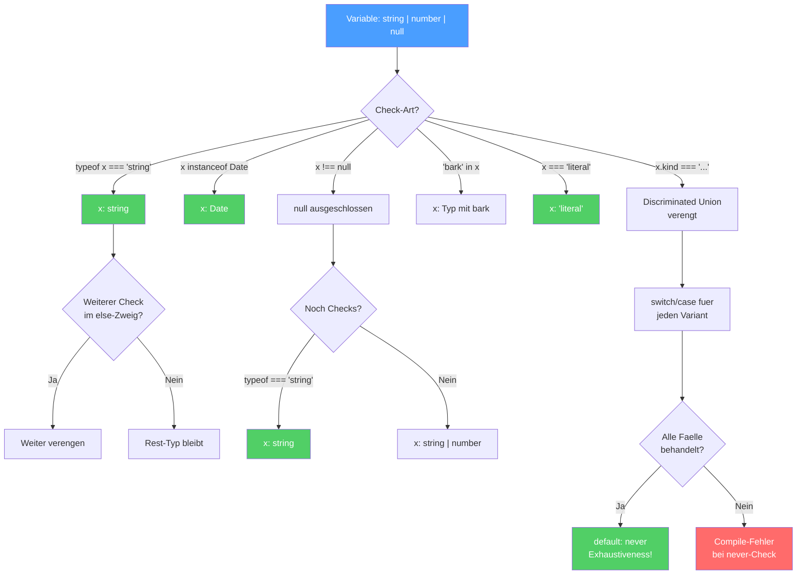

# Section 5: Contextual Typing and Control Flow Analysis

**Estimated reading time:** ~12 minutes

## What you'll learn here

- How Contextual Typing lets type information flow "backwards"
- Why separately defined callbacks lose context -- and how to avoid it
- How Control Flow Analysis narrows types throughout your code
- All narrowing guards and their limitations
- Why narrowing doesn't work across function boundaries

---

## Questions to think about for this section

1. **Why does a separately defined callback lose its Contextual Typing context?**
2. **Why does TypeScript NOT narrow inside closures that are executed asynchronously?**
3. **What's the difference between Contextual Typing and normal inference -- in which direction does type information flow?**

---

## Control Flow Narrowing -- The Big Picture

Before diving into the details, here's the big picture as a flowchart. This is how TypeScript "thinks" when narrowing a type through code flow:



> **Reading note:** Each arrow shows how a check narrows the type step by step. The green end nodes are the places where TypeScript knows the exact type.

---

## Contextual Typing: Types from Outside In

In Section 3, you learned that Contextual Typing reverses the direction: instead of "value determines type," the **context** determines the type.

### The Analogy: Job Posting

Normal inference is like a résumé: "I'm Max, I can do X and Y" -- the candidate defines themselves.

Contextual Typing is like a job posting: "We're looking for someone who can do X" -- the position defines what the candidate must be able to do.

```typescript
// "Stellenausschreibung": .map() auf number[] sucht (n: number) => ...
const nums = [1, 2, 3];
nums.map(n => n * 2);
//        ^-- n bekommt den Typ aus der "Stellenausschreibung"
```

---

## Where Contextual Typing Works

### 1. Callback Parameters with Array Methods

```typescript
const users = [
  { name: "Max", age: 30 },
  { name: "Anna", age: 25 },
];

// TS weiss: users ist { name: string; age: number }[]
// Also ist 'user' in jedem Callback automatisch { name: string; age: number }
users
  .filter(user => user.age > 18)
  .map(user => user.name)
  .sort((a, b) => a.localeCompare(b));
// Kein einziger Parameter musste annotiert werden!
```

### 2. Event Listeners

```typescript
document.addEventListener("click", (event) => {
  // event ist automatisch MouseEvent!
  console.log(event.clientX, event.clientY);
});

document.addEventListener("keydown", (event) => {
  // event ist automatisch KeyboardEvent!
  console.log(event.key);
});
```

> **Background:** How does TypeScript know that a "click" event produces a `MouseEvent`? The answer lies in the **overload signatures** of `addEventListener`. In `lib.dom.d.ts` there are hundreds of overloads like:
> ```typescript
> addEventListener(type: "click", listener: (ev: MouseEvent) => any): void;
> addEventListener(type: "keydown", listener: (ev: KeyboardEvent) => any): void;
> ```
> The string `"click"` is matched as a literal type, and the event type follows from that. That's why `"click"` works perfectly, but `let eventName = "click"; addEventListener(eventName, ...)` gives you only a generic `Event` -- because `eventName` has the type `string` (widening!), not `"click"`.

### 3. Variable with Annotated Type

```typescript
const handler: (event: MouseEvent) => void = (event) => {
  // event ist MouseEvent -- aus der Annotation links
  console.log(event.clientX);
};
```

### 4. Object Literals Assigned to an Interface

```typescript
interface Config {
  onSuccess: (data: string[]) => void;
  onError: (error: Error) => void;
}

const config: Config = {
  onSuccess: (data) => {
    // data ist string[]  --  aus Config inferiert
    console.log(data.length);
  },
  onError: (error) => {
    // error ist Error  --  aus Config inferiert
    console.log(error.message);
  },
};
```

### 5. Return Statements with Annotated Return Type

```typescript
function createHandler(): (event: MouseEvent) => void {
  return (event) => {
    // event ist MouseEvent -- aus dem Return-Typ der aeusseren Funktion
    console.log(event.clientX);
  };
}
```

---

## When Contextual Typing Does NOT Work

### The Biggest Pitfall: Separate Callback Definitions

```typescript
// KEIN Contextual Typing -- handler wird isoliert definiert
const handler = (event) => {
  console.log(event.clientX);  // event ist 'any'!
};
document.addEventListener("click", handler);
```

> 🧠 **Explain to yourself:** Why does a separately defined callback lose its type context? What does it mean that TypeScript analyzes "locally"? And why does an inline callback work, but a variable defined before it doesn't?
> **Key points:** TypeScript analyzes line by line | With separate definition, context is missing | Inline: target type is known | Solution: inline or annotate explicitly

**Why does the context get lost?** TypeScript analyzes **locally**, line by line. When you write `const handler = (event) => ...`, TS has no information at that point that `handler` will later be used as a click handler. The connection only forms in the next line -- but by then, the type of `handler` is already fixed.

```typescript
// Drei Loesungen:

// 1. Inline-Callback (Contextual Typing funktioniert)
document.addEventListener("click", (event) => {
  console.log(event.clientX);  // MouseEvent
});

// 2. Typ annotieren (wenn separate Definition noetig)
const handler = (event: MouseEvent) => {
  console.log(event.clientX);
};

// 3. Funktionstyp annotieren
const handler: (event: MouseEvent) => void = (event) => {
  console.log(event.clientX);
};
```

> **Practical tip:** In Angular projects, you'll often encounter this pattern with RxJS:
> ```typescript
> // GUT: Inline-Pipe, Contextual Typing funktioniert
> this.http.get<User[]>('/api/users').pipe(
>   map(users => users.filter(u => u.active)),
>   catchError(error => of([]))
> );
>
> // SCHLECHT: Separater Operator -- kein Kontext
> const filterActive = map(users => users.filter(u => u.active));
> // users ist 'unknown'! Der Kontext fehlt.
> ```

---

## Control Flow Analysis: Types Narrowing

Control Flow Analysis (CFA) is TypeScript's ability to narrow the type of a variable based on the **code flow**.

### The Analogy: Elimination Process

Imagine a room with 10 suspects (a union type with 10 members). Each `if` check is like an elimination: "It wasn't the butler" -- and suddenly only 9 remain. After enough checks, you've identified the culprit (a single type).

```typescript
function process(value: string | number | null | undefined) {
  // value: string | number | null | undefined  (4 Verdaechtige)

  if (value === null || value === undefined) return;
  // value: string | number  (2 uebrig -- null und undefined ausgeschlossen)

  if (typeof value === "string") {
    // value: string  (1 uebrig -- number ausgeschlossen)
    console.log(value.toUpperCase());
  } else {
    // value: number  (der einzig verbleibende)
    console.log(value.toFixed(2));
  }
}
```

---

## All Narrowing Guards

### typeof Checks

```typescript
function handle(x: string | number | boolean) {
  if (typeof x === "string") {
    x;  // string
  } else if (typeof x === "number") {
    x;  // number
  } else {
    x;  // boolean
  }
}
```

### instanceof Checks

```typescript
function format(date: Date | string) {
  if (date instanceof Date) {
    date;  // Date
  } else {
    date;  // string
  }
}
```

### Truthiness Checks

```typescript
function greet(name: string | null | undefined) {
  if (name) {
    name;  // string  (null und undefined ausgeschlossen)
  }
}
```

> **Watch out:** Truthiness checks also exclude `""`, `0`, and `false`! This can be unintentional:
> ```typescript
> function process(count: number | null) {
>   if (count) {
>     count;  // number -- aber 0 wurde faelschlicherweise ausgeschlossen!
>   }
>   // Besser:
>   if (count !== null) {
>     count;  // number  (0 bleibt erhalten)
>   }
> }
> ```

### in Operator

```typescript
interface Dog { bark(): void; }
interface Cat { meow(): void; }

function speak(pet: Dog | Cat) {
  if ("bark" in pet) {
    pet;  // Dog
    pet.bark();
  } else {
    pet;  // Cat
    pet.meow();
  }
}
```

### Equality Checks

```typescript
function process(x: string | null) {
  if (x !== null) {
    x;  // string
  }
  if (x === "special") {
    x;  // "special"  (sogar auf den Literal-Typ verengt!)
  }
}
```

### Discriminated Unions -- The Most Powerful Pattern

A **Discriminated Union** has a shared property (the "discriminator" or "tag") whose value determines the concrete type:

```typescript annotated
type Result =
  | { status: "success"; data: string[] }
  | { status: "error"; message: string }
  | { status: "loading" };
// ^ Discriminated Union: "status" is the discriminator (tag)

function handleResult(result: Result) {
  switch (result.status) {
// ^ CFA narrows result based on the status value
    case "success":
      console.log(result.data.length);
// ^ result is now { status: "success"; data: string[] }
      break;
    case "error":
      console.log(result.message);
// ^ result is now { status: "error"; message: string }
      break;
    case "loading":
      console.log("Bitte warten...");
// ^ result is now { status: "loading" }
      break;
  }
}
```

> **Background:** Discriminated Unions are one of the most important patterns in TypeScript -- and they conceptually originate from functional languages like Haskell ("Algebraic Data Types" or "Tagged Unions"). In Angular, you use them constantly, e.g. for NgRx Actions:
> ```typescript
> type UserAction =
>   | { type: "[User] Load"; }
>   | { type: "[User] Load Success"; payload: User[] }
>   | { type: "[User] Load Error"; error: string };
> ```

---

## Limits of Control Flow Analysis

### CFA Works Only Locally -- Not Across Function Boundaries

```typescript
function isString(value: unknown): boolean {
  return typeof value === "string";
}

function process(x: string | number) {
  if (isString(x)) {
    // x ist IMMER NOCH string | number!
    // TS hat NICHT genuarrowt, obwohl isString true zurueckgibt
  }
}
```

**Why?** TypeScript doesn't know whether `isString` has side effects or whether its return value actually says anything about `x`. The function could `return true` for everything.

The solution is called a **Type Predicate** (covered in later lessons):

```typescript
function isString(value: unknown): value is string {
  return typeof value === "string";
}
// Jetzt narrowt TS korrekt!
```

### CFA Resets After Assignment

```typescript
function process(x: string | number) {
  if (typeof x === "string") {
    x;  // string
    x = 42;  // Neuzuweisung!
    x;  // number  (nicht mehr string!)
  }
}
```

### CFA and Closures -- A Subtle Pitfall

```typescript
let x: string | number = "hello";

if (typeof x === "string") {
  // x: string -- korrekt
  setTimeout(() => {
    // x: string | number!
    // TS weiss nicht, ob x zwischen jetzt und dem Timeout geaendert wird
    console.log(x.toUpperCase());  // FEHLER
  }, 1000);
}
```

> **A deeper look:** TypeScript doesn't narrow inside closures that are executed asynchronously, because it can't know whether the variable was modified between when the closure was defined and when it runs. This is a deliberate, conservative design decision -- better to report a false error than to miss a real one.

---

## Contextual Typing + Control Flow Together

Both mechanisms often work together:

```typescript
interface FormField {
  type: "text" | "number" | "select";
  value: string;
  options?: string[];
}

function renderField(field: FormField) {
  // Contextual Typing: field.type ist "text" | "number" | "select"
  // Control Flow: switch narrowt den Typ

  switch (field.type) {
    case "select":
      // CFA hat field.type zu "select" verengt
      // Jetzt wissen wir: options SOLLTE vorhanden sein
      if (field.options) {
        // Contextual Typing: .map() kennt den Element-Typ
        const items = field.options.map(opt => opt.toUpperCase());
      }
      break;
    case "text":
    case "number":
      // Kein options-Feld noetig
      console.log(field.value);
      break;
  }
}
```

---

## Experiment Box: Observing Control Flow Live

> **Experiment:** Try the following in the TypeScript Playground and hover over the marked locations:
>
> ```typescript
> // Schritt 1: Typ verengt sich durch if-Checks
> function process(value: string | number | null) {
>   // Hovere hier: value ist string | number | null
>   if (value === null) return;
>   // Hovere hier: null ist ausgeschlossen
>   if (typeof value === "string") {
>     // Hovere hier: value ist string
>     console.log(value.toUpperCase());
>   } else {
>     // Hovere hier: value ist number
>     console.log(value.toFixed(2));
>   }
> }
>
> // Schritt 2: Truthiness-Falle
> function tricky(count: number | null) {
>   if (count) {
>     // Ist 0 hier erlaubt? Hovere ueber count!
>   }
>   if (count !== null) {
>     // Ist 0 jetzt erlaubt?
>   }
> }
>
> // Schritt 3: Contextual Typing -- inline vs. separat
> const nums = [1, 2, 3];
>
> // Inline: Contextual Typing funktioniert
> nums.map(n => n * 2);  // Hovere ueber 'n' -- welcher Typ?
>
> // Separat: Kein Kontext!
> const fn = (n) => n * 2;  // Hovere ueber 'n' -- was passiert?
> nums.map(fn);
> ```

---

## Rubber-Duck Prompt

Explain to an imaginary colleague in your own words:
- How does TypeScript "think" about an `if (typeof x === "string")` -- what happens to the type of `x` in the `if` block vs. the `else` block?
- Why does narrowing NOT work across function boundaries (e.g. with `function isString(x): boolean`)?
- What's the difference between a normal `boolean` return and a Type Predicate (`value is string`)?

---

## What You've Learned

- **Contextual Typing** lets type information flow from outside in -- like a job posting
- It works for **callbacks, event listeners, annotated variables** -- but **not** for separately defined functions
- **Control Flow Analysis** narrows types based on conditions: `typeof`, `instanceof`, truthiness, `in`, equality, Discriminated Unions
- CFA has **limitations**: no narrowing across function boundaries (without Type Predicates), no narrowing in asynchronous closures
- Both mechanisms often work **together** and form the most powerful inference combination in TypeScript

---

**Pause point.** When you're ready, continue with [Section 6: The satisfies Operator](./06-satisfies-operator.md) -- where you'll learn about the newest and most powerful tool for type control.