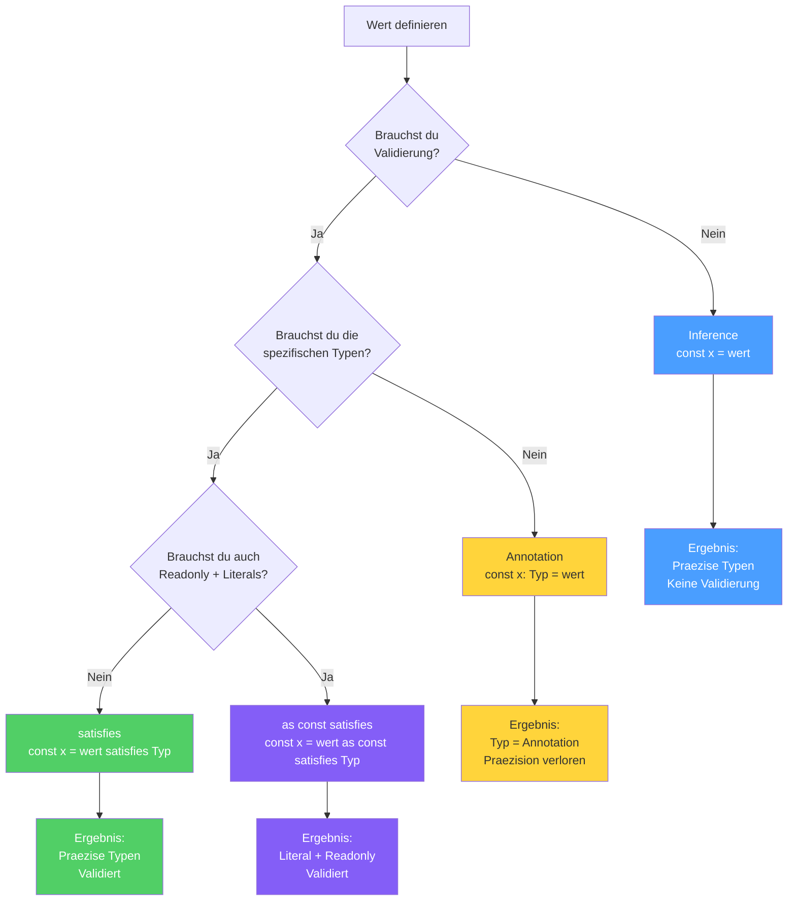

# Section 6: The satisfies Operator

**Estimated reading time:** ~10 minutes

## What you'll learn here

- The history behind `satisfies` and why the community waited years for it
- Which problem `satisfies` solves that neither annotations nor inference alone can solve
- When to use `satisfies`, when to use annotation, and when to use inference
- The power combo: `as const satisfies` for maximum precision
- Practical patterns for Angular/React configurations

---

## Reflection Questions for this Section

1. **Why couldn't the "safety vs. precision" problem simply be solved with an annotation?**
2. **What exactly does it mean that `satisfies` "checks the type without changing it"?**
3. **Why does `as const` come BEFORE `satisfies` and not the other way around — what would happen if the order were reversed?**

---

## satisfies vs. Annotation vs. Inference — the Comparison

This diagram shows you at a glance how the three tools work and when to use each:



> **Note:** Each tool has its place. There is no "best" — only the **right one** for your specific case.

---

## The History Behind satisfies

> **Background:** `satisfies` was introduced with TypeScript 4.9 (November 2022) — but the idea had existed since **2017**. The GitHub issue [#7481](https://github.com/microsoft/TypeScript/issues/7481) titled "Primitives assigned to type alias should retain narrowing" gathered over 700 upvotes and became one of the most discussed feature requests in TypeScript's history.

The problem was: developers had to choose between **safety** (annotation) and **precision** (inference). There was no way to have both at the same time.

```
2017: Issue #7481 eroeffnet -- "Wir brauchen Typ-Validierung ohne Typ-Erweiterung"
2019: Mehrere alternative Proposals (satisfies, implements, fulfills)
2021: Das TypeScript-Team beginnt ernsthaft am Design
2022: satisfies landet in TypeScript 4.9 -- nach 5 Jahren Warten
```

> **Fun Fact:** The name `satisfies` was chosen from several candidates. Other proposals included `implements` (already taken for classes), `fulfills`, `extends` (already taken for generics), and `matches`. `satisfies` won because it most precisely expresses what happens: the value **satisfies** the type without **submitting** to it.

---

## The Problem: Safety vs. Precision

You have two options for specifying the type of a value — and both have drawbacks:

### Option 1: Annotation — safe, but imprecise

```typescript
type ColorMap = Record<string, [number, number, number] | string>;

const palette: ColorMap = {
  red: [255, 0, 0],
  green: "#00ff00",
  blue: [0, 0, 255],
};

palette.red;    // Typ: [number, number, number] | string  <-- zu breit!
palette.green;  // Typ: [number, number, number] | string  <-- zu breit!
```

The annotation tells TypeScript: "Treat `palette` as `ColorMap`". This causes you to lose the information that `red` is a tuple and `green` is a string. TypeScript only knows the **broadest possible type** from the annotation.

### Option 2: Inference — precise, but unsafe

```typescript
const palette = {
  red: [255, 0, 0],
  green: "#00ff00",
  blue: [0, 0, 255],
};

palette.red;    // Typ: number[]  <-- spezifisch, aber...
// Kein Fehler wenn du einen Tippfehler im Wert machst!
// palette.green koennte 12345 sein -- kein Schema-Check!
```

Without annotation, TypeScript retains the specific types, but doesn't check whether your object conforms to the desired schema.

### The Analogy: Blueprint vs. Freehand

- **Annotation** = You build from a blueprint. Safe, but you can't add details that aren't in the plan.
- **Inference** = You build freely. Every detail is preserved, but no one checks whether the result is habitable.
- **satisfies** = You build freely, but an inspector comes by and compares it against the blueprint. They flag errors, but leave your creative details intact.

---

## The Solution: satisfies

`satisfies` checks the type **without changing it**:

```typescript annotated
const palette = {
  red: [255, 0, 0],
// ^ Inferred type remains: [number, number, number]
  green: "#00ff00",
// ^ Inferred type remains: string (not string | [...])
  blue: [0, 0, 255],
} satisfies ColorMap;
// ^ satisfies: checks against ColorMap, WITHOUT changing the type

palette.red;
// ^ Type: [number, number, number] -- precise! (not ColorMap["red"])
palette.green;
// ^ Type: string -- precise! (not string | [n, n, n])
```

> 🧠 **Explain to yourself:** What is the difference between `: ColorMap` (annotation) and `satisfies ColorMap`? What happens to the type of `palette.red` in each case?
> **Key points:** Annotation: type becomes ColorMap (broad) | satisfies: inferred type remains (precise) | satisfies still validates against the schema | Both catch typos

**What exactly happens:**
1. TypeScript infers the type of the object normally (precise types)
2. Then it checks: "Does this inferred object match the type after `satisfies`?"
3. If yes: The **inferred** type is preserved (not the satisfies type)
4. If no: Error message

---

## When to Use Which?

```
                     Brauchst du Validierung gegen ein Schema?
                      /                          \
                    Ja                           Nein
                    |                              |
     Brauchst du die spezifischen Typen?     Lass TS infern
              /            \                   (kein Typ noetig)
            Ja             Nein
             |              |
         satisfies      Annotation
```

| Tool | Validates? | Precise Types? | Use when... |
|----------|:----------:|:---------------:|---------------|
| `: Type` (Annotation) | Yes | No (widened to annotation type) | You want to constrain the type |
| `satisfies Type` | Yes | Yes (inferred types remain) | Config objects with schema check |
| Inference (nothing) | No | Yes | Local variables with a clear value |

---

## Excess Property Checking — satisfies Helps Here Too

TypeScript has a special rule: when you assign an object literal directly to a type, **no extra properties** are allowed. `satisfies` triggers this check as well:

```typescript
interface ComponentConfig {
  selector: string;
  template: string;
}

// Annotation: Excess Properties werden erkannt
const config1: ComponentConfig = {
  selector: "app-root",
  template: "<h1>Hello</h1>",
  styels: "h1 { color: red }",  // FEHLER: Tippfehler erkannt!
};

// satisfies: Excess Properties werden AUCH erkannt
const config2 = {
  selector: "app-root",
  template: "<h1>Hello</h1>",
  styels: "h1 { color: red }",  // FEHLER: Tippfehler erkannt!
} satisfies ComponentConfig;

// Aber: Ueber eine Zwischenvariable -- KEIN Fehler!
const data = {
  selector: "app-root",
  template: "<h1>Hello</h1>",
  styels: "h1 { color: red }",
};
const config3: ComponentConfig = data;  // OK! Kein Excess Property Check.
```

> **Going deeper:** Why does TypeScript only check for extra properties on direct assignment? Because object literals are the only place where the developer has **full control** over the properties. If you assign a literal directly and a property doesn't appear in the type, it's almost certainly a typo. With an intermediate variable, on the other hand, the "richer" object might have been created intentionally (e.g., for multiple uses with different interfaces).

---

## The Power Combo: `as const satisfies`

For maximum precision + validation + readonly:

```typescript
const ROUTES = {
  home: { path: "/", component: "HomePage" },
  users: { path: "/users", component: "UserList" },
  settings: { path: "/settings", component: "Settings" },
} as const satisfies Record<string, { path: string; component: string }>;

// Validierung: Jeder Eintrag muss path + component haben
// Praezision: ROUTES.home.path ist "/", nicht string
// Readonly: Nichts kann geaendert werden

type RouteName = keyof typeof ROUTES;
// "home" | "users" | "settings"

type RoutePath = (typeof ROUTES)[RouteName]["path"];
// "/" | "/users" | "/settings"
```

### Why not just `as const`?

```typescript
// Nur as const: Kein Schema-Check!
const ROUTES = {
  home: { path: "/", compnent: "HomePage" },  // Tippfehler: "compnent"!
  // Kein Fehler -- as const allein validiert nicht
} as const;

// as const satisfies: Schema-Check + Praezision
const ROUTES = {
  home: { path: "/", compnent: "HomePage" },  // FEHLER! "compnent" statt "component"
} as const satisfies Record<string, { path: string; component: string }>;
```

---

## Practical Patterns

### Angular: Route Configuration

```typescript
interface RouteConfig {
  path: string;
  component: string;
  children?: RouteConfig[];
}

const routes = [
  {
    path: "/users",
    component: "UserList",
    children: [
      { path: ":id", component: "UserDetail" },
    ],
  },
  {
    path: "/settings",
    component: "Settings",
  },
] satisfies RouteConfig[];

// TS kennt jetzt die exakte Struktur:
routes[0].children;  // Typ: { path: string; component: string }[] | undefined
// NICHT: RouteConfig[] | undefined (was bei Annotation passieren wuerde)
```

### React: Theme Configuration

```typescript
interface ThemeConfig {
  colors: Record<string, string>;
  spacing: Record<string, number>;
}

const theme = {
  colors: {
    primary: "#3b82f6",
    secondary: "#8b5cf6",
    background: "#ffffff",
  },
  spacing: {
    sm: 4,
    md: 8,
    lg: 16,
    xl: 32,
  },
} satisfies ThemeConfig;

// theme.colors.primary ist string (nicht string | undefined)
// theme.spacing.sm ist number (nicht number | undefined)
// UND: Wenn du "spacing: { sm: "vier" }" schreibst, gibt es einen Fehler
```

### Configuration Objects with Enum-like Keys

```typescript
type Permission = "read" | "write" | "admin";

const PERMISSION_LABELS = {
  read: "Lesen",
  write: "Schreiben",
  admin: "Administrator",
} as const satisfies Record<Permission, string>;

// Validierung: Jede Permission muss vorhanden sein
// Praezision: PERMISSION_LABELS.read ist "Lesen", nicht string
// Readonly: Kann nicht geaendert werden

// Fehlt eine Permission, gibt es einen Fehler:
const BAD_LABELS = {
  read: "Lesen",
  write: "Schreiben",
  // FEHLER: Property 'admin' is missing
} as const satisfies Record<Permission, string>;
```

---

## Summary: The Three Tools Compared

```
+------------------+-------------+------------------+----------------------------+
| Werkzeug         | Validiert?  | Praezise Typen?  | Bestes fuer                |
+------------------+-------------+------------------+----------------------------+
| : Typ            | Ja          | Nein             | let-Variablen, Parameter   |
| satisfies Typ    | Ja          | Ja               | Config-Objekte             |
| (nichts)         | Nein        | Ja               | Lokale Variablen           |
| as const         | Nein        | Ja + Literal     | Enum-Ersatz                |
| as const         | Ja          | Ja + Literal     | Maximale Praezision +      |
|   satisfies Typ  |             | + Readonly       | Validierung                |
+------------------+-------------+------------------+----------------------------+
```

---

## Experiment: satisfies in Action

> **Experiment:** Try the following in the TypeScript Playground and compare the types:
>
> ```typescript
> type ColorMap = Record<string, [number, number, number] | string>;
>
> // Schritt 1: Annotation -- Typ wird "verbreitert"
> const palette1: ColorMap = {
>   red: [255, 0, 0],
>   green: "#00ff00",
> };
> // Hovere ueber 'palette1.red' -- welcher Typ? Zu breit?
>
> // Schritt 2: satisfies -- praezise Typen bleiben erhalten
> const palette2 = {
>   red: [255, 0, 0],
>   green: "#00ff00",
> } satisfies ColorMap;
> // Hovere ueber 'palette2.red' -- was hat sich geaendert?
>
> // Schritt 3: Falschen Wert einbauen
> const palette3 = {
>   red: [255, 0, 0],
>   green: 12345,  // Falscher Typ!
> } satisfies ColorMap;
> // Was passiert? Wird der Fehler erkannt?
>
> // Schritt 4: as const satisfies
> const palette4 = {
>   red: [255, 0, 0],
>   green: "#00ff00",
> } as const satisfies ColorMap;
> // Hovere ueber 'palette4.red' -- was ist jetzt anders?
> ```
>
> Answer this: What happens to the type of `palette1.red` vs. `palette2.red`? Why does that matter in practice?

---

## Rubber Duck Prompt

Imagine a colleague asks: "Why should I use `satisfies` when an annotation also validates?"

Explain in 3 sentences:
1. What happens to the specific types with an annotation (the loss)
2. What `satisfies` does differently (validation WITHOUT changing the type)
3. When `as const satisfies` makes sense (configuration objects)

---

## What you've learned

- **satisfies** was introduced in 2022 and solves a 5-year-old problem: validation without type loss
- It checks the type **without changing it** — you get safety AND precision
- **Excess property checking** works with `satisfies` as well
- **`as const satisfies`** is the power combo for configurations: literal types + readonly + schema check
- In Angular/React projects, use `satisfies` for **route configs, theme objects, permission maps**, and similar configurations

> 🧠 **Explain to yourself:** Why does `as const` come BEFORE `satisfies` and not the other way around? What would `satisfies Type as const` do — and why is that a syntax error?
> **Key points:** as const enforces literal types first | Then satisfies checks against the target type | Reversed: satisfies returns the inferred type, as const on top = syntax error | Order: freeze first, then validate

---

**Pause here.** When you're ready, continue with [Section 7: Where Inference Falls Short](./07-wo-inference-versagt.md) — there you'll learn the systematic places where you always need to annotate.