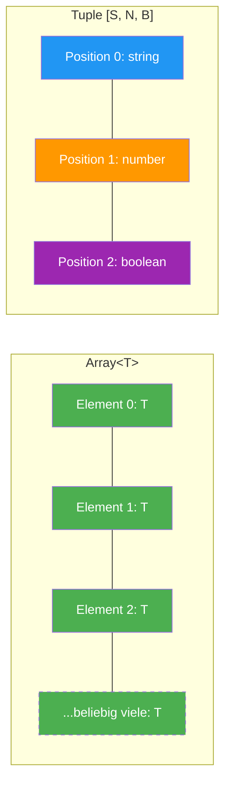
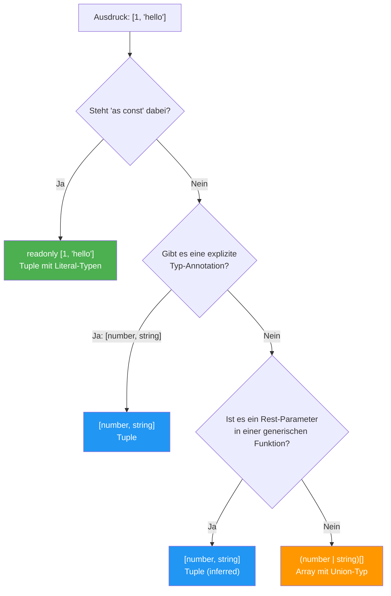

# Section 1: Array Fundamentals

> **Estimated reading time:** ~10 minutes
>
> **What you'll learn here:**
> - The mental model: Why arrays and tuples are fundamentally different
> - The two syntax variants `T[]` and `Array<T>` and when each is better
> - Why `Array<T>` is your first encounter with generics
> - How TypeScript infers mixed arrays — and why it never becomes a tuple

---

## The Mental Model: Arrays vs Tuples

Before we write any code, one fundamental difference must be clear.
Arrays and tuples look syntactically similar (both use square brackets),
but they **represent completely different concepts**:

```
  Array<number>                  [string, number, boolean]
  ┌───┬───┬───┬───┬─────┐       ┌────────┬────────┬─────────┐
  │ 1 │ 2 │ 3 │ 4 │ ... │       │"hello" │  42    │  true   │
  └───┴───┴───┴───┴─────┘       └────────┴────────┴─────────┘
  Beliebige Laenge               Fixe Laenge, fixe Typen
  Alle Elemente gleicher Typ     Jede Position hat eigenen Typ
```

**The analogy:** An array is like a **shopping list** — any number of
entries, all of the same type ("things you want to buy"). A tuple is
like a **form** — a fixed number of fields, each with a specific
type (Name: text, Age: number, Active: yes/no).

> **Background:** JavaScript has no distinction between arrays
> and tuples. In the V8 engine (Chrome, Node.js), arrays are internally objects
> with numeric keys. There is no native tuple construct — unlike in
> Python, where tuples are their own immutable data type. TypeScript invented
> the tuple concept **purely at the type level** to express fixed structures like
> `[x, y]` or `[state, setState]`. At runtime,
> a tuple is just a plain JavaScript array.

### The Big Picture: Array vs Tuple



**Array** = all nodes the same (green) and any number of them.
**Tuple** = each position has its own color (= its own type) and the length is fixed.

### The Key Comparison Table

| Property | Array | Tuple |
|---|---|---|
| Length | variable | fixed (known at compile time) |
| Element types | all the same (or union) | defined per position |
| Index access | always same type | position-dependent type |
| `.length` type | `number` | literal number (e.g. `3`) |
| Inference | TypeScript infers array | TypeScript **never** infers a tuple |

The last point is **crucial** and a common source of errors:

```typescript
const punkt = [10, 20];
// TypeScript sagt: number[]      <-- KEIN Tuple!
// Du denkst vielleicht: [number, number] — aber nein!
```

> **Think about it:** Why does TypeScript infer `number[]` here and not
> `[number, number]`? Take a moment to think before reading on.
>
> **Answer:** Because TypeScript assumes you might later do `punkt.push(30)`.
> A tuple with a fixed length would be too restrictive as a default.
> The design decision is: "Better too flexible than too restrictive — the
> developer can always restrict with an annotation or `as const`."

**Rule of thumb:** Use arrays for **lists of similar things** (e.g.,
usernames). Use tuples for a **fixed structure with a known
length and known types per position** (e.g., a coordinate pair `[x, y]`
or a React hook return value `[state, setState]`).

---

## Arrays in TypeScript

An array is an ordered collection of values **of the same type** (or
a union type). The length is variable.

```typescript annotated
// Simple arrays
const namen: string[] = ["Alice", "Bob", "Charlie"];  // ← T[]: shorthand for Array<T>
const zahlen: number[] = [1, 2, 3, 4, 5];             // ← All elements of the same type
const flags: boolean[] = [true, false, true];          // ← Variable length, fixed type
```

**Explain to yourself:** Why does TypeScript offer two notations (`T[]` and `Array<T>`) for the same concept — and in which situation is which better?
- `T[]` is syntactic sugar: compact and preferred for simple types
- `Array<T>` is the actual generic type from the standard library — becomes clearer with complex union types like `Array<string | number>` versus `(string | number)[]`
- Both produce exactly the same type — the difference is purely stylistic

**Why "of the same type"?** Because an array represents a **homogeneous collection**.
When you write `string[]`, you're saying: "Every element is a string, regardless
of position, regardless of how many." The access `namen[0]` and `namen[999]`
both have the type `string` — TypeScript doesn't distinguish by position.

> **Experiment:** Open your IDE and type the following:
> ```typescript
> const namen = ["Alice", "Bob"];
> const x = namen[0];
> ```
> Hover over `x` — what type is shown? Now change the first
> line to `const namen = ["Alice", "Bob"] as const;` and hover again
> over `x`. What changed? (Answer: Without `as const`, `x`
> is of type `string`. With `as const`, `x` is of type `"Alice"`.)

> **Background:** In many strongly typed languages (Java, C#, Go),
> arrays are inherently homogeneous. JavaScript is the exception — there, an
> array can contain `[1, "hello", true, null, {x: 5}]`. TypeScript restores
> order by treating arrays as homogeneous by default and
> offering the union type as an escape hatch.

---

## Array Syntax: `T[]` vs `Array<T>`

TypeScript offers two equivalent notations:

```
  Short form        Generic form
  ---------         ---------------
  string[]          Array<string>
  number[]          Array<number>
  boolean[]         Array<boolean>
```

Both produce **exactly the same type**. The difference is purely
stylistic — with one important exception:

### Tuple Inference: When Does TypeScript Decide What?



**Note:** When in doubt, TypeScript **always** chooses the more flexible array type.
You have to actively restrict to get a tuple type.

### When is `Array<T>` Better?

With complex types, `Array<T>` becomes more readable:

```typescript
// Schwer zu lesen — was ist das Array, was ist die Union?
let a: string | number[];       // string ODER number[] ?
let b: (string | number)[];     // Array von string | number

// Klar mit Array<T>:
let c: Array<string | number>;  // Eindeutig: Array von string | number
```

The ambiguity with `a` arises because `[]` **binds more tightly** than `|`.
So `string | number[]` is parsed as `string | (number[])` — a
single string OR an array of numbers. That's almost never what you intend.

> **Practical Tip:** Most TypeScript projects prefer `T[]` for
> simple types and `Array<T>` for more complex expressions. The ESLint rule
> `@typescript-eslint/array-type` can enforce this team-wide. In Angular
> projects, `T[]` is the common standard.

### When is `T[]` Better?

For simple types, the short form is more compact and more common:

```typescript
const namen: string[] = ["Alice", "Bob"];         // klar und kurz
const namen2: Array<string> = ["Alice", "Bob"];   // unnoetig lang
```

### Multidimensional Arrays

```typescript
// 2D Array (Matrix)
const matrix: number[][] = [
  [1, 2, 3],
  [4, 5, 6],
  [7, 8, 9],
];

// Oder mit generischer Form (lesbarer bei Verschachtelung):
const matrix2: Array<Array<number>> = [
  [1, 2, 3],
  [4, 5, 6],
];
```

---

## `Array<T>` as a Generic Type — The Connection to Generics

This concept is often overlooked: `Array<T>` is **not a special
language keyword**. It is a completely normal generic type, defined in
TypeScript's standard library (`lib.es5.d.ts`).

```typescript
// Das hier ist die (vereinfachte) Definition in lib.es5.d.ts:
interface Array<T> {
  length: number;
  push(...items: T[]): number;
  pop(): T | undefined;
  map<U>(callbackfn: (value: T) => U): U[];
  filter(predicate: (value: T) => boolean): T[];
  find(predicate: (value: T) => boolean): T | undefined;
  // ... viele weitere Methoden
}
```

> **Going Deeper:** When you write `Array<string>`, you're doing exactly
> the same as with `Promise<string>` or `Map<string, number>`: you're filling in
> a **type parameter**. This means:
>
> 1. **`T[]` is syntactic sugar** for `Array<T>`. Period. No difference.
> 2. **You understand the method types:** Why does `find()` return the type
>    `T | undefined`? Because that's how it's specified in the generic definition.
> 3. **Connection to your own generics:** When you later write
>    `function first<T>(arr: T[]): T | undefined`, you're using
>    exactly the same concept.
>
> **You've been using generics since Lesson 1**, without knowing it. Every
> `string[]` is an `Array<string>`.

```typescript
// So wie Array<T> funktioniert, kannst du eigene generische Container bauen:
interface Stack<T> {
  push(item: T): void;
  pop(): T | undefined;
  peek(): T | undefined;
  readonly length: number;
}
```

---

## Array Inference with Mixed Types

What happens when TypeScript has to infer the type of an array containing
different value types?

```typescript
// TypeScript inferiert: (string | number)[]
const gemischt = ["hello", 42, "world", 7];

// TypeScript inferiert: (string | number | boolean)[]
const bunt = ["text", 123, true];

// TypeScript inferiert: (string | null)[]
const optional = ["da", null, "auch da", null];
```

**Why does TypeScript do this?** TypeScript looks at all the elements and
forms the **smallest common union type** that covers all of them.
It deliberately does **not** infer a tuple, because TypeScript assumes you
want an array whose elements can change.

> **Background: The Design Decision Behind It.** The TypeScript designers
> had two options:
>
> - **Option A:** `[1, "hello"]` becomes `[number, string]` (tuple) — precise,
>   but then `arr.push("world")` would fail.
> - **Option B:** `[1, "hello"]` becomes `(number | string)[]` (array) —
>   flexible, allows mutation.
>
> They chose Option B, because JavaScript code almost always uses arrays as mutable
> lists. The developer can always restrict with `: [number, string]`
> or `as const`. The philosophy: **opt-in restriction** rather than opt-out.

> **Think about it:**
> ```typescript
> const arr = [1, "hello"];
> arr.push(true);
> ```
> Why does `arr.push(true)` fail? What type does `arr` have?
>
> **Answer:** TypeScript infers `arr` as `(string | number)[]`. Since
> `boolean` is not part of `string | number`, `push(true)` is rejected.
> Inference happens **at the point of declaration** and is fixed after that.

---

## What You've Learned

- Arrays and tuples are **fundamentally different**: arrays are variable-length
  lists of the same type, tuples are fixed structures with a type per position
- `T[]` and `Array<T>` are identical — `Array<T>` is better with complex
  union types
- `Array<T>` is a generic type from `lib.es5.d.ts` — you've been using generics
  since your very first line of TypeScript
- TypeScript always infers an array with a union type for mixed values,
  **never** a tuple
- JavaScript has no tuple concept — TypeScript invented it purely at the type level

**Pause point:** Good time for a break. The next section covers `readonly` arrays —
the tool against unintended mutation.

---

[Back to Overview](../README.md) | [Next Section: Readonly Arrays -->](02-readonly-arrays.md)