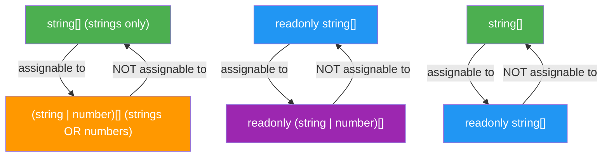
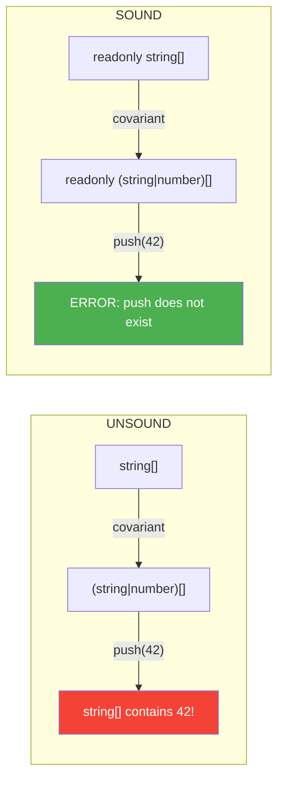

# Section 5: Covariance and Type Safety

> **Estimated reading time:** ~12 minutes
>
> **What you'll learn here:**
> - What covariance means — with an analogy that clicks immediately
> - Why covariance with mutable arrays is **unsound** (and why TypeScript allows it anyway)
> - The three major type-safety gaps in arrays
> - `noUncheckedIndexedAccess` — the most important compiler option you probably don't have enabled
> - Why `readonly` solves the covariance problem

---

## What Is Covariance?

**Covariance** is a concept from type theory that describes how the direction
of a subtype relationship carries over to container types.

That sounds abstract. Here's the analogy:

> **The fruit crate.** Imagine a warehouse that accepts fruit crates.
> Apples are a kind of fruit. The question is: if the warehouse expects a
> "crate of fruit", can you hand in a "crate of apples"?
>
> ```
>   Apple  ────is a────►  Fruit
>     │                     │
>     ▼                     ▼
>   Crate<Apple>  ──?──►  Crate<Fruit>
> ```
>
> **Covariance** says: yes, the direction stays the same. If Apple is a
> subtype of Fruit, then a crate-of-apples is a subtype of a crate-of-fruit.
>
> **But beware:** This is only safe if nobody is allowed to put a banana
> into the apple crate. That's exactly where the problem lies with mutable arrays.

### Covariance as a Diagram



**Reading direction:** Arrows show "is assignable to". Note: the direction
is always **from specific to general** (fewer possibilities to more
possibilities). This is the **essence of covariance**.

### Covariance Formally

```
  If     A extends B    (A is a subtype of B)
  Then   Container<A> extends Container<B>    (covariant)
```

The opposite would be **contravariance** (the direction reverses) and
**invariance** (no relationship). Arrays in TypeScript are **covariant** —
both readonly and mutable.

---

## Covariance in TypeScript Arrays

```typescript
// string is a subtype of string | number
// So string[] is a subtype of (string | number)[]  <-- Covariance!

const names: string[] = ["Alice", "Bob"];
const mixed: (string | number)[] = names; // OK! Covariance.

// The reverse does NOT work:
// const onlyStrings: string[] = mixed; // ERROR!
// Because mixed could also contain numbers.
```

This feels intuitively right: an array that only contains strings
**is also** an array that contains strings-or-numbers. Or is it?

---

## The Problem: Covariance + Mutation = Unsound

This is where it gets dangerous. Let's continue the fruit crate analogy:

> **The fruit crate, part 2.** You hand your apple crate to the warehouse
> (which accepts "crates of fruit"). The warehouse says: "Thanks, we'll throw
> in a banana — it's all fruit anyway." Now you have an apple crate
> with a banana in it. Your apple pie recipe, which only expects apples,
> has a problem.

```typescript annotated
const strings: string[] = ["hello", "world"];
const union: (string | number)[] = strings;
// ^ Covariance: string[] is a subtype of (string | number)[] -- allowed

union.push(42);
// ^ TypeScript allows this -- union is (string | number)[]

console.log(strings);
// ^ ["hello", "world", 42] -- strings and union are THE SAME array!
// ^ strings[2] is now 42, but the type says string[]! (Unsound!)
```

> 🧠 **Explain to yourself:** Why is covariance with mutable arrays unsound? What exactly happens in memory when two variables point to the same array? And why does `readonly` solve the problem?
> **Key points:** Both variables point to the same array | Mutation via a wider reference is possible | readonly prevents push/pop | Reading is always safe (string is also string|number)

```
  strings: string[]  ──────────────────┐
                                       ├── SAME array in memory
  union: (string | number)[] ──────────┘   ["hello", "world", 42]
                                            ↑
                                            That's a number inside a "string[]"!
```

**This is a hole in the type system.** TypeScript says `strings` is `string[]`,
but it contains a number. The compiler lied.

> **Rubber-Duck Prompt:** Explain to another person (or your rubber duck)
> in your own words:
>
> 1. Why does TypeScript allow the assignment `const union: (string | number)[] = strings`?
> 2. What exactly happens in memory when you then call `union.push(42)`?
> 3. Why is `strings[2]` now a number even though the type says `string[]`?
> 4. What would the consequences be if TypeScript treated arrays as **invariant**
>    instead of **covariant**?
>
> If you can answer point 4, you've truly understood covariance.

> **Background: Why does TypeScript allow this anyway?** The alternative
> would be to treat arrays as **invariant** — then `string[]` would NOT
> be assignable to `(string | number)[]`. That would be mathematically
> correct, but **extremely impractical**:
>
> ```typescript
> // Without covariance this would be FORBIDDEN:
> function printAll(items: (string | number)[]): void { ... }
> const names: string[] = ["Alice", "Bob"];
> printAll(names);  // ERROR! string[] is not (string | number)[]
> ```
>
> That would be an ergonomic nightmare. Java had the same problem
> with arrays (leading to `ArrayStoreException` at runtime). TypeScript
> chose **pragmatism**: this type of bug is rare in practice, and the
> ergonomics would otherwise be terrible.
>
> **Fun Fact:** Java learned from this mistake and made generics (like
> `List<String>`) **invariant**. There you need `List<? extends Object>`
> (wildcards) for covariance — considerably more cumbersome, but type-safe.

### The Solution: `readonly` Makes Covariance Safe

```typescript
function process(names: readonly string[]): void {
  // No push, pop, sort, splice possible
  // The covariance problem CANNOT occur!
}

const strings: string[] = ["hello", "world"];
const readonlyView: readonly (string | number)[] = strings; // OK and SAFE
// readonlyView.push(42);  // ERROR! Property 'push' does not exist
```

**Why is this safe?** Because the covariance problem only occurs when
someone **writes something** through the wider reference. If the reference
is readonly, nobody can write. Reading is always safe:
a string is also a `string | number` — there's no contradiction when reading.

```
  Covariant + mutable    = UNSOUND (mutation via wider reference is possible)
  Covariant + readonly   = SOUND   (no mutation, reading only)
```



> **Experiment:** Test the covariance bug yourself:
> ```typescript
> const a: string[] = ["x", "y"];
> const b: (string | number)[] = a;
> b.push(99);
> console.log(a);  // What comes out?
> console.log(typeof a[2]);  // "number" — but the type says string!
> ```
> Run the code (e.g. with `npx tsx`). Then change `a` to
> `readonly string[]` — what happens now?

---

## The Three Major Type-Safety Gaps

TypeScript's array typing has **deliberate gaps**. You should know them
so you can protect yourself.

### Gap 1: Out-of-Bounds Access

```typescript
const names: string[] = ["Alice", "Bob"];
const third = names[99]; // Type: string — NOT string | undefined!
// At runtime: undefined

console.log(third.toUpperCase()); // Runtime crash!
// Cannot read properties of undefined (reading 'toUpperCase')
```

**Why?** TypeScript assumes by default that every index access returns
a valid element. That's optimistic — and wrong.

### Gap 2: Covariance Mutation (as explained in detail above)

### Gap 3: `filter()` Doesn't Narrow Types Automatically

```typescript
const arr: (string | number)[] = ["hello", 42];
const strings = arr.filter(x => typeof x === "string");
// Type: (string | number)[]  <-- TypeScript does NOT narrow automatically!

// Solution: use a type predicate
const strings2 = arr.filter((x): x is string => typeof x === "string");
// Type: string[]  <-- Correct now!
```

**Why?** TypeScript's type analysis works **statement-by-statement** (line
by line, block by block). The callback function in `filter` is a separate
scope. TypeScript sees: the callback returns `boolean`. It doesn't know
that this `boolean` expresses a type constraint — unless you say so
explicitly with `x is string`.

> **Practical tip:** The type predicate syntax `(x): x is string => ...`
> looks unfamiliar the first time. Remember: `x is string` replaces
> the return type `boolean`. You're telling the compiler: "When I return
> `true`, `x` is a `string`."

---

## `noUncheckedIndexedAccess` — The Game-Changer

This is the **most important compiler option** that most projects don't
have enabled — but should.

### The Problem Without the Option

```typescript
const names: string[] = ["Alice", "Bob"];
const third = names[2]; // Type: string — but at runtime: undefined!
third.toUpperCase(); // Runtime crash!
```

### The Solution

In `tsconfig.json`:
```json
{
  "compilerOptions": {
    "noUncheckedIndexedAccess": true
  }
}
```

Now:
```typescript annotated
const names: string[] = ["Alice", "Bob"];
const third = names[2]; // ← Type: string | undefined — correct! (without option: string)

// You now need to check:
if (third !== undefined) {
  third.toUpperCase(); // ← ok: TypeScript knows here: third is string
}

// Or with optional chaining:
third?.toUpperCase();  // ← shorthand: only call if third is not undefined

// Or with non-null assertion (when you're certain):
third!.toUpperCase(); // ← Caution: bypasses the check — you take responsibility
```

### Effect on Tuples

```typescript
const tup: [string, number] = ["hello", 42];

// Tuple positions are NOT affected (length is known):
const a = tup[0]; // string (not string | undefined!)
const b = tup[1]; // number (not number | undefined!)

// Dynamic index IS affected:
function getElement(t: [string, number], i: number) {
  return t[i]; // string | number | undefined
}
```

> **Deeper knowledge:** TypeScript makes an intelligent distinction here:
> with a **literal index** (`tup[0]`), the compiler knows that
> position 0 exists. With a **dynamic index** (`tup[i]`),
> the compiler can't know whether `i` is a valid index. That's why
> `| undefined` is only added for dynamic indices.

> **Experiment:** Create a `tsconfig.json` with
> `"noUncheckedIndexedAccess": true` and compile:
> ```typescript
> const arr = ["a", "b", "c"];
> const el = arr[0];
> console.log(el.toUpperCase());
> ```
> What happens? Now add `if (el !== undefined)`. Then try
> `for (const x of arr)` — notice that `x` there does **not** have a
> `| undefined` type. Why not?

### Effect on `for...of` and Destructuring

```typescript
const names: string[] = ["Alice", "Bob"];

// for...of is NOT affected — TypeScript knows the iterator
// only yields elements that exist:
for (const name of names) {
  console.log(name.toUpperCase()); // name is string, not string | undefined
}

// But index-based loops ARE affected:
for (let i = 0; i < names.length; i++) {
  const name = names[i]; // string | undefined
  if (name) {
    console.log(name.toUpperCase());
  }
}
```

### Effect on Record/Dictionary Types

The option affects not just arrays but also **index signatures**:

```typescript
const dict: Record<string, number> = { a: 1, b: 2 };
const value = dict["c"]; // WITH option: number | undefined (correct!)
                         // WITHOUT option: number (wrong!)
```

> **Practical tip:** Enable `noUncheckedIndexedAccess` in **every new
> project**. It's one of the biggest type-safety wins in TypeScript.
> Yes, you'll need to handle `| undefined` in some places where you "know"
> the index is valid. But the bugs it prevents are the kind that only
> surface in production after weeks.
>
> **In existing projects:** Enable the option and see what turns red.
> This immediately shows you where potential runtime errors are lurking. In
> Angular projects, `Object.keys()` + index access is commonly affected;
> in React projects, `Array.find()` (which already returns `T | undefined`)
> and dictionary lookups.

---

## What You've Learned

- **Covariance** means: if A is a subtype of B, then Container\<A\>
  is a subtype of Container\<B\>
- Covariance with mutable arrays is **unsound** — TypeScript allows it for
  pragmatic reasons
- `readonly` makes covariance **safe**, because no mutation is possible
- TypeScript has three deliberate type-safety gaps: out-of-bounds access,
  covariance mutation, and missing narrowing in `filter()`
- `noUncheckedIndexedAccess` fixes gap 1 and is the most important
  compiler option for array safety
- Type predicates (`x is string`) fix gap 3 in `filter()`

**Pause point:** The final section brings everything together with practical
patterns from Angular and React, decision guides, and common pitfalls.

---

[<-- Previous Section: Advanced Tuples](04-fortgeschrittene-tuples.md) | [Back to Overview](../README.md) | [Next Section: Practical Patterns -->](06-praxis-patterns.md)