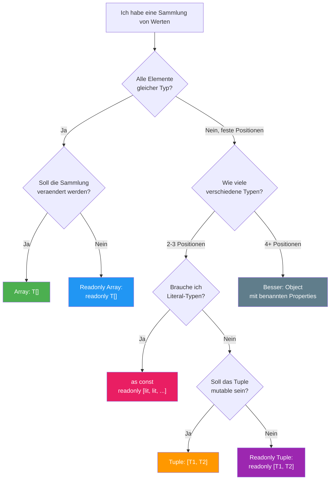

# Section 6: Practical Patterns and Pitfalls

> **Estimated reading time:** ~12 minutes
>
> **What you'll learn here:**
> - 7 battle-tested patterns for arrays and tuples
> - Tuple returns in Angular and React
> - The 6 most common pitfalls (and how to avoid them)
> - The decision guide: Array vs Tuple vs Object
> - When `push()` works on tuples — and why that's a problem

---

## Pattern 1: React Hook Returns (useState-Style)

```typescript
function useCounter(initial: number): [count: number, increment: () => void] {
  let count = initial;
  const increment = () => { count++; };
  return [count, increment];
}

// Destructuring — wie bei React Hooks:
const [count, increment] = useCounter(0);
//     ^-- number    ^-- () => void

// Vorteil gegenueber Object: Freie Benennung!
const [playerScore, addPoint] = useCounter(0);
const [enemyHealth, takeDamage] = useCounter(100);
```

---

## Pattern 2: Angular Signal-like Pattern

```typescript
// Angular's signal() gibt ein Signal-Objekt zurueck,
// aber das Getter/Setter-Pattern kann auch als Tuple modelliert werden:
function createState<T>(initial: T): [get: () => T, set: (value: T) => void] {
  let state = initial;
  return [
    () => state,
    (value: T) => { state = value; }
  ];
}

const [getCount, setCount] = createState(0);
console.log(getCount()); // 0
setCount(5);
console.log(getCount()); // 5
```

> **Background:** Angular's `signal()` deliberately chooses an Object over
> a tuple, because Signals can do more than just get/set (`computed`,
> `effect`, `update`). The tuple pattern is best suited for simple
> value/action pairs.

---

## Pattern 3: Error Handling (Go-Style)

```typescript annotated
type Result<T> = [data: T, error: null] | [data: null, error: Error];
// ← Discriminated Union: either data OR error — never both

function parseJSON(json: string): Result<unknown> {
  try {
    return [JSON.parse(json), null]; // ← Success: data + no error
  } catch (e) {
    return [null, e as Error];       // ← Error: no data + Error object
  }
}

const [data, error] = parseJSON('{"valid": true}');
if (error) {
  console.error(error.message); // ← TypeScript knows: error is Error (not null)
} else {
  console.log(data);            // ← TypeScript knows: data is not null
}
```

**Explain to yourself:** Why does Pattern 3 return a tuple instead of an object with `{ data, error }` — and when is a tuple a better choice than an object?
- Tuples enforce **free naming** when destructuring: `const [inhalt, fehler]` instead of `const { data: inhalt, error: fehler }`
- Tuples are suited for **2–3 positions with a clear order** — the first value is always the result, the second is the error (as in Go)
- With 4+ fields or when the order isn't obvious, an object with named properties becomes more readable

> **Background:** Go returns errors as the second return value:
> `data, err := parseJSON(...)`. This pattern can be replicated in TypeScript
> with tuples and discriminated unions. The advantage over try/catch: You
> **can't forget the error** — it's in the type.
> Libraries like `neverthrow` formalize this pattern.

---

## Pattern 4: Typed Object.entries

```typescript
interface User {
  name: string;
  age: number;
}

const user: User = { name: "Alice", age: 30 };
const entries: [string, string | number][] = Object.entries(user);

for (const [key, value] of entries) {
  console.log(`${key}: ${value}`);
}
```

> **Deeper knowledge:** `Object.entries()` returns `[string, V][]`
> — the keys are always `string`, never the specific key types. This is
> because TypeScript is structurally typed: an object can have more keys
> than the type specifies. That's why the key type is conservatively `string`.

---

## Pattern 5: Promise.all — Tuple Types in Action

```typescript
// Promise.all bewahrt die Tuple-Struktur:
async function loadDashboard() {
  const [user, posts, settings] = await Promise.all([
    fetchUser(),      // Promise<User>
    fetchPosts(),     // Promise<Post[]>
    fetchSettings(),  // Promise<Settings>
  ]);
  // user: User, posts: Post[], settings: Settings
  // Die Typen werden positionsgenau beibehalten!
}
```

In Angular with RxJS, the equivalent is `forkJoin` or `combineLatest`:

```typescript
// RxJS combineLatest — gleiche Tuple-Logik:
combineLatest([
  this.userService.getUser(),        // Observable<User>
  this.postService.getPosts(),       // Observable<Post[]>
]).subscribe(([user, posts]) => {
  // user: User, posts: Post[]
});
```

---

## Pattern 6: Spread with Tuples for Function Arguments

```typescript
type LogArgs = [message: string, level: number, ...tags: string[]];

function log(...args: LogArgs): void {
  const [message, level, ...tags] = args;
  console.log(`[${level}] ${message}`, tags.length ? `(${tags.join(", ")})` : "");
}

const logEintrag: LogArgs = ["Server gestartet", 1, "startup", "info"];
log(...logEintrag);
```

---

## Pattern 7: Deriving a Union from `as const` (Worth Repeating)

```typescript
const ROLLEN = ["admin", "user", "gast"] as const;
type Rolle = (typeof ROLLEN)[number];
// => "admin" | "user" | "gast"

// Auch bei verschachtelten Strukturen:
const ROUTES = [
  { path: "/home", component: "HomeComponent" },
  { path: "/about", component: "AboutComponent" },
  { path: "/contact", component: "ContactComponent" },
] as const;

type RoutePath = (typeof ROUTES)[number]["path"];
// => "/home" | "/about" | "/contact"
```

---

## The 6 Most Common Pitfalls

### 1. `push()` Works on Tuples — and That's a Problem

```typescript
const pair: [string, number] = ["Alice", 30];
pair.push(true);  // Compile-Fehler: boolean ist nicht string | number
pair.push("x");   // KEIN Compile-Fehler! string ist in string | number

// pair ist jetzt ["Alice", 30, "x"] — aber der Typ sagt immer noch [string, number]
console.log(pair.length); // 3 (Laufzeit) vs 2 (Typ-System)
```

**Why?** TypeScript's tuple type protects the **first n positions**, but
`push()` accepts `string | number` (the union of all tuple element types).
TypeScript cannot detect that `push` changes the length.

> **Experiment:** Try it yourself:
> ```typescript
> const pair: [string, number] = ["hello", 42];
> pair.push("extra");
> console.log(pair);         // ["hello", 42, "extra"]
> console.log(pair.length);  // 3
> // Aber TypeScript denkt: pair.length ist 2!
> ```
> Now change `[string, number]` to `readonly [string, number]` — what
> happens to `pair.push("extra")`?

**Solution:** Use `readonly` tuples:
```typescript
const pair: readonly [string, number] = ["Alice", 30];
// pair.push("x");  // FEHLER! Property 'push' does not exist
```

### 2. Arrays Are Not Inferred as Tuples

```typescript
// Das ist KEIN Tuple!
const point = [10, 20];
// Typ: number[]  (nicht [number, number])

// Loesung 1: Explizite Annotation
const point2: [number, number] = [10, 20];

// Loesung 2: as const (ergibt readonly [10, 20])
const point3 = [10, 20] as const;

// Loesung 3: Helper-Funktion
function tuple<T extends readonly unknown[]>(...args: T): T {
  return args;
}
const point4 = tuple(10, 20); // readonly [number, number]
```

> **Think about it:** The helper function `tuple()` uses a rest parameter
> `...args: T`. Why does TypeScript infer a tuple here instead of an array?
>
> **Answer:** Because `T extends readonly unknown[]` appears in the context
> of a rest parameter. TypeScript infers rest parameters in generic functions
> as tuples because it knows the **exact argument list**. This differs from
> a normal array literal, where TypeScript assumes flexibility.

### 3. Readonly Array Not Assignable to Mutable Array

```typescript
const readonlyArr: readonly string[] = ["A", "B"];
// const mutableArr: string[] = readonlyArr;  // FEHLER!

// Andersherum geht es:
const mutable: string[] = ["A", "B"];
const readonlyRef: readonly string[] = mutable;  // OK!
```

### 4. Spread Loses Tuple Type

```typescript
function getPoint(): [number, number] {
  return [1, 2];
}

const p = getPoint();
// p[2] -> Fehler: Tuple type has no element at index '2'  <-- gut!

// ABER: Mit Spread verliert man die Tuple-Info:
const arr = [...getPoint()];
// arr ist jetzt number[], nicht [number, number]!

// Loesung: Explizite Annotation
const arr2: [number, number] = [...getPoint()];
```

### 5. Empty Arrays Become `any[]` (or `never[]`)

```typescript
const arr = [];           // any[] (mit noImplicitAny: never[])
const arr2: string[] = []; // string[] — immer explizit typisieren!
```

> **Practical tip:** Always annotate empty arrays. A `never[]` accepts
> no elements at all (because no value satisfies the `never` type), and an
> `any[]` loses all type safety.

### 6. `filter()` Doesn't Narrow Types Automatically

```typescript
const mixed: (string | number)[] = ["a", 1, "b", 2];

// FALSCH: filter gibt (string | number)[] zurueck
const wrong = mixed.filter(x => typeof x === "string");

// RICHTIG: Type Predicate verwenden
const right = mixed.filter((x): x is string => typeof x === "string");
// Typ: string[]
```

---

## Decision Guide: Array vs Tuple vs Object

```
  Frage                                          -> Verwende
  -----                                          ----------
  Liste gleichartiger Dinge?                      -> Array
  Feste Anzahl mit bekannten Typen pro Position?  -> Tuple
  Rueckgabe mit 2 Werten (wie useState)?          -> Tuple
  Konfigurationsgruppe fester Laenge?             -> Tuple oder Object
  Sammlung, die wachsen/schrumpfen kann?          -> Array
  CSV-Zeile mit fester Spaltenstruktur?           -> Tuple
  Mehr als 3-4 verschiedene Felder?               -> Object (nicht Tuple!)
  Soll das Array unveraenderbar sein?             -> readonly Array / readonly Tuple
  Brauche ich Literal-Typen?                      -> as const
  Brauche ich Laufzeit UND Typ-Werte?             -> as const + typeof
```

### The Threshold: When to Use Object Instead of Tuple?

```typescript
// OK als Tuple — 3 Positionen, Bedeutung erschliesst sich:
type Koordinate = [x: number, y: number, z: number];
type HTTPResult = [status: number, body: string, headers: Headers];

// GRENZWERTIG — ohne Labels schwer zu verstehen:
type UserTuple = [string, string, number, boolean, string, Date];
// Was ist Index 3? Was ist Index 5?

// BESSER als Object:
type UserObject = {
  firstName: string;
  lastName: string;
  age: number;
  active: boolean;
  email: string;
  createdAt: Date;
};
```

**Rule of thumb:** With 4 or more elements, or when the positions have no
obvious order (like x/y/z or key/value), use an Object.

---

## Summary of the Entire Lesson

### The Most Important Concepts at a Glance

| Concept | Core idea |
|---|---|
| Array vs Tuple | Array = variable list, Tuple = fixed structure |
| `T[]` vs `Array<T>` | Identical, `Array<T>` for complex unions |
| `readonly` | Blocks mutation, almost always correct for parameters |
| Covariance | Mutable arrays are unsoundly covariant |
| `as const` | Prevents widening, creates readonly tuples |
| `satisfies` + `as const` | Literal types + schema validation |
| `noUncheckedIndexedAccess` | The most important compiler switch |
| Variadic Tuples | Generic spreads, reason for `Promise.all` types |

### The 6 Core Rules to Remember

1. **TypeScript never infers tuples** — you must annotate or use `as const`
2. **`readonly` for array parameters** is almost always the right choice
3. **Covariance with mutable arrays** is unsound — `readonly` makes it safe
4. **`as const`** prevents widening and turns arrays into readonly tuples
5. **`noUncheckedIndexedAccess`** should be active in every project
6. **`Array<T>` is Generics** — you've been using generics since Lesson 1

---

### Decision Tree: Which Array Feature Do I Need?



> **Rubber Duck Prompt:** Think of three different data structures
> from your current project (or a past one). For each:
>
> 1. Is it an array, tuple, or object?
> 2. Should it be `readonly`?
> 3. Would `as const` help?
>
> If you can give a clear answer for all three, you've internalized the lesson.

## Next Steps

1. Work through the examples in `examples/`
2. Complete the exercises in `exercises/`
3. Take the quiz with `npx tsx quiz.ts`
4. Check the `solutions/` if needed
5. Use `cheatsheet.md` as a quick reference

> **Practical tip:** Enable `noUncheckedIndexedAccess` in your project
> and see what turns red. That immediately shows you where potential runtime
> errors are lurking.
>
> **Bonus:** Open `lib.es5.d.ts` in your IDE (Ctrl+Click on `Array`)
> and read the type definition. After this lesson, you'll understand every
> type parameter in it.

---

[<-- Previous Section: Covariance and Safety](05-kovarianz-und-sicherheit.md) | [Back to Overview](../README.md)