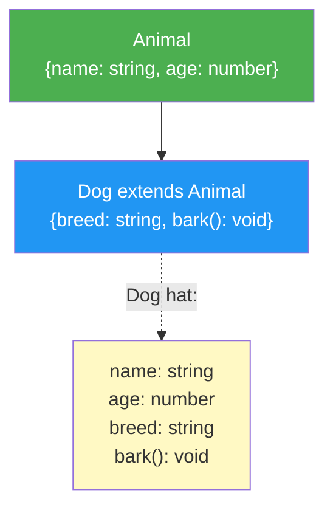

# 02 -- Interfaces & Declaration

> Estimated reading time: ~10 minutes

## What you'll learn here

- How to define reusable object types with `interface`
- How interfaces extend one another (`extends`)
- What **Declaration Merging** is and why it exists
- When `interface` and when `type` is the better choice

---

## Interfaces: Named Object Shapes

An interface gives an object structure a **reusable name**:

```typescript annotated
interface User {
// ^^^^^^^^^ Keyword 'interface' -- opens a named object shape
  name: string;
// ^^^^^^^^^^^^ Property 'name' is required, type: string
  age: number;
// ^^^^^^^^^^^^ Property 'age' is required, type: number
  email: string;
// ^^^^^^^^^^^^^^ Property 'email' is required, type: string
}
// 'User' is now a reusable type name

const user: User = {
//          ^^^^ Annotation: this object must conform to the User shape
  name: "Max",   // string ✓
  age: 30,       // number ✓
  email: "max@test.de",  // string ✓
};
// TypeScript checks: does the object have all three properties with the correct types?
```

> **Analogy:** An interface is like a **job description**. The role
> "Frontend Developer" describes which skills someone MUST bring
> (HTML, CSS, JavaScript). Applicants must be able to do AT LEAST that —
> but they may bring more. An interface works exactly the same way: it describes
> the minimum requirements for an object.

> 🧠 **Explain to yourself:** What is the difference between an Object Type Literal
> (`let user: { name: string }`) and an interface (`interface User { name: string }`)
> in terms of the actual type-checking logic? Is the result the same?
>
> **Key points:** Both produce the same type check | An interface gives the type a
> reusable name | An Object Type Literal is anonymous and single-use | An interface
> can be extended via `extends` and supports Declaration Merging — a Type Literal
> cannot | Semantically they are equivalent for simple object structures

### Interfaces in Practice: Angular and React

In Angular you'll see interfaces everywhere — for services, models, and component inputs:

```typescript
// Angular: Model fuer einen API-Response
interface HeroDto {
  id: number;
  name: string;
  power: string;
}

// React: Props-Interface fuer eine Komponente
interface UserCardProps {
  user: User;
  onEdit: (id: string) => void;
  showAvatar?: boolean;   // Optional -- dazu gleich mehr
}
```

The pattern is always the same: you describe the **shape of the data** that a
component, service, or function expects.

---

## Extending Interfaces with `extends`

Interfaces can extend other interfaces — similar to class inheritance,
but **only for the type description**, not for behavior:

```typescript
// Basis-Interface
interface Animal {
  name: string;
  age: number;
}

// Erweiterung: Dog hat alles von Animal + eigene Properties
interface Dog extends Animal {
  breed: string;
  bark(): void;
}

// Dog muss jetzt: name, age, breed UND bark() haben
const rex: Dog = {
  name: "Rex",
  age: 5,
  breed: "Schaeferhund",
  bark() { console.log("Wuff!"); },
};
```

### Visualization: Interface extends



### Multiple Extension

An interface can inherit from **multiple** interfaces simultaneously:

```typescript
interface Trackable {
  id: string;
  createdAt: Date;
}

interface Auditable {
  lastModifiedBy: string;
  lastModifiedAt: Date;
}

// TrackedDog erbt von Animal, Trackable UND Auditable
interface TrackedDog extends Animal, Trackable, Auditable {
  breed: string;
}

// TrackedDog hat: name, age, id, createdAt,
//                 lastModifiedBy, lastModifiedAt, breed
```

> **Practical tip:** In Angular projects you'll frequently see this pattern for
> entity types. A base like `Identifiable` and `Timestamped` gets reused everywhere:
> ```typescript
> interface BaseEntity extends Identifiable, Timestamped {
>   // Jede Entity hat automatisch id, createdAt, updatedAt
> }
> ```

---

## Declaration Merging

A unique feature of interfaces — and the most important difference from `type`:
you can **open** an interface in multiple places and add properties.
TypeScript automatically merges them:

```typescript
// Datei 1: Original aus lib.dom.d.ts
interface Window {
  document: Document;
  // ... hunderte weitere Properties
}

// Datei 2: Dein Code
interface Window {
  myCustomProperty: string;
  analytics: AnalyticsService;
}

// TypeScript merged beide Deklarationen!
// Window hat jetzt document, myCustomProperty, analytics, ...
```

### Why does Declaration Merging exist?

> **Background:** Declaration Merging wasn't invented for fun. It solves a
> concrete problem: **extending types for existing global objects.**
>
> Imagine you're using a library that adds `window.myLib`. Without Declaration
> Merging, the library would have to redefine the entire `Window` type. With merging,
> it can simply add its properties to the existing `Window` interface.
>
> This does **not** work with `type` aliases — that's not an oversight, it's
> intentional. `type` is "closed", `interface` is "open".

> **Experiment box:** Try Declaration Merging in the Playground:
> ```typescript
> interface Config { host: string; }
> interface Config { port: number; }
>
> const c: Config = { host: "localhost", port: 3000 };
> ```
> Now try the same with `type`:
> ```typescript
> type Config2 = { host: string; }
> type Config2 = { port: number; }  // FEHLER!
> ```
> The error message reads: *"Duplicate identifier 'Config2'"*.
> This is the proof: `type` is closed, `interface` is open.

### Practical Example: Extending an Express.js Request

```typescript
// Du moechtest req.user in Express verwenden:
declare namespace Express {
  interface Request {
    user?: {
      id: string;
      role: string;
    };
  }
}

// Jetzt kennt TypeScript req.user in allen Route-Handlern!
```

---

## Interface vs. Type Alias: The Decision

For simple object types, **both** are completely equivalent:

```typescript
// Kein echter Unterschied:
interface UserI { name: string; age: number; }
type UserT = { name: string; age: number; };
```

But there are situations where one is superior to the other:

```
  When Interface?                     When Type Alias?
  ──────────────────────              ──────────────────────
  - Defining object structures        - Union Types ( A | B )
  - API contracts / library types     - Intersection Types ( A & B )
  - When Declaration Merging          - Mapped / Conditional Types
    is desired                        - Primitive aliases
  - extends syntax preferred          - Tuple Types
```

### Why many teams prefer `interface` for objects

1. **Better error messages:** TypeScript shows the interface name, not the resolved structure
2. **Declaration Merging:** Users of your library can extend the interface
3. **`extends` is more readable** than `&` for deep hierarchies
4. **TypeScript docs recommend it:** The official guidance is "use Interface until you need something only Type can do"

> **Think about it:** You're building a library that other developers will use.
> Should you use `interface` or `type` for the public API types?
>
> Consider: what if a user of your library wants to extend one of your types?
>
> **Answer:** `interface`! Because users of your library can extend the interface via
> Declaration Merging. With `type` that's not possible. That's why Angular, React,
> Express, and almost all major libraries use interfaces for their public types.

---

## Rubber Duck Prompt

> **Rubber Duck Prompt:** Explain to a beginner in three sentences:
> 1. What is the difference between an Object Type Literal and an interface?
> 2. When would you use `extends` and when not?
> 3. Why can an interface be declared in multiple places (Declaration Merging),
>    but a Type Alias cannot?

---

## Summary

| Concept | Description |
|---------|-------------|
| `interface` | Named, reusable object structure |
| `extends` | Interface inherits all properties from another |
| Multiple `extends` | `interface C extends A, B` -- inherits from multiple |
| Declaration Merging | Same-named interfaces are merged together |
| Interface vs. Type | Interface for objects, Type for Unions/Mapped Types |

---

**What you've learned:** You can define and extend interfaces, and you know when
`interface` is a better fit than `type`.

| [<-- Previous Section](01-objekt-typen-basics.md) | [Back to Overview](../README.md) | [Next Section: Structural Typing -->](03-structural-typing.md) |