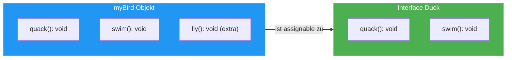

# 03 -- Structural Typing

> Estimated reading time: ~12 minutes

## What you'll learn here

- What **Structural Typing** is and how it differs from **Nominal Typing**
- WHY TypeScript uses structural typing (the design decision)
- The formal rule: **Width Subtyping**
- When structural typing hits its limits (the Euro/Dollar problem)
- How all of this is relevant in Angular and React

---

## The Big Idea

> **Fun Fact:** The name "Duck Typing" comes from the American poet
> James Whitcomb Riley (circa 1890s):
> *"When I see a bird that walks like a duck and swims like a duck and quacks
> like a duck, I call that bird a duck."*
>
> This isn't a programmer joke -- it's a philosophical argument about
> **identity through behavior**. If something behaves like a duck, then for
> all practical purposes it is a duck -- regardless of what the name tag says.

TypeScript adopts exactly this principle. It doesn't check the **name** of a type,
but its **structure**. If an object has all the required properties, it fits --
no matter what the type is called.

```typescript
interface Duck {
  quack(): void;
  swim(): void;
}

const myBird = {
  quack() { console.log("Quack!"); },
  swim() { console.log("*schwimmt*"); },
  fly() { console.log("*fliegt*"); },  // Extra -- stoert nicht!
};

function feedDuck(d: Duck): void {
  d.quack();
  d.swim();
}

feedDuck(myBird);  // Funktioniert! myBird hat quack + swim.
```

`myBird` was never declared as a `Duck`. It doesn't even have a type name. But it has
`quack()` and `swim()` -- so for TypeScript, it's a duck.

> 🧠 **Explain to yourself:** What does "Structural Typing" mean? Why can `myBird` be used as a `Duck` even though it was never declared as one? What would happen in Java or C#?
> **Key points:** Structure counts, not name | myBird has quack+swim = satisfies Duck | Extra method fly doesn't matter | In Java/C#: would have to explicitly implement Duck

### Visualization: Structural Typing in Action



The key insight: TypeScript checks whether `myBird` has **at least** everything
that `Duck` requires. The extra method `fly()` is ignored -- it doesn't hurt,
it simply isn't needed.

> **Rubber-Duck Prompt:** Explain to a colleague in your own words:
> "Why can `myBird` be used as a `Duck` even though it was never declared as one
> and even has an extra method?" If you get stuck, re-read the section.

---

## Structural vs. Nominal Typing: The Comparison

```
  Nominal Typing (Java, C#, Rust)     Structural Typing (TypeScript, Go)
  ───────────────────────────────      ────────────────────────────────────
  "What IS this object?"              "What does this object HAVE?"

  class Dog { name: string; }          type Dog = { name: string; }
  class Cat { name: string; }          type Cat = { name: string; }

  Dog and Cat are DIFFERENT,           Dog and Cat are THE SAME,
  even though they have the same       because they have the same
  structure. The NAME counts.          structure. The name doesn't matter.
```

> **Background:** Anders Hejlsberg designed C# with nominal typing. When he
> designed TypeScript, he faced a choice: adopt the same system --
> or choose a new one that fits JavaScript better.
>
> He chose structural typing. The reason is pragmatic: JavaScript has no
> nominal type system. Objects in JS are simply bags of properties.
> `typeof` only returns `"object"`, `instanceof` only checks the
> prototype chain. If TypeScript had enforced nominal types, a large portion
> of existing JavaScript code would have been impossible to type.

### Why Go Also Uses Structural Typing

> **Background:** TypeScript isn't alone. Go (developed at Google by
> Rob Pike, Ken Thompson, and Robert Griesemer) also uses structural typing
> for its interfaces -- for similar reasons:
>
> In Go, a type automatically implements an interface if it has the right
> methods. There is no `implements` keyword. The Go designers argued:
> *"If it has the right methods, it satisfies the interface. Period."*
>
> This leads to looser coupling and easier composability -- just like
> in TypeScript.

---

## Width Subtyping: The Formal Rule

Behind the "Duck Typing" saying lies a precise rule:

**Type A is a subtype of B if A has AT LEAST all the properties of B.**

```
  Width Subtyping
  ───────────────

  { x: number, y: number, z: number }   is a subtype of   { x: number, y: number }
       3 properties  >=  2 properties

  More properties = more specific type = subtype
  Fewer properties = more general type = supertype

  Subtype --> Supertype:   ALWAYS allowed (upcasting)
  Supertype --> Subtype:   ERROR (downcasting -- information is missing!)
```

### The Resume Analogy

> **Analogy:** Imagine a job posting:
> "Required: German and English."
>
> You speak German, English, and French. Are you qualified?
> **Yes!** Your extra skill (French) doesn't hurt.
>
> Your resume (3 languages) is a **subtype** of the job posting (2 languages).
> You have AT LEAST what's required -- so you're a match.

That's exactly what TypeScript does:

```typescript annotated
interface HasName {
  name: string;
// ^ HasName requires ONLY one property: name of type string
}

const person = {
  name: "Max",
// ^ Satisfies the requirement of HasName
  age: 30,
// ^ Extra property -- no problem (Width Subtyping)
  email: "m@t.de"
// ^ Another extra property -- simply ignored
};

const named: HasName = person;
// ^ OK! person has AT LEAST name: string (Structural Typing)
```

> **Experiment:** Try this yourself! Open the TypeScript Playground and
> write the code above. Then:
> 1. Hover over `named` -- what type does the compiler show?
> 2. Remove `name` from the `person` object -- what happens?
> 3. Change the type of `name` to `number` in the object -- what error message appears?
>
> Notice: TypeScript checks the **existence** and **type compatibility** of each
> required property, but ignores everything extra.

### The Opposite: Too Little Doesn't Work

```typescript
const incomplete = {
  email: "m@t.de"
  // name fehlt!
};

// FEHLER: Property 'name' is missing in type '{ email: string }'
const named: HasName = incomplete;
```

"Required: German and English." You only speak French? Not qualified.

---

## Structural Typing in Angular and React

### Angular: Dependency Injection

Angular's DI system doesn't use structural typing directly (it works with tokens),
but the concept is crucial for **mocking in tests**:

```typescript
// Der echte Service
@Injectable()
class UserService {
  getUser(id: string): Observable<User> { /* HTTP-Call */ }
  updateUser(user: User): Observable<void> { /* HTTP-Call */ }
}

// Im Test: Mock muss nur die GENUTZTEN Methoden haben
const mockService = {
  getUser: jasmine.createSpy().and.returnValue(of(mockUser)),
  // updateUser fehlt -- aber wenn die Komponente es nicht nutzt, ist das OK
  // dank Structural Typing!
};

// Wenn die Komponente nur getUser() aufruft:
TestBed.configureTestingModule({
  providers: [{ provide: UserService, useValue: mockService as any }]
});
```

### React: Props Are Structural

```typescript
interface ButtonProps {
  label: string;
  onClick: () => void;
}

function Button({ label, onClick }: ButtonProps) {
  return <button onClick={onClick}>{label}</button>;
}

// Du kannst ein Objekt mit MEHR Properties uebergeben:
const config = {
  label: "Klick mich",
  onClick: () => console.log("geklickt"),
  icon: "star",       // Extra -- wird von Button ignoriert
  disabled: false,     // Extra
};

// Funktioniert! config hat label + onClick.
// (In JSX greift allerdings Excess Property Checking --
//  dazu mehr in der naechsten Sektion)
```

---

## When Structural Typing Is NOT Enough: The Euro/Dollar Problem

Structural typing has a price. When two types happen to have the same structure
but are semantically DIFFERENT, TypeScript cannot distinguish them:

```typescript
type Euro = { amount: number; };
type Dollar = { amount: number; };

function chargeInEuro(price: Euro): void {
  console.log(`Berechne ${price.amount} EUR`);
}

const usdPrice: Dollar = { amount: 100 };

chargeInEuro(usdPrice);  // KEIN Fehler! Gleiche Struktur.
// Aber logisch FALSCH: 100 Dollar != 100 Euro!
```

> **Think about it:** Why is this a problem? Because the compiler won't help you
> when you accidentally pass dollars instead of euros. In a financial system,
> this can have catastrophic consequences.
>
> This isn't a design flaw -- it's a deliberate trade-off. TypeScript sacrifices
> nominal safety for JavaScript compatibility.

### The Solution: Branded Types (Preview)

```typescript
// Ein "kuenstliches" nominales Feld einfuegen:
type Euro = { amount: number; readonly __brand: "EUR" };
type Dollar = { amount: number; readonly __brand: "USD" };

function chargeInEuro(price: Euro): void { /* ... */ }

const usdPrice = { amount: 100 } as Dollar;

// chargeInEuro(usdPrice);  // FEHLER! "USD" ist nicht "EUR"
```

The `__brand` field only exists in the type system -- it doesn't exist at runtime.
The full explanation comes in Lesson 24 (Branded Types).

---

## Structural Typing and Covariance (Preview)

> **Deeper knowledge:** Structural typing and width subtyping lead directly to an
> important concept: **covariance**. If `Dog` is a subtype of `Animal` (because Dog
> has all properties of Animal plus more), then:
>
> - `Dog[]` is a subtype of `Animal[]` (covariant -- the container "inherits" the relationship)
> - `(animal: Animal) => void` is **NOT** a subtype of `(dog: Dog) => void`
>   (parameters are contravariant -- the relationship reverses)
>
> This sounds abstract now, but becomes crucial in Lesson 06 (Functions) and Lesson 14
> (Variance). For now, just remember: **Structural typing determines WHAT a subtype is.
> Variance determines WHERE that subtype may be used.**

---

## Core Concepts to Remember

```
  TypeScript is structural because JavaScript is structural.
  ──────────────────────────────────────────────────────────

  1. Check the STRUCTURE, not the NAME
  2. More properties = subtype (Width Subtyping)
  3. The price: semantically different types with the same
     structure (Euro/Dollar) cannot be distinguished
  4. The solution: Branded Types (Lesson 24)
  5. Subtype relationships feed into variance (Lesson 14)
```

---

## Summary

| Concept | Description |
|---------|-------------|
| Structural Typing | Compatibility is based on structure, not name |
| Nominal Typing | Compatibility is based on the declared type name (Java, C#) |
| Duck Typing | "If it quacks like a duck..." -- the philosophical foundation |
| Width Subtyping | More properties = subtype (more specific) |
| Euro/Dollar Problem | Limits of structural typing |
| Branded Types | Artificial nominal field as a workaround (more in Lesson 24) |

---

**What you've learned:** You understand the design decision behind structural typing,
can explain width subtyping, and know the limits of the system.

> **Practical tip for RIGHT NOW:** If you have two types with the same structure
> in your Angular project today that you need to distinguish
> (e.g., `UserId` vs `ProductId`, both `{ value: number }`),
> you can use the branded type pattern **right now** --
> you don't have to wait until Lesson 24:
>
> ```typescript
> type UserId = number & { readonly __brand: "UserId" };
> type ProductId = number & { readonly __brand: "ProductId" };
>
> function getUser(id: UserId) { /* ... */ }
> function getProduct(id: ProductId) { /* ... */ }
>
> // getUser(42 as ProductId);  // FEHLER! TypeScript schuetzt dich.
> ```
>
> This isn't an "advanced" feature -- it's a simple,
> pragmatic pattern you can start using today.

| [<-- Previous Section](02-interfaces-deklaration.md) | [Back to Overview](../README.md) | [Next Section: Excess Property Checking -->](04-excess-property-checking.md) |