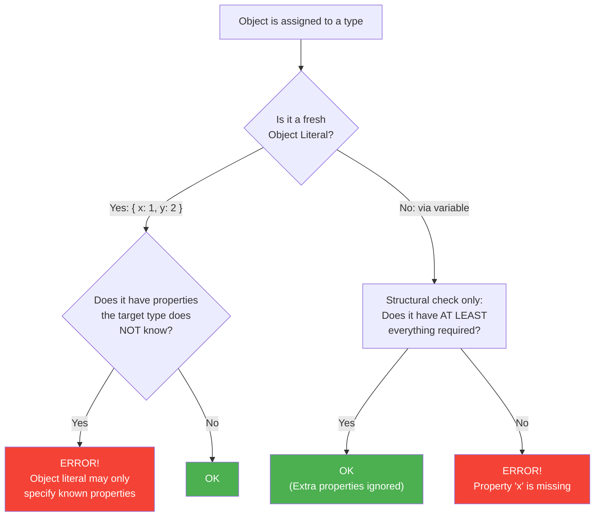

# 04 -- Excess Property Checking

> Estimated reading time: ~10 minutes

## What you'll learn here

- What **Excess Property Checking** is and when it applies
- Why TypeScript introduced this exception to Structural Typing
- The rule: "fresh" Object Literals vs. variables
- Three ways to bypass the check (and when that makes sense)
- How this affects Angular templates and React JSX

---

## The Big Trap

In the last section you learned: TypeScript checks structure, and extra properties
are allowed. **Except** in one special case:

```typescript annotated
interface HasName {
  name: string;
}

// ERROR! Object literal may only specify known properties.
const named: HasName = {
// ^^^^^^^^^^^^^^^^^^^^^ This is a FRESH Object Literal -- assigned directly
  name: "Max",
// ^^^^^^^^^^^^ OK: 'name' is known to HasName
  age: 30,
// ^^^^^^^ ERROR! 'age' does not exist in HasName -- Excess Property!
  // TypeScript asks: "If you're typing 'age', did you maybe
  //  mistype 'name'? This looks like a bug."
};
```

> 🧠 **Explain to yourself:** Why does TypeScript allow extra properties on variables
> (Structural Typing), but forbid them on fresh Object Literals?
> What's the pragmatic reason for this special case?
>
> **Key points:** Structural Typing needs extra properties for subtyping (Dog with
> an extra method as Animal) | But in fresh literals, extra properties are almost
> always typos | TypeScript performs the excess check only on literals |
> Historically: TS 1.6 as a retroactive safety measure | Design principle:
> Surgical intervention, leaving the rest of the system unchanged

Wait -- didn't we just say extra properties are OK? What happened?

The difference: Here, a **fresh Object Literal** (i.e., `{ ... }` written directly)
is being assigned to a type. TypeScript performs an **additional check** in this case
that goes beyond Structural Typing.

---

## Why Does This Check Exist?

> **Background:** Excess Property Checking wasn't built into TypeScript from the start.
> It was introduced in **TypeScript 1.6** (September 2015) as a retroactive safety
> measure. The reason: TypeScript maintainers observed that typos in Object Literals
> were one of the most common sources of bugs -- and Structural Typing alone didn't
> catch them.

The classic example:

```typescript
interface Options {
  color: string;
  width: number;
}

// Typo -- 'colour' instead of 'color'!
const opts: Options = {
  colour: "red",  // ERROR! Thank goodness!
  width: 100,
  // Bonus: 'color' is missing -- a second error
};
```

Without Excess Property Checking, TypeScript would say: "You have `width: number`, that fits.
`colour` is just an extra." The typo would slip through, and your element would have
no color.

> **Design decision:** The TypeScript maintainers faced a dilemma:
>
> - Structural Typing says: extra properties are OK
> - But in fresh literals, extra properties are almost ALWAYS bugs
>
> Their solution: Introduce a **special case** that only applies to fresh Object Literals.
> This keeps Structural Typing intact for variables and expressions, while
> catching the most common typos.

---

## The Rule: Fresh vs. Not Fresh

### The Decision Tree



```
  Excess Property Checking -- When does it apply?
  ────────────────────────────────────────────────

  "Fresh" Object Literal       -->  Excess properties ARE CHECKED
  Variable / Expression        -->  ONLY structural compatibility

  // ERROR: Fresh Object Literal
  const a: HasName = { name: "Max", age: 30 };
                                     ^^^^^^^ Excess!

  // OK: Via variable (no longer "fresh")
  const temp = { name: "Max", age: 30 };
  const b: HasName = temp;  // No excess check!
```

**What does "fresh" mean?** An Object Literal is considered "fresh" when it is written
**directly** at the point where it is used -- meaning it hasn't been assigned to a
variable beforehand.

### Another Example: Function Parameters

```typescript
interface Config {
  host: string;
  port: number;
}

function startServer(config: Config): void { /* ... */ }

// ERROR: Fresh literal passed directly as an argument
startServer({ host: "localhost", port: 3000, debug: true });
//                                           ^^^^^ Excess!

// OK: Via variable
const myConfig = { host: "localhost", port: 3000, debug: true };
startServer(myConfig);  // No error!
```

---

## The Three Ways to Bypass It

There are situations where you intentionally want to bypass the Excess Property Check.
Three ways:

### 1. Via a Variable (most common)

```typescript
const data = { name: "Max", age: 30 };
const named: HasName = data;  // OK
```

> **Practical tip:** This is the cleanest way. You're saying: "I know this object
> has more properties than necessary, and that's intentional."

### 2. Type Assertion

```typescript
const named = { name: "Max", age: 30 } as HasName;
```

> **Warning:** Type assertions bypass ALL checks. If you make a typo
> (`{ naem: "Max" } as HasName`), there will be no error. That's why option 1
> is almost always better.

### 3. Index Signature

```typescript
interface HasNameFlexible {
  name: string;
  [key: string]: unknown;  // Allow arbitrary extra properties
}

const named: HasNameFlexible = {
  name: "Max",
  age: 30,      // OK -- Index Signature allows everything
};
```

> **Practical tip:** Use Index Signatures when designing an interface that is
> intentionally extensible (e.g., plugin configurations, dynamic forms).

---

## Excess Property Checking in Frameworks

### Angular: Component Inputs

```typescript
@Component({
  selector: 'app-user',
  template: '...',
})
export class UserComponent {
  @Input() name!: string;
  @Input() age!: number;
}

// In the template:
// <app-user [name]="'Max'" [age]="30" [role]="'admin'"></app-user>
//                                      ^^^^^^ Angular template compiler
//                                      reports: 'role' is not a known property
```

Angular's template compiler performs a check similar to Excess Property Checking --
unknown inputs are flagged as errors (since `strictTemplates`).

### React: JSX Props

```typescript
interface ButtonProps {
  label: string;
  onClick: () => void;
}

function Button(props: ButtonProps) { /* ... */ }

// ERROR: Excess Property Check applies in JSX!
<Button label="OK" onClick={() => {}} color="red" />
//                                     ^^^^^ Excess!
```

JSX attributes are treated like fresh Object Literals -- so Excess Property Checking
applies here as well.

---

## Think About It: Why ONLY Fresh Literals?

> **Think about it:** Imagine TypeScript also prohibited excess properties on
> variables. What would happen?

Think of a function that only reads the name of an object:

```typescript
function greet(user: { name: string }): string {
  return `Hello, ${user.name}!`;
}
```

If extra properties were also forbidden on variables:

```typescript
const fullUser = { name: "Max", age: 30, email: "m@test.de" };
greet(fullUser);  // ERROR?! age and email are "excess"!
```

The entire Structural Typing system would collapse. Functions could only accept objects
with **exactly** the right properties -- no more subtyping. You couldn't pass a `Dog`
to a function expecting an `Animal`, because `Dog` has extra properties.

**Conclusion:** Excess Property Checking is a **surgically precise intervention** --
it applies only where extra properties are almost certainly a bug (fresh literals),
leaving the rest of the type system untouched.

---

## Experiment Box: Experience the Difference Live

> **Experiment:** Write the following code in the TypeScript Playground and observe
> what happens:
>
> ```typescript
> interface Config {
>   host: string;
>   port: number;
> }
>
> // Step 1: Direct literal
> const c1: Config = { host: "localhost", port: 3000, debug: true };
> // --> Error!
>
> // Step 2: Via variable
> const temp = { host: "localhost", port: 3000, debug: true };
> const c2: Config = temp;
> // --> No error!
>
> // Step 3: What happens with function parameters?
> function startServer(config: Config) { }
> startServer({ host: "localhost", port: 3000, debug: true });
> // --> ???
> startServer(temp);
> // --> ???
> ```
>
> **Observe:** Step 3 behaves exactly like steps 1/2. Function arguments are also
> "fresh literals" when you write `{ ... }` directly. Using a variable bypasses
> the check.
>
> **The core question:** Why is the variable no longer a fresh literal?
> Because TypeScript already computed the variable's type at assignment.
> At the point `const c2: Config = temp`, it only checks structural
> compatibility -- and `temp` has everything `Config` needs.

---

## Understanding Error Messages: Two Different Errors

Excess Property Checking and missing properties produce **different**
error messages. Knowing the difference is crucial for debugging:

```
  ERROR 1: Excess Property
  ────────────────────────
  "Object literal may only specify known properties,
   and 'debug' does not exist in type 'Config'"

  --> You have an EXTRA property in the fresh literal.
  --> The object has TOO MUCH.

  ERROR 2: Missing Property
  ─────────────────────────
  "Type '{ host: string }' is not assignable to type 'Config'.
   Property 'port' is missing in type '{ host: string }'
   but required in type 'Config'."

  --> The object is MISSING something the target type requires.
  --> The object has TOO LITTLE.
```

> **Think about it:** You see the error message *"Object literal may only specify known
> properties"*. What do you now know immediately?
>
> **Answer:** You know three things: (1) it's a fresh Object Literal,
> (2) all required properties are present (otherwise a different error would come first),
> and (3) there is at least one property the target type doesn't know about.

---

## Summary

| Concept | Description |
|---------|-------------|
| Excess Property Check | Additional check on fresh Object Literals |
| "Fresh" | Object Literal written directly, not via variable |
| Why it exists | To catch typos in Object Literals |
| Bypass: Variable | Assign object to a variable first |
| Bypass: Assertion | `as Type` -- unsafe, avoid it |
| Bypass: Index Signature | `[key: string]: unknown` in the interface |

---

**What you learned:** You understand the exception to Structural Typing, know its
history, and know when and how to bypass it.

| [<-- Previous Section](03-structural-typing.md) | [Back to Overview](../README.md) | [Next Section: Readonly & Optional -->](05-readonly-und-optional.md) |