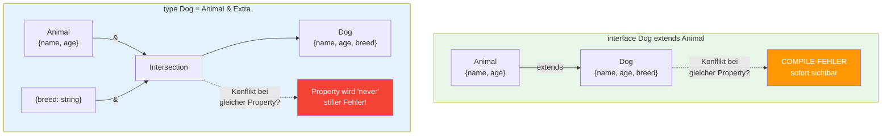
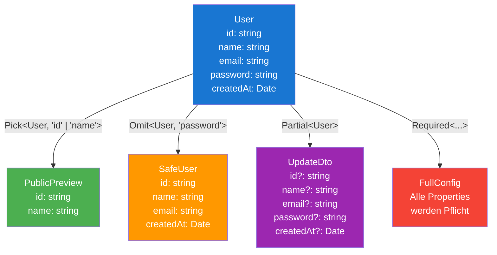

# 07 -- Intersection & Utility Types

> Estimated reading time: ~12 minutes

## What you'll learn here

- How the **intersection operator `&`** works and when it produces `never`
- The difference between `extends` and `&`
- The four most important Utility Types: `Partial`, `Pick`, `Omit`, `Required`
- Practical patterns for Angular and React (API responses, form state, composition)
- Discriminated Unions as a preview

> **Note:** The Utility Types (`Partial`, `Pick`, `Omit`, `Required`)
> appear here for the first time. How they **work internally** (Mapped Types)
> is covered in **Lesson 16** in detail. For now: understand what they do,
> not how they are implemented. In **Lesson 15** you'll get all
> built-in Utility Types as a complete overview.

---

## Intersection Types: The Core Idea

Besides interfaces and `extends`, there is a second way to combine object types --
the **intersection operator `&`**:

```typescript
type HasName = { name: string };
type HasAge = { age: number };

// Intersection: Ein Typ der BEIDES gleichzeitig erfuellen muss
type Person = HasName & HasAge;

const person: Person = {
  name: "Max",
  age: 30,
};
// person muss ALLE Properties aus HasName UND HasAge haben
```

> **Analogy:** An intersection is like an **AND condition** in a job posting:
> "Applicant must speak German AND English AND have experience
> with Angular." Each individual requirement is a type, and the intersection
> says: you must satisfy ALL of them simultaneously.

```
  Intersection = UND
  ──────────────────

  type A = { x: number }      type B = { y: string }

  A & B = {                    Muss ALLES haben:
    x: number;                 - x aus A
    y: string;                 - y aus B
  }
```

---

## `extends` vs. `&` -- What's the Difference?

```typescript
// Mit extends:
interface Animal { name: string; }
interface Dog extends Animal { breed: string; }

// Mit &:
type Animal2 = { name: string; };
type Dog2 = Animal2 & { breed: string; };
```

Both produce the same resulting type. But there are important differences:

### Visualization: extends vs. &



| Property | `extends` | `&` |
|-------------|-----------|-----|
| Works with | `interface` | `type` (and `interface`) |
| Conflicts with same property | **Compile error** | Intersection of property type |
| Readability | Clear hierarchy | Flat composition |
| Error messages | Shows interface names | Shows resolved structure |
| Performance | Cached | Recalculated every time |

> **Deeper knowledge:** Performance differences are rarely noticeable in practice.
> But in very large codebases (1000+ types) it can become measurable:
> `interface extends` is cached by the compiler, `&` is recalculated on every use.
> The TypeScript docs therefore recommend `interface extends` for
> simple inheritance.

---

## Intersection Conflicts: When `never` Occurs

This is the **most important trap** with intersections:

```typescript
type A = { status: string };
type B = { status: number };

type C = A & B;
// status ist jetzt: string & number = never!

> 🧠 **Erklaere dir selbst:** Warum ergibt `string & number` den Typ `never`? Was bedeutet eine Intersection bei primitiven Typen? Und warum gibt `extends` stattdessen einen Compile-Fehler?
> **Kernpunkte:** Kein Wert kann gleichzeitig string UND number sein | Intersection inkompatibler Typen = never (leere Menge) | extends meldet Konflikt sofort | & erzeugt stilles never
```

Why? A value cannot be both `string` AND `number` at the same time. The intersection
of two incompatible types results in `never` -- the "impossible" type.

```typescript
// const obj: C = { status: ??? };  // Unmoeglich! Kein Wert ist string & number.
```

> **Think about it:** What happens with `extends` given the same conflict?
>
> ```typescript
> interface A { status: string; }
> interface B extends A { status: number; }
> // COMPILE-FEHLER! "Type 'number' is not assignable to type 'string'"
> ```
>
> `extends` throws an error. `&` produces `never`. That makes `extends`
> safer in this case -- you learn about the conflict immediately.

### Compatible Types Get Narrowed

When types are compatible, the intersection narrows them:

```typescript
type D = { value: string | number };
type E = { value: number };

type F = D & E;
// value ist: (string | number) & number = number
// Die Intersection VERENGT den Typ!
```

---

## Practical Pattern: Composition via Intersection

In practice, intersections are used for **modular types** -- reusable
building blocks that can be freely combined:

```typescript
// Wiederverwendbare "Mixins":
type Timestamped = {
  createdAt: Date;
  updatedAt: Date;
};

type SoftDeletable = {
  deletedAt: Date | null;
  isDeleted: boolean;
};

type Identifiable = {
  id: string;
};

// Frei kombinierbar:
type User = Identifiable & Timestamped & {
  name: string;
  email: string;
};

type ArchivedPost = Identifiable & Timestamped & SoftDeletable & {
  title: string;
  content: string;
};
```

> **Practical tip:** This pattern is widely used in Angular and React projects,
> especially for API response types. Instead of building a huge interface hierarchy,
> you compose small, focused types.

---

## The Four Utility Types for Objects

TypeScript has built-in Utility Types that transform existing object types.
The full coverage comes in Lesson 15 -- but you need these four right now:

### 1. Partial\<T\> -- All Properties Optional

```typescript
interface User {
  name: string;
  email: string;
  age: number;
}

// Partial<User> = { name?: string; email?: string; age?: number }
function updateUser(id: string, changes: Partial<User>): void {
  console.log(`Update user ${id}:`, changes);
}

updateUser("u1", { name: "Neuer Name" });   // OK -- nur name
updateUser("u1", { email: "new@test.de" }); // OK -- nur email
updateUser("u1", {});                        // OK -- nichts aendern
```

**Typical use case:** Update functions, PATCH requests, form state.

### 2. Pick\<T, K\> -- Select Specific Properties

```typescript annotated
type Pick<T, K extends keyof T> = {
// ^ K must be a valid key of T (constraint)
  [P in K]: T[P];
// ^ Iterates over K  (takes the value of property P from T)
};
// ^ Mapped Type: creates a new object with the selected keys

type PublicUser = Pick<User, "id" | "name" | "email">;
// ^ Only id, name, email -- sensitive data like password excluded
```

> 🧠 **Explain to yourself:** Why does `Pick` need the constraint `K extends keyof T`? What would happen without this constraint? What does `[P in K]: T[P]` mean?
> **Key points:** K must be a valid key | Without it: T[P] would be unsafe, arbitrary keys possible | Compiler error for invalid keys | [P in K] iterates over the selected keys

### 3. Omit\<T, K\> -- Remove Specific Properties

```typescript
// Alles AUSSER password -- das Gegenteil von Pick
type SafeUser = Omit<User, "password">;
// { id: string; name: string; email: string; createdAt: Date }
```

### 4. Required\<T\> -- All Properties Mandatory

(Already covered in Section 05 -- included here for completeness.)

```typescript
type FullConfig = Required<Config>;
// Alle optionalen Properties werden zu Pflichtfeldern
```

### How They Work Together



```
  User
  ┌──────────────────────────────────┐
  | id: string                       |
  | name: string                     |
  | email: string                    |
  | password: string                 |
  | createdAt: Date                  |
  └──────────────────────────────────┘
         |              |             |
    Pick<,"id|name">   Omit<,"pwd">  Partial<>
         |              |             |
         v              v             v
  ┌──────────┐  ┌──────────────┐  ┌──────────────────┐
  | id       |  | id           |  | id?              |
  | name     |  | name         |  | name?            |
  └──────────┘  | email        |  | email?           |
                | createdAt    |  | password?        |
                └──────────────┘  | createdAt?       |
                                  └──────────────────┘
```

> **Rubber-duck prompt:** Explain to a colleague the difference between
> `Pick` and `Omit`. When would you use which? Tip: Think in terms of
> "I'm selecting" vs. "I'm excluding". If you want to keep many properties
> and only remove a few, `Omit` is more efficient -- and vice versa.

---

## Practical Patterns: Objects in the Real World

### Pattern 1: API Response Types

```typescript
interface ApiResponse<T> {
  data: T;
  status: number;
  message: string;
  timestamp: Date;
}

interface UserDto {
  id: string;
  name: string;
  email: string;
}

type UserResponse = ApiResponse<UserDto>;
type UserListResponse = ApiResponse<UserDto[]>;

// Fehler-Response: Intersection von ApiResponse + Error-Infos
interface ApiError {
  code: string;
  message: string;
  details?: Record<string, string[]>;
}

type ErrorResponse = ApiResponse<null> & { error: ApiError };
```

### Pattern 2: Angular Component with Inputs

```typescript
// Basis-Props die jede Card hat:
interface CardBaseProps {
  title: string;
  subtitle?: string;
  elevation?: number;
}

// Spezifische Cards erweitern die Basis:
interface UserCardProps extends CardBaseProps {
  user: UserDto;
  onEdit: (id: string) => void;
}

interface ProductCardProps extends CardBaseProps {
  product: ProductDto;
  onAddToCart: (productId: string) => void;
}
```

### Pattern 3: React Form State

```typescript
interface LoginForm {
  username: string;
  password: string;
  rememberMe: boolean;
}

type FormField<T> = {
  value: T;
  error: string | null;
  touched: boolean;
  dirty: boolean;
};

// Mapped Type (Vorschau -- Lektion 16):
type FormState<T> = {
  [K in keyof T]: FormField<T[K]>;
};

// FormState<LoginForm> ergibt:
// {
//   username: FormField<string>;
//   password: FormField<string>;
//   rememberMe: FormField<boolean>;
// }
```

### Pattern 4: Discriminated Unions (Preview)

```typescript
interface ClickEvent {
  type: "click";
  x: number;
  y: number;
}

interface KeyEvent {
  type: "key";
  key: string;
  ctrl: boolean;
}

interface ScrollEvent {
  type: "scroll";
  deltaY: number;
}

type AppEvent = ClickEvent | KeyEvent | ScrollEvent;

function handleEvent(event: AppEvent): void {
  switch (event.type) {
    case "click":
      console.log(`Klick bei ${event.x}, ${event.y}`);
      break;
    case "key":
      console.log(`Taste: ${event.key}`);
      break;
    case "scroll":
      console.log(`Scroll: ${event.deltaY}`);
      break;
  }
}
```

The `type` property is the **discriminant** -- it differentiates the variants.
TypeScript automatically narrows the type in the `switch`/`case`. This is one of the
most powerful patterns in TypeScript and is covered in detail in Lesson 12.

> **Background:** Discriminated Unions are THE pattern for state management.
> Redux actions (React), NgRx actions (Angular), and every state machine uses
> this pattern. Remember: **Objects + union + shared literal property =
> Discriminated Union.**

---

## Thought Questions on Intersection and Utility Types

> **Think about it 1:** You have `type A = { x: string | number }` and
> `type B = { x: number | boolean }`. What is the type of `(A & B)["x"]`?
>
> **Answer:** `number` -- the intersection of both unions.
> `(string | number) & (number | boolean)` = `number` (the only type
> that appears in BOTH unions).

> **Think about it 2:** You use `Omit<User, "passwort">` (with a typo!).
> What happens?
>
> **Answer:** No error! `Omit` is not type-safe -- if the key
> doesn't exist, it's simply ignored. The result is the
> unchanged User type. This is a known weakness of `Omit`.
>
> **Experiment:** Try it out:
> ```typescript
> type Bad = Omit<{ a: 1; b: 2 }, "c">;  // Kein Fehler!
> // Bad = { a: 1; b: 2 } -- unveraendert
> ```

> **Think about it 3:** Why does the TypeScript documentation prefer `extends`
> over `&` for simple inheritance?
>
> **Answer:** Three reasons: (1) Better performance (compiler caching),
> (2) clearer error messages for conflicts (compile error instead of silent
> `never`), (3) more readable hierarchy in the code.

---

## Common Mistakes at a Glance

| Mistake | Problem | Solution |
|--------|---------|---------|
| `A & B` with conflicting properties | Property becomes `never` | Use `extends` or adjust types |
| `Omit<T, K>` with wrong key | No error! Key is simply ignored | Use a type-safe Omit variant |
| Using `Partial<T>` and then accessing `.name` | Can be `undefined` | Check first: `if (changes.name)` |
| Too many intersections | Hard-to-read error messages | Use interface + extends for stable hierarchies |

> **Deeper knowledge:** `Omit<T, K>` is not type-safe -- if you write `Omit<User, "passwort">`
> (typo!), there's no error. `K` is simply treated as non-existent
> and ignored. There are libraries (e.g., `ts-essentials`) with a `StrictOmit` that only
> accepts existing keys. A built-in StrictOmit does not yet exist.

---

## Summary

| Concept | Description |
|---------|-------------|
| Intersection `&` | Combine types: object must satisfy EVERYTHING |
| `extends` vs. `&` | extends: hierarchy + error on conflict. &: composition + `never` on conflict |
| `Partial<T>` | Make all properties optional |
| `Pick<T, K>` | Select specific properties |
| `Omit<T, K>` | Remove specific properties |
| `Required<T>` | Make all properties mandatory |
| Discriminated Union | Objects + union + shared `type` property |
| Composition Pattern | Freely combine small types (Timestamped, Identifiable) |

---

**What you've learned:** You can combine types with `&`, know the pitfalls,
and have mastered the four Utility Types you need in every project.

| [<-- Previous Section](06-index-signatures.md) | [Back to Overview](../README.md) |

---

## Complete Lesson Summary

You've learned the fundamentals of object typing in TypeScript in this lesson.
Here are the **core concepts** you should remember:

1. **Structural Typing** is the fundamental rule: structure counts, not the name
2. **Excess Property Checking** is the exception: only with fresh literals
3. **`readonly` is shallow** -- nested objects are not protected
4. **`optional` != `undefined`** -- property missing vs. property is undefined
5. **`Record<K, V>`** instead of index signatures, where possible
6. **`Partial`, `Pick`, `Omit`** are your daily tools

**Continue with:** Examples, exercises, quiz -- and then Lesson 06 (Functions).