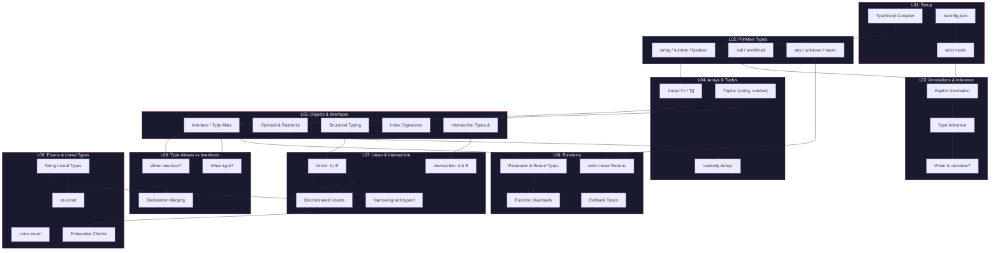

# 01 -- Phase 1 Review: What You've Learned

> Estimated reading time: ~10 minutes

## From Zero to the Type System

In nine lessons you built the entire foundation of TypeScript. That's no small thing -- you now
command the tools professional TypeScript developers use every day. Before we dive into the
challenges, let's look at how all the concepts connect.

---

## The Phase 1 Concept Map



---

## The Four Pillars of Your Knowledge

### Pillar 1: Describing Types (L02, L04, L05)

You know how to describe **any** data structure in TypeScript:

| What | Tool | Example |
|------|------|---------|
| Single values | Primitive Types | `string`, `number`, `boolean` |
| Lists | Arrays & Tuples | `string[]`, `[number, string]` |
| Structures | Interfaces / Types | `interface User { name: string }` |
| Dictionaries | Index Signatures | `{ [key: string]: number }` |
| Precise values | Literal Types | `"success" \| "error"` |
| Constants | as const | `const ROLES = ["admin", "user"] as const` |

### Pillar 2: Combining Types (L07, L08, L09)

You can flexibly compose and constrain types:

- **Union (`|`)** -- "either A or B" -- `string | number`
- **Intersection (`&`)** -- "A and B simultaneously" -- `HasId & HasName`
- **Discriminated Unions** -- safe state modeling with a `kind`/`type` field
- **Literal Types** -- values as types: `"GET" | "POST" | "PUT" | "DELETE"`
- **as const** -- maximum precision for runtime values

### Pillar 3: Typing Functions (L06)

You write type-safe functions with:

- Annotated parameters and return types
- Optional and default parameters
- Rest parameters
- Function overloads for different calling patterns
- Callback types and higher-order functions

### Pillar 4: Safety Through the Compiler (L01, L03, L07, L09)

You understand how TypeScript protects you:

- **Type Inference** knows when you can omit types
- **Structural Typing** checks compatibility based on shape
- **Excess Property Checking** catches typos in object literals
- **Exhaustive Checks** ensure you cover all cases
- **never** as the bottom type for unreachable code

---

## The Invisible Connections

What distinguishes you from a beginner isn't knowledge of individual features --
it's understanding how they **work together**:

### Connection 1: Interfaces + Unions = Discriminated Unions

```typescript
// Interface alone: describes ONE object
interface Circle { kind: "circle"; radius: number; }
interface Rect { kind: "rect"; width: number; height: number; }

// Union combined: describes DIFFERENT objects
type Shape = Circle | Rect;

// Narrowing makes it safe
function area(s: Shape): number {
  switch (s.kind) {
    case "circle": return Math.PI * s.radius ** 2;
    case "rect": return s.width * s.height;
  }
}
```

### Connection 2: as const + Literal Types + typeof = Type from Value

```typescript
const HTTP_METHODS = ["GET", "POST", "PUT", "DELETE"] as const;
type HttpMethod = typeof HTTP_METHODS[number]; // "GET" | "POST" | "PUT" | "DELETE"
```

### Connection 3: Function Overloads + Union Types = Precise APIs

```typescript
function parse(input: string): number;
function parse(input: string[]): number[];
function parse(input: string | string[]): number | number[] {
  if (Array.isArray(input)) return input.map(Number);
  return Number(input);
}
```

### Connection 4: Interfaces + Intersection = Composition

```typescript
interface HasId { readonly id: string; }
interface HasTimestamps { createdAt: Date; updatedAt: Date; }
interface HasName { name: string; }

type Entity = HasId & HasTimestamps;
type User = Entity & HasName & { email: string };
```

---

## What Makes This Review Challenge Different

In the previous lessons you practiced each concept **in isolation**. The exercises in this
lesson are different:

1. **No new concepts** -- everything here you've already learned
2. **Integration** -- each challenge requires concepts from MULTIPLE lessons
3. **Real-world relevance** -- the scenarios come from actual projects
4. **Harder** -- you must decide yourself WHICH tool fits

> **Analogy:** Imagine you've practiced nine different tools individually -- hammer,
> saw, screwdriver, etc. Now you're building a piece of furniture. Nobody tells you which
> tool to use when -- you have to figure it out yourself.

---

## Your Goal for This Lesson

By the end of this lesson you should be able to:

- [ ] Apply every Phase 1 concept **without looking things up**
- [ ] When facing a new problem, **recognize on your own** which types and patterns fit
- [ ] Build complex data models with 5+ interlocking types
- [ ] **Safely refactor** existing `any` code
- [ ] Be ready for **Phase 2: Type System Core** (Generics, Mapped Types, etc.)