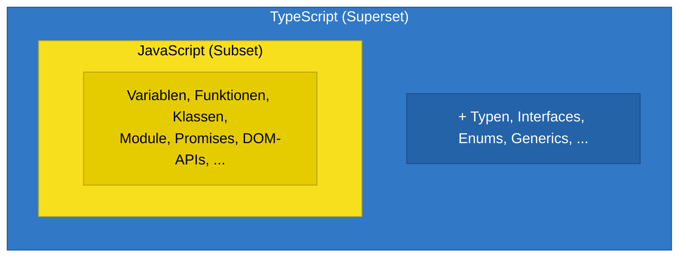
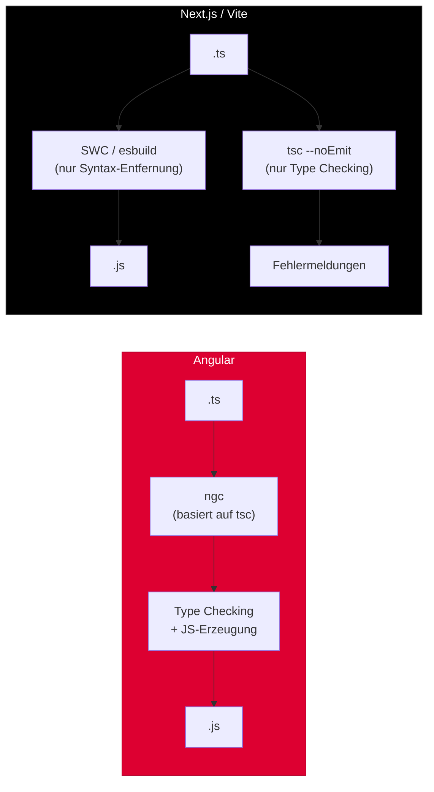

# Sektion 1: Was ist TypeScript?

> Geschaetzte Lesezeit: ~10 Minuten

## Was du hier lernst

- Warum TypeScript erfunden wurde und welches reale Problem es loest
- Wie TypeScript und JavaScript zusammenhaengen (Superset-Beziehung)
- Warum Angular, React und Next.js TypeScript unterschiedlich nutzen

---

## Die Entstehungsgeschichte

Im Jahr 2010 hatte Microsoft ein Problem. Grosse interne Projekte -- darunter Bing Maps und Office Web Apps -- waren in JavaScript geschrieben und wuchsen rasant. Hunderte Entwickler arbeiteten am selben Code. Und es lief aus dem Ruder.

Das Problem war nicht JavaScript selbst. JavaScript ist eine brillante Sprache fuer kleine Skripte und dynamische Webseiten. Aber bei Codebasen mit hunderttausenden Zeilen bricht ein fundamentales Versprechen zusammen: **Niemand weiss mehr, welche Daten wo hinfliessen.**

> **Hintergrund:** Anders Hejlsberg -- der Mann hinter Turbo Pascal, Delphi und C# -- wurde beauftragt, eine Loesung zu finden. Seine zentrale Einsicht war: Man darf JavaScript nicht ersetzen, man muss es *erweitern*. Jedes andere Vorgehen wuerde daran scheitern, dass das gesamte Web-Oekosystem auf JavaScript aufbaut. Also entwarf er eine Sprache, die zu JavaScript *kompiliert* und dabei Typinformationen als reine Entwicklungshilfe hinzufuegt -- ohne das Laufzeitverhalten zu veraendern.

Das Team arbeitete zwei Jahre lang im Stillen an dem Projekt. Im Oktober 2012 stellte Microsoft TypeScript 0.8 der Oeffentlichkeit vor.

> **Fun Fact:** TypeScript wurde zwei volle Jahre intern bei Microsoft entwickelt, bevor es 2012 veroeffentlicht wurde. Anders Hejlsberg sagte in einem Interview: *"We could have designed a completely new language, but the key insight was that we needed to meet JavaScript developers where they are."*

### Der Google-Moment

2014 passierte etwas Unerwartetes: Google arbeitete an einem eigenen Projekt namens **AtScript** -- einer Erweiterung von JavaScript, die ebenfalls Typen und Annotationen hinzufuegen sollte. AtScript war als Grundlage fuer Angular 2 gedacht.

Statt zwei konkurrierende Systeme zu schaffen, entschied sich Google, mit Microsoft zusammenzuarbeiten. Die Features von AtScript (insbesondere Decorators und Metadata Annotations) flossen in TypeScript ein. Angular 2 wurde komplett in TypeScript geschrieben.

> **Hintergrund:** Diese Entscheidung war historisch bedeutsam. Zwei der groessten Tech-Konzerne der Welt einigten sich auf ein gemeinsames Typsystem fuer JavaScript. Das gab TypeScript eine Legitimation, die kein internes Microsoft-Projekt allein haette erreichen koennen.

Heute wird TypeScript von Microsoft, Google, der gesamten Angular-Community, dem React-Oekosystem, Deno, und unzaehligen Open-Source-Projekten genutzt.

> **Denkfrage:** Google hatte mit AtScript eine *eigene* Sprache fuer Angular 2 geplant. Was waere deiner Meinung nach passiert, wenn Google AtScript statt TypeScript gewaehlt haette? Haette das Web-Oekosystem heute zwei konkurrierende Typsysteme?

---

## Das eigentliche Problem: Warum brauchen wir Typen?

Stell dir vor, du baust ein Hochhaus. JavaScript gibt dir die Werkzeuge -- Hammer, Saege, Beton. Aber keine Bauplaene, keine Statik-Pruefung, keinen TUEV. Du kannst bauen, was du willst. Und es stuerzt erst ein, wenn jemand einzieht.

TypeScript ist der Statiker, der *vor dem Bau* prueft, ob die Struktur haelt.

### Die vier echten Gruende fuer TypeScript

**1. Grosse Codebasen brechen ohne Typen zusammen.**

Bei Microsoft arbeiteten hunderte Entwickler am gleichen JavaScript-Code. Ohne Typen wusste niemand, welche Daten eine Funktion erwartet oder zurueckgibt. Fehler wurden erst von Kunden gefunden.

**2. Refactoring wird zum Gluecksspiel.**

Wenn du eine Funktion umbenennst oder ihre Parameter aenderst, kann dir JavaScript nicht sagen, welche 47 anderen Stellen jetzt kaputtgehen. TypeScript kann das.

**3. Dokumentation veraltet, Typen nicht.**

Kommentare luegen. Typen nicht. Eine Typ-Annotation ist eine *lebende Dokumentation*, die der Compiler durchsetzt.

**4. IDE-Unterstuetzung braucht Typinformationen.**

Autocomplete, "Go to Definition", Rename-Refactoring -- all das funktioniert nur gut, wenn die IDE weiss, welche Typen im Spiel sind. Der TypeScript Language Server (tsserver) ist der Grund, warum VS Code so gute JavaScript/TypeScript-Unterstuetzung hat -- sogar fuer reines JavaScript nutzt VS Code im Hintergrund TypeScript-Inferenz.

> **Praxis-Tipp:** Selbst wenn du nie eine einzige Zeile TypeScript schreibst, profitierst du von TypeScript. Die IntelliSense in VS Code fuer JavaScript-Projekte basiert auf dem TypeScript Language Server, der `.d.ts`-Dateien und JSDoc-Kommentare auswertet.

> **Experiment:** Oeffne VS Code und erstelle eine Datei `test.js` (nicht `.ts`!). Schreibe `const arr = [1, 2, 3];` und dann `arr.` -- VS Code zeigt dir trotzdem die Array-Methoden mit Typen an. Warum? Weil im Hintergrund der TypeScript Language Server laeuft, auch fuer JavaScript-Dateien.

---

## TypeScript und JavaScript: Die Beziehung

Ein Punkt, den viele missverstehen:

```
TypeScript ist ein SUPERSET von JavaScript.
Jeder gueltige JavaScript-Code ist auch gueltiger TypeScript-Code.
```

Das bedeutet: TypeScript *ersetzt* JavaScript nicht. Es *erweitert* es.



> Alles innerhalb des gelben Bereichs (JavaScript) ist gleichzeitig gueltiges TypeScript. TypeScript fuegt nur den blauen Bereich hinzu.

TypeScript fuegt **ausschliesslich** Dinge *hinzu*. Es entfernt nichts aus JavaScript. Und -- das ist der Clou -- alles, was TypeScript hinzufuegt, existiert **nur zur Compile-Zeit**. Zur Laufzeit ist alles wieder pures JavaScript. Dieses Prinzip heisst **Type Erasure** und ist so wichtig, dass wir ihm in Sektion 2 einen eigenen Abschnitt widmen.

```typescript annotated
// --- JavaScript (gueltig in BEIDEN Sprachen) ---
const greet = (name) => {    // plain JS function -- valid TypeScript too
  return "Hallo " + name;    // no types needed, JS logic stays unchanged
};

// --- TypeScript-Erweiterungen (nur zur Compile-Zeit) ---
interface Person {           // ← existiert ONLY at compile time, removed in JS output
  name: string;              // ← type annotation -- erased before runtime
  age: number;               // ← erased before runtime
}

const greetTyped = (person: Person): string => {  // ← ": Person" and ": string" are erased
  return "Hallo " + person.name;                  // ← this line survives into JS unchanged
};
// After compilation: const greetTyped = (person) => { return "Hallo " + person.name; };
```

> **Erklaere dir selbst:** Was genau ist der Unterschied zwischen dem, was TypeScript zur Compile-Zeit weiss, und dem, was zur Laufzeit uebrig bleibt?
> - Typ-Annotationen (`: string`, `: Person`) existieren nur im `.ts`-Quellcode und werden vollstaendig entfernt
> - Interfaces verschwinden komplett aus dem JavaScript-Output -- kein einziges Byte bleibt uebrig
> - Der eigentliche Logik-Code (Variablen, Funktionen, Rueckgabewerte) bleibt unveraendert erhalten

> **Denkfrage:** Wenn TypeScript ein Superset von JavaScript ist, bedeutet das, dass jede `.js`-Datei auch eine gueltige `.ts`-Datei ist? Und wenn ja -- warum gibt es dann ueberhaupt eine Unterscheidung zwischen den Dateiendungen?

Die Antwort: Ja, jede `.js`-Datei ist syntaktisch gueltiges TypeScript. Aber der Compiler behandelt `.ts`-Dateien strenger -- z.B. darf in einer `.ts`-Datei kein implizites `any` auftreten (wenn `noImplicitAny` aktiv ist). Die Dateiendung signalisiert dem Compiler, welche Regeln er anwenden soll.

---

## TypeScript in der Praxis: Angular, React, Next.js

Wenn du mit Angular oder React/Next.js arbeitest, nutzt du TypeScript bereits -- aber auf fundamental unterschiedliche Weise:

### Angular: TypeScript-first

Angular ist TypeScript-first. Das Projekt wurde von Anfang an in TypeScript geschrieben, und der Angular-Compiler (`ngc`) baut direkt auf `tsc` auf. Decorators wie `@Component` und `@Injectable` sind TypeScript-Features, die Angular intensiv nutzt. Ohne TypeScript gibt es kein Angular.

> **Hintergrund:** Die Entscheidung, Angular 2 in TypeScript zu schreiben, war direkte Folge der Google-Microsoft-Zusammenarbeit um AtScript. Google wollte Decorators und Metadata Annotations -- und statt ein eigenes System zu bauen, trugen sie diese Features zu TypeScript bei. Heute sind Decorators ein offizieller TC39-Proposal und Teil des JavaScript-Standards.

### React/Next.js: JavaScript-first mit TypeScript als De-facto-Standard

React und Next.js sind JavaScript-first, aber TypeScript hat sich als De-facto-Standard durchgesetzt. Hier ist ein wichtiger Unterschied: Next.js nutzt NICHT `tsc` zum Kompilieren. Stattdessen verwenden Next.js und Vite schnellere Werkzeuge wie **SWC** oder **esbuild**, die die TypeScript-Syntax entfernen, aber KEIN Type Checking durchfuehren. `tsc` laeuft separat als Type Checker (mit `--noEmit`).



Das erklaert, warum `npm run build` in Next.js zwei Schritte hat: erst `tsc --noEmit` (Typen pruefen), dann den eigentlichen Build mit SWC. In Angular ist beides ein Schritt.

> **Praxis-Tipp:** In deinem Angular-Projekt sorgt `ng serve` automatisch fuer Type Checking und Kompilierung. In Next.js musst du selbst darauf achten, dass `tsc --noEmit` laeuft -- entweder als separater Script oder ueber die IDE. Sonst schleichen sich Typ-Fehler ein, die erst beim `next build` auffallen.

---

## Was du gelernt hast

- **TypeScript wurde geboren**, weil grosse JavaScript-Codebasen ohne Typen nicht wartbar sind
- **Anders Hejlsberg** entwarf TypeScript mit der Einsicht, dass man JavaScript erweitern, nicht ersetzen muss
- **TypeScript ist ein Superset** von JavaScript -- es fuegt Typen hinzu, entfernt aber nichts
- **Angular** ist TypeScript-first, **React/Next.js** nutzen TypeScript als Standard, aber mit getrenntem Type Checking
- **Google und Microsoft** arbeiteten zusammen, was TypeScript zum De-facto-Standard machte

> **Denkfrage:** Du hast gelernt, dass TypeScript ein Superset von JavaScript ist. Stell dir vor, du oeffnest ein bestehendes JavaScript-Projekt mit 500 `.js`-Dateien. Was waere der einfachste erste Schritt, um TypeScript einzufuehren, OHNE eine einzige Datei umzuschreiben? (Tipp: Die Antwort steckt in der tsconfig.json -- du lernst sie in Sektion 3.)

---

**Naechste Sektion:** [Der Compiler -- Wie TypeScript zu JavaScript wird](02-der-compiler.md)

> Guter Zeitpunkt fuer eine Pause. Wenn du wiederkommst, starte mit Sektion 2: Der Compiler.
