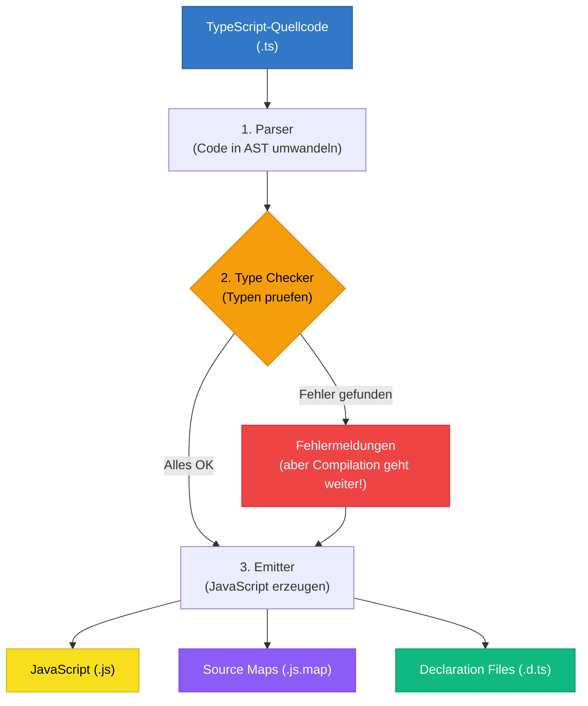
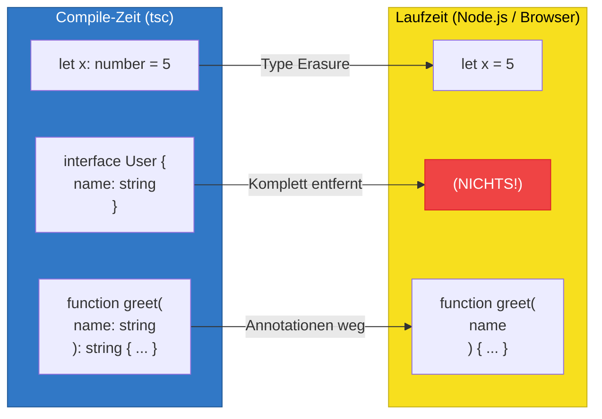

# Sektion 2: Der Compiler -- Wie TypeScript zu JavaScript wird

> Geschaetzte Lesezeit: ~10 Minuten

## Was du hier lernst

- Was der TypeScript-Compiler in seinen drei Phasen tut (Parsing, Type Checking, Emit)
- Warum Type Checking und Code-Erzeugung *unabhaengig* voneinander sind
- Was Type Erasure bedeutet und welche Konsequenzen das hat

---

## Kompilation vs. Transpilation

Streng genommen ist der TypeScript-Compiler ein **Transpiler**: Er uebersetzt von einer Hochsprache (TypeScript) in eine andere Hochsprache (JavaScript), nicht in Maschinencode. Bei einem echten Compiler (wie dem C-Compiler `gcc`) entsteht Maschinencode, den der Prozessor direkt ausfuehren kann.

Aber der TypeScript-Compiler tut mehr als nur uebersetzen. Er prueft auch deine Typen. Diese beiden Aufgaben sind *unabhaengig* voneinander -- ein Designentscheid, der weitreichende Konsequenzen hat.

> **Hintergrund:** Anders Hejlsberg traf eine bewusste Designentscheidung: Der Compiler soll *immer* JavaScript erzeugen, auch wenn es Typ-Fehler gibt. Bei Sprachen wie Java oder C# bedeutet ein Kompilierfehler, dass kein ausfuehrbarer Code entsteht. TypeScript ist anders: Es meldet die Fehler, produziert aber trotzdem Output. Warum? Weil TypeScript existierenden JavaScript-Code nicht blockieren darf. Du sollst schrittweise Typen hinzufuegen koennen, ohne dass dein Projekt waehrenddessen unbaubar wird.

---

## Die drei Phasen im Detail



> **Wichtig:** Beachte den Pfeil von "Fehler gefunden" zum Emitter -- TypeScript erzeugt JavaScript **auch bei Fehlern**! Das ist eine bewusste Designentscheidung.

### Phase 1: Parsing -- Code wird in einen Baum verwandelt

Der Parser liest deinen Quellcode Zeichen fuer Zeichen und baut daraus einen **Abstract Syntax Tree (AST)** -- eine Baumstruktur, die die logische Struktur deines Codes repraesentiert.

Stell dir den AST wie einen Stammbaum deines Codes vor:

```
  Code: let alter: number = 30;

  AST:
  VariableDeclaration
  +-- name: "alter"
  +-- type: NumberKeyword
  +-- initializer: NumericLiteral (30)
```

Warum ist das wichtig? Weil sowohl der Type Checker als auch der Emitter nicht den rohen Text lesen, sondern den AST. Das ist auch der Grund, warum deine IDE dir Syntaxfehler sofort anzeigen kann -- der Parser scheitert, bevor das Type Checking ueberhaupt beginnt.

> **Tieferes Wissen:** Du kannst den AST deines eigenen Codes anschauen: [astexplorer.net](https://astexplorer.net) zeigt dir fuer jedes Code-Snippet den resultierenden Baum. Das ist nicht nur akademisch interessant -- wenn du spaeter einmal einen ESLint-Rule oder ein Codemod schreibst, arbeitest du direkt mit dem AST.

> **Experiment:** Oeffne [astexplorer.net](https://astexplorer.net), waehle "TypeScript" als Sprache und gib diesen Code ein: `let alter: number = 30;`. Finde im AST-Baum den `NumberKeyword`-Knoten. Aendere dann den Code zu `let alter = 30;` (ohne Typ-Annotation). Was aendert sich im AST? Der `NumberKeyword`-Knoten verschwindet -- genau das entfernt der Emitter bei der Kompilierung.

### Phase 2: Type Checking -- Die Intelligenz von TypeScript

Der Type Checker durchlaeuft den AST und prueft jeden Knoten:

- Stimmen die Typen bei Zuweisungen? (`let x: string = 42` -- Fehler!)
- Existieren die Properties? (`user.nmae` -- Tippfehler!)
- Passen die Funktionsargumente? (`add(1, "2")` -- falsche Typen!)
- Sind alle Code-Pfade abgedeckt? (fehlendes `return` -- Fehler!)

Das ist der rechenintensivste Schritt. Bei grossen Projekten kann das Type Checking mehrere Sekunden dauern.

> **Hintergrund:** Das Type-Checking-System von TypeScript ist Turing-vollstaendig. Das bedeutet theoretisch, dass es Programme gibt, bei denen der Type Checker nie terminiert. In der Praxis hat TypeScript Rekursions-Limits eingebaut (z.B. maximal 50 Ebenen bei konditionalen Typen). Trotzdem ist es moeglich, extrem komplexe Typ-Konstrukte zu schreiben, die den Compiler sekundenlang beschaeftigen. Ein Grund, warum Tools wie `esbuild` und SWC so schnell sind: **Sie ueberspringen diesen Schritt komplett.**

### Phase 3: Emit -- JavaScript-Code erzeugen

Der Emitter durchlaeuft den AST erneut und erzeugt JavaScript-Code:

- Alle Typ-Annotationen werden entfernt
- Interfaces und Type-Aliases verschwinden komplett
- Bei Bedarf wird moderner Code in aeltere Syntax umgeschrieben (Downleveling)
- Optional werden Source Maps und Declaration Files erzeugt

> 🧠 **Erklaere dir selbst:** Der Compiler hat drei Phasen (Parsing, Type Checking, Emit). Warum sind Type Checking und Emit voneinander unabhaengig? Was waere der Nachteil, wenn Typ-Fehler die JavaScript-Erzeugung blockieren wuerden?
> **Kernpunkte:** Schrittweise Migration moeglich | Bestehender JS-Code wird nicht blockiert | noEmitOnError fuer strikte Builds

---

## Type Checking und Emit sind getrennt!

TypeScript kann JavaScript-Code erzeugen, **selbst wenn es Typ-Fehler gibt**. Der Compiler meldet die Fehler, produziert aber trotzdem Output.

Wenn du dieses Verhalten nicht willst, gibt es die Option **`noEmitOnError: true`**. Damit erzeugt `tsc` nur dann JavaScript, wenn KEINE Typ-Fehler vorhanden sind. Das ist fuer CI/CD-Pipelines und Production Builds empfohlen.

```json
{
  "compilerOptions": {
    "noEmitOnError": true
  }
}
```

> **Denkfrage:** Wenn TypeScript auch bei Fehlern JavaScript erzeugt -- warum sollte man dann ueberhaupt auf die Fehler hoeren? Koennte man nicht einfach alle Fehler ignorieren und den Code trotzdem ausfuehren?

Die Antwort: Du *koenntest* die Fehler ignorieren. Der Code wuerde laufen. Aber die Fehler sagen dir, dass dein Code wahrscheinlich nicht das tut, was du denkst. Es ist wie ein Rauchmelder: Du kannst die Batterie rausnehmen und weiterschlafen, aber das Feuer ist trotzdem da.

---

## Type Erasure: Typen verschwinden spurlos

Das ist eines der wichtigsten Konzepte in TypeScript:

**Zur Laufzeit existieren keine TypeScript-Typen.**



Alles, was TypeScript-spezifisch ist (`: number`, `interface`, Generics, etc.), wird **komplett entfernt**. Es bleibt kein einziges Byte davon im JavaScript uebrig.

```typescript annotated
interface User {
// ^ Existiert NUR zur Compile-Zeit -- wird komplett entfernt
  name: string;
// ^ Typ-Annotation ": string" verschwindet im JS
  age: number;
}

const greet = (user: User): string => {
// ^ ": User" und ": string" werden entfernt (Type Erasure)
  return `Hallo ${user.name}, du bist ${user.age}`;
};
// ^ Im JS bleibt: const greet = (user) => { return `Hallo...` }
```

> **Fun Fact:** Node.js 23.6+ hat experimentellen Support fuer "Type Stripping" -- das heisst, Node.js kann `.ts`-Dateien direkt ausfuehren, indem es die Typen selbst entfernt, ohne den vollen Compiler zu benoetigen. Das zeigt: Type Erasure ist so zentral, dass sogar die Runtime es jetzt nativ unterstuetzt.

### Konsequenzen der Type Erasure

**1. Du kannst zur Laufzeit nicht auf TypeScript-Typen pruefen.**

`if (typeof x === "string")` funktioniert -- das ist JavaScript.
`if (x instanceof MyInterface)` funktioniert NICHT -- Interfaces existieren nicht zur Laufzeit.

**2. Typen haben keinen Performance-Einfluss.**

Da sie komplett entfernt werden, machen sie den erzeugten JavaScript-Code weder langsamer noch groesser.

**3. Du brauchst keine TypeScript-Runtime.**

Der erzeugte JavaScript-Code laeuft ueberall, wo JavaScript laeuft, ohne jede Abhaengigkeit von TypeScript.

> 🧠 **Erklaere dir selbst:** Was bedeutet Type Erasure konkret? Wenn du `interface User { name: string }` schreibst und kompilierst -- was bleibt davon im JavaScript uebrig? Warum ist das so?
> **Kernpunkte:** Interface verschwindet komplett | Nur Compile-Zeit-Konstrukt | Kein Byte im JS-Output | Laufzeit-Pruefung mit typeof/instanceof noetig

### Die grosse Ausnahme: Was NICHT verschwindet

Nicht alles in TypeScript ist reine Compile-Zeit-Magie. Diese Konstrukte erzeugen echten JavaScript-Code:

| Konstrukt | Was daraus wird |
|-----------|----------------|
| `enum Direction { Up, Down }` | Ein JavaScript-Objekt mit Reverse Mapping |
| `class User { ... }` | Eine JavaScript-Klasse (das ist ein JS-Feature!) |
| Decorators `@Component()` | Funktionsaufrufe (relevant fuer Angular!) |
| `import` / `export` | Bleiben als Module-Syntax erhalten |

> **Praxis-Tipp:** Viele Entwickler bevorzugen `as const`-Objekte statt Enums -- sie erzeugen reines JavaScript und verhalten sich vorhersagbarer. In Angular-Projekten wirst du trotzdem haeufig Enums sehen, weil sie in aelteren Angular-Versionen der Standard waren.

### Die Analogie: Bauplan und Gebaeude

Stell dir Type Erasure so vor: TypeScript-Typen sind wie der Bauplan eines Hauses. Der Bauplan ist entscheidend waehrend der Bauphase (Compile-Zeit) -- er stellt sicher, dass alles passt. Aber wenn das Haus fertig steht (Laufzeit), traegt niemand den Bauplan mit sich herum. Das Haus funktioniert ohne ihn. Und wenn du das Haus anschaust, siehst du nicht, welcher Architekt den Plan gezeichnet hat.

> **Denkfrage:** Wenn Interfaces zur Laufzeit nicht existieren, wie pruefst du dann zur Laufzeit, ob ein Objekt eine bestimmte Struktur hat? Zum Beispiel: Ein API-Response kommt an und du willst pruefen, ob er wirklich die erwarteten Properties hat. Welche JavaScript-Mittel koenntest du dafuer nutzen?

> **Experiment:** Erstelle eine Datei `test-erasure.ts` mit folgendem Inhalt:
> ```typescript
> interface Tier { name: string; }
> enum Farbe { Rot, Gruen, Blau }
> const hund: Tier = { name: "Bello" };
> console.log(hund);
> console.log(Farbe.Rot);
> ```
> Kompiliere sie mit `tsc test-erasure.ts` und oeffne die erzeugte `test-erasure.js`. Welche Zeilen sind verschwunden? Welche sind geblieben? Vergleiche die zwei Dateien Zeile fuer Zeile.

---

## Was du gelernt hast

- Der Compiler hat **drei Phasen**: Parsing (AST erzeugen), Type Checking (Fehler finden), Emit (JavaScript erzeugen)
- **Type Checking und Emit sind unabhaengig** -- Typ-Fehler verhindern nicht die JavaScript-Erzeugung (ausser mit `noEmitOnError`)
- **Type Erasure** bedeutet: Zur Laufzeit existieren keine TypeScript-Typen, alles wird restlos entfernt
- **Ausnahmen** wie `enum`, `class` und Decorators erzeugen echten JavaScript-Code
- Der Compiler ist bewusst so designt, um **schrittweise Migration** zu ermoeglichen

---

**Naechste Sektion:** [tsconfig verstehen -- Das Herz jedes TS-Projekts](03-tsconfig-verstehen.md)

> Guter Zeitpunkt fuer eine Pause. Wenn du wiederkommst, starte mit Sektion 3: tsconfig verstehen.
