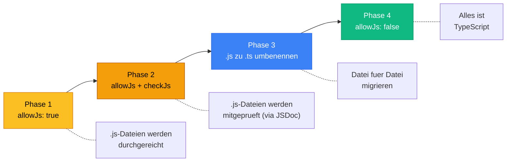

# Sektion 3: tsconfig verstehen -- Das Herz jedes TS-Projekts

> Geschaetzte Lesezeit: ~12 Minuten

## Was du hier lernst

- Was die wichtigsten Optionen in einer `tsconfig.json` tun und WARUM sie existieren
- Warum `strict: true` nicht verhandelbar ist
- Was Source Maps und Declaration Files sind und wann du sie brauchst

---

## Die tsconfig.json: Dein Projekt konfigurieren

Jetzt wo du weisst, WAS der Compiler tut (Parsing, Type Checking, Emit), schauen wir uns an, WIE du ihn konfigurierst. Die `tsconfig.json` ist die Steuerungszentrale.

### Eine typische tsconfig.json

```json
{
  "compilerOptions": {
    "target": "ES2022",
    "module": "NodeNext",
    "moduleResolution": "NodeNext",
    "strict": true,
    "esModuleInterop": true,
    "outDir": "./dist",
    "rootDir": "./src",
    "declaration": true,
    "sourceMap": true,
    "skipLibCheck": true,
    "forceConsistentCasingInFileNames": true,
    "noEmitOnError": true
  },
  "include": ["src/**/*"],
  "exclude": ["node_modules", "dist"]
}
```

Auf den ersten Blick sieht das nach vielen Schaltern aus. Aber jeder einzelne hat einen konkreten Grund.

> **Hintergrund:** Die `tsconfig.json` wurde mit TypeScript 1.5 (2015) eingefuehrt. Vorher musste man alle Compiler-Optionen als Kommandozeilen-Flags uebergeben. Stell dir vor, du tippst jedes Mal `tsc --target ES5 --module commonjs --strict --outDir dist --rootDir src ...` -- das war die Realitaet. Die `tsconfig.json` war ein Game Changer, weil sie die Konfiguration versionierbar und teilbar machte.

> **Experiment:** Oeffne die `tsconfig.json` in deinem Projekt und hovere in VS Code ueber eine beliebige Option. VS Code zeigt dir eine Beschreibung direkt aus der TypeScript-Dokumentation an. Probiere es mit `strict`, `target` und `module` -- die Beschreibungen sind ueberraschend hilfreich.

> **Denkfrage:** Warum ist die tsconfig.json als JSON-Datei implementiert und nicht als JavaScript-Datei (wie z.B. `webpack.config.js` oder `eslint.config.js`)? Was waere der Vorteil einer JS-Konfiguration? Was der Nachteil?

### Die wichtigsten Optionen erklaert

| Option | Was sie tut | Empfehlung |
|--------|-------------|------------|
| `target` | Bestimmt, in welche JS-Version kompiliert wird (ES5, ES2015, ES2022, ...) | `ES2022` fuer moderne Node.js-Projekte |
| `module` | Das Modulsystem des Outputs (CommonJS, ESNext, NodeNext) | `NodeNext` fuer Node.js |
| `strict` | Aktiviert ALLE strengen Pruefungen auf einmal | **Immer `true`** |
| `outDir` | Wohin die kompilierten JS-Dateien geschrieben werden | `./dist` |
| `rootDir` | Wo der Quellcode liegt | `./src` |
| `declaration` | Erzeugt `.d.ts`-Dateien (Typ-Deklarationen) | `true` fuer Libraries |
| `sourceMap` | Erzeugt `.map`-Dateien fuer Debugging | `true` waehrend der Entwicklung |
| `esModuleInterop` | Bessere Kompatibilitaet mit CommonJS-Modulen | `true` |
| `skipLibCheck` | Ueberspringt Typ-Pruefung von `.d.ts`-Dateien | `true` (beschleunigt Kompilierung) |
| `noEmitOnError` | Kein JavaScript-Output bei Typ-Fehlern | `true` fuer Production Builds |

> **Tieferes Wissen:** `target` beeinflusst nicht nur die Syntax (z.B. ob `async/await` in Promises umgeschrieben wird), sondern auch welche **Built-in-Typen** verfuegbar sind. Mit `target: "ES5"` kennt TypeScript kein `Promise`, `Map`, `Set` oder `Symbol`. Wenn du diese nutzen willst, musst du entweder das Target erhoehen oder die `lib`-Option erweitern: `"lib": ["ES5", "ES2015.Promise"]`. In der Praxis: Nutze einfach `ES2022` -- alle modernen Laufzeitumgebungen (Node 18+, aktuelle Browser) unterstuetzen das.

---

## Was `strict: true` im Detail aktiviert

`strict` ist ein Sammelschalter. Er aktiviert diese Einzel-Optionen:

- **`strictNullChecks`** -- `null` und `undefined` sind eigene Typen
- **`strictFunctionTypes`** -- Strengere Pruefung von Funktionsparametern (Kontravarianz!)
- **`strictBindCallApply`** -- Prueft `bind`, `call`, `apply` korrekt
- **`strictPropertyInitialization`** -- Klassen-Properties muessen initialisiert werden
- **`noImplicitAny`** -- Variablen ohne Typ-Annotation bekommen nicht automatisch `any`
- **`noImplicitThis`** -- `this` muss einen klaren Typ haben
- **`alwaysStrict`** -- Erzeugt `"use strict"` in jeder Datei
- **`useUnknownInCatchVariables`** -- `catch(e)` hat den Typ `unknown` statt `any`

> **Hintergrund:** Der `strict`-Schalter wurde mit TypeScript 2.3 (2017) eingefuehrt, und das Team fuegt bei neuen TypeScript-Versionen regelmaessig weitere Unter-Optionen hinzu. Das bedeutet: Wenn du `strict: true` setzt und TypeScript updatest, kann dein Code ploetzlich neue Fehler haben, weil strengere Pruefungen hinzugekommen sind. Das ist *beabsichtigt* -- jede neue strenge Pruefung fand reale Bugs in echtem Code.

### Warum strict IMMER an sein muss: Ein konkretes Beispiel

Ohne `strictNullChecks` passiert Folgendes:

```typescript
// OHNE strictNullChecks -- GEFAEHRLICH!
function getUser(id: number): User {
  return database.find(u => u.id === id);  // Koennte undefined sein!
}

const user = getUser(999);
console.log(user.name);  // KEIN Compiler-Fehler!
                          // Aber zur Laufzeit: "Cannot read property 'name' of undefined"
```

Mit `strictNullChecks` meldet TypeScript:

```typescript
// MIT strictNullChecks -- SICHER!
function getUser(id: number): User | undefined {
  return database.find(u => u.id === id);  // TypeScript weiss: koennte undefined sein
}

const user = getUser(999);
console.log(user.name);  // FEHLER! Object is possibly 'undefined'
// Du MUSST pruefen:
if (user) {
  console.log(user.name);  // Jetzt ist es sicher
}
```

> **Hintergrund:** Tony Hoare, der 1965 das Konzept der Null-Referenz erfand, nannte es spaeter seinen **"Milliarden-Dollar-Fehler"**: *"I call it my billion-dollar mistake. It was the invention of the null reference."* `strictNullChecks` ist das direkte Gegenmittel. Es zwingt dich, ueberall dort wo `null` oder `undefined` auftreten kann, explizit damit umzugehen. Keine "Cannot read property of undefined"-Fehler mehr in Production.

> **Denkfrage:** `useUnknownInCatchVariables` (seit TS 4.4) aendert den Typ von `catch(e)` von `any` zu `unknown`. Warum ist das sicherer? Was musst du im catch-Block jetzt anders machen?

> 🧠 **Erklaere dir selbst:** Warum meldet TypeScript OHNE `strictNullChecks` keinen Fehler bei `user.name`, auch wenn `user` moeglicherweise `undefined` ist? Was aendert sich MIT dieser Option?
> **Kernpunkte:** Ohne strictNullChecks: null/undefined implizit in jedem Typ | Mit: null/undefined sind eigene Typen | Erzwingt explizite Pruefung | Verhindert "Cannot read property of undefined"

**Regel: Starte immer mit `strict: true`.** Es ist viel schwieriger, Strict-Mode nachtraeglich einzufuehren, als von Anfang an damit zu arbeiten. Wenn du ein bestehendes Projekt migrierst, kannst du `strict: true` setzen und einzelne Unter-Optionen temporaer deaktivieren:

```json
{
  "compilerOptions": {
    "strict": true,
    "strictPropertyInitialization": false  // Spaeter aktivieren
  }
}
```

---

## allowJs und checkJs: Die Bruecke zwischen JS und TS

Was ist, wenn du ein bestehendes JavaScript-Projekt hast und es schrittweise auf TypeScript umstellen willst? Dafuer gibt es zwei wichtige Compiler-Optionen:

- **`allowJs: true`** -- Erlaubt `.js`-Dateien im TypeScript-Projekt. Du kannst `.ts`- und `.js`-Dateien mischen. Das ist der erste Schritt einer Migration.

- **`checkJs: true`** -- Geht einen Schritt weiter: TypeScript prueft auch die `.js`-Dateien auf Typ-Fehler! Es nutzt dafuer JSDoc-Kommentare und Type Inference.

```javascript
// In einer .js-Datei (mit checkJs: true):

/** @param {string} name */
/** @param {number} alter */
function begruessung(name, alter) {
  return `${name} ist ${alter} Jahre alt.`;
}

begruessung("Anna", "zwanzig");  // TypeScript meldet: Fehler!
                                  // Auch ohne .ts-Datei!
```

**Migrations-Strategie in vier Phasen:**



> **Praxis-Tipp:** Wenn du ein bestehendes React-Projekt migrierst, beginne mit den "Leaf Components" -- also den kleinsten, unabhaengigsten Komponenten ganz unten im Baum. Arbeite dich dann nach oben. Bei Angular-Projekten ist diese Strategie seltener noetig, weil Angular von Anfang an TypeScript ist.

---

## Source Maps: Das Debugging-Werkzeug

Wenn du `"sourceMap": true` setzt, erzeugt der Compiler neben jeder `.js`-Datei eine `.js.map`-Datei. Aber was steckt darin?

**Das Problem:** Du schreibst TypeScript, aber der Browser/Node.js fuehrt JavaScript aus. Wenn ein Fehler auftritt, zeigt der Stack Trace auf Zeile 47 in `user.js` -- aber du hast nie `user.js` geschrieben. Du willst Zeile 23 in `user.ts` sehen.

**Die Loesung:** Source Maps sind eine Uebersetzungstabelle, die jede Zeile im generierten JavaScript auf die entsprechende Zeile im originalen TypeScript zuordnet.

```
user.ts (was du schreibst)      user.js (was ausgefuehrt wird)
----------------------------    ----------------------------
Zeile 23: const x: number = 5  Zeile 47: const x = 5
                       \                    /
                        \                  /
                    user.js.map
                    (Zuordnungstabelle)
```

Die Analogie: Source Maps sind wie das Inhaltsverzeichnis eines uebersetzten Buches. Wenn jemand auf Seite 47 der englischen Uebersetzung eine Stelle findet, kann er ueber das Mapping nachschlagen, dass es sich um Seite 23 im deutschen Original handelt.

**Wie du Source Maps nutzt:**

- **Im Browser:** DevTools erkennen Source Maps automatisch. Du siehst deine `.ts`-Dateien im Sources-Tab und kannst Breakpoints direkt darin setzen.
- **In Node.js:** Starte mit `node --enable-source-maps dist/main.js`. Stack Traces zeigen dann auf die `.ts`-Dateien.
- **In VS Code:** Konfiguriere `launch.json` mit `"sourceMap": true` -- dann kannst du direkt in TypeScript debuggen.

**Wann Source Maps aktivieren?**

| Umgebung | Empfehlung | Warum |
|----------|-----------|-------|
| Entwicklung | Immer `true` | Debugging ohne Source Maps ist Blindflug |
| Production (Backend) | `true` | Hilft beim Debugging in Production |
| Production (Frontend) | Optional / `"hidden"` | Veroeffentlichte Source Maps zeigen Quellcode; `"hidden"` nur fuer Error-Tracking (Sentry etc.) |

---

## Declaration Files (.d.ts): Typ-Definitionen fuer die Welt

Wenn du `"declaration": true` setzt, erzeugt `tsc` neben jeder `.js`-Datei auch eine `.d.ts`-Datei. Diese enthaelt NUR die Typ-Informationen -- keinen Code.

```typescript
// user.ts (dein Code)
export function createUser(name: string, age: number): User {
  return { id: Math.random(), name, age, createdAt: new Date() };
}

// user.d.ts (automatisch erzeugt)
export declare function createUser(name: string, age: number): User;
```

**Warum gibt es das?**

Wenn du eine Library schreibst und sie als npm-Paket veroeffentlichst, gibst du das kompilierte JavaScript aus. Aber die Nutzer deiner Library wollen trotzdem Typ-Informationen. Die `.d.ts`-Dateien liefern genau das.

> **Hintergrund:** Das ist auch der Grund, warum Pakete wie `@types/react` oder `@types/node` existieren. React und Node.js sind in JavaScript geschrieben, aber die Community hat auf [DefinitelyTyped](https://github.com/DefinitelyTyped/DefinitelyTyped) die Typ-Informationen nachgeliefert. DefinitelyTyped ist eines der groessten Open-Source-Repositorys der Welt -- mit ueber 8.000 Typ-Definitionen fuer JavaScript-Libraries. Wenn du `npm install @types/lodash` machst, installierst du die `.d.ts`-Dateien aus diesem Repository.

---

## Was du gelernt hast

- Die **tsconfig.json** ist die zentrale Konfiguration -- sie steuert *wie* der Compiler arbeitet
- **`strict: true`** ist Pflicht -- ohne Strict-Mode verschenkst du den groessten Vorteil von TypeScript
- **`strictNullChecks`** ist die einzelne wichtigste Unter-Option -- sie verhindert Null-Referenz-Fehler
- **Source Maps** verbinden generierten JavaScript-Code mit deinem TypeScript fuer Debugging
- **Declaration Files** (`.d.ts`) liefern Typ-Informationen fuer Libraries
- Die **Migration** von JS zu TS funktioniert schrittweise ueber `allowJs` und `checkJs`

> **Experiment:** Erstelle eine minimale `tsconfig.json` mit nur `{ "compilerOptions": { "strict": true } }` und kompiliere eine Datei, in der eine Variable keinen Typ hat: `function add(a, b) { return a + b; }`. Lies die Fehlermeldung. Setze dann `strict: false` und kompiliere erneut. Welcher Unterschied ist dir aufgefallen? Setze `strict` danach wieder auf `true`!

---

**Naechste Sektion:** [Tools & Ausfuehrung -- tsc, tsx, ts-node im Vergleich](04-tools-und-ausfuehrung.md)

> Guter Zeitpunkt fuer eine Pause. Wenn du wiederkommst, starte mit Sektion 4: Tools & Ausfuehrung.
