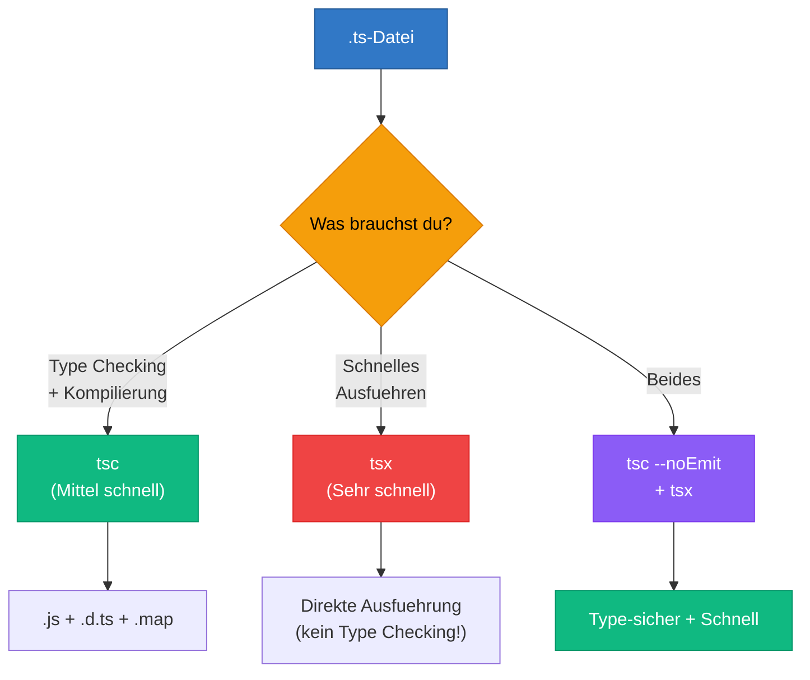

# Sektion 4: Tools & Ausfuehrung -- tsc, tsx, ts-node im Vergleich

> Geschaetzte Lesezeit: ~10 Minuten

## Was du hier lernst

- Welche Werkzeuge es gibt, um TypeScript auszufuehren, und was jedes davon tut
- Warum `tsx` schnell ist, aber kein Type Checking macht
- Der ideale Entwicklungsworkflow: Type Checking + schnelle Ausfuehrung kombinieren

---

## Das Werkzeug-Oekosystem

TypeScript hat kein eingebautes Runtime. Du kannst `.ts`-Dateien nicht einfach "starten" wie ein Python-Skript. Stattdessen musst du entweder zuerst kompilieren und dann ausfuehren, oder ein Tool nutzen, das beides in einem Schritt macht.

> **Hintergrund:** Das ist eine bewusste Designentscheidung. TypeScript wollte kein eigenes Oekosystem aufbauen, sondern sich in das bestehende JavaScript-Oekosystem einfuegen. Deshalb erzeugt `tsc` JavaScript, das von jeder bestehenden JavaScript-Runtime (Node.js, Deno, Browser, Bun) ausgefuehrt werden kann. Andere Sprachen wie Dart oder CoffeeScript schufen eigene Runtimes -- und verloren dadurch an Relevanz. TypeScript vermied diesen Fehler.

---

## 1. `tsc` -- Der offizielle Compiler

```bash
# Installation
npm install -g typescript

# Einzelne Datei kompilieren
tsc hello.ts        # erzeugt hello.js

# Projekt kompilieren (nutzt tsconfig.json)
tsc                 # kompiliert alles laut Konfiguration

# Watch-Modus: Kompiliert bei jeder Aenderung neu
tsc --watch

# Nur Type Checking, kein Output
tsc --noEmit
```

`tsc` kompiliert nur -- er fuehrt den Code nicht aus. Du musst das erzeugte JavaScript anschliessend mit `node` ausfuehren:

```bash
tsc hello.ts && node hello.js
```

> **Tieferes Wissen:** `tsc --noEmit` ist einer der wichtigsten Befehle in modernen TypeScript-Projekten. Er prueft alle Typen, erzeugt aber keinen Output. Das ist genau das, was Next.js und Vite tun: Sie nutzen `tsc` nur zum Pruefen, nicht zum Kompilieren. Die eigentliche Kompilierung uebernehmen schnellere Tools. Du wirst diesen Befehl in fast jeder `package.json` finden: `"typecheck": "tsc --noEmit"`.

---

## 2. `tsx` -- TypeScript direkt ausfuehren

```bash
# Installation
npm install -g tsx

# Direkt ausfuehren (kompiliert im Speicher, keine .js-Datei)
tsx hello.ts

# Watch-Modus
tsx watch hello.ts
```

`tsx` ist der schnellste Weg, TypeScript auszufuehren. Es nutzt `esbuild` unter der Haube und ist extrem schnell.

**Aber:** Es fuehrt KEIN Type Checking durch. Es entfernt die Typen einfach und fuehrt das JavaScript aus.

> **Hintergrund:** `esbuild` wurde von Evan Wallace (einem der Gruender von Figma) in Go geschrieben. Es ist 10-100x schneller als `tsc`, weil es zwei Dinge tut, die `tsc` nicht tut: (1) Es nutzt alle CPU-Kerne parallel, und (2) es ueberspringt das Type Checking komplett. Fuer `esbuild` sind Typ-Annotationen nur Syntax, die entfernt werden muss -- es versteht ihre Bedeutung nicht.

**Wann ist das ein Problem?**

Wenn du einen Typ-Fehler in deinem Code hast, meldet `tsx` ihn NICHT. Der Code laeuft einfach -- und crasht moeglicherweise erst zur Laufzeit. Deshalb brauchst du immer `tsc --noEmit` daneben.

Stell dir das so vor: `tsx` ist wie ein schneller Kurier, der dein Paket sofort ausliefert, ohne den Inhalt zu pruefen. `tsc` ist die Qualitaetskontrolle, die sicherstellt, dass das richtige Produkt im Paket liegt. Du brauchst beides.

> 🧠 **Erklaere dir selbst:** Warum fuehrt `tsx` KEIN Type Checking durch? Welchen Vorteil hat das -- und welches Risiko entsteht? Wie ergaenzen sich `tsx` und `tsc --noEmit` im Workflow?
> **Kernpunkte:** tsx nutzt esbuild (nur Syntax-Entfernung) | Kein Type Checking = schneller | Risiko: Laufzeitfehler trotz Typ-Fehler | Beides zusammen: Geschwindigkeit + Sicherheit

> **Experiment:** Erstelle eine Datei `test-tsx.ts` mit einem absichtlichen Typ-Fehler:
> ```typescript
> const name: number = "hello";
> console.log(name);
> ```
> Fuehre sie mit `tsx test-tsx.ts` aus. Was passiert? Der Code laeuft ohne Fehler! Fuehre dann `tsc --noEmit test-tsx.ts` aus. Jetzt siehst du den Fehler. Das ist der Unterschied.

> **Denkfrage:** Wenn `tsx` keine Typ-Fehler meldet -- warum benutzt man es dann ueberhaupt? Warum nicht immer `tsc`? (Tipp: Denke an die Geschwindigkeit bei grossen Projekten und den Feedback-Loop beim Entwickeln.)

---

## 3. `ts-node` -- Der Klassiker

```bash
# Installation
npm install -g ts-node

# Ausfuehren
ts-node hello.ts

# Mit SWC (schneller)
ts-node --swc hello.ts
```

`ts-node` ist aelter und langsamer als `tsx`, aber weiter verbreitet. Es kann optional auch Type Checking durchfuehren.

> **Hintergrund:** `ts-node` war das erste populaere Tool zum direkten Ausfuehren von TypeScript und erschien 2015. Es nutzt den echten TypeScript-Compiler unter der Haube, was es langsamer aber vollstaendiger macht. Mit dem `--swc`-Flag kann es SWC statt `tsc` fuer die Transpilation nutzen -- das macht es deutlich schneller, aber dann ohne Type Checking (genau wie `tsx`). Fuer neue Projekte ist `tsx` die bessere Wahl, aber du wirst `ts-node` noch in vielen aelteren Projekten und Tutorials finden.

---

## 4. `tsc --watch` vs. `tsx watch` -- Was ist der Unterschied?

| | `tsc --watch` | `tsx watch` |
|---|---|---|
| **Was es tut** | Kompiliert bei jeder Aenderung neu | Fuehrt bei jeder Aenderung neu aus |
| **Type Checking** | Ja, bei jeder Aenderung | Nein |
| **Output** | `.js`-Dateien auf der Festplatte | Direkte Ausfuehrung im Speicher |
| **Geschwindigkeit** | Langsamer (volles Type Checking) | Sehr schnell (nur Syntax-Entfernung) |
| **Bester Einsatz** | Im Hintergrund fuer Typ-Feedback | Fuer schnelles Entwickeln |

### Der ideale Workflow

Beides gleichzeitig laufen lassen:

```bash
# Terminal 1: Type Checking im Hintergrund
tsc --watch --noEmit

# Terminal 2: Schnelles Ausfuehren
tsx watch src/main.ts
```

Terminal 1 sagt dir, ob dein Code korrekt ist. Terminal 2 zeigt dir, was dein Code tut. Zusammen geben sie dir schnelles Feedback UND Typsicherheit.

> **Praxis-Tipp:** In VS Code kannst du beide Tasks in `tasks.json` konfigurieren und sie automatisch beim Oeffnen des Projekts starten. Oder nutze einfach die eingebauten TypeScript-Fehler in VS Code -- die kommen direkt vom TypeScript Language Server und sind immer aktuell, ohne dass du `tsc --watch` manuell starten musst.

---

## Vergleich aller Werkzeuge



**Vollstaendiger Vergleich:**

| Werkzeug | Type Checking | Geschwindigkeit | Ausgabe |
|----------|:---:|:---:|---|
| tsc | Ja | Mittel | .js + .d.ts + .map |
| tsx | Nein | Sehr schnell | Direkte Ausfuehrung |
| ts-node | Optional | Langsam | Direkte Ausfuehrung |
| esbuild | Nein | Extrem schnell | .js (bundled) |
| SWC | Nein | Extrem schnell | .js |

### Empfehlung nach Kontext

| Kontext | Empfehlung |
|---------|-----------|
| Schnelles Ausfuehren | `tsx` |
| CI/Build | `tsc` fuer Type Checking + Kompilierung |
| Kombination | `tsc --noEmit` (pruefen) + `tsx` (ausfuehren) |
| Angular-Projekt | `ng serve` (nutzt `tsc` intern) |
| Next.js-Projekt | `next dev` (nutzt SWC intern, `tsc` nur fuer Type Checking) |
| Dieses Lernprojekt | `tsx` fuer Beispiele und Uebungen |

> **Denkfrage:** Warum gibt es eigentlich kein Tool, das beides kann -- schnell UND mit Type Checking? Koennte man nicht einfach einen schnellen Type Checker schreiben?

Das wird tatsaechlich versucht. Projekte wie **stc** (ein TypeScript Type Checker in Rust, mittlerweile eingestellt) und **ezno** zeigen, dass die Community aktiv daran arbeitet. Das Kernproblem: Der TypeScript Type Checker ist extrem komplex -- er muss tausende Sonderfaelle und Interaktionen zwischen Features beruecksichtigen. Einen vollstaendig kompatiblen Type Checker neu zu implementieren ist eine enorme Aufgabe. Bis es soweit ist, bleibt die Kombination aus `tsc --noEmit` + schnellem Transpiler der pragmatische Weg.

---

## Was du gelernt hast

- **`tsc`** ist der offizielle Compiler -- kompiliert und prueft Typen
- **`tsx`** fuehrt TypeScript blitzschnell aus, aber ohne Type Checking
- **`ts-node`** ist der Klassiker, langsamer als `tsx`, aber weiter verbreitet
- **`tsc --watch` + `tsx watch`** zusammen sind der ideale Workflow
- **Kein Tool bietet beides** -- schnelle Ausfuehrung UND Type Checking -- das liegt an der Komplexitaet des Type Checkers
- In **Angular** und **Next.js** ist das Tooling abstrahiert, aber unter der Haube gelten die gleichen Prinzipien

> **Experiment:** Fuehre diese Befehle nacheinander aus und miss die Zeit mental:
> ```bash
> time tsc --noEmit          # Type Checking des ganzen Projekts
> time tsx examples/01-hello-typescript.ts   # Direkte Ausfuehrung
> ```
> Merkst du den Geschwindigkeitsunterschied? Bei kleinen Projekten ist er minimal, aber bei 1000+ Dateien wird `tsc` mehrere Sekunden brauchen, waehrend `tsx` quasi sofort startet.

---

**Naechste Sektion:** [Praxis & Grenzen -- Type Checking vs. Laufzeitverhalten](05-praxis-und-grenzen.md)

> Guter Zeitpunkt fuer eine Pause. Wenn du wiederkommst, starte mit Sektion 5: Praxis & Grenzen.
