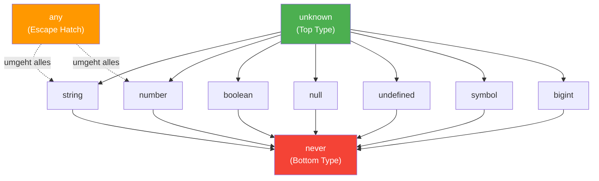

# Sektion 1: Das Typsystem im Ueberblick

> Geschaetzte Lesezeit: **10 Minuten**
>
> Vorherige Sektion: — (Start)
> Naechste Sektion: [02 - string, number, boolean](./02-string-number-boolean.md)

---

## Was du hier lernst

- Warum TypeScript-Typen zur Laufzeit **komplett verschwinden** (Type Erasure)
- Wie die **Typhierarchie** aufgebaut ist und warum das wichtig ist
- Den Unterschied zwischen **Compilezeit** und **Laufzeit** als fundamentales Denkmodell

---

## Das mentale Modell: Compilezeit vs Laufzeit

Bevor wir einen einzigen Typ anschauen, muessen wir das **wichtigste
Konzept** in TypeScript verstehen. Es ist so fundamental, dass alles
andere darauf aufbaut:

> **TypeScript-Typen existieren NUR zur Compilezeit. Zur Laufzeit sind
> sie komplett weg.**

Das nennt man **Type Erasure** (Typ-Loeschung). Wenn der TypeScript-Compiler
deinen Code in JavaScript umwandelt, werden **alle Typ-Annotationen entfernt**.
Was uebrig bleibt, ist normales JavaScript.

```typescript
// DAS schreibst du (TypeScript):
function addiere(a: number, b: number): number {
  return a + b;
}

// DAS wird ausgefuehrt (JavaScript nach Kompilierung):
function addiere(a, b) {
  return a + b;
}
// Die Typen ": number" sind VERSCHWUNDEN.
```

### Warum ist das so wichtig?

Weil es bedeutet, dass TypeScript eine **reine Compilezeit-Pruefung** ist.
Es ist wie ein extrem gruendlicher Lektor, der dein Buch vor dem Druck
auf Fehler prueft — aber der Lektor ist nicht mehr da, wenn das Buch im
Regal steht.

> **Praktische Konsequenz:**
> Daten von ausserhalb (APIs, `localStorage`, `JSON.parse`) haben
> KEINE TypeScript-Typen. Du musst sie SELBST validieren.

```typescript
// TypeScript kann das NICHT zur Laufzeit pruefen:
function istString(wert: unknown): boolean {
  // return typeof wert === "string";   <-- JavaScript-Pruefung (funktioniert)
  // return wert instanceof string;     <-- FALSCH! "string" ist keine Klasse
}

// Daten von ausserhalb (APIs, localStorage, JSON.parse) haben
// KEINE TypeScript-Typen. Du musst sie SELBST validieren.
const apiDaten = JSON.parse('{"name": "Max"}');
// apiDaten ist "any" — TypeScript kann nicht wissen was die API liefert.
```

Das ist der Grund, warum `unknown` so wichtig ist (dazu in Sektion 4):
Es zwingt dich, Laufzeit-Pruefungen zu schreiben fuer Daten, deren Typ
TypeScript nicht garantieren kann.

> 🧠 **Erklaere dir selbst:** Warum kann TypeScript nicht garantieren, welchen Typ `JSON.parse()` zurueckgibt? Was muesste passieren, damit TypeScript das koennte?
> **Kernpunkte:** JSON kommt von aussen (API, Datei) | Inhalt erst zur Laufzeit bekannt | TypeScript arbeitet nur zur Compile-Zeit | Loesung: Runtime-Validierung mit zod o.ae.

> 📖 **Hintergrund: Warum hat TypeScript dieses Design gewaehlt?**
>
> Anders Hejlsberg (Erfinder von TypeScript, aber auch von C# und Turbo Pascal)
> traf 2012 eine bewusste Designentscheidung: TypeScript sollte ein **Superset
> von JavaScript** sein, kein komplett neues Typsystem mit Laufzeit-Overhead.
> Der Grund? Adoption. Wenn TypeScript eigene Laufzeit-Konstrukte eingefuehrt
> haette (wie `enum`-Klassen oder Runtime-Type-Checks), waere es ein eigener
> Sprachstandard geworden — nicht einfach "JavaScript mit Typen".
>
> Das Ergebnis: TypeScript kompiliert zu **sauberem, lesbarem JavaScript**
> ohne Runtime-Bibliothek. Dein `tsc`-Output sieht aus wie handgeschriebenes JS.
> Diese Entscheidung ist der Hauptgrund, warum TypeScript sich so massiv
> durchgesetzt hat — im Gegensatz zu Alternativen wie Flow oder ReasonML,
> die aehnliche Ziele hatten aber weniger Adoption fanden.

**Merke dir dieses Bild:**

```
  +-----------------------------------------------------------+
  |              COMPILEZEIT (tsc prueft)                      |
  |                                                           |
  |  TypeScript-Typen existieren hier:                        |
  |  string, number, boolean, interfaces, type aliases...     |
  |                                                           |
  |  Der Compiler ENTFERNT alle Typen beim Kompilieren.       |
  +-----------------------------------------------------------+
  |              LAUFZEIT (Node.js / Browser fuehrt aus)       |
  |                                                           |
  |  Nur JavaScript-Werte existieren hier:                    |
  |  typeof === "string", "number", "boolean", "object"...    |
  |                                                           |
  |  KEIN TypeScript-Typ ist mehr vorhanden!                  |
  +-----------------------------------------------------------+
```

> 💭 **Denkfrage:** Wenn TypeScript-Typen zur Laufzeit nicht existieren,
> warum sind sie dann trotzdem so wertvoll?
>
> **Antwort:** Weil die meisten Fehler in der Entwicklung passieren,
> nicht erst in der Produktion. TypeScript faengt diese Fehler ab,
> BEVOR der Code ueberhaupt laeuft. Das ist wie eine
> Rechtschreibpruefung — sie verhindert Fehler, ohne im gedruckten
> Text sichtbar zu sein. Studien von Google und Microsoft zeigen, dass
> statische Typsysteme **etwa 15% aller Bugs** verhindern — das klingt
> wenig, ist aber enorm bei Projekten mit Millionen Zeilen Code.

> 🔍 **Tieferes Wissen: Die Ausnahme von Type Erasure**
>
> Es gibt **eine** Stelle, wo TypeScript doch Laufzeit-Code erzeugt:
> `enum`. Ein TypeScript `enum` wird zu einem JavaScript-Objekt kompiliert.
> Das ist einer der Gruende, warum manche Teams `enum` vermeiden und
> stattdessen Union Types mit `as const` verwenden — weil Union Types
> zu Type Erasure fuehren und keinen Laufzeit-Code generieren.
>
> ```typescript
> // enum erzeugt Laufzeit-Code:
> enum Direction { Up, Down }
> // wird zu: var Direction; (function(Direction) { ... })(Direction || ...)
>
> // Union + as const erzeugt KEINEN Laufzeit-Code:
> const Direction = { Up: 0, Down: 1 } as const;
> type Direction = typeof Direction[keyof typeof Direction]; // 0 | 1
> ```

---

## Die TypeScript-Typhierarchie

Jetzt, wo wir wissen, dass Typen ein Compilezeit-Konzept sind,
schauen wir uns an, wie sie zueinander stehen.
TypeScript hat eine klare Hierarchie:

```
                        unknown
              (Top Type — alles ist unknown zuweisbar)
           /     /    |    \     \       \
      string  number  boolean  symbol  bigint  null  undefined  ...
           \     \    |    /     /       /
                        never
              (Bottom Type — nichts ist never zuweisbar)
```

Die folgende Darstellung zeigt die Hierarchie als gerichteten Graphen — die
Pfeile zeigen die Richtung der **Zuweisbarkeit** (von oben nach unten):



**Leserichtung:** Ein Pfeil von A nach B bedeutet "A ist Supertyp von B"
(B kann an A zugewiesen werden). Also kann jeder `string` zu `unknown`
zugewiesen werden (aufwaerts), und `never` kann jedem Typ zugewiesen werden
(weil `never` Subtyp von allem ist).
Die gestrichelten Linien von `any` zeigen, dass `any` die Regeln bricht.

### Was bedeutet das?

- **`unknown`** ist der **Top Type**: Jeder Wert in TypeScript ist `unknown`
  zuweisbar. Es ist der allgemeinste Typ — wie eine Schachtel, in die
  alles hineinpasst.
- **`never`** ist der **Bottom Type**: `never` ist jedem Typ zuweisbar, aber
  nichts kann `never` zugewiesen werden. Es repraesentiert das "Unmoegliche".
- Die **primitiven Typen** (`string`, `number`, `boolean`, `symbol`, `bigint`)
  sitzen dazwischen.

> 📖 **Hintergrund: Top und Bottom Types in der Typentheorie**
>
> Die Begriffe "Top Type" und "Bottom Type" kommen aus der mathematischen
> Typentheorie. In der Mengenlehre waere `unknown` die **Menge aller Werte**
> (jeder Wert gehoert dazu) und `never` die **leere Menge** (kein Wert
> gehoert dazu, aber die leere Menge ist Teilmenge jeder anderen Menge —
> deshalb ist `never` jedem Typ zuweisbar).
>
> Andere Sprachen haben aehnliche Konzepte:
> - Java: `Object` (Top), kein expliziter Bottom Type
> - Scala: `Any` (Top), `Nothing` (Bottom)
> - Kotlin: `Any` (Top), `Nothing` (Bottom)
> - Rust: `!` (Bottom, "never type")

Und dann gibt es **`any`** — den Typ, der die Regeln bricht:

```
  any <--> ALLES    (any kann zu allem werden und alles kann any werden)
                     Das ist ein Escape-Hatch, keine Loesung!
```

`any` ist weder Top noch Bottom — es ist ein Typ, der das Typsystem
**komplett deaktiviert**. Stell dir `any` als den "Feueralarm-Hebel" vor:
Er existiert fuer Notfaelle, aber wenn du ihn im Alltag benutzt, hast du
ein ernstes Problem.

### Die Hierarchie in der Praxis

Diese Hierarchie ist nicht nur Theorie. Sie bestimmt, **was du wohin
zuweisen kannst**:

```typescript annotated
let x: unknown = "hallo";
// ^ unknown ist der Top-Type: alles kann zugewiesen werden
let y: unknown = 42;
// ^ Aufwaerts-Zuweisung (konkreter -> allgemeiner) funktioniert immer

// let a: string = x;
// ^ FEHLER! Abwaerts (allgemeiner -> konkreter) geht NICHT ohne Pruefung

if (typeof x === "string") {
// ^ Type Narrowing: TypeScript verengt den Typ durch die Pruefung
  let a: string = x;
// ^ Jetzt OK! Nach dem typeof-Check weiss TS: x ist string
}

function gibNever(): never { throw new Error("!"); }
// ^ never ist der Bottom-Type: die Funktion kehrt NIE zurueck
let s: string = gibNever();
// ^ OK -- wird aber nie ausgefuehrt (Code nach throw ist unerreichbar)
```

> ⚡ **Praxis-Tipp:** In Angular und React begegnest du der Hierarchie
> staendig. Zum Beispiel bei HTTP-Responses:
>
> ```typescript
> // Angular HttpClient gibt Observable<unknown> zurueck, wenn kein Typ angegeben:
> this.http.get('/api/users')  // Observable<Object> — muesste eigentlich gecastet werden
>
> // Besser: Typ angeben
> this.http.get<User[]>('/api/users')  // Observable<User[]>
> // Aber ACHTUNG: Das ist ein "Trust me, Compiler" — TypeScript prueft
> // nicht, ob die API wirklich User[] liefert!
> ```

### Zwischenzusammenfassung

| Konzept | Bedeutung | Merkregel |
|---|---|---|
| **Type Erasure** | Typen verschwinden zur Laufzeit | "Typen sind Tinte, die nach dem Drucken verschwindet" |
| **unknown** (Top) | Jeder Wert passt hinein | "Die groesste Schachtel" |
| **never** (Bottom) | Kein Wert passt hinein | "Die leere Menge" |
| **any** | Deaktiviert das Typsystem | "Der Feueralarm-Hebel" |
| **Compilezeit** | Wo TypeScript arbeitet | "Der Lektor vor dem Druck" |
| **Laufzeit** | Wo JavaScript laeuft | "Das Buch im Regal" |

---

## Was du gelernt hast

- TypeScript-Typen existieren **nur zur Compilezeit** und werden beim Kompilieren entfernt (Type Erasure)
- Die Typhierarchie hat `unknown` als Top Type und `never` als Bottom Type
- `any` steht ausserhalb der Hierarchie und deaktiviert das Typsystem
- Externe Daten (APIs, JSON.parse) haben keine TypeScript-Typen — du musst selbst validieren

> 🧠 **Erklaere dir selbst:** Was ist der Unterschied zwischen `unknown` (Top-Type) und `any`? Beide akzeptieren jeden Wert -- aber was passiert, wenn du danach auf Properties zugreifen willst?
> **Kernpunkte:** unknown erzwingt Pruefung vor Zugriff | any deaktiviert Typsystem komplett | any ist ansteckend | unknown ist sicher

**Kernkonzept zum Merken:** Type Erasure ist das fundamentalste Konzept in TypeScript. Wenn du jemals verwirrt bist, frage dich: "Existiert das zur Laufzeit?" — und die Antwort klaert fast alles.

> **Experiment:** Probiere folgendes im TypeScript Playground aus:
> ```typescript
> // Sicherer Weg: unknown erzwingt Pruefungen
> function verarbeite(wert: unknown): string {
>   if (typeof wert === "string") {
>     return wert.toUpperCase(); // OK — TypeScript weiss: wert ist string
>   }
>   return "kein String";
> }
>
> // Unsicherer Weg: any deaktiviert das Typsystem
> function verarbeiteUnsicher(wert: any): string {
>   return wert.toUpperCase(); // Kein Fehler — aber Laufzeitcrash bei Zahlen!
> }
> ```
> Aendere in `verarbeite` den Typ von `wert` von `unknown` auf `any`.
> Welche Fehlermeldungen verschwinden? Versuch danach `wert.nichtExistent()` aufzurufen
> — bei `any` kein Compilerfehler, bei `unknown` sofort rot. Was sagt dir das ueber
> die Sicherheitsgarantien des Typsystems?

---

> **Pausenpunkt** -- Guter Moment fuer eine Pause. Du hast das fundamentale
> Denkmodell verstanden, auf dem alles Weitere aufbaut.
>
> Weiter geht es mit: [Sektion 02: string, number, boolean](./02-string-number-boolean.md)
