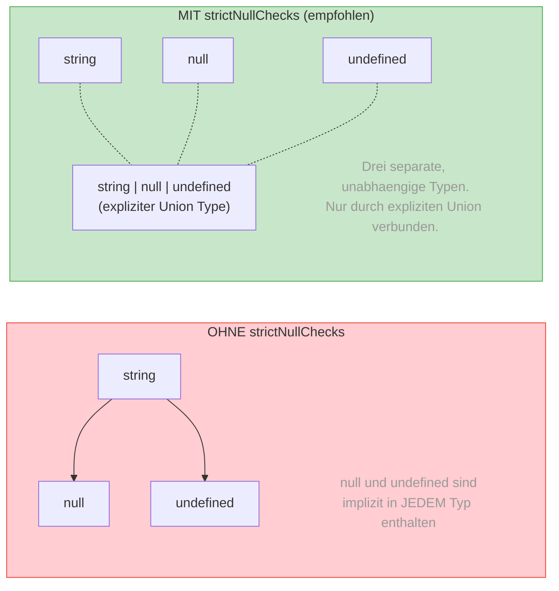

# Sektion 3: null und undefined — die Milliarden-Dollar-Geschichte

> Geschaetzte Lesezeit: **10 Minuten**
>
> Vorherige Sektion: [02 - string, number, boolean](./02-string-number-boolean.md)
> Naechste Sektion: [04 - any vs unknown](./04-any-vs-unknown.md)

---

## Was du hier lernst

- Die historischen Gruende, warum JavaScript **zwei** Typen fuer "kein Wert" hat
- Warum `strictNullChecks` die **wichtigste Compiler-Option** ist
- Der Unterschied zwischen `x?: string`, `x: string | undefined` und `x: string | null`

---

## Warum hat JavaScript zwei "Nichts"-Werte?

JavaScript (und damit TypeScript) hat **zwei** Typen fuer "kein Wert":

| | `undefined` | `null` |
|---|---|---|
| **Bedeutung** | "Wurde nie gesetzt" | "Wurde bewusst geleert" |
| **Default** | Nicht initialisierte Variablen | Muss explizit gesetzt werden |
| **typeof** | `"undefined"` | `"object"` (historischer Bug!) |
| **JSON** | Wird **entfernt** | Bleibt als `null` |

> 📖 **Hintergrund: Der "Billion Dollar Mistake"**
>
> Tony Hoare, ein britischer Informatiker, erfand 1965 den **Null-Zeiger**
> fuer die Sprache ALGOL W. Im Jahr 2009 hielt er eine beruehmte Rede,
> in der er dies seinen **"Billion Dollar Mistake"** nannte:
>
> *"I call it my billion-dollar mistake. It was the invention of the null
> reference in 1965. [...] I couldn't resist the temptation to put in a
> null reference, simply because it was so easy to implement."*
>
> Sein Argument: Null-Referenz-Fehler (NullPointerException in Java,
> "Cannot read property of null" in JavaScript) haben seither
> **Milliarden an Schaden** verursacht — in Form von Bugs, Crashes und
> Sicherheitsluecken.
>
> JavaScript hat das Problem sogar **verdoppelt**, indem es sowohl `null`
> als auch `undefined` hat. TypeScript's `strictNullChecks` ist der
> Versuch, Hoares Fehler nachtraeglich zu korrigieren.

> 📖 **Hintergrund: Warum ist typeof null === "object"?**
>
> Dieser Bug stammt aus der **allerersten JavaScript-Implementierung**
> von 1995. In der originalen Implementierung (von Brendan Eich in
> 10 Tagen geschrieben) wurden Werte als Tag + Daten gespeichert.
> Objekte hatten den Tag `0`, und `null` wurde als **Null-Pointer**
> (0x00) dargestellt. Da die Tag-Bits auch `0` waren, wurde `null`
> faelschlicherweise als Objekt erkannt.
>
> Dieser Bug wurde **nie gefixt**, weil zu viel existierender Code
> sich auf `typeof null === "object"` verlaesst. Ein Versuch, den Bug
> in ES2015 zu fixen, wurde abgelehnt — er haette zu viele Websites
> zerstoert.
>
> **Die praktische Konsequenz:**
> ```typescript
> // FALSCH: typeof-Check fuer Objekte fangen auch null:
> function process(value: unknown) {
>   if (typeof value === "object") {
>     value.toString(); // Error! value koennte null sein!
>   }
>   // RICHTIG:
>   if (typeof value === "object" && value !== null) {
>     value.toString(); // OK
>   }
> }
> ```

---

## strictNullChecks — dein Sicherheitsnetz

In der `tsconfig.json` gibt es die Option `strictNullChecks` (ist Teil
von `strict: true`, was du verwenden solltest):

```typescript
// MIT strictNullChecks (empfohlen, unser Standard):
let name: string = "Max";
name = null;       // Error! null ist nicht string zuweisbar
name = undefined;  // Error! undefined ist nicht string zuweisbar

// Man muss explizit erlauben:
let name2: string | null = "Max";
name2 = null;       // OK

let age: number | undefined = 25;
age = undefined;   // OK
```

**Ohne** `strictNullChecks` waere `null` und `undefined` **jedem Typ
zuweisbar** — ein Rezept fuer Laufzeitfehler.

> 🧠 **Erklaere dir selbst:** Was ist der Unterschied zwischen `x?: string`, `x: string | undefined` und `x: string | null`? In welchen Situationen wuerdest du welche Variante verwenden?
> **Kernpunkte:** x?: optional, Property darf fehlen | x: string|undefined: muss vorhanden sein, Wert kann undefined sein | x: string|null: bewusst "kein Wert" | JSON: null bleibt, undefined wird entfernt

> 🔍 **Tieferes Wissen: Was aendert strictNullChecks an der Typhierarchie?**
>
> Ohne `strictNullChecks` sind `null` und `undefined` **Subtypen** von
> allen anderen Typen. Das bedeutet: `string` schliesst implizit `null`
> und `undefined` ein. Das entspricht dem Verhalten von Java, C# (vor
> nullable reference types), und Python.
>
> Mit `strictNullChecks` werden `null` und `undefined` zu **eigenen,
> unabhaengigen Typen** in der Hierarchie. Das ist der fundamentale
> Unterschied:
>
> ```
> OHNE strictNullChecks:        MIT strictNullChecks:
>
>     string                        string    null    undefined
>     /    \                         |         |         |
>   null  undefined                (drei separate, unabhaengige Typen)
> ```
>
> TypeScript 2.0 (September 2016) fuehrte `strictNullChecks` ein. Es war
> einer der groessten Breaking Changes in der Geschichte der Sprache —
> und einer der wertvollsten.

Das folgende Diagramm zeigt die Auswirkung von `strictNullChecks` auf die
Typhierarchie als Vorher/Nachher-Vergleich:



**Kernaussage:** Ohne `strictNullChecks` kann JEDE Variable `null` sein —
du erfaehrst es erst zur Laufzeit. Mit der Option erzwingt TypeScript, dass
du `null` und `undefined` **explizit** deklarierst und **explizit** pruefst.

---

## Optionale Parameter vs null vs undefined

Hier liegt eine der subtilsten Unterscheidungen in TypeScript:

```typescript
// 1. Optional: Parameter kann FEHLEN (wird dann undefined)
function greet(name?: string) {
  console.log(name);  // string | undefined
}
greet();           // OK, name ist undefined
greet("Max");      // OK
greet(undefined);  // OK

// 2. Explizit undefined: Parameter MUSS uebergeben werden, kann undefined sein
function greet2(name: string | undefined) {
  console.log(name);  // string | undefined
}
// greet2();       // Error! Argument fehlt
greet2(undefined); // OK — aber du musst es explizit sagen
greet2("Max");     // OK

// 3. Explizit nullable: Parameter MUSS uebergeben werden, kann null sein
function greet3(name: string | null) {
  console.log(name);  // string | null
}
// greet3();       // Error! Argument fehlt
greet3(null);      // OK
greet3("Max");     // OK
```

> 💭 **Denkfrage:** Wann verwendet man welche Variante?
>
> **Antwort:**
> - `name?: string` — wenn der Parameter **komplett optional** ist
>   (der Aufrufer muss nicht mal daran denken)
> - `name: string | undefined` — wenn der Aufrufer **bewusst entscheiden**
>   muss, ob er einen Wert liefert (z.B. "Ich habe keinen Wert, aber
>   ich weiss das")
> - `name: string | null` — wenn `null` eine **semantische Bedeutung** hat
>   (z.B. "Der Wert existierte mal, ist aber jetzt geleert")

### Ein Praxis-Beispiel: Formulare in Angular/React

```typescript
// Angular Reactive Form: ein Feld kann initialisiert oder leer sein
interface FormState {
  vorname: string;                 // Pflichtfeld, immer gefuellt
  nachname: string;                // Pflichtfeld, immer gefuellt
  spitzname?: string;              // Optionales Feld, muss nicht existieren
  geloeschteEmail: string | null;  // Hatte mal einen Wert, bewusst geleert
}

// React: Props mit optionalen Werten
interface ButtonProps {
  label: string;                   // Pflicht
  icon?: string;                   // Optional — kein Icon noetig
  tooltip: string | null;          // Explizit: "hat keinen Tooltip"
}
```

---

## Nullish Coalescing (??) und Optional Chaining (?.)

Zwei Operatoren, die das Arbeiten mit `null`/`undefined` fundamental
vereinfachen. Beide wurden in ES2020 eingefuehrt.

### Nullish Coalescing (??)

```typescript
// ?? gibt den rechten Wert zurueck, wenn der linke null oder undefined ist
const port = config.port ?? 3000;
```

> **Die Falle: ?? vs ||**
>
> ```typescript
> // || gibt den rechten Wert bei ALLEN falsy-Werten:
> const port1 = config.port || 3000;
> // Wenn config.port === 0 → port1 ist 3000!   (0 ist falsy)
> // Wenn config.port === "" → port1 ist 3000!   ("" ist falsy)
>
> // ?? gibt den rechten Wert NUR bei null/undefined:
> const port2 = config.port ?? 3000;
> // Wenn config.port === 0 → port2 ist 0!       (0 ist nicht nullish)
> // Wenn config.port === "" → port2 ist ""!      ("" ist nicht nullish)
> ```
>
> **Faustregel:** Verwende immer `??` statt `||` fuer Default-Werte,
> ausser du willst bewusst alle falsy-Werte abfangen.

### Optional Chaining (?.)

```typescript
// ?. bricht die Kette ab, wenn ein Wert null/undefined ist
const street = user?.address?.street;  // string | undefined

// Funktioniert auch fuer Methodenaufrufe:
const length = array?.length;
const result = callback?.();

// Und fuer Index-Zugriffe:
const first = array?.[0];
```

### Nullish Assignment (??=)

```typescript
// Setze nur wenn null/undefined:
let name: string | null = null;
name ??= "Default";  // name ist jetzt "Default"

let port: number | undefined = 0;
port ??= 3000;       // port bleibt 0! (0 ist nicht nullish)
```

> ⚡ **Praxis-Tipp:** In Angular-Services und React-Hooks siehst du
> diese Operatoren ueberall:
>
> ```typescript
> // Angular: Service mit optionaler Konfiguration
> @Injectable()
> export class ApiService {
>   private baseUrl: string;
>
>   constructor(@Optional() config?: ApiConfig) {
>     this.baseUrl = config?.baseUrl ?? '/api';
>   }
> }
>
> // React: Hook mit optionalem Initialwert
> function useUser(id?: string) {
>   const user = useQuery(['user', id], () => fetchUser(id!), {
>     enabled: id != null,  // == null prueft null UND undefined
>   });
>   return user?.data ?? null;
> }
> ```

---

## == null vs === null — ein Sonderfall

```typescript
let x: string | null | undefined = getValue();

// == null prueft auf null UND undefined (manchmal gewollt):
if (x == null) { /* x ist null oder undefined */ }

// === null prueft NUR auf null:
if (x === null) { /* x ist nur null, nicht undefined */ }

// === undefined prueft NUR auf undefined:
if (x === undefined) { /* x ist nur undefined, nicht null */ }
```

> 🔍 **Tieferes Wissen: Warum == null eine Ausnahme ist**
>
> Normalerweise sollte man in JavaScript immer `===` statt `==` verwenden.
> Aber `x == null` ist die **einzige akzeptierte Ausnahme** — weil es
> sowohl `null` als auch `undefined` abfaengt, was fast immer das
> gewuenschte Verhalten ist.
>
> Viele Style Guides (darunter die von TypeScript selbst) erlauben
> `== null` explizit, auch wenn sie `==` sonst verbieten. Die ESLint-Regel
> `eqeqeq` hat dafuer die Option `"allow-null"`.

---

## Was du gelernt hast

- JavaScript hat **zwei** Werte fuer "nichts": `undefined` (nie gesetzt) und `null` (bewusst geleert)
- Tony Hoare nannte Null seinen **"Billion Dollar Mistake"** — TypeScript's `strictNullChecks` korrigiert das
- `typeof null === "object"` ist ein **Bug aus 1995**, der nie gefixt wird
- `??` vs `||`: Immer `??` fuer Default-Werte (ignoriert nur null/undefined, nicht 0/"")
- Drei Varianten: `x?: T` (optional), `x: T | undefined` (explizit), `x: T | null` (semantisch)

**Kernkonzept zum Merken:** `strictNullChecks` macht `null` und `undefined` zu eigenstaendigen Typen. Ohne diese Option ist TypeScript's Typsystem nur halb so wertvoll.

> **Experiment:** Probiere folgendes im TypeScript Playground aus:
> ```typescript
> // strictNullChecks ist standardmaessig aktiv (mit "strict": true)
> function gibLaenge(text: string): number {
>   return text.length;
> }
> // gibLaenge(null);  // Fehler mit strictNullChecks — entferne // und schau!
>
> // ?? vs || bei falsy-Werten
> const port1 = 0 || 3000;   // Was ist das Ergebnis? 3000 — 0 ist "falsy"!
> const port2 = 0 ?? 3000;   // Was ist das Ergebnis? 0 — ?? prueft nur null/undefined
>
> const text1 = "" || "default";  // "default"
> const text2 = "" ?? "default";  // ""
> ```
> Schalte im Playground unter "TS Config" die Option `strictNullChecks` aus.
> Welche Fehlermeldungen verschwinden, wenn du `gibLaenge(null)` aufrufst?
> Ersetze dann in der zweiten Haelfte `??` durch `||` bei `port2` —
> warum ist das bei einem Port-Default gefaehrlich?

---

> **Pausenpunkt** -- Du verstehst jetzt, warum JavaScript zwei "Nichts"-Werte
> hat und wie TypeScript dich vor den daraus entstehenden Fehlern schuetzt.
>
> Weiter geht es mit: [Sektion 04: any vs unknown](./04-any-vs-unknown.md)
