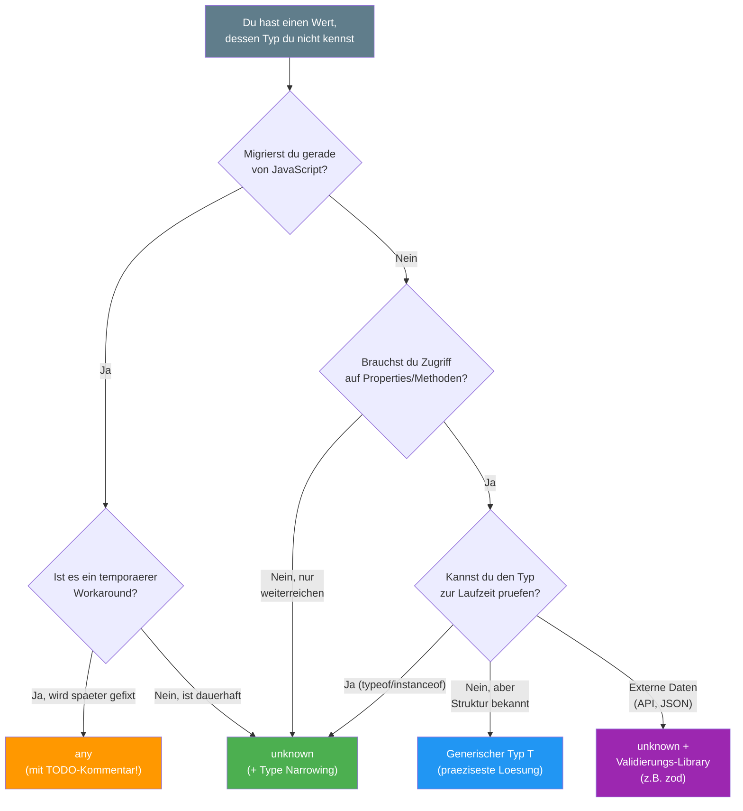

# Sektion 4: any vs unknown — die wichtigste Entscheidung

> Geschaetzte Lesezeit: **10 Minuten**
>
> Vorherige Sektion: [03 - null und undefined](./03-null-und-undefined.md)
> Naechste Sektion: [05 - never, void, symbol, bigint](./05-never-void-symbol-bigint.md)

---

## Was du hier lernst

- Warum `any` das Typsystem **komplett deaktiviert** und wie es sich ausbreitet
- Warum `unknown` erst in **TypeScript 3.0** eingefuehrt wurde — und was vorher war
- Wann `any` trotzdem akzeptabel ist (die Ausnahmen)

---

## any — der Notausgang

```typescript
let dangerous: any = "hallo";
dangerous.foo.bar.baz();   // Kein Error! TypeScript schaut nicht hin
dangerous = 42;
dangerous = true;
dangerous();               // Kein Error! Obwohl es ein boolean ist
```

`any` **deaktiviert das gesamte Typsystem** fuer diesen Wert. TypeScript
gibt auf und sagt: "Mach was du willst."

### Warum ist any gefaehrlich?

**Grund 1: Fehler wandern von Compilezeit zur Laufzeit**

Der ganze Sinn von TypeScript ist es, Fehler VOR der Ausfuehrung zu finden.
Mit `any` verlierst du diesen Vorteil komplett:

```typescript
const user: any = { name: "Max", age: 25 };
console.log(user.adress.street);  // Kein Compile-Error!
// Aber zur Laufzeit: "Cannot read property 'street' of undefined"
// Bemerkst du den Tippfehler? "adress" statt "address"
```

**Grund 2: any ist ansteckend**

Das ist das eigentlich Gefaehrliche. `any` breitet sich wie ein Virus aus:

```typescript
let x: any = "hallo";
let y = x.foo;      // y ist auch any!
let z = y + 1;      // z ist auch any!
let w = z.bar();    // w ist auch any!
// Die gesamte Kette ist jetzt unkontrolliert.
// Ein einziges "any" kann hunderte Variablen infizieren.
```

> 📖 **Hintergrund: Warum existiert any ueberhaupt?**
>
> Als TypeScript 2012 veroeffentlicht wurde, war das Hauptziel:
> **Migration bestehender JavaScript-Projekte**. Microsoft wollte,
> dass Teams ihre JavaScript-Codebases schrittweise umstellen koennen.
>
> Ohne `any` waere das unmoeglich gewesen. Stell dir ein Projekt mit
> 100.000 Zeilen JavaScript vor — wenn jede Zeile sofort strikt typisiert
> werden muesste, wuerde niemand migrieren. `any` war das Versprechen:
> "Du kannst anfangen und schrittweise verbessern."
>
> Das Problem: Viele Teams blieben beim "anfangen" stehen. `any` wurde
> nicht als Uebergangsloesung genutzt, sondern als Dauerzustand.
> TypeScript 3.0 fuehrte deshalb `unknown` als **sichere Alternative**
> ein — und der Community-Druck gegen `any` waechst seither staendig.

### any visuell verstanden

```
  Normales Typsystem:           Mit any:

  string ──x──> number          any ────> alles
  number ──x──> boolean         alles ──> any
  boolean ──x──> string
                                 Keine Pruefungen.
  Jede falsche Zuweisung         Keine Fehlermeldungen.
  wird sofort erkannt.           Keine Sicherheit.
```

---

## unknown — der sichere Weg

```typescript
let safe: unknown = "hallo";
safe.foo;              // Error! Erst pruefen!
safe();                // Error! Erst pruefen!
safe + 1;              // Error! Erst pruefen!

// Erst nach einer Pruefung (Type Narrowing) darfst du zugreifen:
if (typeof safe === "string") {
  console.log(safe.toUpperCase());  // OK! TypeScript weiss: es ist string
}

if (typeof safe === "number") {
  console.log(safe.toFixed(2));     // OK! TypeScript weiss: es ist number
}
```

### Die Sicherheitsanalogie

Stell dir vor, du bekommst ein Paket geliefert:

- **`any`** = "Oeffne das Paket nicht, nimm einfach an es ist ein
  Kuchen und iss es." — Vielleicht ist es Sprengstoff.
- **`unknown`** = "Du hast ein Paket, aber oeffne und pruefe es
  erst, bevor du damit arbeitest." — Sicher und verantwortungsvoll.

Oder anders gesagt:
- **`any`** = "Ich schliesse die Augen und renne los."
- **`unknown`** = "Ich schaue erst, bevor ich laufe."

> 📖 **Hintergrund: Warum kam unknown erst in TypeScript 3.0 (Juli 2018)?**
>
> Vor TypeScript 3.0 gab es **keine sichere Alternative** zu `any`.
> Wenn du einen Wert hattest, dessen Typ du nicht kanntest (z.B.
> `JSON.parse()`, API-Antworten, `catch`-Bloecke), war `any` die
> einzige Option.
>
> Das TypeScript-Team erkannte, dass `any` zu haeufig verwendet wurde,
> weil es keine Alternative gab — nicht weil Entwickler unsicheren Code
> wollten. Ryan Cavanaugh (Lead Developer von TypeScript) beschrieb
> `unknown` als "the type-safe counterpart of any".
>
> Seit TypeScript 3.0 gibt es keinen Grund mehr, `any` fuer "ich weiss
> den Typ nicht" zu verwenden. Der einzige verbleibende Grund fuer `any`
> ist "ich will, dass TypeScript diesen Code nicht prueft" — und das
> sollte extrem selten sein.
>
> **Fun Fact:** TypeScript 4.4 fuehrte dann `useUnknownInCatchVariables`
> ein (und es wurde Teil von `strict` ab 4.4), was `catch (error)` von
> `any` zu `unknown` aenderte. Das war der letzte grosse Schritt weg
> von implizitem `any`.

---

## Entscheidungsbaum: any oder unknown?

Wenn du unsicher bist, welchen Typ du verwenden sollst, folge diesem
Entscheidungsbaum:



**Faustregel:** Der gruene Pfad (`unknown`) ist in 90% der Faelle richtig.
Der orangene Pfad (`any`) ist nur bei aktiver Migration akzeptabel — und
auch dann nur mit einem `// TODO:`-Kommentar.

---

## Vergleich auf einen Blick

| Eigenschaft | `any` | `unknown` |
|---|---|---|
| Alles zuweisbar? | Ja | Ja |
| Zuweisbar an andere Typen? | Ja (!) | Nein (nur nach Pruefung) |
| Properties zugreifen? | Ja (unsicher) | Nein (erst pruefen) |
| Funktionsaufrufe? | Ja (unsicher) | Nein (erst pruefen) |
| Ansteckend? | **Ja!** | **Nein** |
| Sicher? | **Nein** | **Ja** |
| Empfohlen? | **Nein** | **Ja** |
| Eingefuehrt in | TypeScript 1.0 (2014) | TypeScript 3.0 (2018) |

---

## Type Narrowing: unknown nutzbar machen

`unknown` allein ist nutzlos — du kannst nichts damit tun. Aber
das ist der Punkt: es **zwingt** dich, den Typ zu pruefen. Das
nennt man **Type Narrowing** (Typ-Einengung):

```typescript annotated
function verarbeite(wert: unknown): string {
// ^ wert ist unknown -- wir wissen NICHTS ueber den Typ
  if (typeof wert === "string") {
// ^ Type Narrowing: nach diesem Check weiss TS, dass wert ein string ist
    return wert.toUpperCase();
// ^ Sicher! TS hat wert zu string verengt
  }
  if (typeof wert === "number") {
    return wert.toFixed(2);
// ^ Sicher! TS hat wert zu number verengt
  }
  if (wert instanceof Date) {
// ^ instanceof prueft die Prototyp-Kette (funktioniert nur mit Klassen)
    return wert.toISOString();
  }
  if (typeof wert === "object" && wert !== null && "name" in wert) {
// ^ Drei Checks kombiniert: ist Objekt, nicht null, hat "name" Property
    return String((wert as { name: unknown }).name);
  }
  return "unbekannt";
}
```

> 🔍 **Tieferes Wissen: Die Narrowing-Techniken**
>
> TypeScript versteht mehrere Arten von Pruefungen als Narrowing:
>
> | Technik | Syntax | Ergebnis |
> |---|---|---|
> | typeof | `typeof x === "string"` | Primitiv-Pruefung |
> | instanceof | `x instanceof Date` | Klassen-Pruefung |
> | in | `"name" in x` | Property-Existenz |
> | Equality | `x === null` | Exakter Wert |
> | Truthiness | `if (x)` | Nicht-falsy |
> | Type Predicate | `function isX(v): v is X` | Eigene Pruefung |
>
> Type Predicates werden in Lektion 10 (Type Guards) vertieft.

---

## Wann ist any akzeptabel?

Fast nie. Aber es gibt echte Ausnahmen:

### 1. Migration von JavaScript zu TypeScript (temporaer!)

```typescript
// Waehrend der Migration: any als Uebergang
// TODO: Typ definieren nach Migration
const legacyConfig: any = require('./old-config');
```

### 2. Bewusste Typ-Assertion (sehr selten)

```typescript
// Wenn du TypeScript's Typchecker austricksen musst:
// z.B. bei Test-Mocks oder bewusst ungueltigem Input
const mockService = {
  getUser: () => ({ id: 1, name: "Test" })
} as any as UserService;
```

### 3. Generische Typ-Constraints (fortgeschritten)

```typescript
// Manchmal brauchst du any in generischen Helper-Funktionen:
type AnyFunction = (...args: any[]) => any;
// Das ist akzeptabel, weil es als Constraint dient, nicht als Wert-Typ
```

**Faustregel:** Wenn du `any` schreibst, ist das ein **Code Smell**.
Ueberlege immer zuerst, ob `unknown`, ein generischer Typ oder ein
konkreter Typ besser passt.

> ⚡ **Praxis-Tipp: any in Angular/React aufspueren**
>
> ```bash
> # Finde alle "any"-Verwendungen in deinem Projekt:
> grep -rn ": any" src/ --include="*.ts" --include="*.tsx"
>
> # Oder in der tsconfig.json strenger werden:
> {
>   "compilerOptions": {
>     "noImplicitAny": true,          // Fehler wenn Typ als any inferiert wird
>     "useUnknownInCatchVariables": true  // catch-Variable ist unknown statt any
>   }
> }
> ```
>
> Die Compiler-Option `noImplicitAny` (Teil von `strict: true`) verbietet
> nicht explizites `any`. Du kannst aber trotzdem `any` explizit schreiben —
> was die bewusste Entscheidung dokumentiert.

---

## Die any-Infektionskette in der Praxis

Ein realistisches Beispiel, wie `any` ein ganzes Feature unsicher macht:

```typescript
// Schritt 1: Eine Funktion gibt any zurueck (z.B. JSON.parse)
const response: any = JSON.parse(apiResponse);

// Schritt 2: Du greifst auf Properties zu — alles ist any
const users = response.data.users;     // any
const firstUser = users[0];            // any
const name = firstUser.name;           // any
const upperName = name.toUpperCase();  // any (!!!)

// Schritt 3: Du uebergibst any an andere Funktionen
function saveUser(user: User): void { /* ... */ }
saveUser(firstUser);  // KEIN ERROR! any passt ueberall rein

// Zur Laufzeit: firstUser koennte null sein,
// koennte ein String sein, koennte ein Array sein.
// TypeScript hat aufgegeben, das zu pruefen.
```

**Die sichere Alternative:**

```typescript
// Mit unknown:
const response: unknown = JSON.parse(apiResponse);

// TypeScript ERZWINGT jetzt Pruefungen:
if (
  typeof response === "object" && response !== null &&
  "data" in response &&
  typeof (response as any).data === "object"  // hier ist as any OK: einmalig, kontrolliert
) {
  // Ab hier hast du einen validierten Zugriffspfad
}

// NOCH BESSER: Eine Validierungs-Library wie zod verwenden:
import { z } from "zod";
const UserSchema = z.object({ name: z.string(), age: z.number() });
const user = UserSchema.parse(JSON.parse(apiResponse));
// user ist jetzt typsicher: { name: string, age: number }
```

---

## Was du gelernt hast

- `any` **deaktiviert** das Typsystem und ist **ansteckend** — es infiziert alle abhaengigen Variablen
- `unknown` ist die **sichere Alternative**: gleich flexibel beim Zuweisen, aber erzwingt Pruefungen
- `unknown` wurde in TypeScript 3.0 (2018) eingefuehrt, weil `any` zu haeufig missbraucht wurde
- Type Narrowing (`typeof`, `instanceof`, `in`) macht `unknown` nutzbar
- `any` ist nur in Ausnahmen akzeptabel: Migration, bewusste Assertions, generische Constraints

> 🧠 **Erklaere dir selbst:** Warum ist `any` "ansteckend"? Wenn du `let x: any = ...` schreibst und dann `let y = x.foo` -- welchen Typ hat `y`? Und was passiert mit `z = y + 1`?
> **Kernpunkte:** any propagiert durch Property-Zugriffe | Jede abhaengige Variable wird auch any | Ein einziges any kann hunderte Variablen infizieren | unknown stoppt die Kette

**Kernkonzept zum Merken:** `any` ist ein Escape-Hatch, `unknown` ist eine Loesung. Wenn du `any` schreibst, dokumentierst du: "Ich verzichte hier bewusst auf Typsicherheit."

> **Experiment:** Probiere folgendes im TypeScript Playground aus:
> ```typescript
> // Die Infektionskette mit any
> let quelle: any = { name: "Max", alter: 25 };
> let name = quelle.name;   // Typ: any (nicht string!)
> let laenge = name.length; // Typ: any — kein Fehler, auch wenn name keine Zahl waere
> let ergebnis = laenge + 1; // Typ: any — die Kette geht weiter
>
> // Dieselbe Kette mit unknown — sicher
> let safe: unknown = { name: "Max", alter: 25 };
> // let nameUnsafe = safe.name; // Fehler! Entferne // und schau
> if (typeof safe === "object" && safe !== null && "name" in safe) {
>   const nameTyped = (safe as { name: string }).name; // Jetzt OK
> }
> ```
> Aendere `safe` von `unknown` auf `any`. Welche Fehlermeldungen verschwinden?
> Schreibe dann `safe.nichtExistiert.tief.verschachtelt` — bei `any` kein
> Compilerfehler, aber ein Laufzeitcrash. Welche Variante wuerdest du in
> einem Produktionsprojekt fuer API-Antworten verwenden, und warum?

---

> **Pausenpunkt** -- Du kennst jetzt die wichtigste Entscheidung in
> TypeScript: any vs unknown. Ab hier kommen die spezialisierten Typen.
>
> Weiter geht es mit: [Sektion 05: never, void, symbol, bigint](./05-never-void-symbol-bigint.md)
