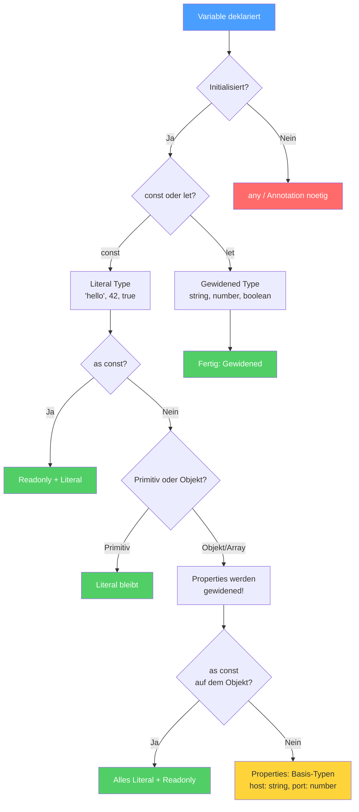

# Sektion 3: Wie Inference funktioniert

**Geschaetzte Lesezeit:** ~12 Minuten

## Was du hier lernst

- Die sechs konkreten Regeln, nach denen TypeScript Typen ableitet
- Wie du den inferierten Typ **vorhersagen** kannst, bevor du mit der Maus hoverst
- Was "Best Common Type" wirklich macht -- und warum es keine Klassen-Hierarchie nutzt
- Wie Generic Inference funktioniert und wo ihre Grenzen liegen

---

## Denkfragen fuer diese Sektion

1. **Warum bildet Best Common Type eine Union statt den gemeinsamen Vorfahren in einer Klassen-Hierarchie zu suchen?**
2. **Warum "widened" TypeScript den Typ eines Generic-Parameters, wenn dieser an einer aenderbaren Position verwendet wird?**

---

## Der Inference-Entscheidungsbaum

Bevor wir die einzelnen Regeln durchgehen, hier der Gesamtueberblick als Diagramm. Dieses Flowchart zeigt dir, wie TypeScript fuer **jede Variable** den Typ bestimmt:



> **Lesehinweis:** Gruene Endknoten = Typ steht fest. Gelber Knoten = Ueberraschung (Properties werden gewidened trotz `const`). Roter Knoten = Annotation noetig.

Komm nach den einzelnen Regeln auf dieses Diagramm zurueck -- es wird dann viel klarer.

---

## Inference ist kein Raten -- es ist ein Algorithmus

Der TypeScript-Compiler inferiert Typen nicht durch Magie oder Heuristik. Es ist ein **deterministischer Algorithmus mit klaren Regeln**. Wenn du diese Regeln kennst, kannst du fuer jede Zeile Code den Typ vorhersagen, **bevor** du hoverst.

Denk an den Detektiv aus Sektion 1: Er hat ein festes Regelwerk, nicht nur Bauchgefuehl. Hier sind seine Regeln.

---

## Regel 1: Variable Initialization -- Typ aus dem Wert

Die einfachste Regel: Der Typ des Initialwerts bestimmt den Typ der Variable.

```typescript
let x = 3 + 4;        // number + number = number  -->  x: number
let y = "a" + "b";    // string + string = string  -->  y: string
let z = true && false; // boolean && boolean        -->  z: boolean
```

Das gilt auch fuer komplexere Ausdruecke:

```typescript
let result = Math.random() > 0.5 ? "yes" : "no";
// Ternary mit zwei Strings  -->  result: string

let parsed = parseInt("42");
// parseInt gibt number zurueck  -->  parsed: number
```

> **Merke:** Bei `const` wird diese Regel **verfeinert** -- dort bekommst du Literal Types statt Basis-Types. Das ist "Widening" und wird in Sektion 4 detailliert behandelt.

---

## Regel 2: Best Common Type -- gemeinsamer Typ fuer mehrere Werte

Wenn TypeScript mehrere Werte zu einem Typ zusammenfassen muss (Arrays, Ternaries, Return-Pfade), sucht es den **engsten gemeinsamen Typ**.

### Was "engster gemeinsamer Typ" bedeutet

TypeScript bildet die **Union aller vorhandenen Typen**. Es sucht **nicht** nach einem gemeinsamen Vorfahren in einer Klassen-Hierarchie:

```typescript
let mixed = [1, "hello", true];
// TS bildet: number | string | boolean
// Ergebnis: (number | string | boolean)[]

let numbers = [1, 2, 3];
// Alle Werte sind number
// Ergebnis: number[]

let withNull = [1, null, 3];
// Ergebnis: (number | null)[]
```

### Warum keine Klassen-Hierarchie?

Viele Entwickler erwarten, dass TypeScript bei Klassen den gemeinsamen Vorfahren findet. Das tut es **nicht**:

```typescript
class Animal { name = ""; }
class Dog extends Animal { bark() {} }
class Cat extends Animal { meow() {} }

const pets = [new Dog(), new Cat()];
// Typ: (Dog | Cat)[]  --  NICHT Animal[]!
```

> **Hintergrund:** Warum nicht `Animal[]`? Weil TypeScript **strukturell** typisiert, nicht nominell. Es gibt keine eingebaute "Klassen-Hierarchie-Suche". Der Compiler nimmt exakt die Typen, die tatsaechlich im Array vorkommen, und bildet deren Union. Das ist praeziser: `(Dog | Cat)[]` sagt dir mehr als `Animal[]`, weil du weisst, dass **nur** Hunde und Katzen drin sind.

Wenn du `Animal[]` willst, musst du es explizit annotieren:

```typescript
const pets: Animal[] = [new Dog(), new Cat()];
// Jetzt ist es Animal[] -- weniger praezise, aber manchmal gewuenscht
```

### Best Common Type bei Ternaries

```typescript
function getResult(success: boolean) {
  return success ? { data: [1, 2, 3] } : { error: "failed" };
}
// Return-Typ: { data: number[]; error?: undefined }
//           | { error: string; data?: undefined }
```

TypeScript bildet hier eine Discriminated Union -- **nicht** einen gemeinsamen Objekt-Typ wie `{ data?: number[]; error?: string }`. Das ist praeziser und ermoeglicht besseres Narrowing spaeter.

---

## Regel 3: Return Type Inference -- Typ aus allen Return-Pfaden

TypeScript analysiert **alle moeglichen Return-Pfade** einer Funktion und bildet die Union:

```typescript
function transform(x: number) {
  if (x > 0) return x.toString();  // Pfad 1: string
  if (x === 0) return null;         // Pfad 2: null
  return undefined;                  // Pfad 3: undefined
}
// Return-Typ: string | null | undefined
```

### Wann das problematisch wird

```typescript
function parseValue(input: string) {
  if (input === "true") return true;
  if (input === "false") return false;
  if (!isNaN(Number(input))) return Number(input);
  return input;
}
// Return-Typ: string | number | boolean
// Ist das gewollt? Wahrscheinlich nicht.
```

> **Praxis-Tipp:** Wenn der inferierte Return-Typ mehr als 3 Mitglieder in der Union hat, ist das ein Signal: Entweder du **annotierst** den Return-Typ explizit (um die Intention zu dokumentieren) oder du **vereinfachst** die Funktion.

### Die Regel fuer `void`

Wenn eine Funktion keinen `return`-Wert hat (oder `return;` ohne Wert), inferiert TS `void`:

```typescript
function logMessage(msg: string) {
  console.log(msg);
  // Kein return  -->  Return-Typ: void
}
```

---

## Regel 4: Contextual Typing -- Typ aus dem Kontext

Bei Contextual Typing fliesst die Typ-Information **von aussen nach innen** -- das Gegenteil der normalen Inference:

```
Normale Inference:    Wert --> Typ --> Variable  (von innen nach aussen)
Contextual Typing:    Kontext --> Variable --> Wert  (von aussen nach innen)
```

```typescript
// Normale Inference: Typ fliesst vom Wert nach aussen
const x = 42;  // Wert 42  -->  Typ number  -->  Variable x

// Contextual Typing: Typ fliesst vom Kontext nach innen
const nums = [1, 2, 3];
nums.map(n => n * 2);
//        ^-- nums ist number[]  -->  map erwartet (n: number) => ...
//            -->  n ist automatisch number
```

Contextual Typing wird in Sektion 5 ausfuehrlich behandelt. Hier nur der Ueberblick: Es funktioniert bei **Callback-Parametern**, **Event-Listenern**, **Variable mit annotiertem Typ** und **Return-Statements** bei annotiertem Return-Typ.

---

## Regel 5: Generic Inference -- Typ-Parameter aus Argumenten

TypeScript kann Generic-Typ-Parameter aus den uebergebenen Argumenten ableiten:

```typescript
function identity<T>(value: T): T {
  return value;
}

identity("hello");  // T wird als string inferiert
identity(42);       // T wird als number inferiert
```

### Wie die Inference bei Generics funktioniert

TypeScript geht in drei Schritten vor:

**Schritt 1: Kandidaten sammeln.** Fuer jeden Typ-Parameter sammelt TS "Kandidaten" aus den Argumenten:

```typescript
function merge<T>(a: T, b: T): T {
  return Math.random() > 0.5 ? a : b;
}

merge("hello", "world");
// Kandidaten fuer T: "hello", "world"  -->  T = string
```

**Schritt 2: Bei mehreren Kandidaten -- Union bilden:**

```typescript
merge("hello", 42);
// Kandidaten fuer T: string, number  -->  T = string | number
```

**Schritt 3: Constraints pruefen (`extends`):**

```typescript
function first<T extends { length: number }>(items: T): T {
  return items;
}

first("hello");       // T = "hello", hat .length  -->  OK
first([1, 2, 3]);     // T = number[], hat .length  -->  OK
first(42);            // FEHLER: number hat kein .length
```

### Wo Generic Inference an Grenzen stoesst

```typescript
function createPair<T, U>(first: T, second: U): [T, U] {
  return [first, second];
}

// Das funktioniert perfekt:
createPair("hello", 42);  // T = string, U = number

// Aber manchmal ist die Inference zu breit:
function createState<T>(initial: T): { value: T; set: (v: T) => void } {
  let value = initial;
  return { value, set: (v) => { value = v; } };
}

const state = createState("loading");
// T = string  -->  state.set akzeptiert jeden String!
// Wenn du nur "loading" | "success" | "error" willst, musst du:
const state2 = createState<"loading" | "success" | "error">("loading");
```

> **Tieferes Wissen:** Die Generic Inference hat eine interessante Asymmetrie. Bei `identity<T>(value: T)` inferiert TS den Literal-Typ `"hello"`. Bei `createState<T>(initial: T)` inferiert es `string`. Der Unterschied: Wenn T an einer **aenderbaren** Position verwendet wird (wie `set: (v: T) => void`), "widened" TS den Typ automatisch, weil es annimmt, du wirst verschiedene Werte uebergeben wollen.

---

## Regel 6: Control Flow Analysis -- Typ aendert sich im Verlauf

TypeScript verfolgt den Code-Fluss und **verengt (narrowt) Typen** basierend auf Bedingungen. Das ist keine separate Phase -- es passiert waehrend der gesamten Analyse:

```typescript
function process(value: string | number) {
  // Hier ist value: string | number

  if (typeof value === "string") {
    // Hier ist value: string  --  TS hat den Typ verengt!
    console.log(value.toUpperCase());
  } else {
    // Hier ist value: number  --  der einzig verbleibende Typ
    console.log(value.toFixed(2));
  }

  // Hier ist value wieder: string | number
}
```

Control Flow Analysis wird in Sektion 5 ausfuehrlich behandelt, weil es eng mit Contextual Typing zusammenhaengt. Dort lernst du alle Narrowing-Guards und ihre Grenzen kennen.

---

## Zusammenfassung: Die sechs Regeln auf einen Blick

```
+---------------------------+------------------------------------------+
| Regel                     | Was passiert                             |
+---------------------------+------------------------------------------+
| 1. Initialization         | Typ aus dem Wert                         |
| 2. Best Common Type       | Union aller vorhandenen Typen            |
| 3. Return Type Inference  | Union aller Return-Pfade                 |
| 4. Contextual Typing      | Typ fliesst von aussen nach innen        |
| 5. Generic Inference      | Typ-Parameter aus Argumenten             |
| 6. Control Flow Analysis  | Typ verengt sich nach Bedingungen        |
+---------------------------+------------------------------------------+
```

> **Denkfrage:** Gegeben diesen Code -- welche Regel(n) greifen?
> ```typescript
> const items = [1, "hello", null];
> const first = items[0];
> items.filter(x => x !== null).map(x => x.toString());
> ```
> Antwort: Zeile 1 = Best Common Type (`(number | string | null)[]`). Zeile 2 = Initialization (aus dem Typ von `items[0]`). Zeile 3 = Contextual Typing (Parameter von `filter` und `map`) + Control Flow (`.filter()` **narrowt hier NICHT automatisch** -- dafuer brauchst du ein Type Predicate, ein Thema fuer spaetere Lektionen).

---

## Experiment-Box: Regeln in Aktion beobachten

> **Experiment:** Oeffne `examples/02-type-inference.ts` und probiere:
>
> 1. Schreibe `const items = [1, "hello", null];` und hovere. Welche Regel greift? (Best Common Type)
> 2. Schreibe eine Funktion mit zwei Return-Pfaden und hovere ueber den Funktionsnamen. Stimmt die Union?
> 3. Schreibe `[1,2,3].map(n => n.toString())` und hovere ueber `n` -- woher kommt der Typ? (Contextual Typing)
> 4. Schreibe `function id<T>(x: T) { return x; }` und rufe `id("hello")` auf -- was wird `T`?

---

## Rubber-Duck-Prompt

Erklaere einem imaginaeren Kollegen:
- Was ist der Unterschied zwischen "Best Common Type" und einer Klassen-Hierarchie-Suche?
- Warum ergibt `[new Dog(), new Cat()]` den Typ `(Dog | Cat)[]` und nicht `Animal[]`?

Wenn du das erklaeren kannst, hast du das strukturelle Typsystem verstanden.

---

## Was du gelernt hast

- Inference folgt **sechs konkreten Regeln** -- kein Raten, kein Zufall
- **Best Common Type** bildet Unions, nicht Klassen-Hierarchien
- **Return Type Inference** analysiert alle Pfade und bildet deren Union
- **Generic Inference** sammelt Kandidaten aus Argumenten und widened bei aenderbaren Positionen
- Du kannst den inferierten Typ **vorhersagen**, wenn du die Regeln kennst

---

**Pausenpunkt.** Wenn du bereit bist, geht es weiter mit [Sektion 4: Widening und const](./04-widening-und-const.md) -- dort lernst du, warum `let` und `const` verschiedene Typen produzieren und wie `as const` das Verhalten steuert.
