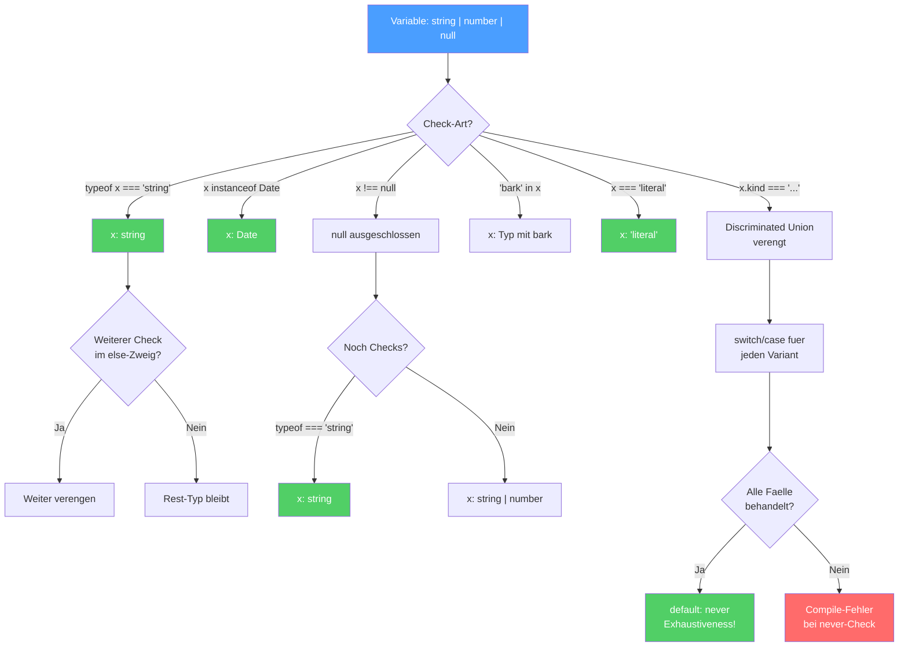

# Sektion 5: Contextual Typing und Control Flow Analysis

**Geschaetzte Lesezeit:** ~12 Minuten

## Was du hier lernst

- Wie Contextual Typing Typ-Information "rueckwaerts" fliessen laesst
- Warum getrennt definierte Callbacks den Kontext verlieren -- und wie du es vermeidest
- Wie Control Flow Analysis Typen im Verlauf deines Codes verengt
- Alle Narrowing-Guards und ihre Grenzen
- Warum Narrowing nicht ueber Funktionsgrenzen hinweg funktioniert

---

## Denkfragen fuer diese Sektion

1. **Warum verliert ein separat definierter Callback seinen Contextual Typing-Kontext?**
2. **Warum narrowt TypeScript NICHT in Closures, die asynchron ausgefuehrt werden?**
3. **Was ist der Unterschied zwischen Contextual Typing und normaler Inference -- in welche Richtung fliesst die Typ-Information?**

---

## Control Flow Narrowing -- das Gesamtbild

Bevor wir ins Detail gehen, hier das Gesamtbild als Flowchart. So "denkt" TypeScript, wenn es einen Typ durch Code-Fluss verengt:



> **Lesehinweis:** Jeder Pfeil zeigt, wie ein Check den Typ Schritt fuer Schritt verengt. Die gruenen Endknoten sind die Stellen, wo TypeScript den exakten Typ kennt.

---

## Contextual Typing: Typen von aussen nach innen

In Sektion 3 hast du gelernt, dass Contextual Typing die Richtung umkehrt: Statt "Wert bestimmt Typ" bestimmt der **Kontext** den Typ.

### Die Analogie: Stellenausschreibung

Normale Inference ist wie ein Lebenslauf: "Ich bin Max, ich kann X und Y" -- der Bewerber definiert sich selbst.

Contextual Typing ist wie eine Stellenausschreibung: "Wir suchen jemanden, der X kann" -- die Stelle definiert, was der Bewerber koennen muss.

```typescript
// "Stellenausschreibung": .map() auf number[] sucht (n: number) => ...
const nums = [1, 2, 3];
nums.map(n => n * 2);
//        ^-- n bekommt den Typ aus der "Stellenausschreibung"
```

---

## Wo Contextual Typing funktioniert

### 1. Callback-Parameter bei Array-Methoden

```typescript
const users = [
  { name: "Max", age: 30 },
  { name: "Anna", age: 25 },
];

// TS weiss: users ist { name: string; age: number }[]
// Also ist 'user' in jedem Callback automatisch { name: string; age: number }
users
  .filter(user => user.age > 18)
  .map(user => user.name)
  .sort((a, b) => a.localeCompare(b));
// Kein einziger Parameter musste annotiert werden!
```

### 2. Event-Listener

```typescript
document.addEventListener("click", (event) => {
  // event ist automatisch MouseEvent!
  console.log(event.clientX, event.clientY);
});

document.addEventListener("keydown", (event) => {
  // event ist automatisch KeyboardEvent!
  console.log(event.key);
});
```

> **Hintergrund:** Wie weiss TypeScript, dass ein "click"-Event ein `MouseEvent` produziert? Die Antwort liegt in den **Overload-Signaturen** von `addEventListener`. In `lib.dom.d.ts` gibt es Hunderte von Overloads wie:
> ```typescript
> addEventListener(type: "click", listener: (ev: MouseEvent) => any): void;
> addEventListener(type: "keydown", listener: (ev: KeyboardEvent) => any): void;
> ```
> Der String `"click"` wird als Literal-Typ matched, und daraus folgt der Event-Typ. Deshalb funktioniert `"click"` perfekt, aber `let eventName = "click"; addEventListener(eventName, ...)` gibt dir nur ein generisches `Event` -- weil `eventName` den Typ `string` hat (Widening!), nicht `"click"`.

### 3. Variable mit annotiertem Typ

```typescript
const handler: (event: MouseEvent) => void = (event) => {
  // event ist MouseEvent -- aus der Annotation links
  console.log(event.clientX);
};
```

### 4. Objekt-Literale die einem Interface zugewiesen werden

```typescript
interface Config {
  onSuccess: (data: string[]) => void;
  onError: (error: Error) => void;
}

const config: Config = {
  onSuccess: (data) => {
    // data ist string[]  --  aus Config inferiert
    console.log(data.length);
  },
  onError: (error) => {
    // error ist Error  --  aus Config inferiert
    console.log(error.message);
  },
};
```

### 5. Return-Statements bei annotiertem Return-Typ

```typescript
function createHandler(): (event: MouseEvent) => void {
  return (event) => {
    // event ist MouseEvent -- aus dem Return-Typ der aeusseren Funktion
    console.log(event.clientX);
  };
}
```

---

## Wann Contextual Typing NICHT funktioniert

### Die groesste Falle: Separate Callback-Definitionen

```typescript
// KEIN Contextual Typing -- handler wird isoliert definiert
const handler = (event) => {
  console.log(event.clientX);  // event ist 'any'!
};
document.addEventListener("click", handler);
```

> 🧠 **Erklaere dir selbst:** Warum verliert ein separat definierter Callback seinen Typ-Kontext? Was bedeutet es, dass TypeScript "lokal" analysiert? Und warum funktioniert ein Inline-Callback, aber eine Variable davor nicht?
> **Kernpunkte:** TypeScript analysiert Zeile fuer Zeile | Bei separater Definition fehlt der Kontext | Inline: Ziel-Typ ist bekannt | Loesung: inline oder explizit annotieren

**Warum verliert der Kontext sich?** TypeScript analysiert **lokal**, Zeile fuer Zeile. Wenn du `const handler = (event) => ...` schreibst, hat TS an dieser Stelle keine Information darueber, dass `handler` spaeter als Click-Handler verwendet wird. Die Verbindung entsteht erst in der naechsten Zeile -- aber da ist der Typ von `handler` schon festgelegt.

```typescript
// Drei Loesungen:

// 1. Inline-Callback (Contextual Typing funktioniert)
document.addEventListener("click", (event) => {
  console.log(event.clientX);  // MouseEvent
});

// 2. Typ annotieren (wenn separate Definition noetig)
const handler = (event: MouseEvent) => {
  console.log(event.clientX);
};

// 3. Funktionstyp annotieren
const handler: (event: MouseEvent) => void = (event) => {
  console.log(event.clientX);
};
```

> **Praxis-Tipp:** In Angular-Projekten begegnest du diesem Pattern haeufig bei RxJS:
> ```typescript
> // GUT: Inline-Pipe, Contextual Typing funktioniert
> this.http.get<User[]>('/api/users').pipe(
>   map(users => users.filter(u => u.active)),
>   catchError(error => of([]))
> );
>
> // SCHLECHT: Separater Operator -- kein Kontext
> const filterActive = map(users => users.filter(u => u.active));
> // users ist 'unknown'! Der Kontext fehlt.
> ```

---

## Control Flow Analysis: Typen verengen sich

Control Flow Analysis (CFA) ist TypeScripts Faehigkeit, den Typ einer Variable basierend auf dem **Code-Verlauf** zu verengen (narrowen).

### Die Analogie: Ausschlussverfahren

Stell dir einen Raum mit 10 Verdaechtigen vor (Union-Typ mit 10 Mitgliedern). Jeder `if`-Check ist wie ein Ausschluss: "Es war nicht der Butler" -- und ploetzlich bleiben nur noch 9 uebrig. Nach genug Checks hast du den Taeter (einen einzelnen Typ).

```typescript
function process(value: string | number | null | undefined) {
  // value: string | number | null | undefined  (4 Verdaechtige)

  if (value === null || value === undefined) return;
  // value: string | number  (2 uebrig -- null und undefined ausgeschlossen)

  if (typeof value === "string") {
    // value: string  (1 uebrig -- number ausgeschlossen)
    console.log(value.toUpperCase());
  } else {
    // value: number  (der einzig verbleibende)
    console.log(value.toFixed(2));
  }
}
```

---

## Alle Narrowing-Guards

### typeof-Checks

```typescript
function handle(x: string | number | boolean) {
  if (typeof x === "string") {
    x;  // string
  } else if (typeof x === "number") {
    x;  // number
  } else {
    x;  // boolean
  }
}
```

### instanceof-Checks

```typescript
function format(date: Date | string) {
  if (date instanceof Date) {
    date;  // Date
  } else {
    date;  // string
  }
}
```

### Truthiness-Checks

```typescript
function greet(name: string | null | undefined) {
  if (name) {
    name;  // string  (null und undefined ausgeschlossen)
  }
}
```

> **Achtung:** Truthiness-Checks schliessen auch `""`, `0` und `false` aus! Das kann ungewollt sein:
> ```typescript
> function process(count: number | null) {
>   if (count) {
>     count;  // number -- aber 0 wurde faelschlicherweise ausgeschlossen!
>   }
>   // Besser:
>   if (count !== null) {
>     count;  // number  (0 bleibt erhalten)
>   }
> }
> ```

### in-Operator

```typescript
interface Dog { bark(): void; }
interface Cat { meow(): void; }

function speak(pet: Dog | Cat) {
  if ("bark" in pet) {
    pet;  // Dog
    pet.bark();
  } else {
    pet;  // Cat
    pet.meow();
  }
}
```

### Equality-Checks

```typescript
function process(x: string | null) {
  if (x !== null) {
    x;  // string
  }
  if (x === "special") {
    x;  // "special"  (sogar auf den Literal-Typ verengt!)
  }
}
```

### Discriminated Unions -- das maechtigste Pattern

Eine **Discriminated Union** hat ein gemeinsames Property (den "Discriminator" oder "Tag"), dessen Wert den konkreten Typ bestimmt:

```typescript annotated
type Result =
  | { status: "success"; data: string[] }
  | { status: "error"; message: string }
  | { status: "loading" };
// ^ Discriminated Union: "status" ist der Discriminator (Tag)

function handleResult(result: Result) {
  switch (result.status) {
// ^ CFA narrowt result basierend auf dem status-Wert
    case "success":
      console.log(result.data.length);
// ^ result ist jetzt { status: "success"; data: string[] }
      break;
    case "error":
      console.log(result.message);
// ^ result ist jetzt { status: "error"; message: string }
      break;
    case "loading":
      console.log("Bitte warten...");
// ^ result ist jetzt { status: "loading" }
      break;
  }
}
```
```

> **Hintergrund:** Discriminated Unions sind eines der wichtigsten Patterns in TypeScript -- und sie stammen konzeptionell aus funktionalen Sprachen wie Haskell ("Algebraic Data Types" oder "Tagged Unions"). In Angular nutzt du sie staendig, z.B. fuer NgRx-Actions:
> ```typescript
> type UserAction =
>   | { type: "[User] Load"; }
>   | { type: "[User] Load Success"; payload: User[] }
>   | { type: "[User] Load Error"; error: string };
> ```

---

## Grenzen von Control Flow Analysis

### CFA funktioniert nur lokal -- nicht ueber Funktionsgrenzen

```typescript
function isString(value: unknown): boolean {
  return typeof value === "string";
}

function process(x: string | number) {
  if (isString(x)) {
    // x ist IMMER NOCH string | number!
    // TS hat NICHT genuarrowt, obwohl isString true zurueckgibt
  }
}
```

**Warum?** TypeScript weiss nicht, ob `isString` Seiteneffekte hat oder ob sein Return-Wert tatsaechlich etwas ueber `x` aussagt. Die Funktion koennte `return true` fuer alles zurueckgeben.

Die Loesung heisst **Type Predicate** (kommt in spaeteren Lektionen):

```typescript
function isString(value: unknown): value is string {
  return typeof value === "string";
}
// Jetzt narrowt TS korrekt!
```

### CFA wird nach Zuweisung zurueckgesetzt

```typescript
function process(x: string | number) {
  if (typeof x === "string") {
    x;  // string
    x = 42;  // Neuzuweisung!
    x;  // number  (nicht mehr string!)
  }
}
```

### CFA und Closures -- eine subtile Falle

```typescript
let x: string | number = "hello";

if (typeof x === "string") {
  // x: string -- korrekt
  setTimeout(() => {
    // x: string | number!
    // TS weiss nicht, ob x zwischen jetzt und dem Timeout geaendert wird
    console.log(x.toUpperCase());  // FEHLER
  }, 1000);
}
```

> **Tieferes Wissen:** TypeScript narrowt nicht in Closures, die asynchron ausgefuehrt werden, weil es nicht wissen kann, ob die Variable zwischen der Definition der Closure und ihrer Ausfuehrung veraendert wurde. Das ist eine bewusste, konservative Design-Entscheidung -- lieber einen falschen Fehler melden als einen echten Fehler uebersehen.

---

## Contextual Typing + Control Flow zusammen

Oft arbeiten beide Mechanismen zusammen:

```typescript
interface FormField {
  type: "text" | "number" | "select";
  value: string;
  options?: string[];
}

function renderField(field: FormField) {
  // Contextual Typing: field.type ist "text" | "number" | "select"
  // Control Flow: switch narrowt den Typ

  switch (field.type) {
    case "select":
      // CFA hat field.type zu "select" verengt
      // Jetzt wissen wir: options SOLLTE vorhanden sein
      if (field.options) {
        // Contextual Typing: .map() kennt den Element-Typ
        const items = field.options.map(opt => opt.toUpperCase());
      }
      break;
    case "text":
    case "number":
      // Kein options-Feld noetig
      console.log(field.value);
      break;
  }
}
```

---

## Experiment-Box: Control Flow live beobachten

> **Experiment:** Oeffne `examples/05-control-flow-analysis.ts` und probiere:
>
> 1. Schreibe eine Funktion mit Parameter `value: string | number | null`. Hovere ueber `value` an verschiedenen Stellen: vor dem `if`, innerhalb des `if`, im `else`.
> 2. Ersetze den `typeof`-Check durch einen Truthiness-Check (`if (value)`). Was passiert mit `0` und `""`? Hovere!
> 3. Erstelle eine Discriminated Union mit `type: "a" | "b" | "c"`. Schreibe einen Switch und vergiss bewusst einen Case. Wo erscheint der Fehler?
> 4. **Bonus:** Definiere einen Callback separat (`const handler = (event) => ...`) und uebergib ihn an `addEventListener`. Hovere ueber `event` -- was siehst du? Dann schreibe ihn inline. Was aendert sich?

---

## Rubber-Duck-Prompt

Erklaere einem imaginaeren Kollegen in eigenen Worten:
- Wie "denkt" TypeScript bei einem `if (typeof x === "string")` -- was passiert mit dem Typ von `x` im `if`-Block vs. im `else`-Block?
- Warum funktioniert Narrowing NICHT ueber Funktionsgrenzen hinweg (z.B. bei `function isString(x): boolean`)?
- Was ist der Unterschied zwischen einem normalen `boolean`-Return und einem Type Predicate (`value is string`)?

---

## Was du gelernt hast

- **Contextual Typing** laesst Typ-Information von aussen nach innen fliessen -- wie eine Stellenausschreibung
- Es funktioniert bei **Callbacks, Event-Listenern, annotierten Variablen** -- aber **nicht** bei separat definierten Funktionen
- **Control Flow Analysis** verengt Typen basierend auf Bedingungen: `typeof`, `instanceof`, Truthiness, `in`, Equality, Discriminated Unions
- CFA hat **Grenzen**: Keine Narrowing ueber Funktionsgrenzen (ohne Type Predicates), kein Narrowing in asynchronen Closures
- Beide Mechanismen arbeiten oft **zusammen** und ergeben die maechtigste Inference-Kombination in TypeScript

---

**Pausenpunkt.** Wenn du bereit bist, geht es weiter mit [Sektion 6: Der satisfies-Operator](./06-satisfies-operator.md) -- dort lernst du das neueste und maechtigste Werkzeug zur Typ-Steuerung kennen.
