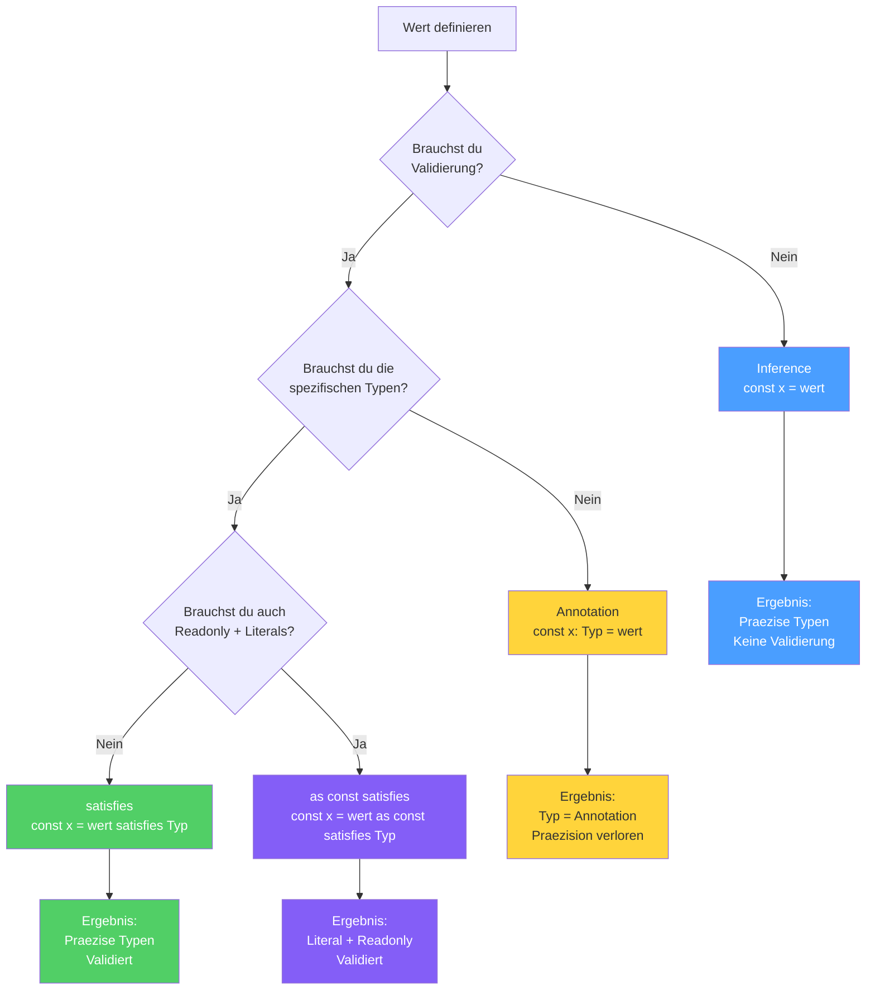

# Sektion 6: Der satisfies-Operator

**Geschaetzte Lesezeit:** ~10 Minuten

## Was du hier lernst

- Die Geschichte hinter `satisfies` und warum die Community jahrelang darauf gewartet hat
- Welches Problem `satisfies` loest, das weder Annotations noch Inference allein loesen koennen
- Wann du `satisfies`, wann Annotation, wann Inference verwendest
- Das Power-Combo: `as const satisfies` fuer maximale Praezision
- Praxis-Patterns fuer Angular/React-Konfigurationen

---

## Denkfragen fuer diese Sektion

1. **Warum konnte man das Problem "Sicherheit vs. Praezision" nicht einfach mit einer Annotation loesen?**
2. **Was genau bedeutet es, dass `satisfies` den Typ "prueft ohne ihn zu aendern"?**
3. **Warum kommt `as const` VOR `satisfies` und nicht umgekehrt -- was wuerde passieren, wenn die Reihenfolge anders waere?**

---

## satisfies vs. Annotation vs. Inference -- der Vergleich

Dieses Diagramm zeigt dir auf einen Blick, wie die drei Werkzeuge funktionieren und wann du welches verwendest:



> **Merke:** Jedes Werkzeug hat seinen Platz. Es gibt kein "bestes" -- nur das **passende** fuer deinen konkreten Fall.

---

## Die Geschichte hinter satisfies

> **Hintergrund:** `satisfies` wurde mit TypeScript 4.9 (November 2022) eingefuehrt -- aber die Idee existierte seit **2017**. Das GitHub-Issue [#7481](https://github.com/microsoft/TypeScript/issues/7481) mit dem Titel "Primitives assigned to type alias should retain narrowing" sammelte ueber 700 Upvotes und wurde eines der meistdiskutierten Feature-Requests in TypeScript's Geschichte.

Das Problem war: Entwickler mussten sich zwischen **Sicherheit** (Annotation) und **Praezision** (Inference) entscheiden. Es gab keinen Weg, beides gleichzeitig zu haben.

```
2017: Issue #7481 eroeffnet -- "Wir brauchen Typ-Validierung ohne Typ-Erweiterung"
2019: Mehrere alternative Proposals (satisfies, implements, fulfills)
2021: Das TypeScript-Team beginnt ernsthaft am Design
2022: satisfies landet in TypeScript 4.9 -- nach 5 Jahren Warten
```

> **Fun Fact:** Der Name `satisfies` wurde aus mehreren Kandidaten gewaehlt. Andere Vorschlaege waren `implements` (schon vergeben fuer Klassen), `fulfills`, `extends` (schon vergeben fuer Generics) und `matches`. `satisfies` gewann, weil es am praezisesten ausdrueckt, was passiert: Der Wert **erfuellt** den Typ, ohne sich ihm zu **unterwerfen**.

---

## Das Problem: Sicherheit vs. Praezision

Du hast zwei Optionen, um den Typ eines Wertes festzulegen -- und beide haben Nachteile:

### Option 1: Annotation -- sicher, aber ungenau

```typescript
type ColorMap = Record<string, [number, number, number] | string>;

const palette: ColorMap = {
  red: [255, 0, 0],
  green: "#00ff00",
  blue: [0, 0, 255],
};

palette.red;    // Typ: [number, number, number] | string  <-- zu breit!
palette.green;  // Typ: [number, number, number] | string  <-- zu breit!
```

Die Annotation sagt TypeScript: "Behandle `palette` als `ColorMap`". Damit verlierst du die Information, dass `red` ein Tuple und `green` ein String ist. TypeScript kennt nur noch den **breitesten moeglichen Typ** aus der Annotation.

### Option 2: Inference -- genau, aber unsicher

```typescript
const palette = {
  red: [255, 0, 0],
  green: "#00ff00",
  blue: [0, 0, 255],
};

palette.red;    // Typ: number[]  <-- spezifisch, aber...
// Kein Fehler wenn du einen Tippfehler im Wert machst!
// palette.green koennte 12345 sein -- kein Schema-Check!
```

Ohne Annotation behaelt TypeScript die spezifischen Typen, aber prueft nicht, ob dein Objekt dem gewuenschten Schema entspricht.

### Die Analogie: Bauplan vs. Freihand

- **Annotation** = Du baust nach einem Bauplan. Sicher, aber du darfst keine Details hinzufuegen, die nicht im Plan stehen.
- **Inference** = Du baust frei. Jedes Detail bleibt erhalten, aber niemand prueft, ob das Ergebnis bewohnbar ist.
- **satisfies** = Du baust frei, aber ein Pruefer kommt vorbei und vergleicht mit dem Bauplan. Er bemängelt Fehler, laesst aber deine kreativen Details stehen.

---

## Die Loesung: satisfies

`satisfies` prueft den Typ, **ohne ihn zu aendern**:

```typescript annotated
const palette = {
  red: [255, 0, 0],
// ^ Inferierter Typ bleibt: [number, number, number]
  green: "#00ff00",
// ^ Inferierter Typ bleibt: string (nicht string | [...])
  blue: [0, 0, 255],
} satisfies ColorMap;
// ^ satisfies: prueft gegen ColorMap, OHNE den Typ zu aendern

palette.red;
// ^ Typ: [number, number, number] -- praezise! (nicht ColorMap["red"])
palette.green;
// ^ Typ: string -- praezise! (nicht string | [n, n, n])
```

> 🧠 **Erklaere dir selbst:** Was ist der Unterschied zwischen `: ColorMap` (Annotation) und `satisfies ColorMap`? Was passiert mit dem Typ von `palette.red` in beiden Faellen?
> **Kernpunkte:** Annotation: Typ wird ColorMap (breit) | satisfies: Inferierter Typ bleibt (praezise) | satisfies validiert trotzdem gegen das Schema | Beides erkennt Tippfehler

**Was genau passiert:**
1. TypeScript inferiert den Typ des Objekts ganz normal (praezise Typen)
2. Dann prueft es: "Passt dieses inferierte Objekt zum Typ hinter `satisfies`?"
3. Wenn ja: Der **inferierte** Typ bleibt erhalten (nicht der satisfies-Typ)
4. Wenn nein: Fehlermeldung

---

## Wann nutzt du was?

```
                     Brauchst du Validierung gegen ein Schema?
                      /                          \
                    Ja                           Nein
                    |                              |
     Brauchst du die spezifischen Typen?     Lass TS infern
              /            \                   (kein Typ noetig)
            Ja             Nein
             |              |
         satisfies      Annotation
```

| Werkzeug | Validiert? | Praezise Typen? | Nutze wenn... |
|----------|:----------:|:---------------:|---------------|
| `: Typ` (Annotation) | Ja | Nein (auf Annotation-Typ erweitert) | Du den Typ einschraenken willst |
| `satisfies Typ` | Ja | Ja (inferierte Typen bleiben) | Konfig-Objekte mit Schema-Check |
| Inference (nichts) | Nein | Ja | Lokale Variablen mit klarem Wert |

---

## Excess Property Checking -- satisfies hilft auch hier

TypeScript hat eine spezielle Regel: Wenn du ein Object Literal direkt einem Typ zuweist, werden **keine Extra-Properties** erlaubt. `satisfies` loest diese Pruefung ebenfalls aus:

```typescript
interface ComponentConfig {
  selector: string;
  template: string;
}

// Annotation: Excess Properties werden erkannt
const config1: ComponentConfig = {
  selector: "app-root",
  template: "<h1>Hello</h1>",
  styels: "h1 { color: red }",  // FEHLER: Tippfehler erkannt!
};

// satisfies: Excess Properties werden AUCH erkannt
const config2 = {
  selector: "app-root",
  template: "<h1>Hello</h1>",
  styels: "h1 { color: red }",  // FEHLER: Tippfehler erkannt!
} satisfies ComponentConfig;

// Aber: Ueber eine Zwischenvariable -- KEIN Fehler!
const data = {
  selector: "app-root",
  template: "<h1>Hello</h1>",
  styels: "h1 { color: red }",
};
const config3: ComponentConfig = data;  // OK! Kein Excess Property Check.
```

> **Tieferes Wissen:** Warum prueft TypeScript Extra-Properties nur bei direkter Zuweisung? Weil Object Literals der einzige Ort sind, wo der Entwickler die **volle Kontrolle** ueber die Eigenschaften hat. Wenn du ein Literal direkt zuweist und eine Property nicht im Typ vorkommt, ist das fast sicher ein Tippfehler. Bei einer Zwischenvariable hingegen koennte das "reichere" Objekt absichtlich erstellt worden sein (z.B. fuer mehrere Verwendungen mit unterschiedlichen Interfaces).

---

## Das Power-Combo: `as const satisfies`

Fuer maximale Praezision + Validierung + Readonly:

```typescript
const ROUTES = {
  home: { path: "/", component: "HomePage" },
  users: { path: "/users", component: "UserList" },
  settings: { path: "/settings", component: "Settings" },
} as const satisfies Record<string, { path: string; component: string }>;

// Validierung: Jeder Eintrag muss path + component haben
// Praezision: ROUTES.home.path ist "/", nicht string
// Readonly: Nichts kann geaendert werden

type RouteName = keyof typeof ROUTES;
// "home" | "users" | "settings"

type RoutePath = (typeof ROUTES)[RouteName]["path"];
// "/" | "/users" | "/settings"
```

### Warum nicht nur `as const`?

```typescript
// Nur as const: Kein Schema-Check!
const ROUTES = {
  home: { path: "/", compnent: "HomePage" },  // Tippfehler: "compnent"!
  // Kein Fehler -- as const allein validiert nicht
} as const;

// as const satisfies: Schema-Check + Praezision
const ROUTES = {
  home: { path: "/", compnent: "HomePage" },  // FEHLER! "compnent" statt "component"
} as const satisfies Record<string, { path: string; component: string }>;
```

---

## Praxis-Patterns

### Angular: Route-Konfiguration

```typescript
interface RouteConfig {
  path: string;
  component: string;
  children?: RouteConfig[];
}

const routes = [
  {
    path: "/users",
    component: "UserList",
    children: [
      { path: ":id", component: "UserDetail" },
    ],
  },
  {
    path: "/settings",
    component: "Settings",
  },
] satisfies RouteConfig[];

// TS kennt jetzt die exakte Struktur:
routes[0].children;  // Typ: { path: string; component: string }[] | undefined
// NICHT: RouteConfig[] | undefined (was bei Annotation passieren wuerde)
```

### React: Theme-Konfiguration

```typescript
interface ThemeConfig {
  colors: Record<string, string>;
  spacing: Record<string, number>;
}

const theme = {
  colors: {
    primary: "#3b82f6",
    secondary: "#8b5cf6",
    background: "#ffffff",
  },
  spacing: {
    sm: 4,
    md: 8,
    lg: 16,
    xl: 32,
  },
} satisfies ThemeConfig;

// theme.colors.primary ist string (nicht string | undefined)
// theme.spacing.sm ist number (nicht number | undefined)
// UND: Wenn du "spacing: { sm: "vier" }" schreibst, gibt es einen Fehler
```

### Konfigurationsobjekte mit Enum-artigen Keys

```typescript
type Permission = "read" | "write" | "admin";

const PERMISSION_LABELS = {
  read: "Lesen",
  write: "Schreiben",
  admin: "Administrator",
} as const satisfies Record<Permission, string>;

// Validierung: Jede Permission muss vorhanden sein
// Praezision: PERMISSION_LABELS.read ist "Lesen", nicht string
// Readonly: Kann nicht geaendert werden

// Fehlt eine Permission, gibt es einen Fehler:
const BAD_LABELS = {
  read: "Lesen",
  write: "Schreiben",
  // FEHLER: Property 'admin' is missing
} as const satisfies Record<Permission, string>;
```

---

## Zusammenfassung: Die drei Werkzeuge im Vergleich

```
+------------------+-------------+------------------+----------------------------+
| Werkzeug         | Validiert?  | Praezise Typen?  | Bestes fuer                |
+------------------+-------------+------------------+----------------------------+
| : Typ            | Ja          | Nein             | let-Variablen, Parameter   |
| satisfies Typ    | Ja          | Ja               | Config-Objekte             |
| (nichts)         | Nein        | Ja               | Lokale Variablen           |
| as const         | Nein        | Ja + Literal     | Enum-Ersatz                |
| as const         | Ja          | Ja + Literal     | Maximale Praezision +      |
|   satisfies Typ  |             | + Readonly       | Validierung                |
+------------------+-------------+------------------+----------------------------+
```

---

## Experiment-Box: satisfies in Aktion

> **Experiment:** Probiere folgendes im TypeScript Playground aus und vergleiche die Typen:
>
> ```typescript
> type ColorMap = Record<string, [number, number, number] | string>;
>
> // Schritt 1: Annotation -- Typ wird "verbreitert"
> const palette1: ColorMap = {
>   red: [255, 0, 0],
>   green: "#00ff00",
> };
> // Hovere ueber 'palette1.red' -- welcher Typ? Zu breit?
>
> // Schritt 2: satisfies -- praezise Typen bleiben erhalten
> const palette2 = {
>   red: [255, 0, 0],
>   green: "#00ff00",
> } satisfies ColorMap;
> // Hovere ueber 'palette2.red' -- was hat sich geaendert?
>
> // Schritt 3: Falscher Wert einbauen
> const palette3 = {
>   red: [255, 0, 0],
>   green: 12345,  // Falscher Typ!
> } satisfies ColorMap;
> // Was passiert? Wird der Fehler erkannt?
>
> // Schritt 4: as const satisfies
> const palette4 = {
>   red: [255, 0, 0],
>   green: "#00ff00",
> } as const satisfies ColorMap;
> // Hovere ueber 'palette4.red' -- was ist jetzt anders?
> ```
>
> Beantworte: Was passiert mit dem Typ von `palette1.red` vs. `palette2.red`? Warum ist das praktisch relevant?

---

## Rubber-Duck-Prompt

Stell dir vor, ein Kollege fragt: "Warum soll ich `satisfies` verwenden, wenn eine Annotation doch auch validiert?"

Erklaere in 3 Saetzen:
1. Was passiert mit den spezifischen Typen bei einer Annotation (Verlust)
2. Was `satisfies` anders macht (Validierung OHNE Typ-Aenderung)
3. Wann `as const satisfies` sinnvoll ist (Konfigurations-Objekte)

---

## Was du gelernt hast

- **satisfies** wurde 2022 eingefuehrt und loest ein 5 Jahre altes Problem: Validierung ohne Typ-Verlust
- Es prueft den Typ, **ohne ihn zu aendern** -- du bekommst Sicherheit UND Praezision
- **Excess Property Checking** funktioniert auch mit `satisfies`
- **`as const satisfies`** ist das Power-Combo fuer Konfigurationen: Literal Types + Readonly + Schema-Check
- In Angular/React-Projekten nutzt du `satisfies` fuer **Route-Configs, Theme-Objekte, Permission-Maps** und aehnliche Konfigurationen

> 🧠 **Erklaere dir selbst:** Warum kommt `as const` VOR `satisfies` und nicht umgekehrt? Was wuerde `satisfies Type as const` bewirken -- und warum ist das ein Syntaxfehler?
> **Kernpunkte:** as const erzwingt zuerst Literal-Typen | Dann prueft satisfies gegen den Zieltyp | Umgekehrt: satisfies gibt inferierten Typ zurueck, as const darauf = Syntaxfehler | Reihenfolge: erst einfrieren, dann validieren

---

**Pausenpunkt.** Wenn du bereit bist, geht es weiter mit [Sektion 7: Wo Inference versagt](./07-wo-inference-versagt.md) -- dort lernst du die systematischen Stellen kennen, an denen du immer annotieren musst.
