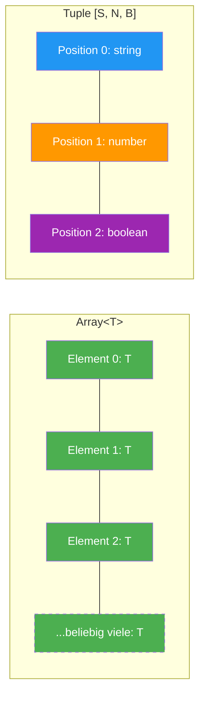
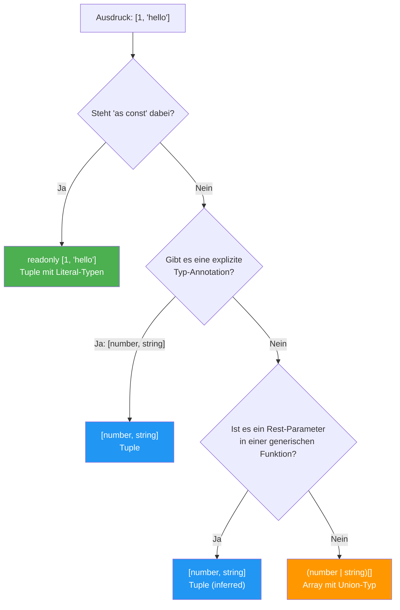

# Sektion 1: Array-Grundlagen

> **Geschaetzte Lesezeit:** ~10 Minuten
>
> **Was du hier lernst:**
> - Das mentale Modell: Warum Arrays und Tuples fundamental verschieden sind
> - Die zwei Syntax-Varianten `T[]` und `Array<T>` und wann welche besser ist
> - Warum `Array<T>` dein erster Kontakt mit Generics ist
> - Wie TypeScript gemischte Arrays inferiert — und warum kein Tuple daraus wird

---

## Das Mentale Modell: Arrays vs Tuples

Bevor wir Code schreiben, muss ein fundamentaler Unterschied klar sein.
Arrays und Tuples sehen syntaktisch aehnlich aus (beides eckige Klammern),
aber sie **repraesentieren voellig verschiedene Konzepte**:

```
  Array<number>                  [string, number, boolean]
  ┌───┬───┬───┬───┬─────┐       ┌────────┬────────┬─────────┐
  │ 1 │ 2 │ 3 │ 4 │ ... │       │"hello" │  42    │  true   │
  └───┴───┴───┴───┴─────┘       └────────┴────────┴─────────┘
  Beliebige Laenge               Fixe Laenge, fixe Typen
  Alle Elemente gleicher Typ     Jede Position hat eigenen Typ
```

**Die Analogie:** Ein Array ist wie eine **Einkaufsliste** — beliebig viele
Eintraege, alle vom selben Typ ("Dinge die man kaufen will"). Ein Tuple ist
wie ein **Formular** — eine feste Anzahl Felder, jedes mit einem bestimmten
Typ (Name: Text, Alter: Zahl, Aktiv: Ja/Nein).

> **Hintergrund:** JavaScript kennt gar keinen Unterschied zwischen Arrays
> und Tuples. In der V8-Engine (Chrome, Node.js) sind Arrays intern Objekte
> mit numerischen Keys. Es gibt kein natives Tuple-Konstrukt — anders als in
> Python, wo Tuples ein eigener immutabler Datentyp sind. TypeScript hat das
> Tuple-Konzept **rein auf Typ-Ebene** erfunden, um feste Strukturen wie
> `[x, y]` oder `[state, setState]` ausdruecken zu koennen. Zur Laufzeit
> ist ein Tuple ein ganz normales JavaScript-Array.

### Das grosse Bild: Array vs Tuple



**Array** = alle Knoepfe gleich (gruen) und beliebig viele.
**Tuple** = jede Position hat eine eigene Farbe (= eigenen Typ) und die Laenge ist fix.

### Die entscheidende Tabelle

| Eigenschaft | Array | Tuple |
|---|---|---|
| Laenge | variabel | fix (zur Compile-Zeit bekannt) |
| Element-Typen | alle gleich (oder Union) | pro Position definiert |
| Index-Zugriff | immer gleicher Typ | positionsabhaengiger Typ |
| `.length` Typ | `number` | Literal-Zahl (z.B. `3`) |
| Inferenz | TypeScript inferiert Array | TypeScript inferiert **nie** ein Tuple |

Der letzte Punkt ist **entscheidend** und eine haeufige Fehlerquelle:

```typescript
const punkt = [10, 20];
// TypeScript sagt: number[]      <-- KEIN Tuple!
// Du denkst vielleicht: [number, number] — aber nein!
```

> **Denkfrage:** Warum inferiert TypeScript hier `number[]` und nicht
> `[number, number]`? Ueberleg kurz, bevor du weiterliest.
>
> **Antwort:** Weil TypeScript davon ausgeht, dass du spaeter `punkt.push(30)`
> machen koenntest. Ein Tuple mit fixer Laenge waere zu restriktiv als Default.
> Die Design-Entscheidung lautet: "Lieber zu flexibel als zu restriktiv — der
> Entwickler kann jederzeit mit einer Annotation oder `as const` einschraenken."

**Faustregel:** Verwende Arrays fuer **Listen gleichartiger Dinge** (z.B.
Benutzernamen). Verwende Tuples fuer eine **feste Struktur mit bekannter
Laenge und bekannten Typen pro Position** (z.B. ein Koordinatenpaar `[x, y]`
oder eine React Hook-Rueckgabe `[state, setState]`).

---

## Arrays in TypeScript

Ein Array ist eine geordnete Sammlung von Werten **gleichen Typs** (oder
eines Union-Typs). Die Laenge ist variabel.

```typescript
// Einfache Arrays
const namen: string[] = ["Alice", "Bob", "Charlie"];
const zahlen: number[] = [1, 2, 3, 4, 5];
const flags: boolean[] = [true, false, true];
```

**Warum "gleichen Typs"?** Weil ein Array eine **homogene Sammlung** darstellt.
Wenn du `string[]` schreibst, sagst du: "Jedes Element ist ein String, egal
an welcher Position, egal wie viele." Der Zugriff `namen[0]` und `namen[999]`
haben beide den Typ `string` — TypeScript unterscheidet nicht nach Position.

> **Experiment-Box:** Oeffne deine IDE und tippe folgendes:
> ```typescript
> const namen = ["Alice", "Bob"];
> const x = namen[0];
> ```
> Hovere ueber `x` — welcher Typ wird angezeigt? Jetzt aendere die erste
> Zeile zu `const namen = ["Alice", "Bob"] as const;` und hovere erneut
> ueber `x`. Was hat sich geaendert? (Antwort: Ohne `as const` ist `x`
> vom Typ `string`. Mit `as const` ist `x` vom Typ `"Alice"`.)

> **Hintergrund:** In vielen stark typisierten Sprachen (Java, C#, Go) sind
> Arrays grundsaetzlich homogen. JavaScript ist die Ausnahme — dort kann ein
> Array `[1, "hello", true, null, {x: 5}]` enthalten. TypeScript bringt die
> Ordnung zurueck, indem es Arrays standardmaessig als homogen behandelt und
> den Union-Typ als Ausweichmechanismus bietet.

---

## Array-Syntax: `T[]` vs `Array<T>`

TypeScript bietet zwei gleichwertige Schreibweisen:

```
  Kurzform          Generische Form
  ---------         ---------------
  string[]          Array<string>
  number[]          Array<number>
  boolean[]         Array<boolean>
```

Beide erzeugen **exakt den gleichen Typ**. Der Unterschied ist rein
stilistisch — mit einer wichtigen Ausnahme:

### Tuple-Inferenz: Wann entscheidet TypeScript was?



**Merke:** TypeScript waehlt im Zweifel **immer** den flexibleren Array-Typ.
Du musst aktiv einschraenken, um einen Tuple-Typ zu bekommen.

### Wann ist `Array<T>` besser?

Bei komplexen Typen wird `Array<T>` lesbarer:

```typescript
// Schwer zu lesen — was ist das Array, was ist die Union?
let a: string | number[];       // string ODER number[] ?
let b: (string | number)[];     // Array von string | number

// Klar mit Array<T>:
let c: Array<string | number>;  // Eindeutig: Array von string | number
```

Die Mehrdeutigkeit bei `a` entsteht, weil `[]` **staerker bindet** als `|`.
Also wird `string | number[]` als `string | (number[])` geparst — ein
einzelner String ODER ein Array von Zahlen. Das ist fast nie das, was man
meint.

> **Praxis-Tipp:** Die meisten TypeScript-Projekte bevorzugen `T[]` fuer
> einfache Typen und `Array<T>` bei komplexeren Ausdruecken. Die ESLint-Regel
> `@typescript-eslint/array-type` kann das teamweit erzwingen. In Angular-
> Projekten ist `T[]` der gaengige Standard.

### Wann ist `T[]` besser?

Fuer einfache Typen ist die Kurzform kompakter und gebraeuchlicher:

```typescript
const namen: string[] = ["Alice", "Bob"];         // klar und kurz
const namen2: Array<string> = ["Alice", "Bob"];   // unnoetig lang
```

### Mehrdimensionale Arrays

```typescript
// 2D Array (Matrix)
const matrix: number[][] = [
  [1, 2, 3],
  [4, 5, 6],
  [7, 8, 9],
];

// Oder mit generischer Form (lesbarer bei Verschachtelung):
const matrix2: Array<Array<number>> = [
  [1, 2, 3],
  [4, 5, 6],
];
```

---

## `Array<T>` als generischer Typ — die Verbindung zu Generics

Dieses Konzept wird oft uebersehen: `Array<T>` ist **kein spezielles
Sprach-Keyword**. Es ist ein ganz normaler generischer Typ, definiert in
TypeScripts Standardbibliothek (`lib.es5.d.ts`).

```typescript
// Das hier ist die (vereinfachte) Definition in lib.es5.d.ts:
interface Array<T> {
  length: number;
  push(...items: T[]): number;
  pop(): T | undefined;
  map<U>(callbackfn: (value: T) => U): U[];
  filter(predicate: (value: T) => boolean): T[];
  find(predicate: (value: T) => boolean): T | undefined;
  // ... viele weitere Methoden
}
```

> **Tieferes Wissen:** Wenn du `Array<string>` schreibst, machst du nichts
> anderes als bei `Promise<string>` oder `Map<string, number>`: Du fuellst
> einen **Typ-Parameter** aus. Das bedeutet:
>
> 1. **`T[]` ist syntaktischer Zucker** fuer `Array<T>`. Punkt. Kein Unterschied.
> 2. **Du verstehst die Methodentypen:** Warum gibt `find()` den Typ
>    `T | undefined` zurueck? Weil es so in der generischen Definition steht.
> 3. **Verbindung zu eigenen Generics:** Wenn du spaeter
>    `function first<T>(arr: T[]): T | undefined` schreibst, nutzt du
>    exakt das gleiche Konzept.
>
> **Du benutzt Generics bereits seit Lektion 1**, ohne es zu wissen. Jedes
> `string[]` ist ein `Array<string>`.

```typescript
// So wie Array<T> funktioniert, kannst du eigene generische Container bauen:
interface Stack<T> {
  push(item: T): void;
  pop(): T | undefined;
  peek(): T | undefined;
  readonly length: number;
}
```

---

## Array-Inferenz bei gemischten Typen

Was passiert, wenn TypeScript den Typ eines Arrays mit verschiedenen
Wertetypen erschliessen muss?

```typescript
// TypeScript inferiert: (string | number)[]
const gemischt = ["hello", 42, "world", 7];

// TypeScript inferiert: (string | number | boolean)[]
const bunt = ["text", 123, true];

// TypeScript inferiert: (string | null)[]
const optional = ["da", null, "auch da", null];
```

**Warum macht TypeScript das so?** TypeScript schaut sich alle Elemente an
und bildet den **kleinsten gemeinsamen Union-Typ**, der alle Elemente abdeckt.
Es wird bewusst **kein Tuple** inferiert, weil TypeScript annimmt, dass du
ein Array willst, dessen Elemente sich aendern koennen.

> **Hintergrund: Die Design-Entscheidung dahinter.** Die TypeScript-Designer
> hatten zwei Optionen:
>
> - **Option A:** `[1, "hello"]` wird zu `[number, string]` (Tuple) — praezise,
>   aber dann wuerde `arr.push("world")` fehlschlagen.
> - **Option B:** `[1, "hello"]` wird zu `(number | string)[]` (Array) —
>   flexibel, erlaubt Mutation.
>
> Sie waelten Option B, weil JavaScript-Code Arrays fast immer als mutable
> Listen verwendet. Der Entwickler kann jederzeit mit `: [number, string]`
> oder `as const` einschraenken. Die Philosophie: **Opt-in Restriktion** statt
> Opt-out.

> **Denkfrage:**
> ```typescript
> const arr = [1, "hello"];
> arr.push(true);
> ```
> Warum schlaegt `arr.push(true)` fehl? Welchen Typ hat `arr`?
>
> **Antwort:** TypeScript inferiert `arr` als `(string | number)[]`. Da
> `boolean` nicht zu `string | number` gehoert, wird `push(true)` abgelehnt.
> Die Inferenz passiert **zum Zeitpunkt der Deklaration** und ist danach fixiert.

---

## Was du gelernt hast

- Arrays und Tuples sind **fundamental verschieden**: Arrays sind variable
  Listen gleichen Typs, Tuples sind feste Strukturen mit Typ pro Position
- `T[]` und `Array<T>` sind identisch — `Array<T>` ist besser bei komplexen
  Union-Typen
- `Array<T>` ist ein generischer Typ aus `lib.es5.d.ts` — du benutzt Generics
  seit deiner ersten Zeile TypeScript
- TypeScript inferiert bei gemischten Werten immer ein Array mit Union-Typ,
  **nie** ein Tuple
- JavaScript kennt kein Tuple-Konzept — TypeScript hat es rein auf Typ-Ebene
  erfunden

**Pausenpunkt:** Guter Zeitpunkt fuer eine Pause. In der naechsten Sektion
geht es um `readonly` Arrays — das Werkzeug gegen ungewollte Mutation.

---

[Zurueck zur Uebersicht](../README.md) | [Naechste Sektion: Readonly Arrays -->](02-readonly-arrays.md)
