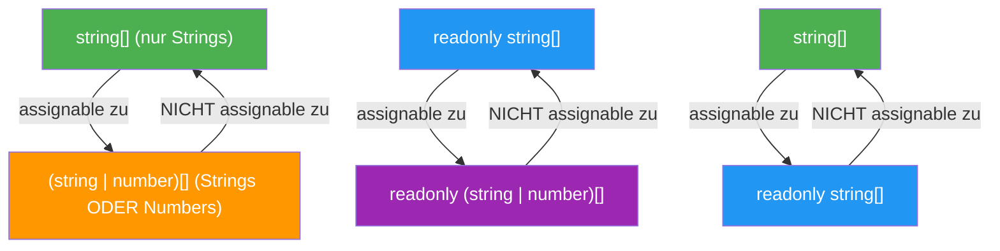
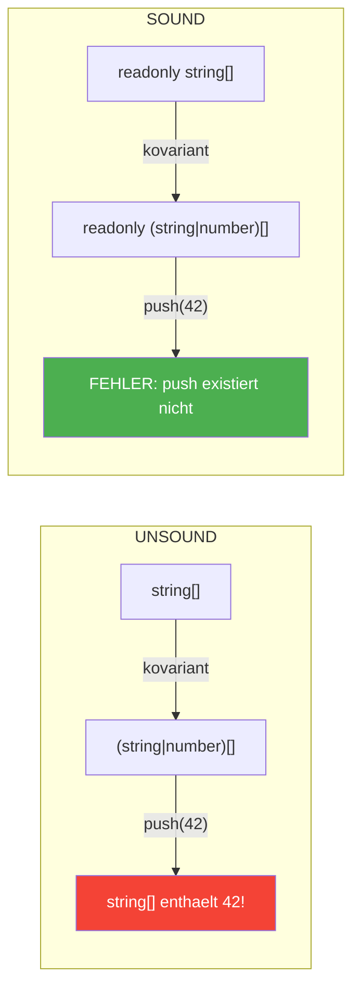

# Sektion 5: Kovarianz und Sicherheit

> **Geschaetzte Lesezeit:** ~12 Minuten
>
> **Was du hier lernst:**
> - Was Kovarianz bedeutet — mit einer Analogie, die sofort sitzt
> - Warum Kovarianz bei mutablen Arrays **unsound** ist (und TypeScript es trotzdem erlaubt)
> - Die drei grossen Typsicherheits-Luecken von Arrays
> - `noUncheckedIndexedAccess` — die wichtigste Compiler-Option, die du wahrscheinlich nicht aktiv hast
> - Warum `readonly` das Kovarianz-Problem loest

---

## Was ist Kovarianz?

**Kovarianz** ist ein Konzept aus der Typentheorie, das beschreibt, wie sich
die Richtung einer Subtyp-Beziehung auf Container-Typen uebertraegt.

Das klingt abstrakt. Hier ist die Analogie:

> **Die Obstkiste.** Stell dir eine Lagerhalle vor, die Obstkisten akzeptiert.
> Aepfel sind eine Art Obst. Die Frage ist: Wenn die Halle "Kiste mit Obst"
> erwartet, darfst du eine "Kiste mit Aepfeln" abgeben?
>
> ```
>   Apfel  ────ist ein────►  Obst
>     │                        │
>     ▼                        ▼
>   Kiste<Apfel>  ──?──►  Kiste<Obst>
> ```
>
> **Kovarianz** sagt: Ja, die Richtung bleibt gleich. Wenn Apfel ein Subtyp
> von Obst ist, dann ist Kiste-von-Aepfeln ein Subtyp von Kiste-von-Obst.
>
> **Aber Vorsicht:** Das ist nur sicher, wenn niemand eine Banane in die
> Apfelkiste legen darf. Genau hier liegt das Problem bei mutablen Arrays.

### Kovarianz als Diagramm



**Leserichtung:** Pfeile zeigen "ist assignable zu". Beachte: Die Richtung
ist immer **von speziell zu allgemein** (weniger Moeglichkeiten zu mehr
Moeglichkeiten). Das ist die **Essenz der Kovarianz**.

### Kovarianz formal

```
  Wenn   A extends B    (A ist Subtyp von B)
  Dann   Container<A> extends Container<B>    (kovariant)
```

Das Gegenteil waere **Kontravarianz** (die Richtung dreht sich um) und
**Invarianz** (keine Beziehung). Arrays sind in TypeScript **kovariant** —
sowohl readonly als auch mutable.

---

## Kovarianz bei TypeScript-Arrays

```typescript
// string ist ein Subtyp von string | number
// Also ist string[] ein Subtyp von (string | number)[]  <-- Kovarianz!

const namen: string[] = ["Alice", "Bob"];
const gemischt: (string | number)[] = namen; // OK! Kovarianz.

// Andersherum geht es NICHT:
// const nurStrings: string[] = gemischt; // FEHLER!
// Weil gemischt auch Zahlen enthalten koennte.
```

Das fuehlt sich intuitiv richtig an: Ein Array das nur Strings enthaelt,
**ist auch** ein Array das Strings-oder-Zahlen enthaelt. Oder?

---

## Das Problem: Kovarianz + Mutation = Unsound

Hier wird es gefaehrlich. Lass uns die Obstkisten-Analogie weiterfuehren:

> **Die Obstkiste, Teil 2.** Du gibst deine Apfelkiste an die Lagerhalle
> (die "Kiste mit Obst" akzeptiert). Die Halle sagt: "Danke, wir legen
> noch eine Banane rein — ist ja alles Obst." Jetzt hast du eine Apfelkiste
> mit einer Banane drin. Dein Apfelkuchen-Rezept, das nur Aepfel erwartet,
> hat ein Problem.

```typescript annotated
const strings: string[] = ["hello", "world"];
const union: (string | number)[] = strings;
// ^ Kovarianz: string[] ist Subtyp von (string | number)[] -- erlaubt

union.push(42);
// ^ TypeScript erlaubt das -- union ist (string | number)[]

console.log(strings);
// ^ ["hello", "world", 42] -- strings und union sind DASSELBE Array!
// ^ strings[2] ist jetzt 42, aber der Typ sagt string[]! (Unsound!)
```

> 🧠 **Erklaere dir selbst:** Warum ist Kovarianz bei mutablen Arrays unsound? Was genau passiert im Speicher, wenn zwei Variablen auf dasselbe Array zeigen? Und warum loest `readonly` das Problem?
> **Kernpunkte:** Beide Variablen zeigen auf dasselbe Array | Mutation ueber breitere Referenz moeglich | readonly verhindert push/pop | Lesen ist immer sicher (string ist auch string|number)

```
  strings: string[]  ──────────────────┐
                                       ├── SELBES Array im Speicher
  union: (string | number)[] ──────────┘   ["hello", "world", 42]
                                            ↑
                                            Das ist eine Zahl in einem "string[]"!
```

**Das ist ein Loch im Typsystem.** TypeScript sagt, `strings` ist `string[]`,
aber es enthaelt eine Zahl. Der Compiler hat gelogen.

> **Rubber-Duck-Prompt:** Erklaere einer anderen Person (oder deiner
> Gummiente) in eigenen Worten:
>
> 1. Warum erlaubt TypeScript die Zuweisung `const union: (string | number)[] = strings`?
> 2. Was genau passiert im Speicher, wenn du danach `union.push(42)` aufrufst?
> 3. Warum ist `strings[2]` jetzt eine Zahl, obwohl der Typ `string[]` sagt?
> 4. Was waere die Konsequenz, wenn TypeScript Arrays **invariant** statt
>    **kovariant** behandeln wuerde?
>
> Wenn du Punkt 4 beantworten kannst, hast du Kovarianz wirklich verstanden.

> **Hintergrund: Warum erlaubt TypeScript das trotzdem?** Die Alternative
> waere, Arrays als **invariant** zu behandeln — dann waere
> `string[]` NICHT zuweisbar an `(string | number)[]`. Das waere
> mathematisch korrekt, aber **extrem unpraktisch**:
>
> ```typescript
> // Ohne Kovarianz waere das VERBOTEN:
> function printAll(items: (string | number)[]): void { ... }
> const names: string[] = ["Alice", "Bob"];
> printAll(names);  // FEHLER! string[] ist nicht (string | number)[]
> ```
>
> Das waere ein Albtraum fuer die Ergonomie. Java hatte das gleiche Problem
> mit Arrays (fuehrt zu `ArrayStoreException` zur Laufzeit). TypeScript hat
> sich fuer **Pragmatismus** entschieden: Dieser Bug-Typ ist in der Praxis
> selten, und die Ergonomie waere sonst schlecht.
>
> **Fun Fact:** Java lernte aus diesem Fehler und machte Generics (wie
> `List<String>`) **invariant**. Dort brauchst du `List<? extends Object>`
> (Wildcard) fuer Kovarianz — deutlich umstaendlicher, aber typsicher.

### Die Loesung: `readonly` macht Kovarianz sicher

```typescript
function verarbeite(namen: readonly string[]): void {
  // Kein push, pop, sort, splice moeglich
  // Das Kovarianz-Problem KANN NICHT auftreten!
}

const strings: string[] = ["hello", "world"];
const readonlyView: readonly (string | number)[] = strings; // OK und SICHER
// readonlyView.push(42);  // FEHLER! Property 'push' does not exist
```

**Warum ist das sicher?** Weil das Kovarianz-Problem nur auftritt, wenn
jemand ueber die erweiterte Referenz **etwas hineinschreibt**. Wenn die
Referenz readonly ist, kann niemand schreiben. Lesen ist immer sicher:
Ein String ist auch ein `string | number` — beim Lesen gibt es keinen
Widerspruch.

```
  Kovariant + mutable    = UNSOUND (Mutation ueber breitere Referenz moeglich)
  Kovariant + readonly   = SOUND   (keine Mutation, nur Lesen)
```



> **Experiment-Box:** Teste den Kovarianz-Bug selbst:
> ```typescript
> const a: string[] = ["x", "y"];
> const b: (string | number)[] = a;
> b.push(99);
> console.log(a);  // Was kommt raus?
> console.log(typeof a[2]);  // "number" — aber Typ sagt string!
> ```
> Fuehre den Code aus (z.B. mit `npx tsx`). Dann aendere `a` zu
> `readonly string[]` — was passiert jetzt?

---

## Die drei grossen Typsicherheits-Luecken

TypeScripts Array-Typisierung hat **bewusste Luecken**. Du solltest sie
kennen, um dich davor zu schuetzen.

### Luecke 1: Out-of-bounds-Zugriff

```typescript
const namen: string[] = ["Alice", "Bob"];
const dritter = namen[99]; // Typ: string — NICHT string | undefined!
// Zur Laufzeit: undefined

console.log(dritter.toUpperCase()); // Laufzeit-Crash!
// Cannot read properties of undefined (reading 'toUpperCase')
```

**Warum?** TypeScript nimmt standardmaessig an, dass jeder Index-Zugriff
ein gueltiges Element zurueckgibt. Das ist optimistisch, aber falsch.

### Luecke 2: Kovarianz-Mutation (wie oben ausfuehrlich erklaert)

### Luecke 3: `filter()` verengt Typen nicht automatisch

```typescript
const arr: (string | number)[] = ["hello", 42];
const strings = arr.filter(x => typeof x === "string");
// Typ: (string | number)[]  <-- TypeScript verengt NICHT automatisch!

// Loesung: Type Predicate verwenden
const strings2 = arr.filter((x): x is string => typeof x === "string");
// Typ: string[]  <-- Jetzt korrekt!
```

**Warum?** TypeScripts Typanalyse funktioniert **statement-basiert** (Zeile
fuer Zeile, Block fuer Block). Die Callback-Funktion in `filter` ist ein
separater Scope. TypeScript sieht: der Callback gibt `boolean` zurueck.
Es weiss nicht, dass dieses `boolean` eine Typ-Einschraenkung ausdrueckt —
es sei denn, du sagst es explizit mit `x is string`.

> **Praxis-Tipp:** Die Type-Predicate-Syntax `(x): x is string => ...`
> sieht beim ersten Mal ungewohnt aus. Merk dir: Das `x is string` ersetzt
> den Rueckgabetyp `boolean`. Du sagst dem Compiler: "Wenn ich `true`
> zurueckgebe, ist `x` ein `string`."

---

## `noUncheckedIndexedAccess` — der Game-Changer

Dies ist die **wichtigste Compiler-Option**, die die meisten Projekte nicht
aktiviert haben — und sollten.

### Das Problem ohne die Option

```typescript
const namen: string[] = ["Alice", "Bob"];
const dritter = namen[2]; // Typ: string — aber Laufzeit: undefined!
dritter.toUpperCase(); // Laufzeit-Crash!
```

### Die Loesung

In `tsconfig.json`:
```json
{
  "compilerOptions": {
    "noUncheckedIndexedAccess": true
  }
}
```

Jetzt:
```typescript
const namen: string[] = ["Alice", "Bob"];
const dritter = namen[2]; // Typ: string | undefined  <-- korrekt!

// Du musst jetzt pruefen:
if (dritter !== undefined) {
  dritter.toUpperCase(); // ok, TypeScript weiss es ist string
}

// Oder mit Optional Chaining:
dritter?.toUpperCase();

// Oder mit Non-null Assertion (wenn du dir sicher bist):
dritter!.toUpperCase(); // Vorsicht: umgeht die Pruefung!
```

### Auswirkung auf Tuples

```typescript
const tup: [string, number] = ["hello", 42];

// Tuple-Positionen sind NICHT betroffen (Laenge ist bekannt):
const a = tup[0]; // string (nicht string | undefined!)
const b = tup[1]; // number (nicht number | undefined!)

// Dynamischer Index IST betroffen:
function getElement(t: [string, number], i: number) {
  return t[i]; // string | number | undefined
}
```

> **Tieferes Wissen:** TypeScript unterscheidet hier intelligent:
> Bei einem **Literal-Index** (`tup[0]`) weiss der Compiler, dass
> Position 0 existiert. Bei einem **dynamischen Index** (`tup[i]`)
> kann der Compiler nicht wissen, ob `i` ein gueltiger Index ist. Deshalb
> wird `| undefined` nur bei dynamischen Indizes hinzugefuegt.

> **Experiment-Box:** Erstelle eine `tsconfig.json` mit
> `"noUncheckedIndexedAccess": true` und kompiliere:
> ```typescript
> const arr = ["a", "b", "c"];
> const el = arr[0];
> console.log(el.toUpperCase());
> ```
> Was passiert? Jetzt fuege `if (el !== undefined)` hinzu. Dann versuche
> `for (const x of arr)` — beachte, dass `x` dort **keinen** `| undefined`
> Typ hat. Warum nicht?

### Auswirkung auf `for...of` und Destructuring

```typescript
const namen: string[] = ["Alice", "Bob"];

// for...of ist NICHT betroffen — TypeScript weiss, dass der Iterator
// nur existierende Elemente liefert:
for (const name of namen) {
  console.log(name.toUpperCase()); // name ist string, nicht string | undefined
}

// Aber Index-basierte Schleifen SIND betroffen:
for (let i = 0; i < namen.length; i++) {
  const name = namen[i]; // string | undefined
  if (name) {
    console.log(name.toUpperCase());
  }
}
```

### Auswirkung auf Record/Dictionary-Typen

Die Option betrifft nicht nur Arrays, sondern auch **Index Signatures**:

```typescript
const dict: Record<string, number> = { a: 1, b: 2 };
const value = dict["c"]; // MIT Option: number | undefined (korrekt!)
                         // OHNE Option: number (falsch!)
```

> **Praxis-Tipp:** Aktiviere `noUncheckedIndexedAccess` in **jedem neuen
> Projekt**. Es ist einer der groessten Typsicherheits-Gewinne in TypeScript.
> Ja, du musst an manchen Stellen `| undefined` behandeln, wo du "weisst"
> dass der Index gueltig ist. Aber die Bugs, die es verhindert, sind die
> Art von Bugs, die in Production erst nach Wochen auffallen.
>
> **In bestehenden Projekten:** Aktiviere die Option und schau, was rot
> wird. Das zeigt dir sofort, wo potenzielle Runtime-Fehler lauern. In
> Angular-Projekten sind haeufig `Object.keys()` + Index-Zugriff betroffen,
> in React-Projekten `Array.find()` (das bereits `T | undefined`
> zurueckgibt) und Dictionary-Lookups.

---

## Was du gelernt hast

- **Kovarianz** bedeutet: Wenn A Subtyp von B ist, dann ist Container\<A\>
  Subtyp von Container\<B\>
- Kovarianz bei mutablen Arrays ist **unsound** — TypeScript erlaubt es aus
  Pragmatismus
- `readonly` macht Kovarianz **sicher**, weil keine Mutation moeglich ist
- TypeScript hat drei bewusste Typsicherheits-Luecken: Out-of-bounds-Zugriff,
  Kovarianz-Mutation, und fehlende Verengung bei `filter()`
- `noUncheckedIndexedAccess` behebt Luecke 1 und ist die wichtigste
  Compiler-Option fuer Array-Sicherheit
- Type Predicates (`x is string`) beheben Luecke 3 bei `filter()`

**Pausenpunkt:** Die letzte Sektion bringt alles zusammen mit praktischen
Patterns aus Angular und React, Entscheidungshilfen und haeufigen
Stolperfallen.

---

[<-- Vorherige Sektion: Fortgeschrittene Tuples](04-fortgeschrittene-tuples.md) | [Zurueck zur Uebersicht](../README.md) | [Naechste Sektion: Praxis-Patterns -->](06-praxis-patterns.md)
