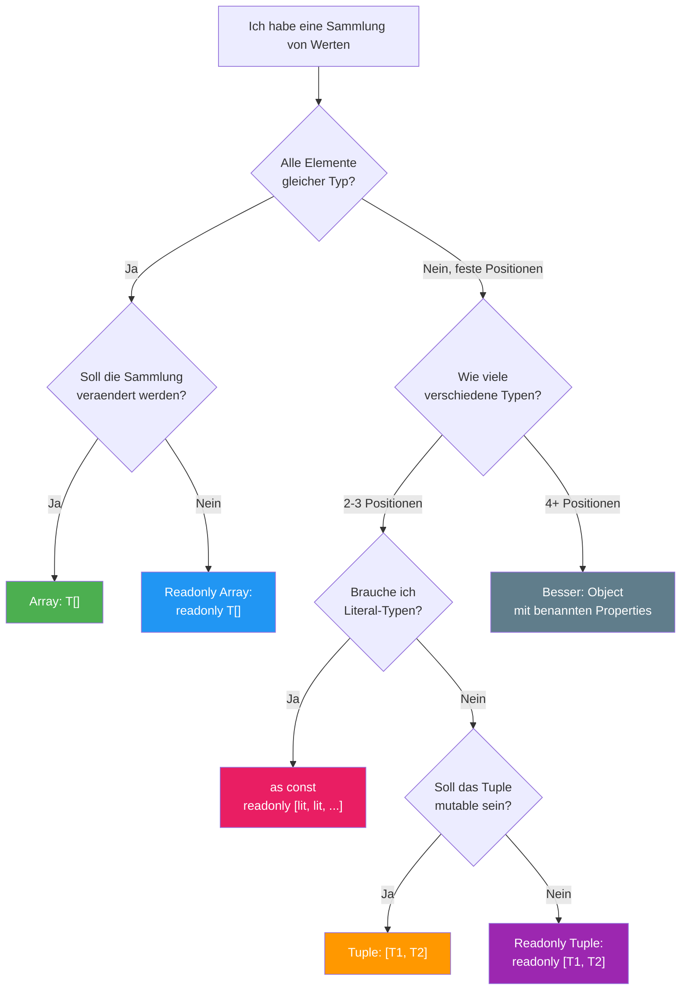

# Sektion 6: Praxis-Patterns und Stolperfallen

> **Geschaetzte Lesezeit:** ~12 Minuten
>
> **Was du hier lernst:**
> - 7 praxiserprobte Patterns fuer Arrays und Tuples
> - Tuple-Rueckgaben in Angular und React
> - Die 6 haeufigsten Stolperfallen (und wie du sie vermeidest)
> - Die Entscheidungshilfe: Array vs Tuple vs Object
> - Wann `push()` auf Tuples funktioniert — und warum das ein Problem ist

---

## Pattern 1: React Hook-Rueckgaben (useState-Style)

```typescript
function useCounter(initial: number): [count: number, increment: () => void] {
  let count = initial;
  const increment = () => { count++; };
  return [count, increment];
}

// Destructuring — wie bei React Hooks:
const [count, increment] = useCounter(0);
//     ^-- number    ^-- () => void

// Vorteil gegenueber Object: Freie Benennung!
const [playerScore, addPoint] = useCounter(0);
const [enemyHealth, takeDamage] = useCounter(100);
```

---

## Pattern 2: Angular Signal-aehnliches Pattern

```typescript
// Angular's signal() gibt ein Signal-Objekt zurueck,
// aber das Getter/Setter-Pattern kann auch als Tuple modelliert werden:
function createState<T>(initial: T): [get: () => T, set: (value: T) => void] {
  let state = initial;
  return [
    () => state,
    (value: T) => { state = value; }
  ];
}

const [getCount, setCount] = createState(0);
console.log(getCount()); // 0
setCount(5);
console.log(getCount()); // 5
```

> **Hintergrund:** Angular's `signal()` waehlt bewusst ein Object statt
> eines Tuples, weil Signals mehr als nur get/set koennen (`computed`,
> `effect`, `update`). Das Tuple-Pattern passt am besten fuer einfache
> Wert/Aktion-Paare.

---

## Pattern 3: Error-Handling (Go-Style)

```typescript
type Result<T> = [data: T, error: null] | [data: null, error: Error];

function parseJSON(json: string): Result<unknown> {
  try {
    return [JSON.parse(json), null];
  } catch (e) {
    return [null, e as Error];
  }
}

const [data, error] = parseJSON('{"valid": true}');
if (error) {
  console.error(error.message);
} else {
  console.log(data); // TypeScript weiss: data ist nicht null
}
```

> **Hintergrund:** Go gibt Fehler als zweiten Rueckgabewert zurueck:
> `data, err := parseJSON(...)`. Dieses Pattern ist in TypeScript mit
> Tuples und Discriminated Unions nachbildbar. Der Vorteil gegenueber
> try/catch: Du **kannst den Fehler nicht vergessen** — er ist im Typ.
> Libraries wie `neverthrow` formalisieren dieses Pattern.

---

## Pattern 4: Typisierte Object.entries

```typescript
interface User {
  name: string;
  age: number;
}

const user: User = { name: "Alice", age: 30 };
const entries: [string, string | number][] = Object.entries(user);

for (const [key, value] of entries) {
  console.log(`${key}: ${value}`);
}
```

> **Tieferes Wissen:** `Object.entries()` gibt `[string, V][]` zurueck
> — die Keys sind immer `string`, nie die spezifischen Key-Typen. Das
> liegt daran, dass TypeScript strukturell typisiert ist: Ein Objekt kann
> mehr Keys haben als der Typ vorschreibt. Deshalb ist der Key-Typ
> konservativ `string`.

---

## Pattern 5: Promise.all — Tuple-Typen in Aktion

```typescript
// Promise.all bewahrt die Tuple-Struktur:
async function loadDashboard() {
  const [user, posts, settings] = await Promise.all([
    fetchUser(),      // Promise<User>
    fetchPosts(),     // Promise<Post[]>
    fetchSettings(),  // Promise<Settings>
  ]);
  // user: User, posts: Post[], settings: Settings
  // Die Typen werden positionsgenau beibehalten!
}
```

In Angular mit RxJS ist das Pendant `forkJoin` oder `combineLatest`:

```typescript
// RxJS combineLatest — gleiche Tuple-Logik:
combineLatest([
  this.userService.getUser(),        // Observable<User>
  this.postService.getPosts(),       // Observable<Post[]>
]).subscribe(([user, posts]) => {
  // user: User, posts: Post[]
});
```

---

## Pattern 6: Spread mit Tuples fuer Funktionsargumente

```typescript
type LogArgs = [message: string, level: number, ...tags: string[]];

function log(...args: LogArgs): void {
  const [message, level, ...tags] = args;
  console.log(`[${level}] ${message}`, tags.length ? `(${tags.join(", ")})` : "");
}

const logEintrag: LogArgs = ["Server gestartet", 1, "startup", "info"];
log(...logEintrag);
```

---

## Pattern 7: Union aus `as const` ableiten (Wiederholung wegen Wichtigkeit)

```typescript
const ROLLEN = ["admin", "user", "gast"] as const;
type Rolle = (typeof ROLLEN)[number];
// => "admin" | "user" | "gast"

// Auch bei verschachtelten Strukturen:
const ROUTES = [
  { path: "/home", component: "HomeComponent" },
  { path: "/about", component: "AboutComponent" },
  { path: "/contact", component: "ContactComponent" },
] as const;

type RoutePath = (typeof ROUTES)[number]["path"];
// => "/home" | "/about" | "/contact"
```

---

## Die 6 haeufigsten Stolperfallen

### 1. `push()` auf Tuples funktioniert — und das ist ein Problem

```typescript
const pair: [string, number] = ["Alice", 30];
pair.push(true);  // Compile-Fehler: boolean ist nicht string | number
pair.push("x");   // KEIN Compile-Fehler! string ist in string | number

// pair ist jetzt ["Alice", 30, "x"] — aber der Typ sagt immer noch [string, number]
console.log(pair.length); // 3 (Laufzeit) vs 2 (Typ-System)
```

**Warum?** TypeScripts Tuple-Typ schuetzt die **ersten n Positionen**, aber
`push()` akzeptiert `string | number` (die Union aller Tuple-Element-Typen).
TypeScript kann nicht erkennen, dass `push` die Laenge veraendert.

> **Experiment-Box:** Teste das selbst:
> ```typescript
> const pair: [string, number] = ["hello", 42];
> pair.push("extra");
> console.log(pair);         // ["hello", 42, "extra"]
> console.log(pair.length);  // 3
> // Aber TypeScript denkt: pair.length ist 2!
> ```
> Jetzt aendere `[string, number]` zu `readonly [string, number]` — was
> passiert mit `pair.push("extra")`?

**Loesung:** Verwende `readonly` Tuples:
```typescript
const pair: readonly [string, number] = ["Alice", 30];
// pair.push("x");  // FEHLER! Property 'push' does not exist
```

### 2. Array wird nicht als Tuple inferiert

```typescript
// Das ist KEIN Tuple!
const point = [10, 20];
// Typ: number[]  (nicht [number, number])

// Loesung 1: Explizite Annotation
const point2: [number, number] = [10, 20];

// Loesung 2: as const (ergibt readonly [10, 20])
const point3 = [10, 20] as const;

// Loesung 3: Helper-Funktion
function tuple<T extends readonly unknown[]>(...args: T): T {
  return args;
}
const point4 = tuple(10, 20); // readonly [number, number]
```

> **Denkfrage:** Die Helper-Funktion `tuple()` nutzt einen Rest-Parameter
> `...args: T`. Warum inferiert TypeScript hier ein Tuple statt ein Array?
>
> **Antwort:** Weil `T extends readonly unknown[]` im Kontext eines
> Rest-Parameters steht. TypeScript inferiert Rest-Parameter in generischen
> Funktionen als Tuples, weil es die **exakte Argumentliste** kennt. Das
> ist anders als bei einem normalen Array-Literal, wo TypeScript Flexibilitaet
> annimmt.

### 3. readonly Array nicht zuweisbar an mutable Array

```typescript
const readonlyArr: readonly string[] = ["A", "B"];
// const mutableArr: string[] = readonlyArr;  // FEHLER!

// Andersherum geht es:
const mutable: string[] = ["A", "B"];
const readonlyRef: readonly string[] = mutable;  // OK!
```

### 4. Spread verliert Tuple-Typ

```typescript
function getPoint(): [number, number] {
  return [1, 2];
}

const p = getPoint();
// p[2] -> Fehler: Tuple type has no element at index '2'  <-- gut!

// ABER: Mit Spread verliert man die Tuple-Info:
const arr = [...getPoint()];
// arr ist jetzt number[], nicht [number, number]!

// Loesung: Explizite Annotation
const arr2: [number, number] = [...getPoint()];
```

### 5. Leere Arrays werden zu `any[]` (oder `never[]`)

```typescript
const arr = [];           // any[] (mit noImplicitAny: never[])
const arr2: string[] = []; // string[] — immer explizit typisieren!
```

> **Praxis-Tipp:** Leere Arrays IMMER annotieren. Ein `never[]` akzeptiert
> gar keine Elemente (weil kein Wert dem Typ `never` entspricht), und ein
> `any[]` verliert jede Typsicherheit.

### 6. `filter()` verengt Typen nicht automatisch

```typescript
const mixed: (string | number)[] = ["a", 1, "b", 2];

// FALSCH: filter gibt (string | number)[] zurueck
const wrong = mixed.filter(x => typeof x === "string");

// RICHTIG: Type Predicate verwenden
const right = mixed.filter((x): x is string => typeof x === "string");
// Typ: string[]
```

---

## Entscheidungshilfe: Array vs Tuple vs Object

```
  Frage                                          -> Verwende
  -----                                          ----------
  Liste gleichartiger Dinge?                      -> Array
  Feste Anzahl mit bekannten Typen pro Position?  -> Tuple
  Rueckgabe mit 2 Werten (wie useState)?          -> Tuple
  Konfigurationsgruppe fester Laenge?             -> Tuple oder Object
  Sammlung, die wachsen/schrumpfen kann?          -> Array
  CSV-Zeile mit fester Spaltenstruktur?           -> Tuple
  Mehr als 3-4 verschiedene Felder?               -> Object (nicht Tuple!)
  Soll das Array unveraenderbar sein?             -> readonly Array / readonly Tuple
  Brauche ich Literal-Typen?                      -> as const
  Brauche ich Laufzeit UND Typ-Werte?             -> as const + typeof
```

### Der Schwellwert: Ab wann Object statt Tuple?

```typescript
// OK als Tuple — 3 Positionen, Bedeutung erschliesst sich:
type Koordinate = [x: number, y: number, z: number];
type HTTPResult = [status: number, body: string, headers: Headers];

// GRENZWERTIG — ohne Labels schwer zu verstehen:
type UserTuple = [string, string, number, boolean, string, Date];
// Was ist Index 3? Was ist Index 5?

// BESSER als Object:
type UserObject = {
  firstName: string;
  lastName: string;
  age: number;
  active: boolean;
  email: string;
  createdAt: Date;
};
```

**Faustregel:** Ab 4 Elementen oder wenn die Positionen keine offensichtliche
Reihenfolge haben (wie x/y/z oder key/value), nimm ein Object.

---

## Zusammenfassung der gesamten Lektion

### Die wichtigsten Konzepte auf einen Blick

| Konzept | Kernaussage |
|---|---|
| Array vs Tuple | Array = variable Liste, Tuple = feste Struktur |
| `T[]` vs `Array<T>` | Identisch, `Array<T>` bei komplexen Unions |
| `readonly` | Blockiert Mutation, fast immer richtig bei Parametern |
| Kovarianz | Mutable Arrays sind unsound kovariant |
| `as const` | Verhindert Widening, erzeugt readonly Tuples |
| `satisfies` + `as const` | Literal-Typen + Schema-Validierung |
| `noUncheckedIndexedAccess` | Der wichtigste Compiler-Switch |
| Variadic Tuples | Generische Spreads, Grund fuer `Promise.all`-Typen |

### Die 6 Kernregeln zum Merken

1. **TypeScript inferiert nie Tuples** — du musst annotieren oder `as const` verwenden
2. **`readonly` bei Array-Parametern** ist fast immer die richtige Wahl
3. **Kovarianz bei mutablen Arrays** ist unsound — `readonly` macht es sicher
4. **`as const`** verhindert Widening und macht Arrays zu readonly Tuples
5. **`noUncheckedIndexedAccess`** sollte in jedem Projekt aktiv sein
6. **`Array<T>` ist Generics** — du benutzt Generics bereits seit Lektion 1

---

### Entscheidungsbaum: Welches Array-Feature brauche ich?



> **Rubber-Duck-Prompt:** Ueberleg dir drei verschiedene Datenstrukturen
> aus deinem aktuellen Projekt (oder einem vergangenen). Fuer jede:
>
> 1. Ist es ein Array, Tuple oder Object?
> 2. Sollte es `readonly` sein?
> 3. Wuerde `as const` helfen?
>
> Wenn du fuer alle drei eine klare Antwort geben kannst, hast du die
> Lektion verinnerlicht.

## Naechste Schritte

1. Arbeite die Beispiele in `examples/` durch
2. Loese die Uebungen in `exercises/`
3. Mache das Quiz mit `npx tsx quiz.ts`
4. Kontrolliere bei Bedarf die `solutions/`
5. Nutze das `cheatsheet.md` als Schnellreferenz

> **Praxis-Tipp:** Aktiviere `noUncheckedIndexedAccess` in deinem Projekt
> und schau, was rot wird. Das zeigt dir sofort, wo potenzielle Runtime-
> Fehler lauern.
>
> **Bonus:** Oeffne `lib.es5.d.ts` in deiner IDE (Ctrl+Click auf `Array`)
> und lies die Typ-Definition. Nach dieser Lektion verstehst du jeden
> Typ-Parameter darin.

---

[<-- Vorherige Sektion: Kovarianz und Sicherheit](05-kovarianz-und-sicherheit.md) | [Zurueck zur Uebersicht](../README.md)
