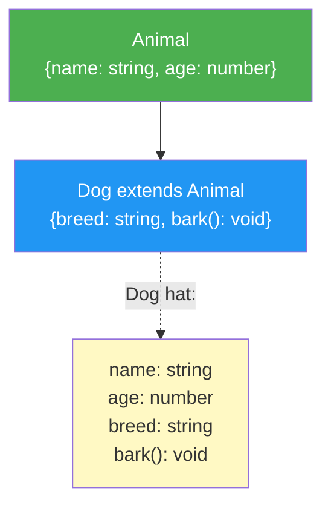

# 02 -- Interfaces & Deklaration

> Geschaetzte Lesezeit: ~10 Minuten

## Was du hier lernst

- Wie du wiederverwendbare Objekttypen mit `interface` definierst
- Wie Interfaces einander erweitern (`extends`)
- Was **Declaration Merging** ist und warum es existiert
- Wann `interface` und wann `type` die bessere Wahl ist

---

## Interfaces: Benannte Objektformen

Ein Interface gibt einer Objektstruktur einen **wiederverwendbaren Namen**:

```typescript
interface User {
  name: string;
  age: number;
  email: string;
}

const user: User = {
  name: "Max",
  age: 30,
  email: "max@test.de",
};
```

> **Analogie:** Ein Interface ist wie eine **Stellenbeschreibung**. Die Stelle
> "Frontend-Entwickler" beschreibt, welche Faehigkeiten jemand mitbringen MUSS
> (HTML, CSS, JavaScript). Wer sich bewirbt, muss MINDESTENS das koennen --
> darf aber auch mehr koennen. Genau so funktioniert ein Interface: Es beschreibt
> die Mindestanforderungen an ein Objekt.

### Interface in der Praxis: Angular und React

In Angular siehst du Interfaces ueberall -- fuer Services, Models, und Component Inputs:

```typescript
// Angular: Model fuer einen API-Response
interface HeroDto {
  id: number;
  name: string;
  power: string;
}

// React: Props-Interface fuer eine Komponente
interface UserCardProps {
  user: User;
  onEdit: (id: string) => void;
  showAvatar?: boolean;   // Optional -- dazu gleich mehr
}
```

Das Pattern ist immer dasselbe: Du beschreibst die **Form der Daten**, die eine
Komponente, ein Service oder eine Funktion erwartet.

---

## Interfaces erweitern mit `extends`

Interfaces koennen andere Interfaces erweitern -- aehnlich wie Vererbung bei Klassen,
aber **nur fuer die Typbeschreibung**, nicht fuer Verhalten:

```typescript
// Basis-Interface
interface Animal {
  name: string;
  age: number;
}

// Erweiterung: Dog hat alles von Animal + eigene Properties
interface Dog extends Animal {
  breed: string;
  bark(): void;
}

// Dog muss jetzt: name, age, breed UND bark() haben
const rex: Dog = {
  name: "Rex",
  age: 5,
  breed: "Schaeferhund",
  bark() { console.log("Wuff!"); },
};
```

### Visualisierung: Interface extends



### Mehrfach-Erweiterung

Ein Interface kann von **mehreren** Interfaces gleichzeitig erben:

```typescript
interface Trackable {
  id: string;
  createdAt: Date;
}

interface Auditable {
  lastModifiedBy: string;
  lastModifiedAt: Date;
}

// TrackedDog erbt von Animal, Trackable UND Auditable
interface TrackedDog extends Animal, Trackable, Auditable {
  breed: string;
}

// TrackedDog hat: name, age, id, createdAt,
//                 lastModifiedBy, lastModifiedAt, breed
```

> **Praxis-Tipp:** In Angular-Projekten siehst du dieses Pattern haeufig fuer
> Entity-Typen. Eine Basis wie `Identifiable` und `Timestamped` wird ueberall
> wiederverwendet:
> ```typescript
> interface BaseEntity extends Identifiable, Timestamped {
>   // Jede Entity hat automatisch id, createdAt, updatedAt
> }
> ```

---

## Declaration Merging

Ein einzigartiges Feature von Interfaces -- und der wichtigste Unterschied zu `type`:
Du kannst ein Interface an mehreren Stellen **oeffnen** und Properties hinzufuegen.
TypeScript fuegt sie automatisch zusammen:

```typescript
// Datei 1: Original aus lib.dom.d.ts
interface Window {
  document: Document;
  // ... hunderte weitere Properties
}

// Datei 2: Dein Code
interface Window {
  myCustomProperty: string;
  analytics: AnalyticsService;
}

// TypeScript merged beide Deklarationen!
// Window hat jetzt document, myCustomProperty, analytics, ...
```

### Warum existiert Declaration Merging?

> **Hintergrund:** Declaration Merging wurde nicht aus Spass erfunden. Es loest ein
> konkretes Problem: **Typen fuer bestehende globale Objekte erweitern.**
>
> Stell dir vor, du nutzt eine Library, die `window.myLib` hinzufuegt. Ohne Declaration
> Merging muesste die Library den gesamten `Window`-Typ neu definieren. Mit Merging
> kann sie einfach ihre Properties zum bestehenden `Window`-Interface hinzufuegen.
>
> Das funktioniert mit `type` Aliases **nicht** -- das ist kein Versehen, sondern
> Absicht. `type` ist "geschlossen", `interface` ist "offen".

> **Experiment-Box:** Probiere Declaration Merging im Playground:
> ```typescript
> interface Config { host: string; }
> interface Config { port: number; }
>
> const c: Config = { host: "localhost", port: 3000 };
> ```
> Jetzt versuche dasselbe mit `type`:
> ```typescript
> type Config2 = { host: string; }
> type Config2 = { port: number; }  // FEHLER!
> ```
> Die Fehlermeldung lautet: *"Duplicate identifier 'Config2'"*.
> Das ist der Beweis: `type` ist geschlossen, `interface` ist offen.

### Praxis-Beispiel: Express.js Request erweitern

```typescript
// Du moechtest req.user in Express verwenden:
declare namespace Express {
  interface Request {
    user?: {
      id: string;
      role: string;
    };
  }
}

// Jetzt kennt TypeScript req.user in allen Route-Handlern!
```

---

## Interface vs. Type Alias: Die Entscheidung

Fuer einfache Objekttypen sind **beide** voellig gleichwertig:

```typescript
// Kein echter Unterschied:
interface UserI { name: string; age: number; }
type UserT = { name: string; age: number; };
```

Aber es gibt Situationen, in denen einer dem anderen ueberlegen ist:

```
  Wann Interface?                     Wann Type Alias?
  ──────────────────────              ──────────────────────
  - Objektstrukturen definieren       - Union Types ( A | B )
  - API-Vertraege / Library-Typen     - Intersection Types ( A & B )
  - Wenn Declaration Merging          - Mapped / Conditional Types
    gewuenscht ist                    - Primitive Aliases
  - extends-Syntax bevorzugt          - Tuple Types
```

### Warum viele Teams `interface` fuer Objekte bevorzugen

1. **Bessere Fehlermeldungen:** TypeScript zeigt den Interface-Namen, nicht die aufgeloeste Struktur
2. **Declaration Merging:** Nutzer deiner Library koennen das Interface erweitern
3. **`extends` ist lesbarer** als `&` bei tiefen Hierarchien
4. **TypeScript-Docs empfehlen es:** Die offizielle Empfehlung ist "Interface, bis du etwas brauchst, das nur Type kann"

> **Denkfrage:** Du baust eine Library, die andere Entwickler verwenden.
> Solltest du `interface` oder `type` fuer die oeffentlichen API-Typen verwenden?
>
> Denke nach: Was ist, wenn ein Nutzer deiner Library einen Typ erweitern moechte?
>
> **Antwort:** `interface`! Weil Nutzer deiner Library das Interface per Declaration
> Merging erweitern koennen. Bei `type` ist das nicht moeglich. Deshalb verwenden
> Angular, React, Express und fast alle grossen Libraries Interfaces fuer ihre
> oeffentlichen Typen.

---

## Rubber-Duck-Prompt

> **Rubber-Duck-Prompt:** Erklaere einem Anfaenger in drei Saetzen:
> 1. Was ist der Unterschied zwischen einem Object Type Literal und einem Interface?
> 2. Wann wuerdest du `extends` verwenden und wann nicht?
> 3. Warum kann man ein Interface an mehreren Stellen deklarieren (Declaration Merging),
>    aber einen Type Alias nicht?

---

## Zusammenfassung

| Konzept | Beschreibung |
|---------|-------------|
| `interface` | Benannte, wiederverwendbare Objektstruktur |
| `extends` | Interface erbt alle Properties eines anderen |
| Mehrfach-`extends` | `interface C extends A, B` -- erbt von mehreren |
| Declaration Merging | Gleichnamige Interfaces werden zusammengefuegt |
| Interface vs. Type | Interface fuer Objekte, Type fuer Unions/Mapped Types |

---

**Was du gelernt hast:** Du kannst Interfaces definieren, erweitern, und weisst, wann
`interface` besser passt als `type`.

| [<-- Vorherige Sektion](01-objekt-typen-basics.md) | [Zurueck zur Uebersicht](../README.md) | [Naechste Sektion: Structural Typing -->](03-structural-typing.md) |
