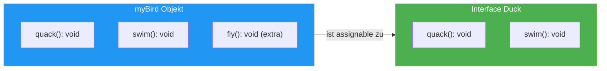

# 03 -- Structural Typing

> Geschaetzte Lesezeit: ~12 Minuten

## Was du hier lernst

- Was **Structural Typing** ist und wie es sich von **Nominal Typing** unterscheidet
- WARUM TypeScript structural typisiert (die Designentscheidung)
- Die formale Regel: **Width Subtyping**
- Wann Structural Typing an seine Grenzen stoesst (Euro/Dollar-Problem)
- Wie das Ganze in Angular und React relevant ist

---

## Die grosse Idee

> **Fun Fact:** Der Name "Duck Typing" stammt von dem amerikanischen Dichter
> James Whitcomb Riley (ca. 1890er):
> *"When I see a bird that walks like a duck and swims like a duck and quacks
> like a duck, I call that bird a duck."*
>
> Das ist kein Programmierer-Witz -- es ist ein philosophisches Argument ueber
> **Identitaet durch Verhalten**. Wenn etwas sich wie eine Ente verhaelt, dann ist
> es fuer alle praktischen Zwecke eine Ente -- egal was auf dem Namensschild steht.

TypeScript uebernimmt genau dieses Prinzip. Es prueft nicht den **Namen** eines Typs,
sondern seine **Struktur**. Wenn ein Objekt alle benoetigten Properties hat, passt es --
egal wie der Typ heisst.

```typescript
interface Duck {
  quack(): void;
  swim(): void;
}

const myBird = {
  quack() { console.log("Quack!"); },
  swim() { console.log("*schwimmt*"); },
  fly() { console.log("*fliegt*"); },  // Extra -- stoert nicht!
};

function feedDuck(d: Duck): void {
  d.quack();
  d.swim();
}

feedDuck(myBird);  // Funktioniert! myBird hat quack + swim.
```

`myBird` wurde nie als `Duck` deklariert. Es hat nicht mal einen Typnamen. Aber es hat
`quack()` und `swim()` -- also ist es fuer TypeScript eine Ente.

> 🧠 **Erklaere dir selbst:** Was bedeutet "Structural Typing"? Warum kann `myBird` als `Duck` verwendet werden, obwohl es nie als `Duck` deklariert wurde? Was wuerde in Java oder C# passieren?
> **Kernpunkte:** Struktur zaehlt, nicht Name | myBird hat quack+swim = erfuellt Duck | Extra-Methode fly stoert nicht | In Java/C#: muesste explizit Duck implementieren

### Visualisierung: Structural Typing in Aktion



Die entscheidende Einsicht: TypeScript prueft ob `myBird` **mindestens** alles hat,
was `Duck` verlangt. Die Extra-Methode `fly()` wird ignoriert -- sie schadet nicht,
sie wird einfach nicht benoetigt.

> **Rubber-Duck-Prompt:** Erklaere einem Kollegen in eigenen Worten:
> "Warum kann `myBird` als `Duck` verwendet werden, obwohl es nie als `Duck` deklariert
> wurde und sogar eine Extra-Methode hat?" Wenn du dabei ins Stocken geraetst, lies
> den Abschnitt nochmal.

---

## Structural vs. Nominal Typing: Der Vergleich

```
  Nominal Typing (Java, C#, Rust)     Structural Typing (TypeScript, Go)
  ───────────────────────────────      ────────────────────────────────────
  "Was IST dieses Objekt?"            "Was HAT dieses Objekt?"

  class Dog { name: string; }          type Dog = { name: string; }
  class Cat { name: string; }          type Cat = { name: string; }

  Dog und Cat sind VERSCHIEDEN,        Dog und Cat sind GLEICH,
  obwohl sie dieselbe Struktur         weil sie dieselbe Struktur
  haben. Der NAME zaehlt.             haben. Der Name ist egal.
```

> **Hintergrund:** Anders Hejlsberg designte C# mit nominalem Typing. Als er
> TypeScript entwarf, stand er vor einer Wahl: Dasselbe System uebernehmen --
> oder ein neues waehlen, das besser zu JavaScript passt.
>
> Er waehlte Structural Typing. Der Grund ist pragmatisch: JavaScript hat kein
> nominales Typsystem. Objekte in JS sind einfach Saecke voller Properties.
> `typeof` gibt nur `"object"` zurueck, `instanceof` prueft nur die
> Prototyp-Kette. Wenn TypeScript nominale Typen erzwungen haette, waere ein
> Grossteil des bestehenden JavaScript-Codes nicht typisierbar gewesen.

### Warum auch Go structural typing nutzt

> **Hintergrund:** TypeScript ist nicht allein. Go (entwickelt bei Google von
> Rob Pike, Ken Thompson und Robert Griesemer) nutzt ebenfalls Structural Typing
> fuer seine Interfaces -- aus aehnlichen Gruenden:
>
> In Go implementiert ein Typ ein Interface automatisch, wenn er die richtigen
> Methoden hat. Es gibt kein `implements`-Keyword. Die Go-Designer argumentierten:
> *"If it has the right methods, it satisfies the interface. Period."*
>
> Das fuehrt zu loserer Kopplung und einfacherer Kompositierbarkeit -- genau wie
> in TypeScript.

---

## Width Subtyping: Die formale Regel

Hinter dem "Duck Typing"-Spruch steckt eine praezise Regel:

**Typ A ist ein Subtyp von B, wenn A MINDESTENS alle Properties von B hat.**

```
  Width Subtyping
  ───────────────

  { x: number, y: number, z: number }   ist Subtyp von   { x: number, y: number }
       3 Properties  >=  2 Properties

  Mehr Properties = speziellerer Typ = Subtyp
  Weniger Properties = allgemeinerer Typ = Supertyp

  Subtyp --> Supertyp:   IMMER erlaubt (Upcasting)
  Supertyp --> Subtyp:   FEHLER (Downcasting -- Information fehlt!)
```

### Die Lebenslauf-Analogie

> **Analogie:** Stell dir eine Stellenanzeige vor:
> "Gesucht: Deutsch und Englisch."
>
> Du sprichst Deutsch, Englisch und Franzoesisch. Bist du qualifiziert?
> **Ja!** Dein Extra-Skill (Franzoesisch) schadet nicht.
>
> Dein Lebenslauf (3 Sprachen) ist ein **Subtyp** der Stellenanzeige (2 Sprachen).
> Du hast MINDESTENS das Geforderte -- also passt du.

Das ist exakt, was TypeScript macht:

```typescript annotated
interface HasName {
  name: string;
// ^ HasName verlangt NUR eine Property: name vom Typ string
}

const person = {
  name: "Max",
// ^ Erfuellt die Anforderung von HasName
  age: 30,
// ^ Extra-Property -- stoert nicht (Width Subtyping)
  email: "m@t.de"
// ^ Noch eine Extra-Property -- wird einfach ignoriert
};

const named: HasName = person;
// ^ OK! person hat MINDESTENS name: string (Structural Typing)
```

> **Experiment-Box:** Probiere das selbst aus! Oeffne den TypeScript Playground und
> schreibe den obigen Code. Dann:
> 1. Hover ueber `named` -- welchen Typ zeigt der Compiler an?
> 2. Entferne `name` aus dem `person`-Objekt -- was passiert?
> 3. Aendere den Typ von `name` auf `number` im Objekt -- welche Fehlermeldung kommt?
>
> Beobachte: TypeScript prueft **Existenz** und **Typ-Kompatibilitaet** jeder
> geforderten Property, ignoriert aber alles Zusaetzliche.

### Das Gegenteil: Zu wenig geht nicht

```typescript
const incomplete = {
  email: "m@t.de"
  // name fehlt!
};

// FEHLER: Property 'name' is missing in type '{ email: string }'
const named: HasName = incomplete;
```

"Gesucht: Deutsch und Englisch." Du sprichst nur Franzoesisch? Nicht qualifiziert.

---

## Structural Typing in Angular und React

### Angular: Dependency Injection

Angulars DI-System nutzt Structural Typing nicht direkt (es arbeitet mit Tokens),
aber das Konzept ist bei **Mocking in Tests** entscheidend:

```typescript
// Der echte Service
@Injectable()
class UserService {
  getUser(id: string): Observable<User> { /* HTTP-Call */ }
  updateUser(user: User): Observable<void> { /* HTTP-Call */ }
}

// Im Test: Mock muss nur die GENUTZTEN Methoden haben
const mockService = {
  getUser: jasmine.createSpy().and.returnValue(of(mockUser)),
  // updateUser fehlt -- aber wenn die Komponente es nicht nutzt, ist das OK
  // dank Structural Typing!
};

// Wenn die Komponente nur getUser() aufruft:
TestBed.configureTestingModule({
  providers: [{ provide: UserService, useValue: mockService as any }]
});
```

### React: Props sind strukturell

```typescript
interface ButtonProps {
  label: string;
  onClick: () => void;
}

function Button({ label, onClick }: ButtonProps) {
  return <button onClick={onClick}>{label}</button>;
}

// Du kannst ein Objekt mit MEHR Properties uebergeben:
const config = {
  label: "Klick mich",
  onClick: () => console.log("geklickt"),
  icon: "star",       // Extra -- wird von Button ignoriert
  disabled: false,     // Extra
};

// Funktioniert! config hat label + onClick.
// (In JSX greift allerdings Excess Property Checking --
//  dazu mehr in der naechsten Sektion)
```

---

## Wann Structural Typing NICHT reicht: Das Euro/Dollar-Problem

Structural Typing hat einen Preis. Wenn zwei Typen zufaellig dieselbe Struktur haben,
aber semantisch VERSCHIEDEN sind, kann TypeScript sie nicht unterscheiden:

```typescript
type Euro = { amount: number; };
type Dollar = { amount: number; };

function chargeInEuro(price: Euro): void {
  console.log(`Berechne ${price.amount} EUR`);
}

const usdPrice: Dollar = { amount: 100 };

chargeInEuro(usdPrice);  // KEIN Fehler! Gleiche Struktur.
// Aber logisch FALSCH: 100 Dollar != 100 Euro!
```

> **Denkfrage:** Warum ist das ein Problem? Weil der Compiler dir nicht hilft, wenn
> du versehentlich Dollar statt Euro uebergibst. In einem Finanzsystem kann das
> katastrophale Folgen haben.
>
> Das ist kein Designfehler -- es ist ein bewusster Trade-off. TypeScript opfert
> nominale Sicherheit fuer JavaScript-Kompatibilitaet.

### Die Loesung: Branded Types (Vorschau)

```typescript
// Ein "kuenstliches" nominales Feld einfuegen:
type Euro = { amount: number; readonly __brand: "EUR" };
type Dollar = { amount: number; readonly __brand: "USD" };

function chargeInEuro(price: Euro): void { /* ... */ }

const usdPrice = { amount: 100 } as Dollar;

// chargeInEuro(usdPrice);  // FEHLER! "USD" ist nicht "EUR"
```

Das `__brand`-Feld existiert nur im Typsystem -- zur Laufzeit gibt es es nicht.
Die vollstaendige Erklaerung kommt in Lektion 24 (Branded Types).

---

## Structural Typing und Kovarianz (Vorschau)

> **Tieferes Wissen:** Structural Typing und Width Subtyping fuehren direkt zu einem
> wichtigen Konzept: **Kovarianz**. Wenn `Dog` ein Subtyp von `Animal` ist (weil Dog
> alle Properties von Animal hat plus mehr), dann gilt:
>
> - `Dog[]` ist ein Subtyp von `Animal[]` (kovariant -- der Container "erbt" die Beziehung)
> - `(animal: Animal) => void` ist **NICHT** ein Subtyp von `(dog: Dog) => void`
>   (Parameter sind kontravariant -- hier dreht sich die Beziehung um)
>
> Das klingt jetzt abstrakt, wird aber in Lektion 06 (Functions) und Lektion 14
> (Variance) entscheidend. Merke dir fuer jetzt nur: **Structural Typing bestimmt,
> WAS ein Subtyp ist. Varianz bestimmt, WO dieser Subtyp eingesetzt werden darf.**

---

## Kernkonzepte zum Merken

```
  TypeScript ist structural, weil JavaScript structural ist.
  ──────────────────────────────────────────────────────────

  1. Pruefe die STRUKTUR, nicht den NAMEN
  2. Mehr Properties = Subtyp (Width Subtyping)
  3. Der Preis: Semantisch verschiedene Typen mit gleicher
     Struktur (Euro/Dollar) werden nicht unterschieden
  4. Die Loesung: Branded Types (Lektion 24)
  5. Subtyp-Beziehungen fliessen in Varianz ein (Lektion 14)
```

---

## Zusammenfassung

| Konzept | Beschreibung |
|---------|-------------|
| Structural Typing | Kompatibilitaet basiert auf Struktur, nicht auf Namen |
| Nominal Typing | Kompatibilitaet basiert auf dem deklarierten Typnamen (Java, C#) |
| Duck Typing | "Wenn es quakt wie eine Ente..." -- die philosophische Grundlage |
| Width Subtyping | Mehr Properties = Subtyp (spezieller) |
| Euro/Dollar-Problem | Grenzen des Structural Typing |
| Branded Types | Kuenstliches nominales Feld als Workaround (tiefer in Lektion 24) |

---

**Was du gelernt hast:** Du verstehst die Designentscheidung hinter Structural Typing,
kannst Width Subtyping erklaeren, und kennst die Grenzen des Systems.

> **Praxis-Tipp fuer JETZT:** Wenn du heute in deinem Angular-Projekt
> zwei Typen mit gleicher Struktur hast die du unterscheiden musst
> (z.B. `UserId` vs `ProductId`, beide `{ value: number }`),
> dann kannst du das Branded-Type-Pattern **sofort** verwenden —
> du musst nicht bis Lektion 24 warten:
>
> ```typescript
> type UserId = number & { readonly __brand: "UserId" };
> type ProductId = number & { readonly __brand: "ProductId" };
>
> function getUser(id: UserId) { /* ... */ }
> function getProduct(id: ProductId) { /* ... */ }
>
> // getUser(42 as ProductId);  // FEHLER! TypeScript schuetzt dich.
> ```
>
> Das ist kein "fortgeschrittenes" Feature — es ist ein einfaches,
> pragmatisches Pattern das du ab heute nutzen kannst.

| [<-- Vorherige Sektion](02-interfaces-deklaration.md) | [Zurueck zur Uebersicht](../README.md) | [Naechste Sektion: Excess Property Checking -->](04-excess-property-checking.md) |
