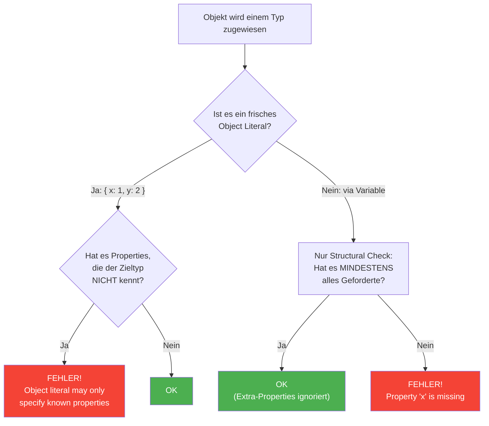

# 04 -- Excess Property Checking

> Geschaetzte Lesezeit: ~10 Minuten

## Was du hier lernst

- Was **Excess Property Checking** ist und wann es greift
- Warum TypeScript diese Ausnahme vom Structural Typing eingefuehrt hat
- Die Regel: "fresh" Object Literals vs. Variablen
- Drei Wege, den Check zu umgehen (und wann das sinnvoll ist)
- Wie sich das in Angular Templates und React JSX auswirkt

---

## Die grosse Falle

In der letzten Sektion hast du gelernt: TypeScript prueft die Struktur, und Extra-Properties
sind erlaubt. **Ausser** in einem speziellen Fall:

```typescript annotated
interface HasName {
  name: string;
}

// FEHLER! Object literal may only specify known properties.
const named: HasName = {
// ^^^^^^^^^^^^^^^^^^^^^ Das ist ein FRISCHES Object Literal -- direkt zugewiesen
  name: "Max",
// ^^^^^^^^^^^^ OK: 'name' kennt HasName
  age: 30,
// ^^^^^^^ FEHLER! 'age' existiert nicht in HasName -- Excess Property!
  // TypeScript fragt: "Wenn du 'age' tippst, hast du dich vielleicht
  //  bei 'name' vertippt? Das klingt nach einem Bug."
};
```

> 🧠 **Erklaere dir selbst:** Warum erlaubt TypeScript Extra-Properties bei Variablen
> (Structural Typing), aber verbietet sie bei frischen Object Literals?
> Was ist der pragmatische Grund fuer diesen Sonderfall?
>
> **Kernpunkte:** Structural Typing braucht Extra-Properties fuer Subtyping (Dog mit
> extra Methode als Animal) | Aber in frischen Literals sind Extra-Properties fast
> immer Tippfehler | TypeScript fuehrt gezielten Excess Check nur bei Literals durch |
> Historisch: TS 1.6 als nachtraegliche Sicherheitsmassnahme | Design-Prinzip:
> Chirurgisch eingreifen, Rest des Systems nicht veraendern

Warte -- wir haben gerade gesagt, Extra-Properties sind OK? Was ist passiert?

Der Unterschied: Hier wird ein **frisches Object Literal** (also `{ ... }` direkt
geschrieben) einem Typ zugewiesen. TypeScript fuehrt in diesem Fall einen
**zusaetzlichen Check** durch, der ueber Structural Typing hinausgeht.

---

## Warum existiert dieser Check?

> **Hintergrund:** Excess Property Checking wurde nicht von Anfang an in TypeScript
> eingebaut. Es wurde in **TypeScript 1.6** (September 2015) als nachtraegliche
> Sicherheitsmassnahme eingefuehrt. Der Grund: Die TypeScript-Maintainer beobachteten,
> dass Tippfehler in Object Literals eine der haeufigsten Fehlerquellen waren --
> und Structural Typing allein fing sie nicht ab.

Das klassische Beispiel:

```typescript
interface Options {
  color: string;
  width: number;
}

// Tippfehler -- 'colour' statt 'color'!
const opts: Options = {
  colour: "red",  // FEHLER! Gott sei Dank!
  width: 100,
  // Bonus: 'color' fehlt -- zweiter Fehler
};
```

Ohne Excess Property Checking wuerde TypeScript sagen: "Du hast `width: number`, das passt.
`colour` ist halt ein Extra." Der Tippfehler wuerde durchrutschen, und dein Element haette
keine Farbe.

> **Designentscheidung:** Die TypeScript-Maintainer standen vor einem Dilemma:
>
> - Structural Typing sagt: Extra-Properties sind OK
> - Aber bei frischen Literals sind Extra-Properties fast IMMER Bugs
>
> Ihre Loesung: Einen **Sonderfall** einfuehren, der nur bei frischen Object Literals
> greift. So bleibt Structural Typing fuer Variablen und Ausdruecke intakt, aber
> die haeufigsten Tippfehler werden abgefangen.

---

## Die Regel: Frisch vs. Nicht-Frisch

### Der Entscheidungsbaum



```
  Excess Property Checking -- Wann greift es?
  ────────────────────────────────────────────

  "Frisches" Object Literal    -->  Excess Properties werden GEPRUEFT
  Variable / Ausdruck          -->  NUR strukturelle Kompatibilitaet

  // FEHLER: Frisches Object Literal
  const a: HasName = { name: "Max", age: 30 };
                                     ^^^^^^^ Excess!

  // OK: Ueber Variable (nicht mehr "frisch")
  const temp = { name: "Max", age: 30 };
  const b: HasName = temp;  // Kein Excess Check!
```

**Was bedeutet "frisch"?** Ein Object Literal gilt als "frisch", wenn es **direkt** an
der Stelle geschrieben wird, wo es verwendet wird -- also nicht vorher einer Variablen
zugewiesen wurde.

### Noch ein Beispiel: Funktionsparameter

```typescript
interface Config {
  host: string;
  port: number;
}

function startServer(config: Config): void { /* ... */ }

// FEHLER: Frisches Literal direkt als Argument
startServer({ host: "localhost", port: 3000, debug: true });
//                                           ^^^^^ Excess!

// OK: Ueber Variable
const myConfig = { host: "localhost", port: 3000, debug: true };
startServer(myConfig);  // Kein Fehler!
```

---

## Die drei Umgehungswege

Es gibt Situationen, in denen du den Excess Property Check bewusst umgehen willst.
Drei Wege:

### 1. Ueber eine Variable (haeufigster Weg)

```typescript
const data = { name: "Max", age: 30 };
const named: HasName = data;  // OK
```

> **Praxis-Tipp:** Das ist der sauberste Weg. Du sagst damit: "Ich weiss, dass
> dieses Objekt mehr Properties hat als noetig, und das ist Absicht."

### 2. Type Assertion

```typescript
const named = { name: "Max", age: 30 } as HasName;
```

> **Warnung:** Type Assertions umgehen JEDE Pruefung. Wenn du dich vertippst
> (`{ naem: "Max" } as HasName`), gibt es keinen Fehler. Deshalb ist Weg 1
> fast immer besser.

### 3. Index Signature

```typescript
interface HasNameFlexible {
  name: string;
  [key: string]: unknown;  // Erlaube beliebige Extra-Properties
}

const named: HasNameFlexible = {
  name: "Max",
  age: 30,      // OK -- Index Signature erlaubt alles
};
```

> **Praxis-Tipp:** Nutze Index Signatures, wenn du ein Interface entwirfst, das
> bewusst erweiterbar sein soll (z.B. Plugin-Konfigurationen, dynamische Formulare).

---

## Excess Property Checking in Frameworks

### Angular: Component Inputs

```typescript
@Component({
  selector: 'app-user',
  template: '...',
})
export class UserComponent {
  @Input() name!: string;
  @Input() age!: number;
}

// Im Template:
// <app-user [name]="'Max'" [age]="30" [role]="'admin'"></app-user>
//                                      ^^^^^^ Angular-Template-Compiler
//                                      meldet: 'role' is not a known property
```

Angulars Template-Compiler fuehrt eine aehnliche Pruefung wie Excess Property Checking
durch -- unbekannte Inputs werden als Fehler markiert (seit `strictTemplates`).

### React: JSX Props

```typescript
interface ButtonProps {
  label: string;
  onClick: () => void;
}

function Button(props: ButtonProps) { /* ... */ }

// FEHLER: Excess Property Check greift in JSX!
<Button label="OK" onClick={() => {}} color="red" />
//                                     ^^^^^ Excess!
```

JSX-Attribute werden wie frische Object Literals behandelt -- deshalb greift der
Excess Property Check auch hier.

---

## Die Denkfrage: Warum NUR bei frischen Literals?

> **Denkfrage:** Stell dir vor, TypeScript wuerde Excess Properties auch bei
> Variablen verbieten. Was wuerde passieren?

Denk an eine Funktion, die nur den Namen eines Objekts liest:

```typescript
function greet(user: { name: string }): string {
  return `Hallo, ${user.name}!`;
}
```

Wenn Extra-Properties auch bei Variablen verboten waeren:

```typescript
const fullUser = { name: "Max", age: 30, email: "m@test.de" };
greet(fullUser);  // FEHLER?! age und email sind "excess"!
```

Das gesamte Structural Typing wuerde zusammenbrechen. Funktionen koennten nur noch
Objekte mit **exakt** den richtigen Properties annehmen -- kein Subtyping mehr.
Du koenntest keinen `Dog` an eine Funktion uebergeben, die ein `Animal` erwartet,
weil `Dog` Extra-Properties hat.

**Fazit:** Excess Property Checking ist ein **chirurgisch praeziser Eingriff** --
er greift nur dort, wo Extra-Properties fast sicher ein Bug sind (frische Literals),
und laesst den Rest des Typsystems unberuehrt.

---

## Experiment-Box: Der Unterschied live erleben

> **Experiment:** Schreibe den folgenden Code im TypeScript Playground und beobachte,
> was passiert:
>
> ```typescript
> interface Config {
>   host: string;
>   port: number;
> }
>
> // Schritt 1: Direktes Literal
> const c1: Config = { host: "localhost", port: 3000, debug: true };
> // --> Fehler!
>
> // Schritt 2: Ueber Variable
> const temp = { host: "localhost", port: 3000, debug: true };
> const c2: Config = temp;
> // --> Kein Fehler!
>
> // Schritt 3: Was passiert bei Funktionsparametern?
> function startServer(config: Config) { }
> startServer({ host: "localhost", port: 3000, debug: true });
> // --> ???
> startServer(temp);
> // --> ???
> ```
>
> **Beobachte:** Schritt 3 verhaelt sich genau wie Schritt 1/2. Funktionsargumente
> sind ebenfalls "frische Literals" wenn du `{ ... }` direkt schreibst. Ueber eine
> Variable umgehst du den Check.
>
> **Die Kernfrage:** Warum ist die Variable kein frisches Literal mehr?
> Weil TypeScript den Typ der Variable bereits beim Zuweisen berechnet hat.
> An der Stelle `const c2: Config = temp` prueft es nur noch strukturelle
> Kompatibilitaet -- und `temp` hat alles was `Config` braucht.

---

## Fehlermeldungen verstehen: Zwei verschiedene Fehler

Excess Property Checking und fehlende Properties erzeugen **verschiedene**
Fehlermeldungen. Den Unterschied zu kennen ist entscheidend fuer das Debugging:

```
  FEHLER 1: Excess Property
  ─────────────────────────
  "Object literal may only specify known properties,
   and 'debug' does not exist in type 'Config'"

  --> Du hast ein EXTRA-Property im frischen Literal.
  --> Das Objekt hat ZU VIEL.

  FEHLER 2: Missing Property
  ──────────────────────────
  "Type '{ host: string }' is not assignable to type 'Config'.
   Property 'port' is missing in type '{ host: string }'
   but required in type 'Config'."

  --> Dem Objekt FEHLT etwas, das der Zieltyp verlangt.
  --> Das Objekt hat ZU WENIG.
```

> **Denkfrage:** Du siehst die Fehlermeldung *"Object literal may only specify known
> properties"*. Was weisst du jetzt sofort?
>
> **Antwort:** Du weisst drei Dinge: (1) Es ist ein frisches Object Literal,
> (2) alle Pflicht-Properties sind vorhanden (sonst kaeme ein anderer Fehler zuerst),
> und (3) es gibt mindestens ein Property das der Zieltyp nicht kennt.

---

## Zusammenfassung

| Konzept | Beschreibung |
|---------|-------------|
| Excess Property Check | Zusaetzliche Pruefung bei frischen Object Literals |
| "Frisch" | Object Literal direkt geschrieben, nicht ueber Variable |
| Warum es existiert | Tippfehler in Object Literals abfangen |
| Umgehung: Variable | Objekt vorher einer Variablen zuweisen |
| Umgehung: Assertion | `as Type` -- unsicher, vermeiden |
| Umgehung: Index Signature | `[key: string]: unknown` im Interface |

---

**Was du gelernt hast:** Du verstehst die Ausnahme vom Structural Typing, kennst
die Geschichte dahinter, und weisst, wann und wie du sie umgehst.

| [<-- Vorherige Sektion](03-structural-typing.md) | [Zurueck zur Uebersicht](../README.md) | [Naechste Sektion: Readonly & Optional -->](05-readonly-und-optional.md) |
