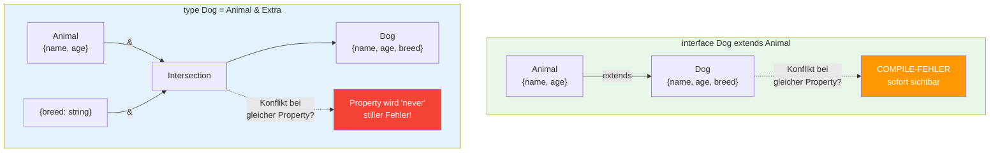
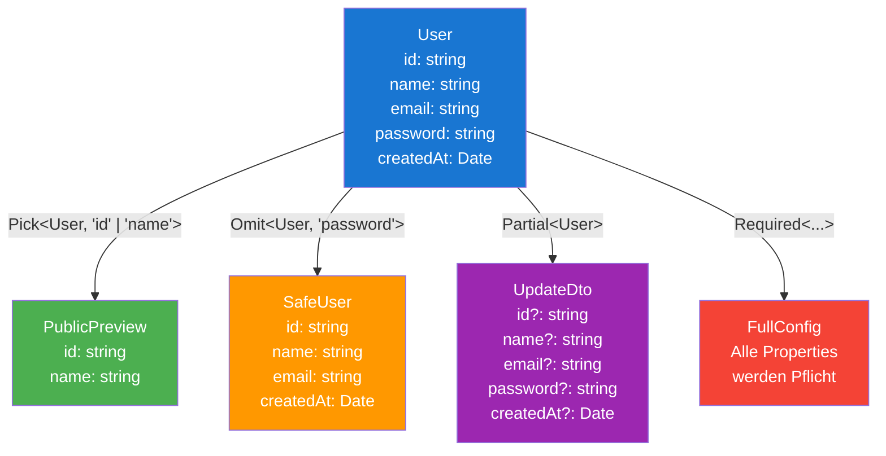

# 07 -- Intersection & Utility Types

> Geschaetzte Lesezeit: ~12 Minuten

## Was du hier lernst

- Wie der **Intersection-Operator `&`** funktioniert und wann er `never` erzeugt
- Den Unterschied zwischen `extends` und `&`
- Die vier wichtigsten Utility Types: `Partial`, `Pick`, `Omit`, `Required`
- Praxis-Patterns fuer Angular und React (API-Responses, Form State, Composition)
- Discriminated Unions als Vorschau

> **Hinweis:** Die Utility Types (`Partial`, `Pick`, `Omit`, `Required`)
> sind hier erstmals zu sehen. Wie sie **intern funktionieren** (Mapped Types)
> lernst du in **Lektion 16** im Detail. Fuer jetzt: Verstehe was sie tun,
> nicht wie sie implementiert sind. In **Lektion 15** bekommst du alle
> Built-in Utility Types als komplette Uebersicht.

---

## Intersection Types: Die Grundidee

Neben Interfaces und `extends` gibt es einen zweiten Weg, Objekttypen zu kombinieren --
den **Intersection-Operator `&`**:

```typescript
type HasName = { name: string };
type HasAge = { age: number };

// Intersection: Ein Typ der BEIDES gleichzeitig erfuellen muss
type Person = HasName & HasAge;

const person: Person = {
  name: "Max",
  age: 30,
};
// person muss ALLE Properties aus HasName UND HasAge haben
```

> **Analogie:** Eine Intersection ist wie eine **UND-Verknuepfung** in einer
> Stellenanzeige: "Bewerber muss Deutsch UND Englisch sprechen UND Erfahrung
> mit Angular haben." Jede einzelne Anforderung ist ein Typ, und die Intersection
> sagt: Du musst ALLE gleichzeitig erfuellen.

```
  Intersection = UND
  ──────────────────

  type A = { x: number }      type B = { y: string }

  A & B = {                    Muss ALLES haben:
    x: number;                 - x aus A
    y: string;                 - y aus B
  }
```

---

## `extends` vs. `&` -- Was ist der Unterschied?

```typescript
// Mit extends:
interface Animal { name: string; }
interface Dog extends Animal { breed: string; }

// Mit &:
type Animal2 = { name: string; };
type Dog2 = Animal2 & { breed: string; };
```

Beide erzeugen den gleichen resultierenden Typ. Aber es gibt wichtige Unterschiede:

### Visualisierung: extends vs. &



| Eigenschaft | `extends` | `&` |
|-------------|-----------|-----|
| Funktioniert mit | `interface` | `type` (und `interface`) |
| Konflikte bei gleicher Property | **Compile-Fehler** | Intersection des Property-Typs |
| Lesbarkeit | Klare Hierarchie | Flache Komposition |
| Fehlermeldungen | Zeigt Interface-Namen | Zeigt aufgeloeste Struktur |
| Performance | Gecacht | Wird jedes Mal neu berechnet |

> **Tieferes Wissen:** Die Performance-Unterschiede sind in der Praxis selten
> spuerbar. Aber in sehr grossen Codebases (1000+ Typen) kann es messbar werden:
> `interface extends` wird vom Compiler gecacht, `&` wird bei jeder Verwendung
> neu berechnet. Die TypeScript-Docs empfehlen deshalb `interface extends` fuer
> einfache Vererbung.

---

## Intersection-Konflikte: Wann `never` entsteht

Das ist die **wichtigste Falle** bei Intersections:

```typescript
type A = { status: string };
type B = { status: number };

type C = A & B;
// status ist jetzt: string & number = never!

> 🧠 **Erklaere dir selbst:** Warum ergibt `string & number` den Typ `never`? Was bedeutet eine Intersection bei primitiven Typen? Und warum gibt `extends` stattdessen einen Compile-Fehler?
> **Kernpunkte:** Kein Wert kann gleichzeitig string UND number sein | Intersection inkompatibler Typen = never (leere Menge) | extends meldet Konflikt sofort | & erzeugt stilles never
```

Warum? Ein Wert kann nicht gleichzeitig `string` UND `number` sein. Die Intersection
zweier inkompatibler Typen ergibt `never` -- den "unmoeglichen" Typ.

```typescript
// const obj: C = { status: ??? };  // Unmoeglich! Kein Wert ist string & number.
```

> **Denkfrage:** Was passiert bei `extends` mit demselben Konflikt?
>
> ```typescript
> interface A { status: string; }
> interface B extends A { status: number; }
> // COMPILE-FEHLER! "Type 'number' is not assignable to type 'string'"
> ```
>
> `extends` gibt einen Fehler. `&` erzeugt `never`. Das macht `extends` in
> diesem Fall sicherer -- du erfaehrst sofort vom Konflikt.

### Kompatible Typen werden verfeinert

Wenn die Typen kompatibel sind, verengt die Intersection:

```typescript
type D = { value: string | number };
type E = { value: number };

type F = D & E;
// value ist: (string | number) & number = number
// Die Intersection VERENGT den Typ!
```

---

## Praxis-Pattern: Composition ueber Intersection

In der Praxis werden Intersections fuer **modulare Typen** verwendet -- wiederverwendbare
Bausteine, die frei kombiniert werden:

```typescript
// Wiederverwendbare "Mixins":
type Timestamped = {
  createdAt: Date;
  updatedAt: Date;
};

type SoftDeletable = {
  deletedAt: Date | null;
  isDeleted: boolean;
};

type Identifiable = {
  id: string;
};

// Frei kombinierbar:
type User = Identifiable & Timestamped & {
  name: string;
  email: string;
};

type ArchivedPost = Identifiable & Timestamped & SoftDeletable & {
  title: string;
  content: string;
};
```

> **Praxis-Tipp:** Dieses Pattern ist in Angular- und React-Projekten weit verbreitet,
> besonders fuer API-Response-Typen. Statt eine riesige Interface-Hierarchie zu bauen,
> komponierst du kleine, fokussierte Typen.

---

## Die vier Utility Types fuer Objekte

TypeScript hat eingebaute Utility Types, die bestehende Objekttypen transformieren.
Die vollstaendige Behandlung kommt in Lektion 15 -- aber diese vier brauchst du jetzt:

### 1. Partial<T> -- Alle Properties optional

```typescript
interface User {
  name: string;
  email: string;
  age: number;
}

// Partial<User> = { name?: string; email?: string; age?: number }
function updateUser(id: string, changes: Partial<User>): void {
  console.log(`Update user ${id}:`, changes);
}

updateUser("u1", { name: "Neuer Name" });   // OK -- nur name
updateUser("u1", { email: "new@test.de" }); // OK -- nur email
updateUser("u1", {});                        // OK -- nichts aendern
```

**Typisches Einsatzgebiet:** Update-Funktionen, PATCH-Requests, Form State.

### 2. Pick<T, K> -- Bestimmte Properties auswaehlen

```typescript annotated
type Pick<T, K extends keyof T> = {
// ^ K muss ein gueltiger Key von T sein (Constraint)
  [P in K]: T[P];
// ^ Iteriert ueber K  (nimmt Wert des Properties P aus T)
};
// ^ Mapped Type: erzeugt neues Objekt mit ausgewaehlten Keys

type PublicUser = Pick<User, "id" | "name" | "email">;
// ^ Nur id, name, email -- sensible Daten wie password ausgeschlossen
```

> 🧠 **Erklaere dir selbst:** Warum braucht `Pick` das Constraint `K extends keyof T`? Was wuerde ohne dieses Constraint passieren? Was bedeutet `[P in K]: T[P]`?
> **Kernpunkte:** K muss gueltiger Key sein | Ohne: T[P] waere unsicher, beliebige Keys moeglich | Compiler-Error bei ungueltigen Keys | [P in K] iteriert ueber die gewaehlten Keys

### 3. Omit<T, K> -- Bestimmte Properties entfernen

```typescript
// Alles AUSSER password -- das Gegenteil von Pick
type SafeUser = Omit<User, "password">;
// { id: string; name: string; email: string; createdAt: Date }
```

### 4. Required<T> -- Alle Properties pflicht

(Schon in Sektion 05 behandelt -- der Vollstaendigkeit halber hier nochmal.)

```typescript
type FullConfig = Required<Config>;
// Alle optionalen Properties werden zu Pflichtfeldern
```

### Wie sie zusammenspielen



```
  User
  ┌──────────────────────────────────┐
  | id: string                       |
  | name: string                     |
  | email: string                    |
  | password: string                 |
  | createdAt: Date                  |
  └──────────────────────────────────┘
         |              |             |
    Pick<,"id|name">   Omit<,"pwd">  Partial<>
         |              |             |
         v              v             v
  ┌──────────┐  ┌──────────────┐  ┌──────────────────┐
  | id       |  | id           |  | id?              |
  | name     |  | name         |  | name?            |
  └──────────┘  | email        |  | email?           |
                | createdAt    |  | password?        |
                └──────────────┘  | createdAt?       |
                                  └──────────────────┘
```

> **Rubber-Duck-Prompt:** Erklaere einem Kollegen den Unterschied zwischen
> `Pick` und `Omit`. Wann wuerdest du welches verwenden? Tipp: Denke an
> "ich waehle AUS" vs. "ich schliesse AUS". Wenn du viele Properties behalten
> willst und nur wenige entfernen, ist `Omit` effizienter -- und umgekehrt.

---

## Praxis-Patterns: Objekte in der echten Welt

### Pattern 1: API Response Types

```typescript
interface ApiResponse<T> {
  data: T;
  status: number;
  message: string;
  timestamp: Date;
}

interface UserDto {
  id: string;
  name: string;
  email: string;
}

type UserResponse = ApiResponse<UserDto>;
type UserListResponse = ApiResponse<UserDto[]>;

// Fehler-Response: Intersection von ApiResponse + Error-Infos
interface ApiError {
  code: string;
  message: string;
  details?: Record<string, string[]>;
}

type ErrorResponse = ApiResponse<null> & { error: ApiError };
```

### Pattern 2: Angular Component mit Inputs

```typescript
// Basis-Props die jede Card hat:
interface CardBaseProps {
  title: string;
  subtitle?: string;
  elevation?: number;
}

// Spezifische Cards erweitern die Basis:
interface UserCardProps extends CardBaseProps {
  user: UserDto;
  onEdit: (id: string) => void;
}

interface ProductCardProps extends CardBaseProps {
  product: ProductDto;
  onAddToCart: (productId: string) => void;
}
```

### Pattern 3: React Form State

```typescript
interface LoginForm {
  username: string;
  password: string;
  rememberMe: boolean;
}

type FormField<T> = {
  value: T;
  error: string | null;
  touched: boolean;
  dirty: boolean;
};

// Mapped Type (Vorschau -- Lektion 16):
type FormState<T> = {
  [K in keyof T]: FormField<T[K]>;
};

// FormState<LoginForm> ergibt:
// {
//   username: FormField<string>;
//   password: FormField<string>;
//   rememberMe: FormField<boolean>;
// }
```

### Pattern 4: Discriminated Unions (Vorschau)

```typescript
interface ClickEvent {
  type: "click";
  x: number;
  y: number;
}

interface KeyEvent {
  type: "key";
  key: string;
  ctrl: boolean;
}

interface ScrollEvent {
  type: "scroll";
  deltaY: number;
}

type AppEvent = ClickEvent | KeyEvent | ScrollEvent;

function handleEvent(event: AppEvent): void {
  switch (event.type) {
    case "click":
      console.log(`Klick bei ${event.x}, ${event.y}`);
      break;
    case "key":
      console.log(`Taste: ${event.key}`);
      break;
    case "scroll":
      console.log(`Scroll: ${event.deltaY}`);
      break;
  }
}
```

Die `type`-Property ist der **Discriminant** -- sie unterscheidet die Varianten.
TypeScript verengt den Typ automatisch im `switch`/`case`. Das ist eines der
maechtigsten Patterns in TypeScript und wird in Lektion 12 ausfuehrlich behandelt.

> **Hintergrund:** Discriminated Unions sind DAS Pattern fuer State Management.
> Redux-Actions (React), NgRx-Actions (Angular) und jeder Zustandsautomat nutzt
> dieses Muster. Merke dir: **Objekte + Union + gemeinsame Literal-Property =
> Discriminated Union.**

---

## Denkfragen zu Intersection und Utility Types

> **Denkfrage 1:** Du hast `type A = { x: string | number }` und
> `type B = { x: number | boolean }`. Was ist der Typ von `(A & B)["x"]`?
>
> **Antwort:** `number` -- die Intersection der beiden Unions.
> `(string | number) & (number | boolean)` = `number` (der einzige Typ
> der in BEIDEN Unions vorkommt).

> **Denkfrage 2:** Du nutzt `Omit<User, "passwort">` (mit Tippfehler!).
> Was passiert?
>
> **Antwort:** Kein Fehler! `Omit` ist nicht type-safe -- wenn der Key
> nicht existiert, wird er einfach ignoriert. Das Ergebnis ist der
> unveraenderte User-Typ. Das ist eine bekannte Schwaeche von `Omit`.
>
> **Experiment:** Probiere es aus:
> ```typescript
> type Bad = Omit<{ a: 1; b: 2 }, "c">;  // Kein Fehler!
> // Bad = { a: 1; b: 2 } -- unveraendert
> ```

> **Denkfrage 3:** Warum bevorzugt die TypeScript-Dokumentation `extends`
> gegenueber `&` fuer einfache Vererbung?
>
> **Antwort:** Drei Gruende: (1) Bessere Performance (Compiler-Caching),
> (2) klarere Fehlermeldungen bei Konflikten (Compile-Fehler statt stilles
> `never`), (3) lesbarere Hierarchie im Code.

---

## Haeufige Fehler auf einen Blick

| Fehler | Problem | Loesung |
|--------|---------|---------|
| `A & B` mit konfligierenden Properties | Property wird `never` | `extends` verwenden oder Typen anpassen |
| `Omit<T, K>` mit falschem Key | Kein Fehler! Key wird einfach ignoriert | Type-Safe-Omit-Variante nutzen |
| `Partial<T>` und dann `.name` nutzen | Kann `undefined` sein | Erst pruefen: `if (changes.name)` |
| Zu viele Intersections | Schwer lesbare Fehlermeldungen | Interface + extends fuer stabile Hierarchien |

> **Tieferes Wissen:** `Omit<T, K>` ist nicht type-safe -- wenn du `Omit<User, "passwort">`
> schreibst (Tippfehler!), gibt es keinen Fehler. `K` wird einfach als nicht-existierend
> ignoriert. Es gibt Libraries (z.B. `ts-essentials`) mit einem `StrictOmit`, das nur
> existierende Keys akzeptiert. Ein eingebautes StrictOmit gibt es bisher nicht.

---

## Zusammenfassung

| Konzept | Beschreibung |
|---------|-------------|
| Intersection `&` | Typen kombinieren: Objekt muss ALLES erfuellen |
| `extends` vs. `&` | extends: Hierarchie + Fehler bei Konflikten. &: Komposition + `never` bei Konflikten |
| `Partial<T>` | Alle Properties optional machen |
| `Pick<T, K>` | Bestimmte Properties auswaehlen |
| `Omit<T, K>` | Bestimmte Properties entfernen |
| `Required<T>` | Alle Properties pflicht machen |
| Discriminated Union | Objekte + Union + gemeinsame `type`-Property |
| Composition Pattern | Kleine Typen (Timestamped, Identifiable) frei kombinieren |

---

**Was du gelernt hast:** Du kannst Typen mit `&` kombinieren, kennst die Fallen,
und beherrschst die vier Utility Types, die du in jedem Projekt brauchst.

| [<-- Vorherige Sektion](06-index-signatures.md) | [Zurueck zur Uebersicht](../README.md) |

---

## Gesamtzusammenfassung der Lektion

Du hast in dieser Lektion die Grundlagen der Objekttypisierung in TypeScript gelernt.
Hier sind die **Kernkonzepte**, die du dir merken solltest:

1. **Structural Typing** ist die Grundregel: Struktur zaehlt, nicht der Name
2. **Excess Property Checking** ist die Ausnahme: Nur bei frischen Literals
3. **`readonly` ist shallow** -- verschachtelte Objekte sind nicht geschuetzt
4. **`optional` != `undefined`** -- Property fehlen vs. Property ist undefined
5. **`Record<K, V>`** statt Index Signatures, wenn moeglich
6. **`Partial`, `Pick`, `Omit`** sind deine taeglichen Werkzeuge

**Weiter geht es mit:** Examples, Exercises, Quiz -- und dann Lektion 06 (Functions).
