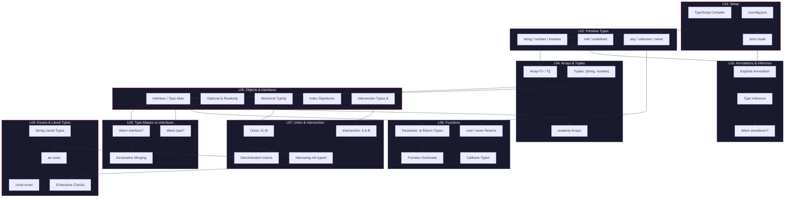

# 01 -- Phase 1 Rueckblick: Was du gelernt hast

> Geschaetzte Lesezeit: ~10 Minuten

## Von Null zum Typsystem

In neun Lektionen hast du dir das gesamte Fundament von TypeScript erarbeitet. Das ist kein
kleines Ding -- du beherrschst jetzt die Werkzeuge, mit denen professionelle TypeScript-Entwickler
taeglich arbeiten. Bevor wir in die Challenges eintauchen, schauen wir uns an, wie alle Konzepte
zusammenhaengen.

---

## Die Phase-1-Konzeptlandkarte



---

## Die vier Sauelen deines Wissens

### Saeule 1: Typen beschreiben (L02, L04, L05)

Du weisst, wie du **jede** Datenstruktur in TypeScript beschreiben kannst:

| Was | Werkzeug | Beispiel |
|-----|----------|----------|
| Einzelwerte | Primitive Types | `string`, `number`, `boolean` |
| Listen | Arrays & Tuples | `string[]`, `[number, string]` |
| Strukturen | Interfaces / Types | `interface User { name: string }` |
| Dictionaries | Index Signatures | `{ [key: string]: number }` |
| Praezise Werte | Literal Types | `"success" \| "error"` |
| Konstanten | as const | `const ROLES = ["admin", "user"] as const` |

### Saeule 2: Typen kombinieren (L07, L08, L09)

Du kannst Typen flexibel zusammensetzen und einschraenken:

- **Union (`|`)** -- "entweder A oder B" -- `string | number`
- **Intersection (`&`)** -- "A und B gleichzeitig" -- `HasId & HasName`
- **Discriminated Unions** -- sichere Zustandsmodellierung mit `kind`/`type`-Feld
- **Literal Types** -- Werte als Typen: `"GET" | "POST" | "PUT" | "DELETE"`
- **as const** -- maximale Praezision fuer Laufzeitwerte

### Saeule 3: Funktionen typisieren (L06)

Du schreibst typsichere Funktionen mit:

- Annotierten Parametern und Rueckgabetypen
- Optionalen und Default-Parametern
- Rest-Parametern
- Function Overloads fuer verschiedene Aufrufmuster
- Callback-Typen und Higher-Order Functions

### Saeule 4: Sicherheit durch den Compiler (L01, L03, L07, L09)

Du verstehst, wie TypeScript dich schuetzt:

- **Type Inference** weiss, wann du Typen weglassen kannst
- **Structural Typing** prueft Kompatibilitaet anhand der Form
- **Excess Property Checking** faengt Tippfehler bei Objektliteralen ab
- **Exhaustive Checks** stellen sicher, dass du alle Faelle abdeckst
- **never** als Bottom Type fuer unerreichbaren Code

---

## Die unsichtbaren Verbindungen

Was dich von einem Anfaenger unterscheidet, ist nicht das Wissen ueber einzelne Features --
es ist das Verstaendnis, wie sie **zusammenspielen**:

### Verbindung 1: Interfaces + Unions = Discriminated Unions

```typescript
// Interface allein: beschreibt EIN Objekt
interface Circle { kind: "circle"; radius: number; }
interface Rect { kind: "rect"; width: number; height: number; }

// Union kombiniert: beschreibt VERSCHIEDENE Objekte
type Shape = Circle | Rect;

// Narrowing macht es sicher
function area(s: Shape): number {
  switch (s.kind) {
    case "circle": return Math.PI * s.radius ** 2;
    case "rect": return s.width * s.height;
  }
}
```

### Verbindung 2: as const + Literal Types + typeof = Typ aus Wert

```typescript
const HTTP_METHODS = ["GET", "POST", "PUT", "DELETE"] as const;
type HttpMethod = typeof HTTP_METHODS[number]; // "GET" | "POST" | "PUT" | "DELETE"
```

### Verbindung 3: Function Overloads + Union Types = praezise APIs

```typescript
function parse(input: string): number;
function parse(input: string[]): number[];
function parse(input: string | string[]): number | number[] {
  if (Array.isArray(input)) return input.map(Number);
  return Number(input);
}
```

### Verbindung 4: Interfaces + Intersection = Komposition

```typescript
interface HasId { readonly id: string; }
interface HasTimestamps { createdAt: Date; updatedAt: Date; }
interface HasName { name: string; }

type Entity = HasId & HasTimestamps;
type User = Entity & HasName & { email: string };
```

---

## Was diese Review Challenge anders macht

In den bisherigen Lektionen hast du jedes Konzept **isoliert** geubt. Die Exercises in dieser
Lektion sind anders:

1. **Kein neues Konzept** -- alles hier hast du schon gelernt
2. **Integration** -- jede Challenge braucht Konzepte aus MEHREREN Lektionen
3. **Realitaetsnaehe** -- die Szenarien kommen aus echten Projekten
4. **Schwieriger** -- du musst selbst entscheiden, WELCHES Werkzeug passt

> **Analogie:** Stell dir vor, du hast neun verschiedene Werkzeuge einzeln geubt -- Hammer,
> Saege, Schraubenzieher, etc. Jetzt baust du ein Moebelstueck. Niemand sagt dir, welches
> Werkzeug du wann brauchst -- du musst es selbst erkennen.

---

## Dein Ziel fuer diese Lektion

Am Ende dieser Lektion solltest du:

- [ ] Jedes Phase-1-Konzept **ohne Nachschlagen** anwenden koennen
- [ ] Bei einem neuen Problem **selbst erkennen**, welche Typen und Patterns passen
- [ ] Komplexe Datenmodelle mit 5+ verschraenkten Typen aufbauen koennen
- [ ] Bestehenden `any`-Code **sicher refactoren** koennen
- [ ] Bereit sein fuer **Phase 2: Type System Core** (Generics, Mapped Types, etc.)
